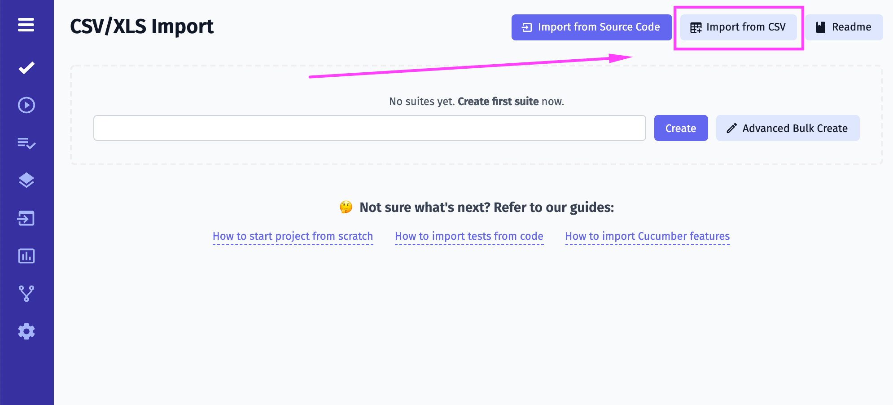
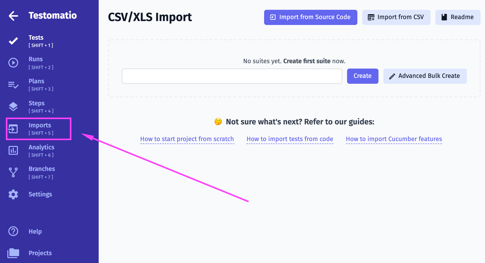
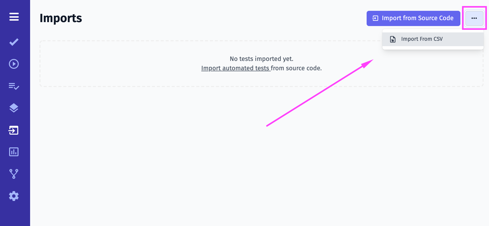
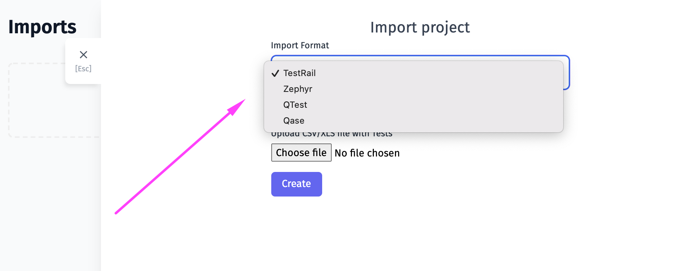
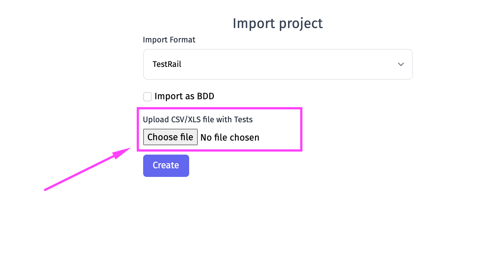
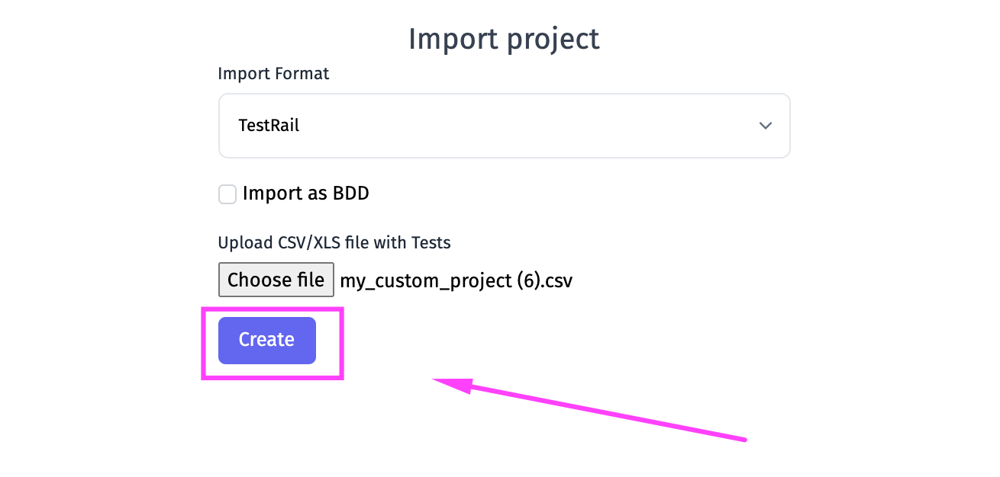

# Import Tests From CSV/XLS

> If you have tests in CSV/XLS format - follow this guide to learn how to import your tests to Testomat.io

For now, Testomat.io supports import from CSV/XLS for these systems:

- TestRail
- Zephyr
- Qase
- QTest
- Testomat.io 

## How To Import Tests From CSV/XLS

You can use **Import from CSV** button on Tests page :

Or use **Imports** button on the side menu:

Then click on the Menu button and pick **Import From CSV**

Pick the format you are going to import:

Click on **Choose file** and pick your file:

Now click on **Create** button

And see Testomat.io importing your tests 

## Example Files For Import 

Here you can find samples for each of supported formats:

- [TestRail](https://testomatio-artifacts.ams3.cdn.digitaloceanspaces.com/documentation/TestRail.csv
)
- [Zephyr](https://testomatio-artifacts.ams3.cdn.digitaloceanspaces.com/documentation/Zephyr.xls
)
- [Qase](https://testomatio-artifacts.ams3.cdn.digitaloceanspaces.com/documentation/Qase.csv)
- [QTest](https://testomatio-artifacts.ams3.cdn.digitaloceanspaces.com/documentation/qtest.xls
)
- [Testomat.io](https://testomatio-artifacts.ams3.digitaloceanspaces.com/documentation/testomatio.xlsx)

## Import CSV/XLS As BDD

> Please note that this is experimental feature and some data can be imported wrongly. 

Testomat.io allows converting CSV/XLS to BDD Scenarios, where your Precondition equals **Given**, Step = **When**, and Expected Result = **Then**.

For this moment this feature is implemented for TestRail. But you can request it for other systems [here](https://testomat.nolt.io/).

## Create Custom XLS For Testomat.io

You can create your own XLS to import your tests to Testomat.io. There are such rules to create custom XLS files for Testomat.io import
| Column name  |  Content |
|---|---|
|ID|leave it empty|
|Title |put the title of your test here, one title per row|
|Status | goes for test type manual or automated, can be blank|
|Folder| place here the name of the suite, and use `/suite name/sub-suite name` format to create suites nesting|
|Emoji |can be blank| 
|Priority| you can set priority to your test normal, important, high, critical or low, can be blank|
|Tags| place here any tags you need,  can be blank|
|Owner |name of test owner, can be blank|
|Description |put here the description of your test, [Markdown format ](https://www.markdownguide.org/basic-syntax/)supported|

You can download the custom Testomat.io example file [here](https://testomatio-artifacts.ams3.digitaloceanspaces.com/documentation/testomatio.xlsx).

