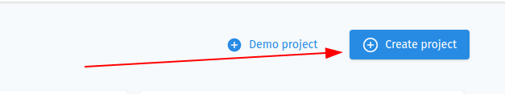
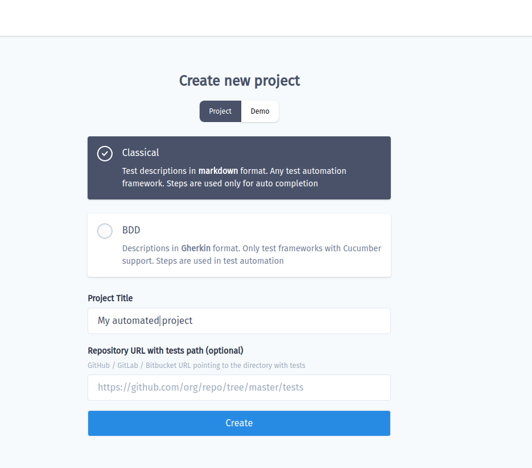
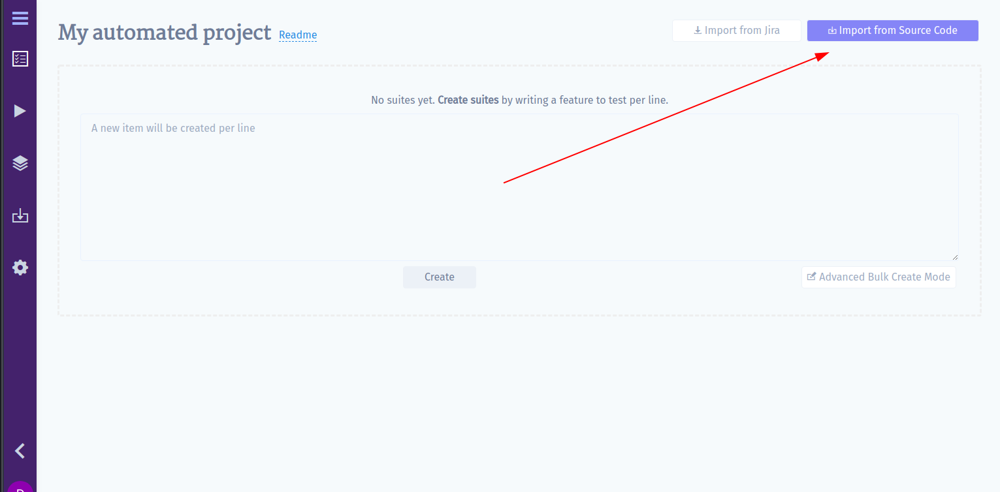
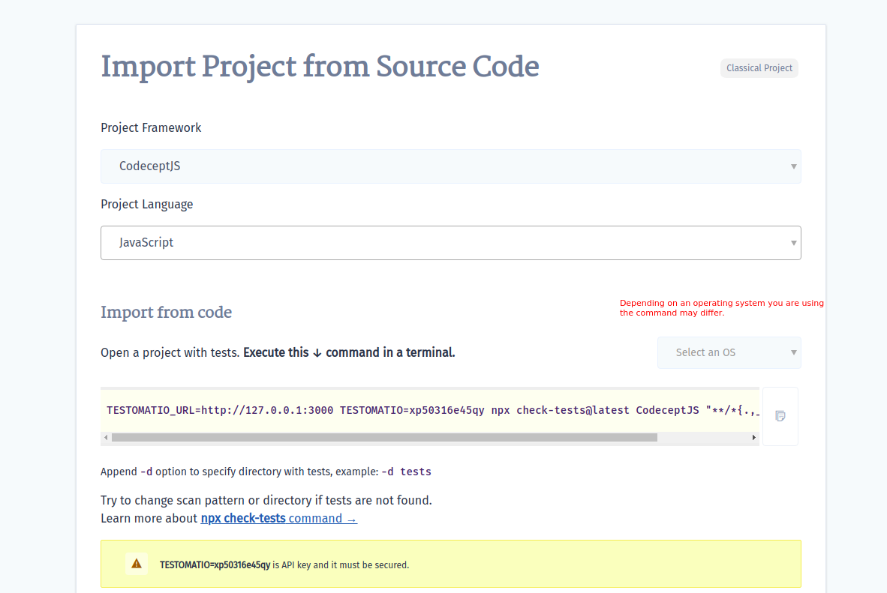
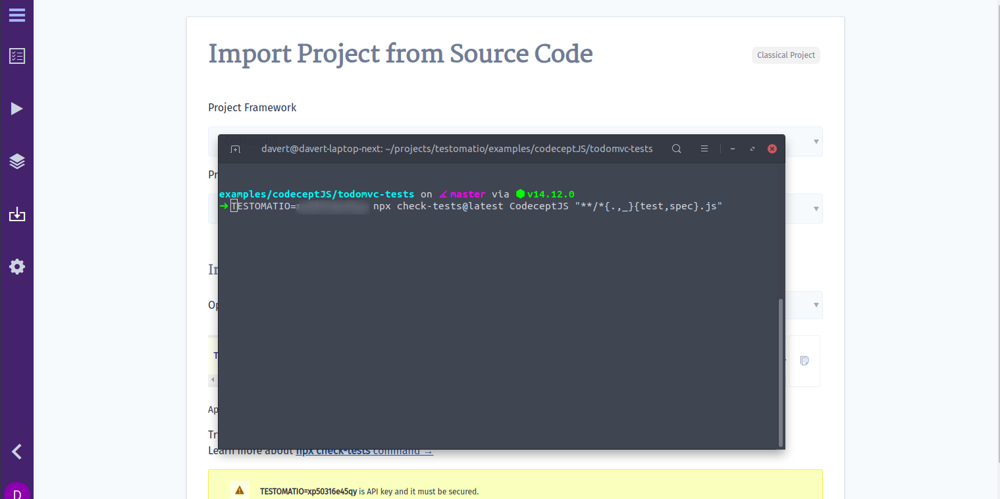
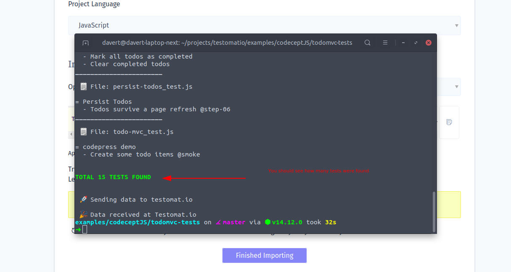
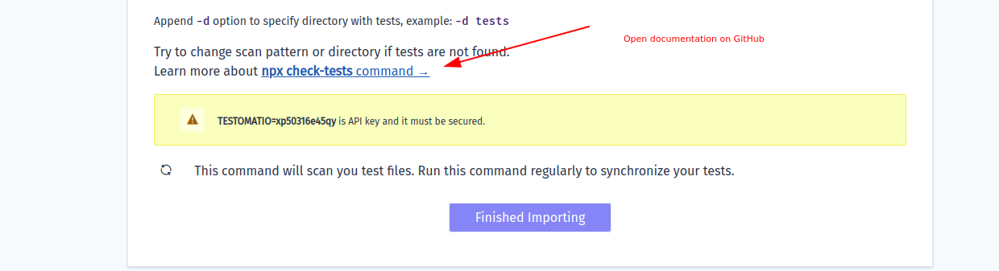
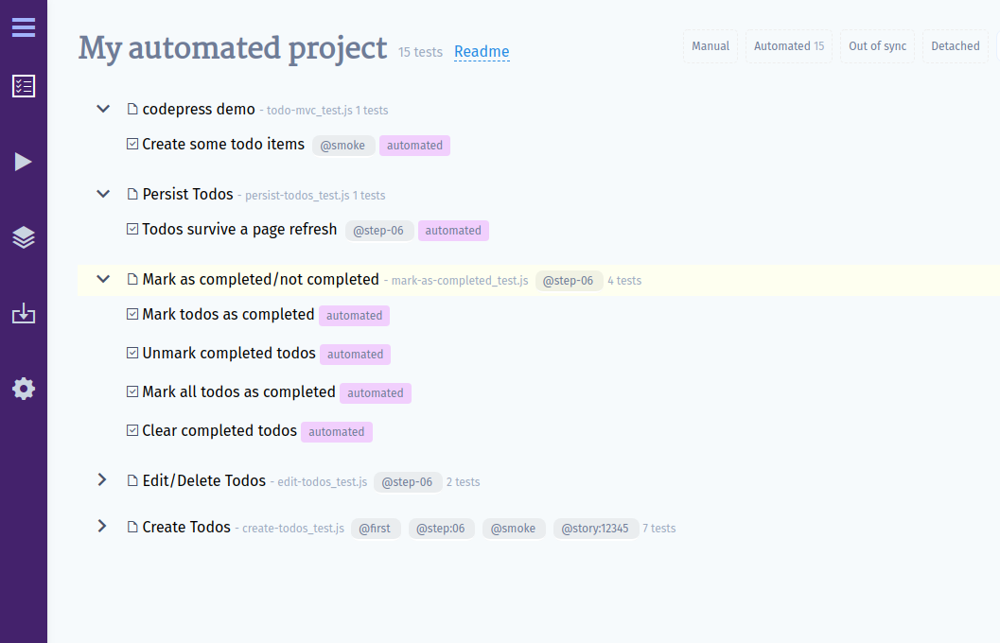
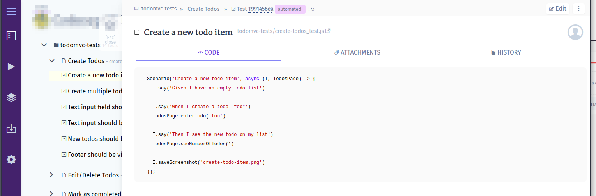

# Import Tests From Source Code

> If you have end-2-end tests, API or unit tests already implemented, you can import them into Testomat.io.

## Why Do I Need to Import My Tests?

Automated tests are hidden within the code and, as a rule, this gem is seen only by engineers. Even though the tests play an important role in product management, they are not available to the whole team involved in the project. To bring the visibility of the running tests further on and show what pieces of software are actually covered by tests, you can import your tests into Testomat.io. 

Moreover, when you have hundreds and thousands of tests on your hands, some things tend to slip through the cracks and end up neglected. For example, you may need to look up certain features and map them with specifications or Jira tickets. In Testomat.io, whenever automated tests are imported,  you can search with ease throughout all the tests, plan new test cases, receive reports, and much more! 

## Create a New Project

Register at [app.testomat.io](https://app.testomat.io) and activate your user account. Then create a new project.

The type of your new project will influence the look of your interface, as well as its intended audience. Choose **BDD Project** if you plan to follow BDD descriptions or use the Cucumber framework in future. If you haven't decided yet, you can start with default **Classical Project**. Depending on your choice, the interface will differ, as follows:

* Within a **BDD Project**, you will have feature definitions written both in the source code (by engineers) and in Testomatio (by managers and QAs). So you will be able to track and plan Cucumber automation, as well as synchronize the actual feature files with relevant test cases. When a scenario has changed in the system, but has not been updated in the code yet, you will be notified that this certain scenario is out of date.
* Within a **Classical Project**, test cases will be written in free form using markdown. Automated tests will be synced up with test cases, so you will be able to see the test description in one tab and the corresponding test code in another tab. When a description of a test case undergoes changes, you will be notified that a certain test might need to be updated.

> In this section of the Guide, we discuss the issues concerning Classical Projects. If you need to import a BDD Project, go to the [Import Tests From Cucumber](https://docs.testomat.io/getting-started/import-tests-from-cucumber/#why-do-i-need-to-import-my-tests) section of this guide.

You can provide a URL of a repository hosted on GitHub, GitLab, BitBucket, as well as of a self-hosted one. Testomat.io will use this URL to navigate you from test cases straight to the source code. Please make sure that the URL is pointing to the *directory where the tests are located*. In the following steps we show in detail how to import tests from that directory.

> If you fill in the **Repository URL** field, doublecheck that the given path matches the one in the URL repository. For instance, if you have URL: "https://github.com/testomatio/examples/tree/master/tests", you should navigate to "tests" within your project to import tests.

Click the **Create** button to start a new project.

## Import Tests

When your project is created, click the **Import from Source Code** button.

In the **Import** section, you are asked to pick the framework and programming language you use for tests.

> If you don't see the framework you work with in this list - please contact us, and we will do our best to add support for it soon! 

Once you have chosen the framework and the language, you will be provided with a command that you need to copy and execute in a terminal. Before running this command, please check if your environment matches these requirements:
* If you run tests in NodeJS (JavaScript, TypeScript), you should have NodeJS 10+ and npm to be installed to be able to run this command.
* If you run tests in PHP - you will need PHP > 7.2 and Composer installed. 

Open a terminal, navigate to the tests folder in your project and execute the command. 

Seeing a report on how many tests were found means that the import command was executed successfully:

If you don't see a similar message, this might be because our default settings do not work for you. Please check the command's API change command parameters so it could find tests. The most common issues with import are different file naming format and/or incorrect directory for import.

When the tests are finally imported, reopen the project, and you will see that all tests with their folders and files are shown on Testomat.io.

All imported tests are marked as "Automated" by default. If you click on any of those tests, you will see its code and a link to its repository. Please, check that the link actually points to the corresponding file. Otherwise, you might want to change the repository URL in project settings. 

## What's Next?

Ok, I've just imported my tests successfully, now what?

* **Show your tests to your team**. You must be proud of your work!  🎉
* **Plan new tests** before automating them. Ask the manager to write test specification within Testomat.io so you could start working on them. 
* All new tests will be marked as "manual" unless you import them from code. You can check the number of manual tests that are left, and see the whole range of what is yet to be implemented.
* **Receive run reports** - similarly to Importing tests, you can receive detailed reports on each test execution. Open **Runs** page and follow instructions from there.
* **Add import command to CI** - re-import the tests on each commit to have your project up to date with the source code.

