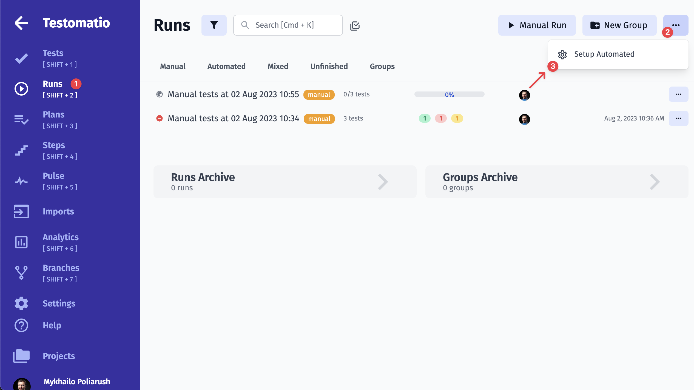
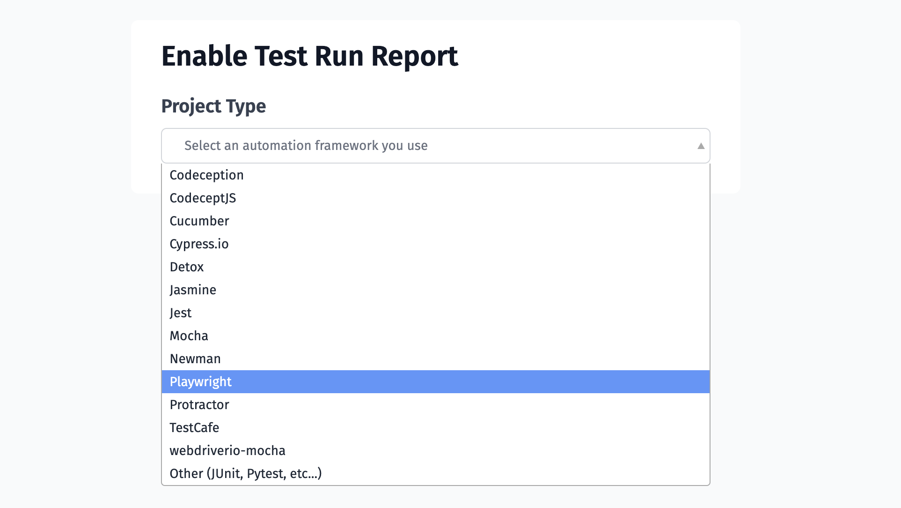
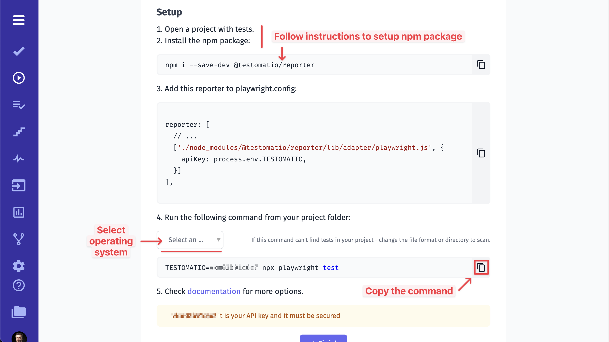
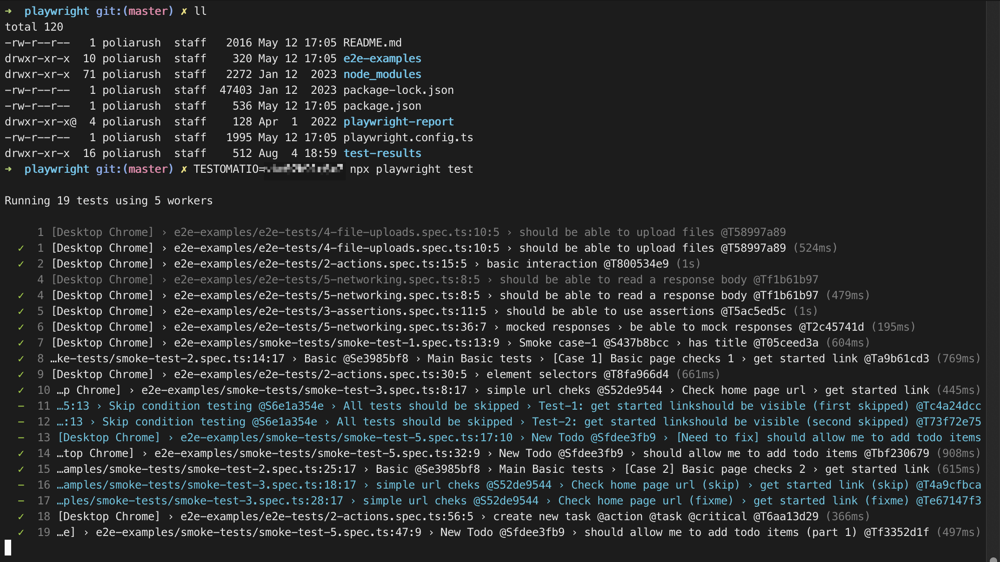
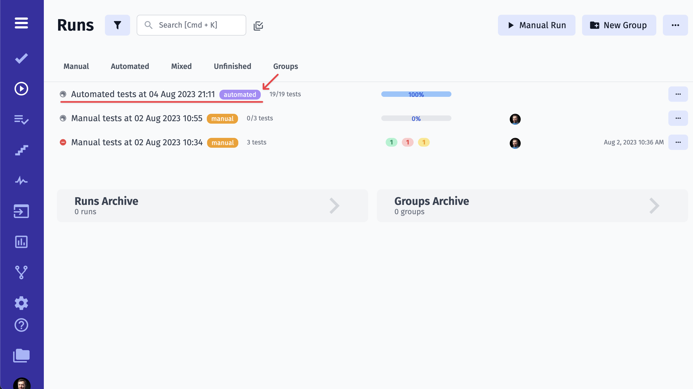
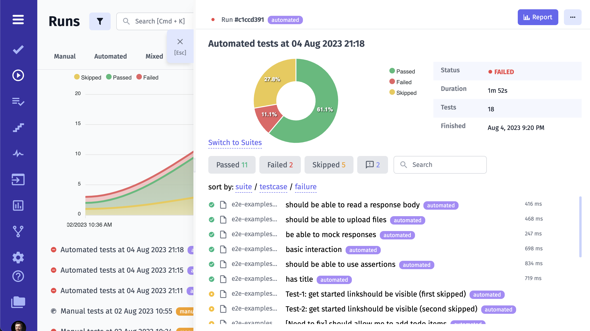
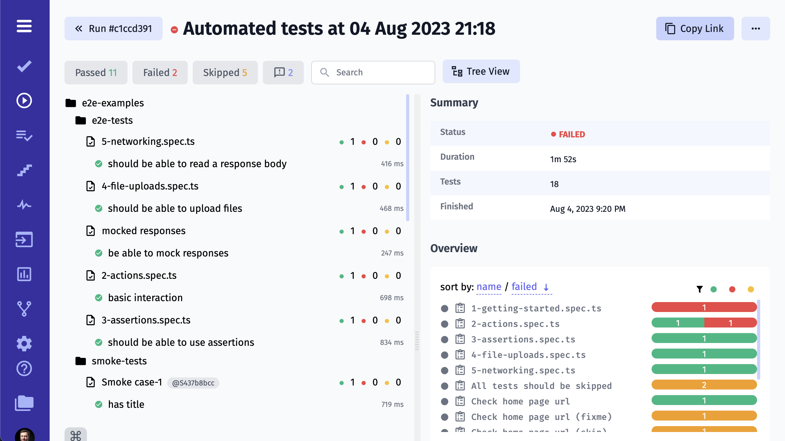

# Running Automated Tests

### Why Do I Need to Enable Test Run Report

You have already [imported automated tests](https://docs.testomat.io/getting-started/import-tests-from-source-code/) and you wonder what's next? Testomat.io will help you to generate a run command to use on your machine or on your CI. As a result, you will get human-readable Run Reports with lots of additional information.

Testomat.io has a friendly UI that helps to set up automated test reporting. So there is no need to learn all technical documentation in the very first steps. Let's see how it works.

### Launch Automated Tests

First, go to the Runs page, click on the Extra button and pick **Setup Automated**

Then you need to pick your framework from the dropdown.

Testomat.io will generate instructions regarding your framework. You may need to make few changes to your code, namely, add the Testomat.io plugin.

Please note that you need to start generated commands in your terminal from your project folder.

> Also, you can add advanced options to your command to enable extra options. For example, you can give a title to your report by passing it as environment variable to `TESTOMATIO_TITLE` or can add environments to run by providing `TESTOMATIO_ENV`. 
Learn more about [advanced reporting options here](https://docs.testomat.io/reference/reporter/#advanced-usage).

If you have successfully launched your automated tests, a new Test Run will appear on Runs page.

You can see tests results in real-time in the Run Report.

As soon as all tests are completed you can check Run Report with details.

