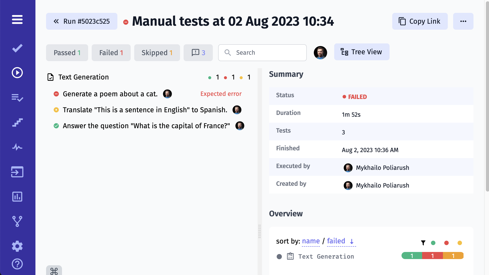

# Start From Scratch

> If you don't have any manual or automated tests yet - follow this guide. Otherwise, pick the section of the guide relevant to your project. You might want to start from [this section](https://docs.testomat.io/getting-started/import-tests-from-source-code/) if you consider importing tests from source code into Testomat.io. For those interested in importing tests from the Cucumber framework, go straight to [this section](https://docs.testomat.io/getting-started/import-tests-from-cucumber/#why-do-i-need-to-import-my-tests)!

## Create a new project

Register at [app.testomat.io](https://app.testomat.io) and activate your user account. Then create a new project.

The type of your new project will influence the look of your interface, as well as its intended audience. Choose **BDD Project** if you plan to follow BDD descriptions or use the Cucumber framework in future. If you haven't decided yet, you can start with default **Classical Project**. Depending on your choice, the interface will differ, as follows:

* Within a **BDD Project**, you will have feature definitions written both in the source code (by engineers) and in Testomatio (by managers and QAs). So you will be able to track and plan Cucumber automation, as well as synchronize the actual feature files with relevant test cases. When a scenario has changed in the system, but has not been updated in the code yet, you will be notified that this certain scenario is out of date.
* Within a **Classical Project**, test cases will be written in free form using markdown. Automated tests will be synced up with test cases, so you will be able to see the test description in one tab and the corresponding test code in another tab. When a description of a test case undergoes changes, you will be notified that a certain test might need to be updated.

Fill the name of your project in the **Project Title** field.  The **Repository URL** field is optional, so you can simply skip it. Click the **Create** button to start a new project. 

## Write First Test Cases

Now you can start creating suites and test cases for your projects. We have implemented Bulk Creation input, which enables you to create as many test suites as you need:

Select a certain suite to nest the creation of new test cases in that suite. This can be done even faster and more efficiently using the same old Bulk Creation editor:

When tests are newly created, they are marked as "manual" by default, which shows that they are ready for manual checks.

You can now add descriptions for each test case. However, the roles of these routine test cases are clearly seen from their titles, so we can probably try to run them to verify the user management part. 

## Run Manual Tests

Before you execute your tests, you might want to specify the run environment options (a list of options is customizable) and the title for this run. Here is how you set the environment for test execution. Click the **Launch** button to execute the tests.

You will see the list of all test cases when the test execution is launched. Mark them as passed or failed. When a test check fails, you can write the description of the failure and attach a relevant image.

Once the run is finished, the overall results of it are available for your review, like this:

To get a detailed report of the test run, click on the **Report** button:

