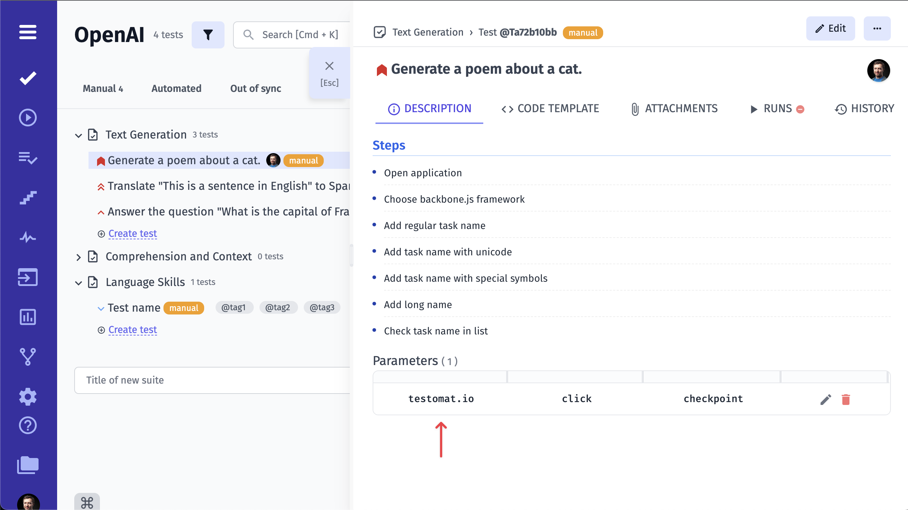

# Test Design

When a new project is created, there are multiple options to start:

1. Create new suite and start adding tests
2. Import automated tests from source code
3. Import tests from CSV file from another Test Management System

## Creating a test

Tests are created within a suite. 

To create a new suite use "+" button or input field. 
Open a newly created suite.

To add a new test to the suite you are currently in,  click on **New Test** button.

Then input the name and the description of your test. 

It is also possible to the test straightaway from this screen. Simply input the test's title and click on the **Create** button. You can add the description at any time later. 

Repeating these steps, you can easily add as many tests as you need within a reasonable period of time.

## Suites and folders

Unlike other test management systems, **Testomat.io doesn't allow suite to include other suites and tests**. That's why you can either create a suite (a collection of tests) or folder (collection of suites).

::: warning
When creating a suite you have to explicitly set its type: a suite or a folder.
:::

This was designed so tests structure could match the filesystem. For instance, if you use BDD project, feature file can contain scenarios, but can't contain other feature files. The same for automated tests, a file can contain tests but can't contain other files. 

It's assumed that in any moment a manual test can be automated, so it is important to keep the filesystem structure in a project.

An empty suite can be converted to folder or vice versa

Also you can set an emoji icon for the suite

## **How to add a label/tag to a test**

This option is the easiest one! You simply need to add the label's name (preceeded by @ char) in the name field of the test.

And now you can see your label/tag in the test list next to the test's title.

## **How to add an attachment to a test**

First of all, you need to open the test that you want to add the attachment to. 

Click on the **Attachments** tab.

Add your attachment via **Browse a file** or simply drag and drop it.

You can also add it immediately when you edit the description of the test.

## **How to assign a test to a user**

If you want to assign a certain test to a certain user, you should click on this user icon in the upper right corner of the window, as shown in the picture.

Assign a user from the list of users added to the project by clicking on the user's name. Please note, that you need to make sure the intended user is added to the project first!

Now you can see that this test is assigned to a certain user. The user icon has changed accordingly.

## **How to set a priority to a test**

First, you should open the test and click on the checkbox icon next to the test title, as shown in the picture.

You will see a list of priority types

Click on the priority type you need and you will see the checkbox changed

Also, you will see set priority in your suite

## **How to add parameters to a test**

If you need to add parameters to your test you need to click on the vertical ellipsis button

Then choose Add Parameter from the menu

You will see a pop-up with instructions. Now you can add your parameters using a comma

Click on Create button to apply your parameters

You will see your added parameters on the bottom of the pop-up

And on the test description page

## **Drag and Drop Your Tests**

You may need to move your tests within a project, for example to another suite. For this purpose, you can use drag and drop. You need to drag a test and drop it into a suite. Please note, you should drop a test to suite name on the top of the suite.

