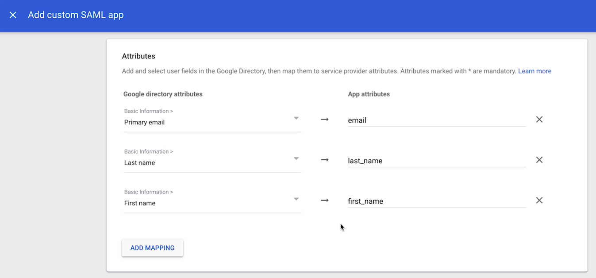

## Single Sign On

Single Sign On is **enterprise** feature that allows you to login users from your Identity Provider into Testomat.io. All new members will be auto-provisioned. If you reach limit of paid seats, all new members will be added as `read-only`. So no matter of how many peoples joined, you won't be charged more than your current plan. You can manage your seats, and specify which users should be active and which to be read-only on your [Company Members](https://docs.testomat.io/subscriptions/companies/#how-to-invite-a-user-to-a-company) page.

This guide shows how to set up SSO connection via SAML for various SAML providers

### Prerequisites

* You have a compay in Testomat.io, and you are [**owner of this company**](/subscriptions/companies#roles-within-a-company).
* Company is on an enterprise plan.
* You have SAML identity provider like Okta or GSuite
* You and all potential company members use emails from the same domain name (like: user1@companyname.com, user2@companyname.com, etc)

If you are ready, proceed to configuring identity provider:

* [Okta](#okta)
* [GSuite](#gsuite)

### Okta


Okta authorization can be enabled via SAML. As a prerequisite a [company](https://docs.testomat.io/subscriptions/companies/) for your domain should be created on Testomat.io. 

Log in to Okta as Administrator and **Create Application Integration**


Choose **SAML 2** as sign-in method


Set "Testomat.io" as the application name and click "Next"


In the next step, you need to set values for **Single sign on URL**:

```
https://app.testomat.io/users/saml/auth
```

and **Audience URI (SP Entity ID)**:

```
https://app.testomat.io/users/saml/metadata
```


Specify the **Attribute Statements**:

* `email` should be set to `user.email`
* `name` should be set to `user.firstName + " " + user.lastName`


Click "Next" to proceed.

On the lastest step check **I'm an Okta customer adding an internal app**


And finish the integration of application.

After interaction was saved click **View SAML setup instructions**


The following information is needed to proceed with integration.

* **Identity Provider Single Sign-On URL**
* **Identity Provider Issuer**
* **X.509 Certificate**


Assign users to this application so they could join Testomat.io:


Now, open Company page in Testomat.io and select Single Sign On options


> If you don't see Single Sign On option, check that you are an owner of this company

Fill in the form:

1. **Company domain**. This is required to identify SSO connection by user's email. Example: `mycompany.com`.
2. **Default Projects**. Select projects to new users will be added to(optional).
3. Enable SAML:


4. Set **Identity Provider Issuer** from Okta as **IdP Entity ID**
5. Set **Identity Provider Single Sign-On URL** from Okta as **Sign In URL**
6. Upload certificate.


And save the form.

Now, use any assigned user from Okta to Log In into Testomat.io. Select "SSO" on the Sign In page, enter the email, and if everything is correct user will get inside Testomat.io, assigned to your company and added to default projects.

> In case user sees 404 page on Okta, check that Single Sign-On URL was correctly set.

### GSuite

Inside Google Admin open **Apps** > **Web & Mobile Apps**:


Add Custom SAML App.

Use "Testomatio" as **App Name** and continue


Copy the following information:

* **SSO URL**
* **Entity ID**
* **Certificate** should be downloaded as file

And continue.


On this step fill the form:

* **ACS URL**: `https://app.testomat.io/users/saml/auth`
* **Entity ID**: `https://app.testomat.io/users/saml/metadata`


On the next page add attributes mappings:

* Add `email`
* Last name as `last_name`
* First name as `first_name`



Finish set up.

Now, open Company page in Testomat.io and select Single Sign On options


> If you don't see Single Sign On option, check that you are an owner of this company

Fill in the form:

1. **Company domain**. This is required to identify SSO connection by user's email. Example: `mycompany.com`.
2. **Default Projects**. Select projects to new users will be added to(optional).
3. Enable SAML:


4. Set **Entity ID** you copied previously as **IdP Entity ID**
5. Set **SSO URL** you copied previously as **Sign In URL**
6. Upload certificate.


And save the form.

Now, use any assigned user from Okta to Log In into Testomat.io. Select "SSO" on the Sign In page, enter the email, and if everything is correct user will get inside Testomat.io, assigned to your company and added to default projects.
