# Subscriptions

Testomat.io is accessible in the cloud on 3 subscription levels, more details [here ](https://testomat.io/#pricing) and on-premise to be installed on your servers with an Enterprise plan. See more info below.
Also, Testomat.io provides two trials for you to evaluate all features: a 30 Days Trial and an additional extra 14 Days Trial.

## How To Use Testomat.io as a Free Subscription Plan 

When you register a user in Testomat.io, there is much more than a free trial. Testomat.io on the Free plan, is a free service that will not expire. You can continue using the features available on the Free plan for as long as needed. 

Testomat.io offers a Free subscription level. This is not a trial period: there is no cut-off date on using Testomat.io as a free service. You can create **2 projects with 2 users** for free and continue using them for free as long as needed.

Here is an overview of what is included in a Testomat.io Free plan :

- Test case management
- Automated tests frameworks support (Codecept.js, Codeception, Wdio, Cucumber, Jest, Cypress, Protractor, Test Cafe)
- Automated tests reporter (Codecept.js, Cucumber, Wdio, Playwright, Cypress)
- Manual testing
- Agile test management
- BDD/Gherkin editor
- Intelligent step completion
- Reusable steps and steps database
- Tests parametrization
- Attachments 2 Mb per unit
- Bulk test case editing
- Test plans and configurations
- Test runs
- Runs history for 30 runs
- Test assignment and email notifications
- Multi-environment runs
- Reports & Metrics
- Tests/Suites templates
- CI/CD Pipeline Integration (Jenkins, Bamboo, GitLab, GitHub)
- Notifications (email)

Note that if you revert to a Free plan after being on a Professional or Enterprise plan, features over the Free plan limit will no longer be available. However, their data is not lost. If you reinstate a Professional or Enterprise plan, you will be able to access those features once again.

## Subscription Levels

Testomat.io is available on three different subscription levels:
- Free 
- Professional (for small and medium-sized businesses)
- Enterprise (for larger businesses)

Each subscription level includes varying access to features such as Bug trackers integration (Jira) or Branches. See full details [here](https://testomat.io/#pricing)

## Monthly Or Yearly Billing

You can choose to pay for your Teamup subscription on a monthly or yearly basis.

All Testomat.io paid subscriptions are billed automatically; if you pay on a monthly basis, then each month you will be automatically charged for your continuing subscription. If you pay on a yearly basis, then you will be automatically charged annually for your continuing subscription. 
 
## How To Enable Subscription

You decided to upgrade your Subscription at Testomat.io. First, you need to create a company. Subscription can be enabled only within a company. Let's have a look how to do this:

1. Go to the Companies tab on a dashboard

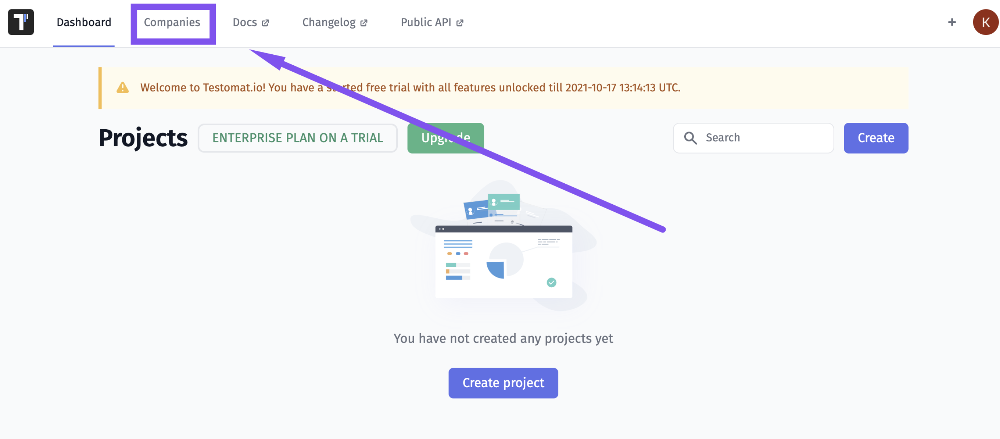

2. Click on Create button

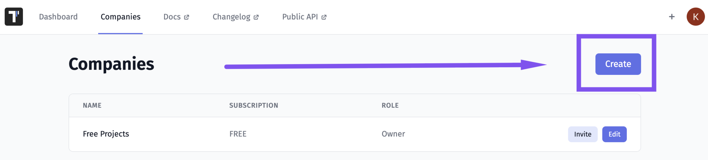

3. Enter the name for your company
4. Click on Create button

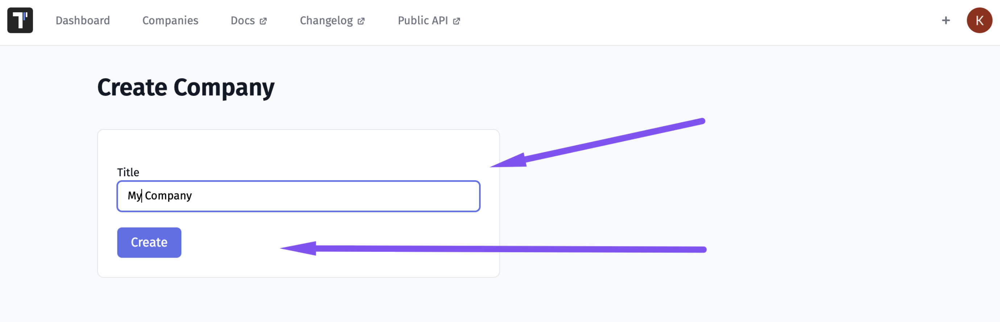

5. Now your Company is created

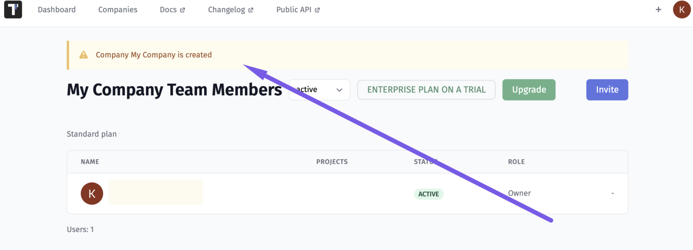

6. Now you can click on the Upgrade button

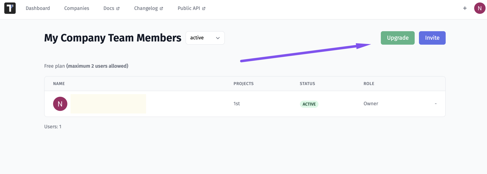

7. Pick Subscription Plan, amount of users, and type of payment (1)and click on the Upgrade button (2)

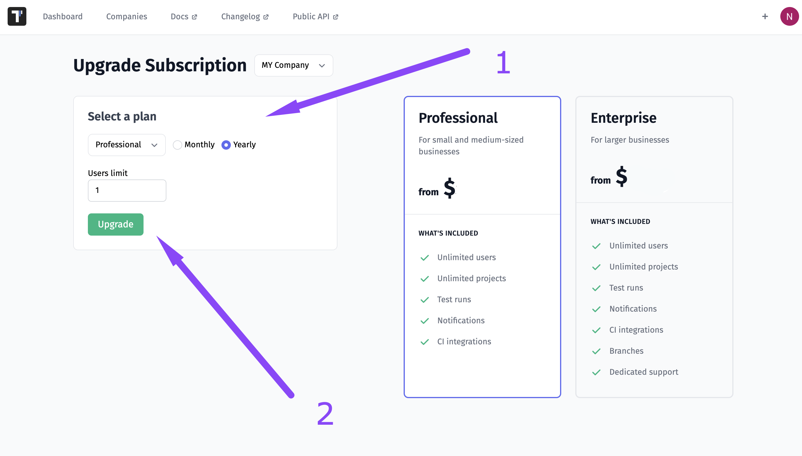

8. You will be redirected to the Payments page. Here you need to enter payment data and click on the Subscribe button

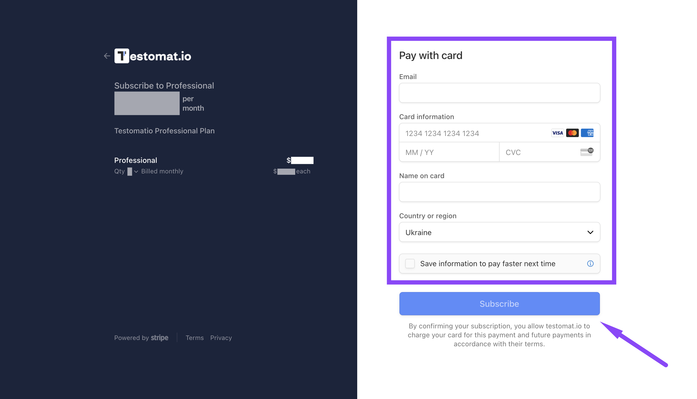

9. Congratulations! 🎉 You upgraded your subscription 

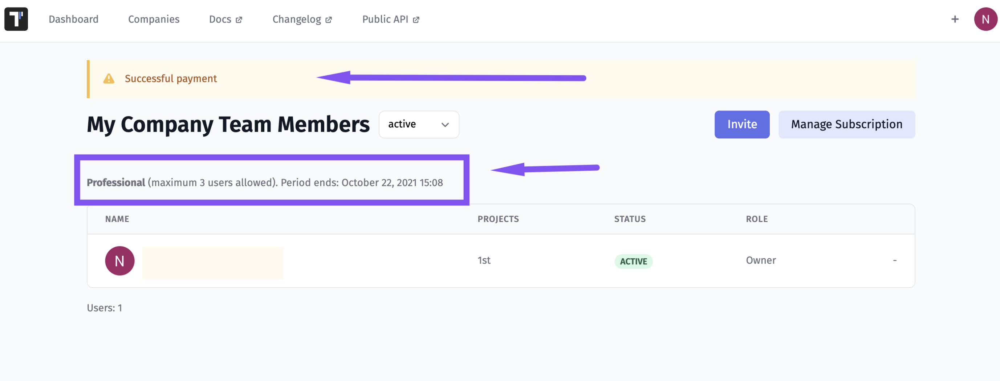

## How To Manage Team Members Within a Company 

How To Increase And Decrease Amount Of Team Members
You can change the number of seats in your team account at any time.

Your seat count can be adjusted in the Companies section. The number of seats in your account determines the amount you’re billed upon subscription renewal as well as the maximum number of people who can be active in your account.

If you want to reduce the amount you’re charged, you’ll need to first delete people under Company Team Members and then reduce your seat count by taking the steps below. Along the same lines, you may need to increase your seat count before you’re able to invite more people to your Testomat.io account. Note that a reduced amount of seats will apply with the next subscription payment.

1. Go to the Companies tab on a dashboard and click the Edit button

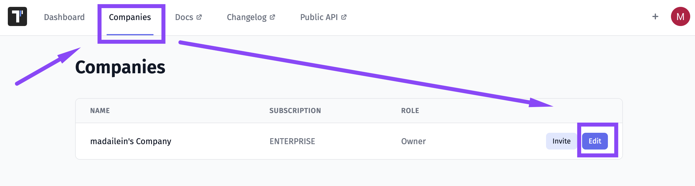

2. Click on the Manage Subscription button

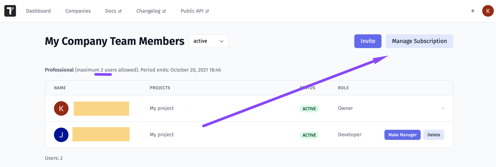

3. You will be redirected to the billing page. Here you need to click on the Update Plan button

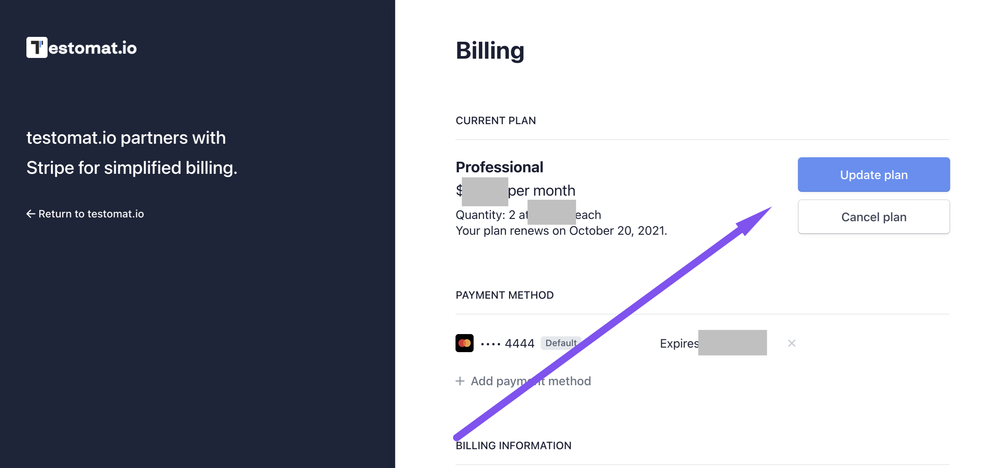

4. Pick the Update quantity button

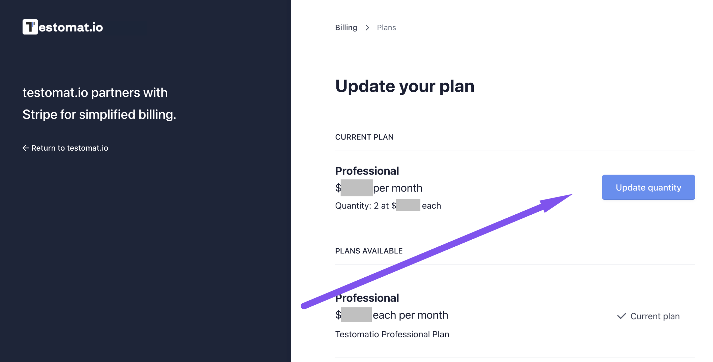

5. Set the needed number of members and click Confirm button

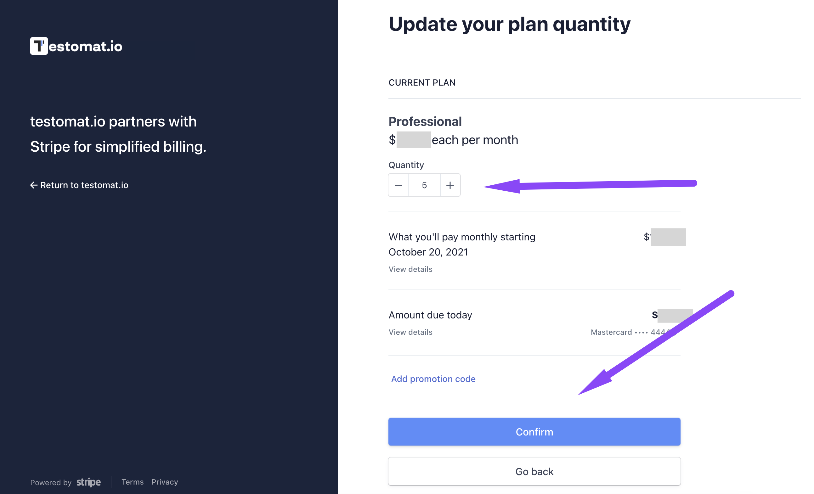

6. Now you see changed amount of users in your Companyand can go back to Testomat.io

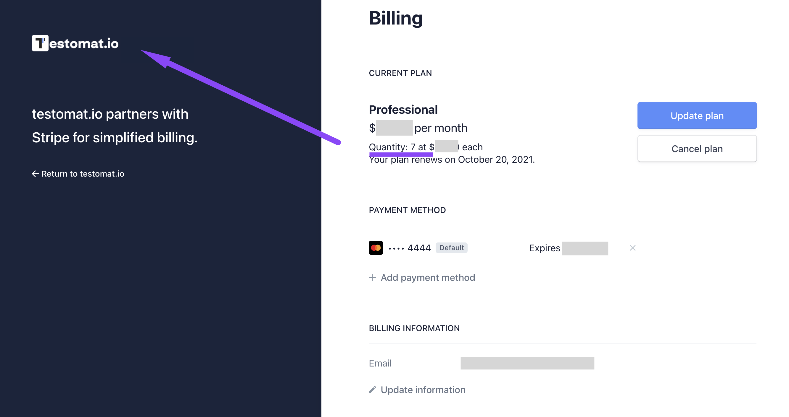

7. In Testomat.io you also will see updated amount of users 

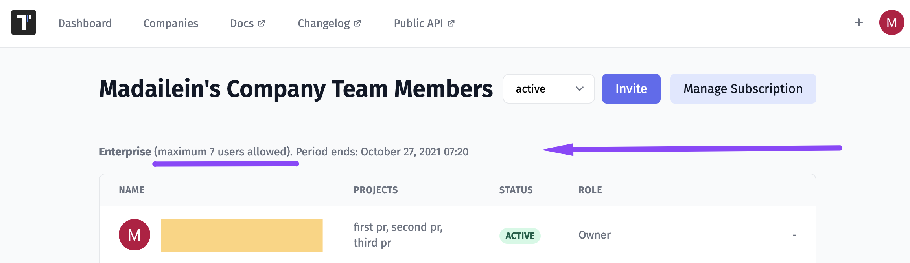

## How To Upgrade And Downgrade Subscription Plan

You can upgrade your subscription at any time, from Free to a paid plan or from one paid plan to another. Select the plan you wish as an upgrade on a billing page, and click the Confirmation button. When you upgrade your plan, you will be charged for the difference in price and the upgrade will be applied to your company immediately.

To do this you need to use steps 1-3 described above to get to the billing page.

4. Pick the subscription plan you want to use and click the Continue button 

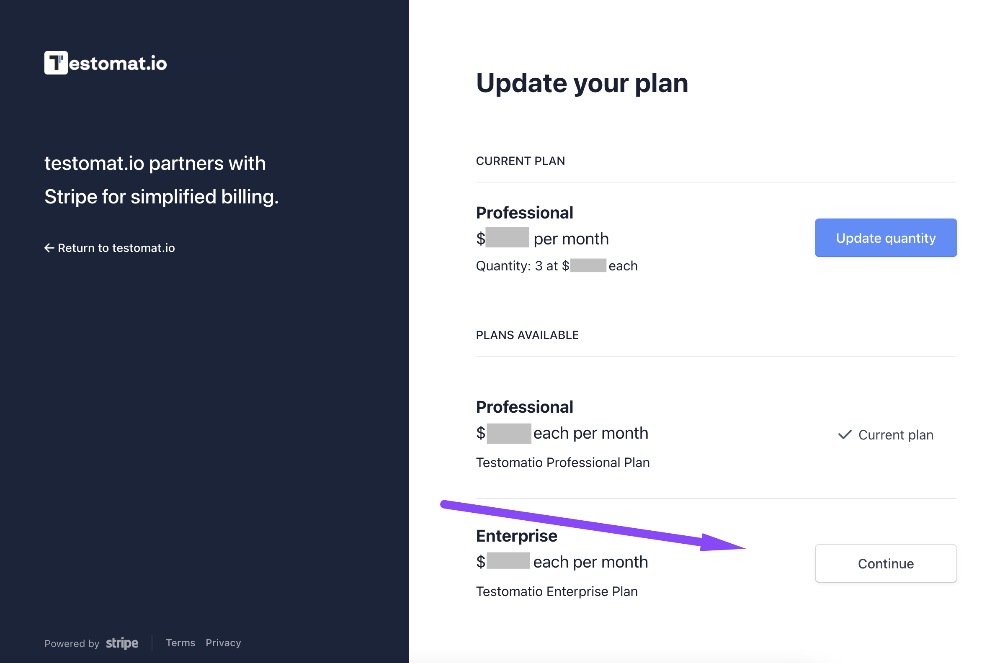

5. Check the billing information and click on Confirm button 

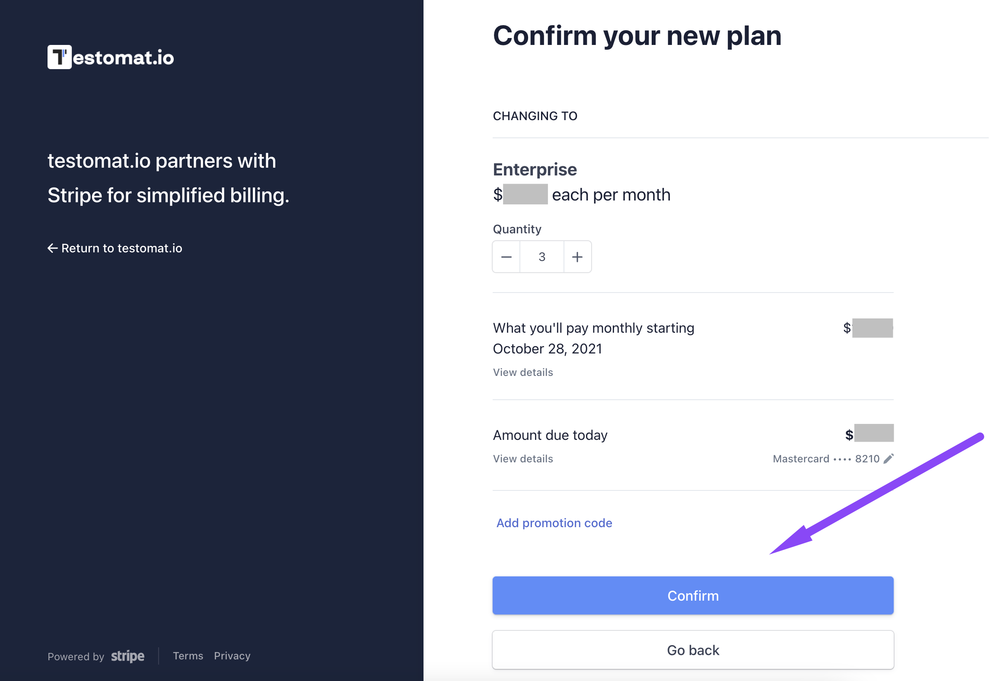

6. See your subscription plan was changed

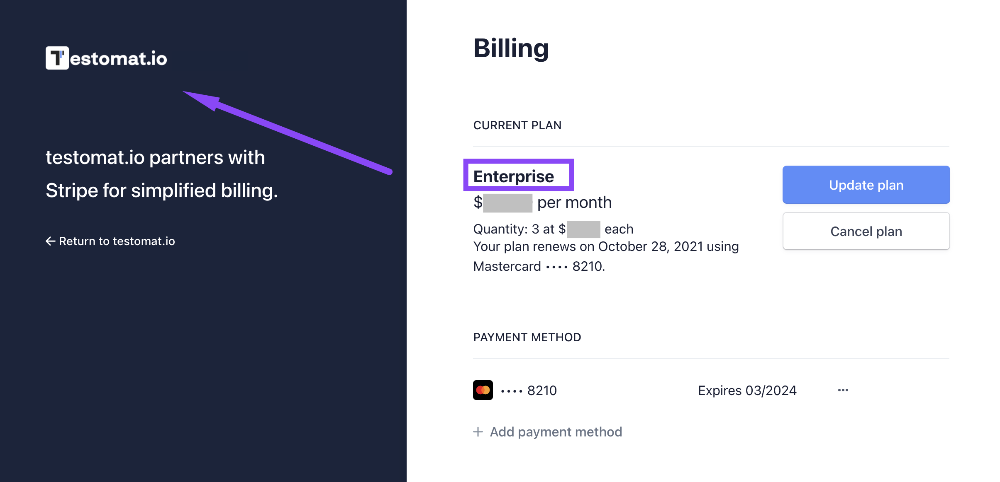

7. In Testomat.io you also will see updated subscription plan

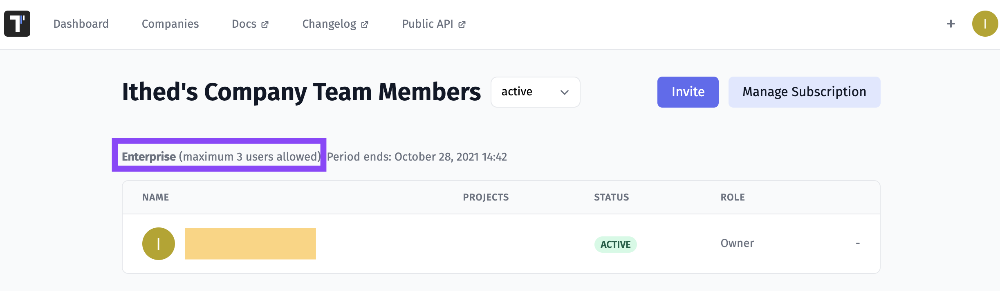

With the same steps, you can downgrade your subscription.

## Renew Your Subscription

Since billing occurs automatically, there is no need to manually renew your plan. At the end of your current billing period, your plan will automatically renew and you will be charged for the next subscription period.

## Cancel Your Subscription

To cancel your subscription, click the Cancel button on the billing page:

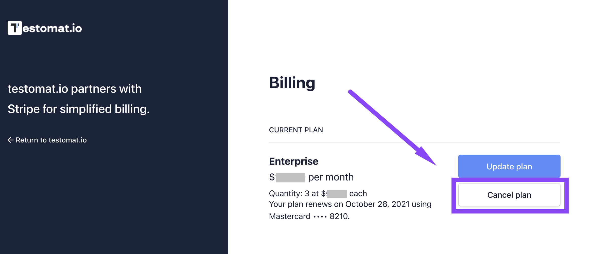

You will continue to have access to your current subscription level until the end of your current (already paid) billing period. At that point, any features beyond those allowed on the Free plan will be deactivated. If you renew or upgrade your subscription, your deactivated features and projects will be available again.

## Edit Your Billing Data

 > Please note, that there is no way to change Billing data for old bills.

 To update / edit your billing data you should go to Companies page > Manage subscription > Billing Iinformation > Update information

 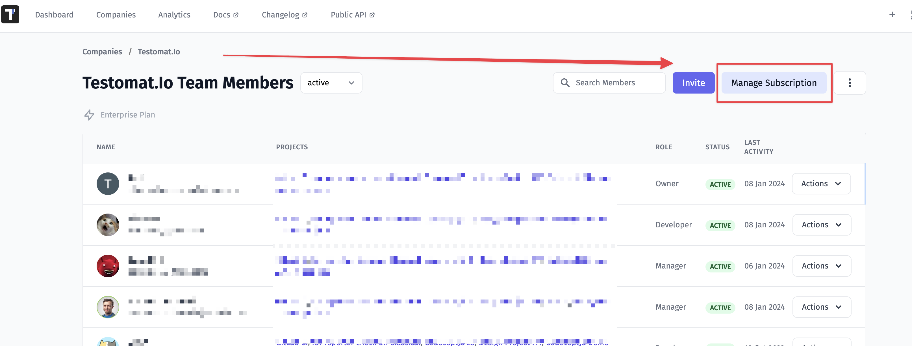

 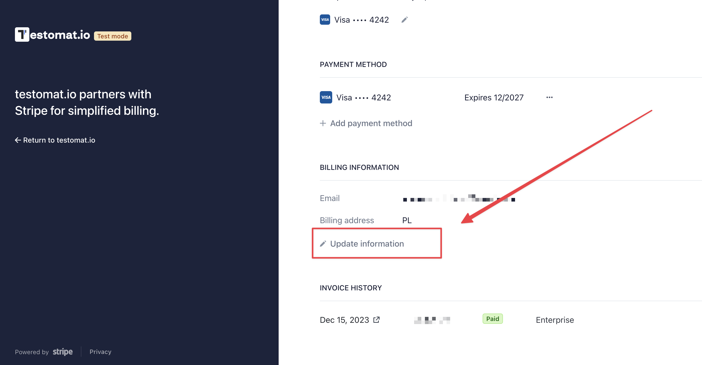

 Enter your data such as email, phone number, address, Tax ID > Save

 

 See your Billing Data was updated

 

 If you need to edit some specific Billing data please contact us support@testomat.io.

## What Happens To Locked Projects And Users

When your subscription is canceled your company is set to Free plan with appropriate limitations. You may [see it above ](https://docs.testomat.io/usage/subscriptions/#how-to-use-testomat.io-as-a-free-subscription-plan). Some of your projects may be locked, but not lost. Member added above Free Plan limit will be moved to removed section in Companies section and won't have access to projects. You can contact support to get the data from the locked projects or upgrade to unlock it. 

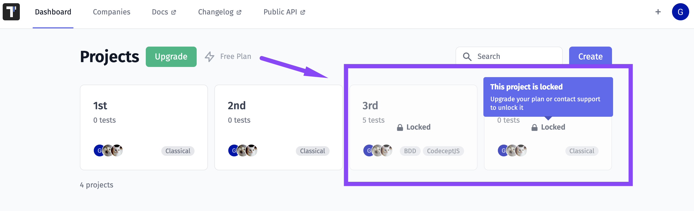
 

## Frequently Asked Questions

Q: I'd like to collaborate with a user who already has their own subscription. Should I purchase a seat for the user to collaborate on my projects?
A: Yes, in Testomat.io you pay for the number of licenses in your account. To start the collaboration, you may either invite the user to your account or ask them to invite you. 

Q: What currency am I going to be charged in?
A: Testomat.io accepts US currency only ($USD). 

Q: Can I share one license/seat with several members?
A: No, as it's one member per seat. However, you can release the license by removing a member and invite another person to the vacant seat.

Q: Is it possible to get free read only users in Trial or Free subscription?
A: No, free read-only users are available in Professional and Enterprise plans.

Q: Can I change Billing data for already paid bills.
A: No, Billing data can't be changed for old bills.