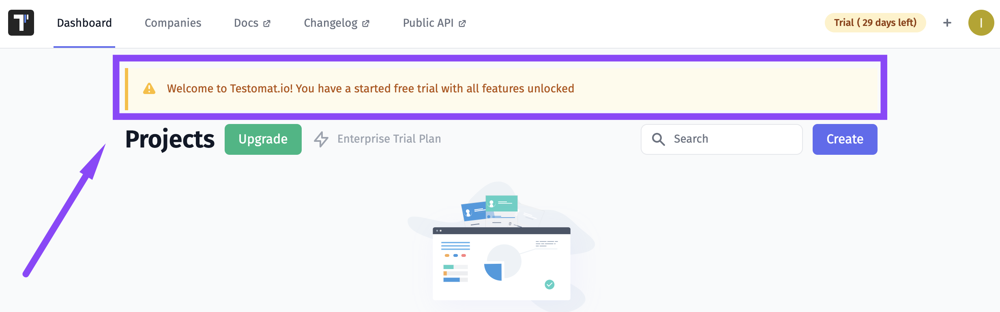
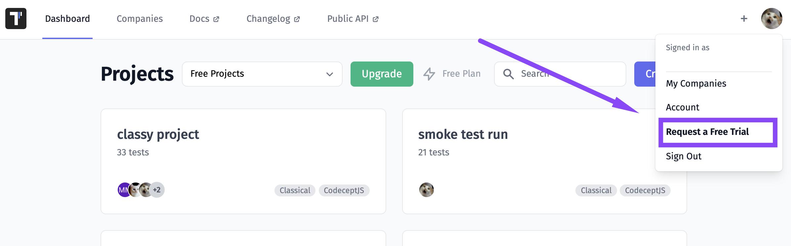

# Trials

Testomat.io provides two trials for you to evaluate all features: a 30 Days Trial and an additional extra 14 Days Trial, which you can use after the 30 Days Trial ends if you need more time to make a decision.

## Free 30 Days Trial

All new users are given a free trial to evaluate Testomat.io features without a commitment. The free trial period allows getting familiar with our features and benefits of delivery with simplified test management using out-of-the-box test automation integration capabilities.

**Duration**
The free trial is offered to all new users and lasts for 30 days from the moment of account creation.

**Limitations**
During the trial, users get **unlimited users and projects limits** and free access to **all features** without exception, namely:

- Branches
- Bug trackers integration (Jira)
- Jira plugin (BDD, Classical tests)
- Notifications (MS Teams, Slack, Jira)
- Public reports for read-only access
- Living documentation
- Documentation management integration (Confluence)
- Rerun failed manual/automated tests
- Runs and Runs Groups Archive
- Attachment 2Mb per unit
- Unlimited Runs History 

## Extra Free 14 Days Trial

For some reason, you may need more time to weigh up the advantages of Testomat.io. For such cases, you are offered Extra Free 14 Days Trial. All features listed above are available during this period.

**Duration**
An extra free trial lasts for 14 days from the moment of its activation. It is available only once per user registration. It may be picked after the ending 30 days trial at any time. It may be postponed, but it can't be paused. 

## When Trial Ends

Please note, when the Free Trial ends features over the Free plan limit will no longer be available. However, their data is not lost. If you subscribe to a Professional or Enterprise plan, you will be able to access those features and content again. If you are interested in the paid options supported by Testomat.io, see our [**pricing plan**](https://testomat.io/pricing/) for more details. 

## How Can I Request Free Trial

You can request Free Trial here:

1. click on the avatar icon 
2. in the menu click on Request a Free Trial 
3. your 30 days Free Trial is activated 

## How Can I Ask a Question
 
If you are a large company or if you have specific requirements, or for some reason you need more than the above-listed limits, write us at contact@testomat.io
