# Branches

The typical day-to-day workflow includes changes that developers make to the code. So as code is changing, quality assurance needs to update the tests to keep code tests coverage update. You may need to add tests for a new feature, but you don't want to affect existing suites and tests. Or there are a lot of specialists in the team and you don't want to affect each other's work and you need to write tests separately. 
For all these cases Testomat.io implemented tests branching and versioning, which helps software testing teams working on different parts of a project without impacting each other. Teams can more efficiently organize work on a shared tests base by branching and merging.

## How To Create A Branch

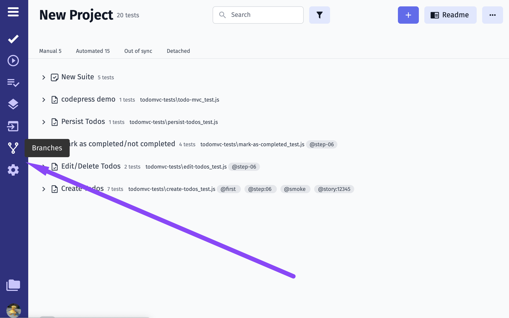

1. enter the name for your branch
2. click on Create button

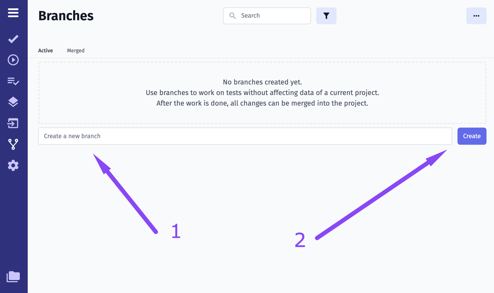

Here is your branch created:

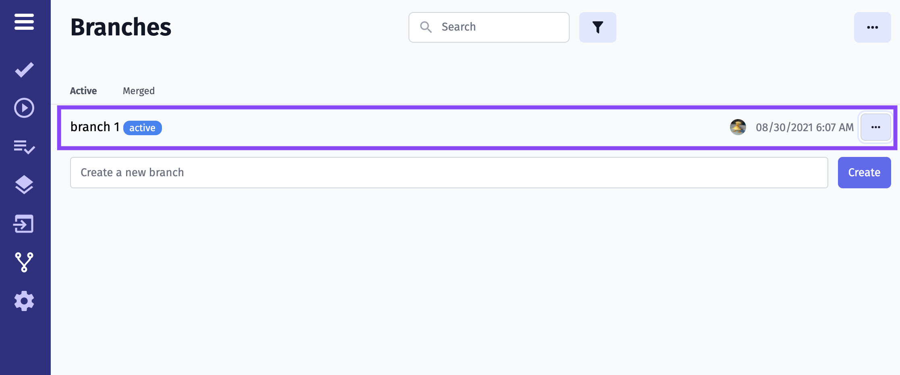

Now you can switch to a created branch

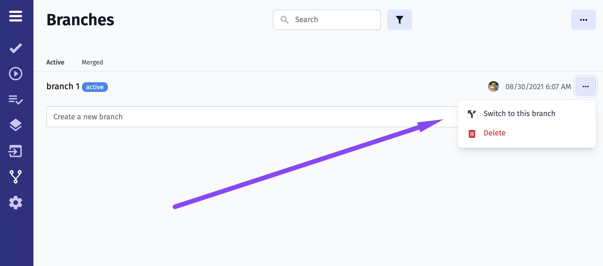

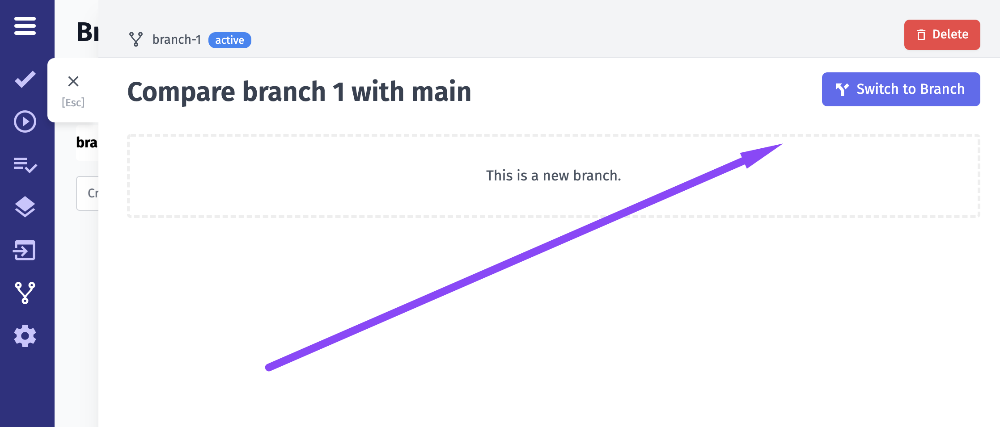

## Work Within The Branch

Now you work inside the branch

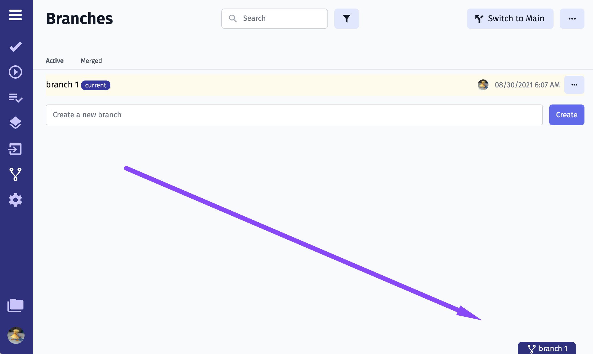

You can create suites and tests within the branch au usual. Suites and tests changed (1) and created (2) within the branch are marked with a badge, so you won't miss them.

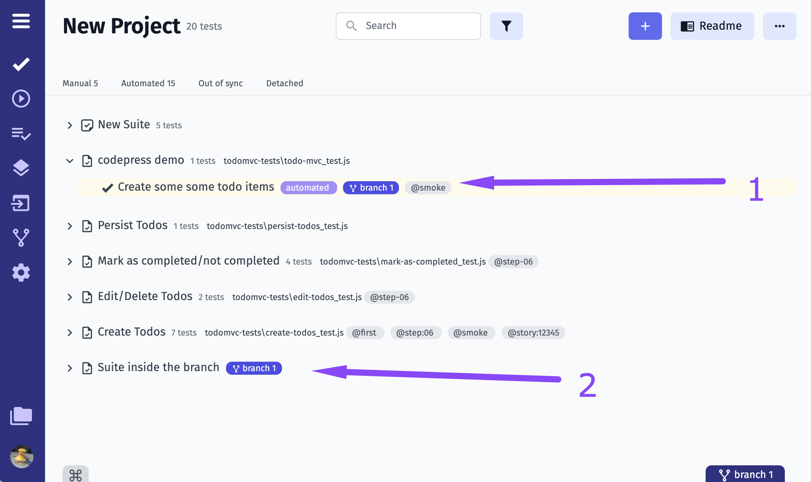

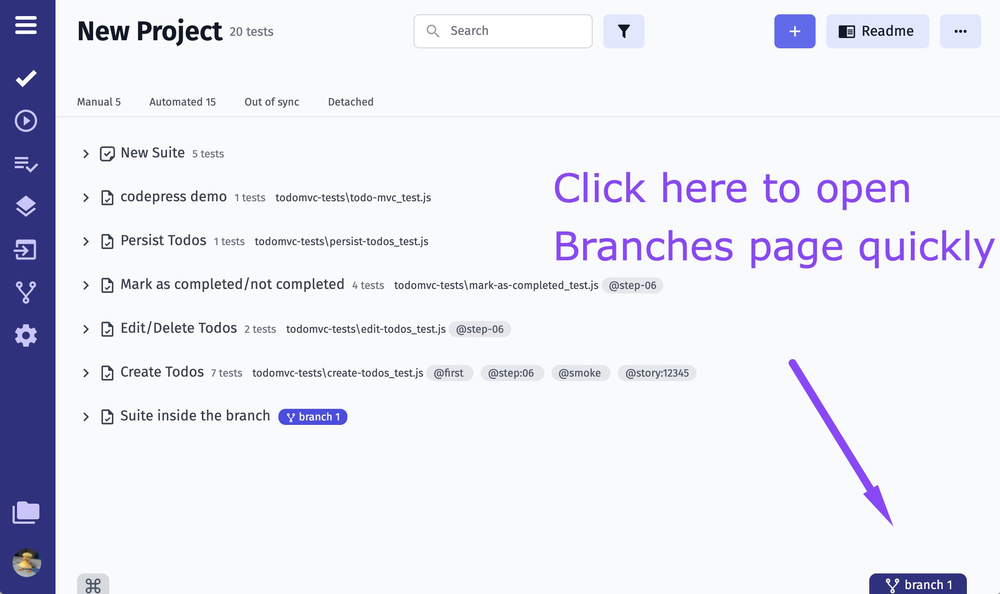

Also, you can view **Forks for tests changed in different branches** and switch to that branches. You need to open a test and switch to the Forks tab.

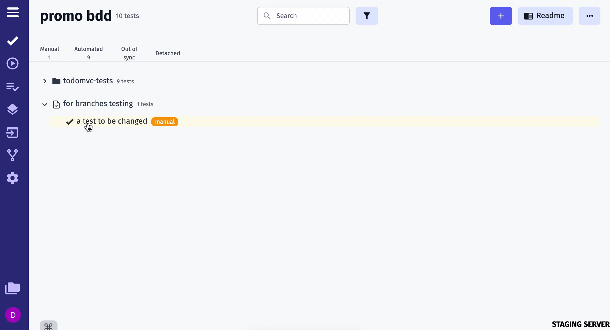

You can compare changes with Main 

You can switch to Main from the Branches page

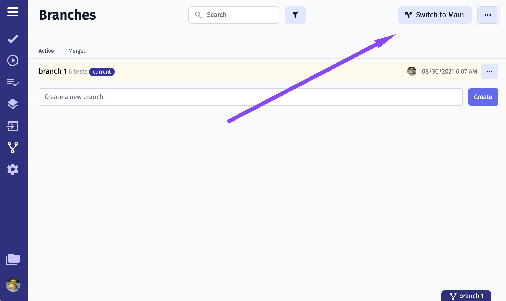

Or from the chosen Branch

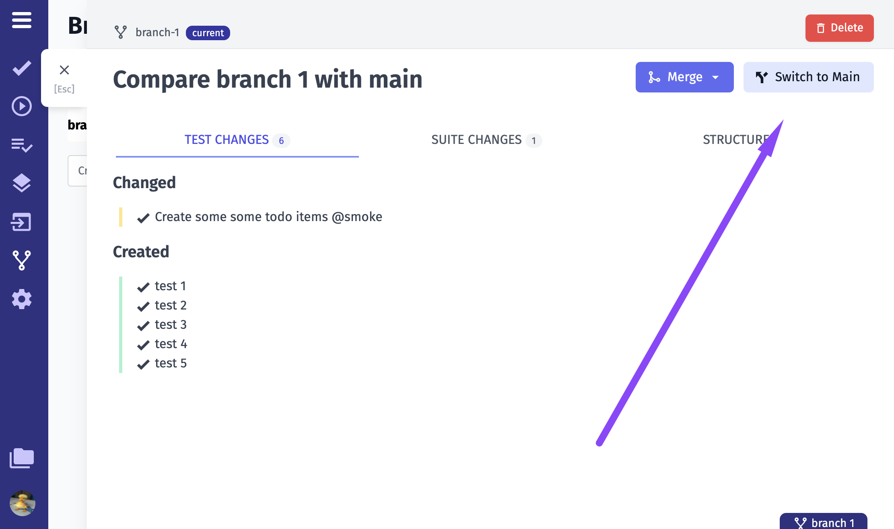

## Automated tests in Branches

When testing different versions of your software you may need to add automated tests to a specific branch for some reason. Testomat.io allows working with automated tests within a branch, separately from Main. 
You can import tests into a chosen branch or create a new branch during import using `TESTOMATIO_BRANCH` parameter. 
Learn more [here.](https://docs.testomat.io/reference/import/#import-into-a-branch-2)

## Merge And Replace To Main

After all work within the branch was done, you can merge or replace your changes to the main or replace

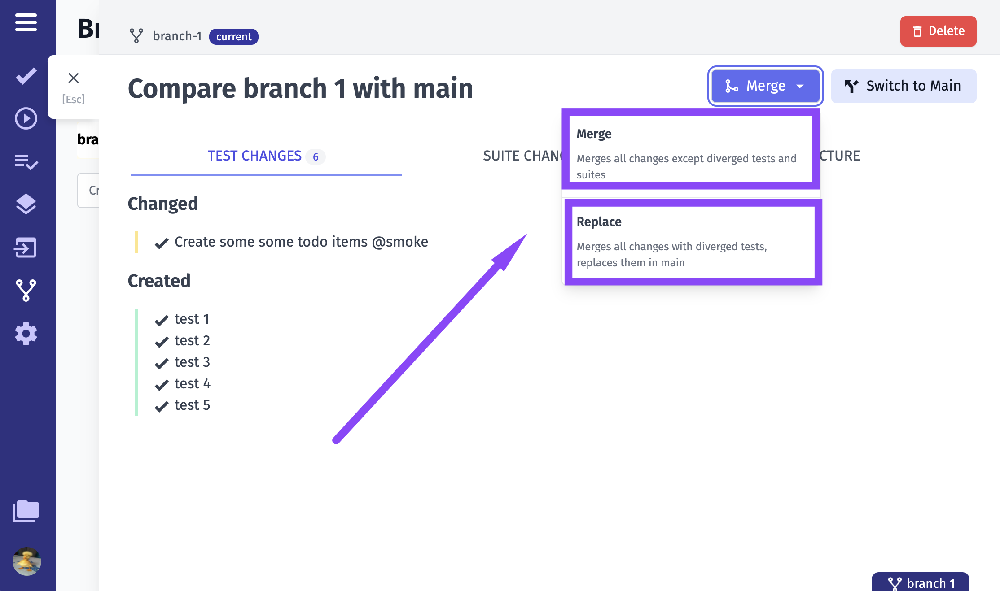

When the branch is merged it goes to the Merged tab.

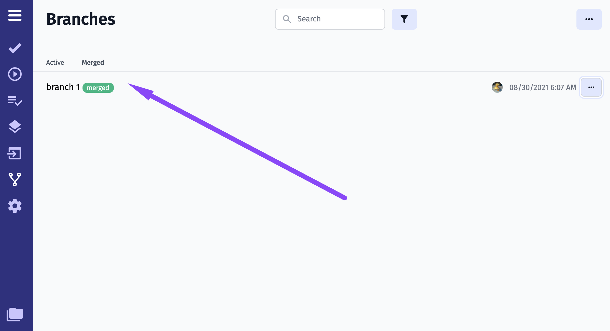

You can use filters to find the exact branch quickly.

## Difference between Merge And Replace

**Merge** merges all changes except diverged tests and suites, which means Testomat.io will merge only changed within the current branch tests and suites, so the Main will be complemented.

**Replace** merges all changes with diverged tests, replaces them in the Main, which means Testomat.io will fully replace the Main with the current branch. So previous changes within the Main can be off-track.
