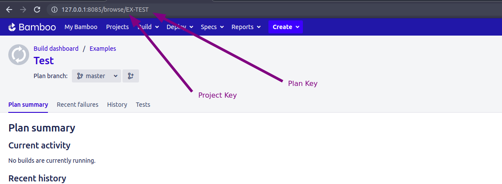

# Continious Integration

Testomatio allows executing tests on CI from its interface. 
A single test, suite, test plan, or all tests can be executed automatically on CI.

Currently following CI systems supported:

* [Jenkins](#jenkins)
* [Bamboo](#bamboo)
* [GitHub Actions](#github-actions)
* [GitLab CI](#gitlab-ci)
* [Circle CI](#circle-ci)
* [Azure Pipelines](#azure-pipelines)

## Overview

Testomatio uses REST API to trigger jobs on external CI systems. IDs of tests or suites can be passed to the job so only a specific test or suite will be executed. The test runner greps all tests by their IDs and executes a subset of tests. Then a report is sent back to Testomatio via reporter.


Connecting CI server to Testomatio consist of the following steps:

1. Create Testomatio Project
2. Import automated tests into that project from a repository
3. [Assign Ids](#assigning-ids) for imported tests source code
4. Create a new job in CI according to instructions on this page
5. Connect CI server to Testomatio 
6. Run your tests or suites to get reports!

## Assigning IDs 

To execute a specific test or a suite a test runner should have a way to find a test by its unique name. For this reason, Testomatio IDs can be used. If tests in the source code will have Testomatio IDs it will be very simple to filter tests. We provide a semi-automatic way to assign Testomatio IDs to tests in source code.

For JavaScript frameworks use the same `check-tests` command you used for importing tests with `--update-ids`. The tests must be already imported in Testomatio:

```
TESTOMATIO={apiKey} npx check-tests <framework> <pattern> --update-ids 
```

For Cucumber tests use `check-cucumber` command with the similar `--update-ids` command. The command should be the same as for importing plus `--update-ids` option:

```
TESTOMATIO={apiKey} npx check-cucumber <pattern> --update-ids 
```

This command will update your source code. Please check the changes before committing it.
If the Testomatio IDs were placed correctly you can commit your changes to repository.

From now on, Testomatio can use Test IDs to run exact tests and suites on Continuous Integration servers.


## Configuring CI 

CI configuration has 3 steps:

* establishing a connection with CI
* setting up required input variables
* setting up custom configuration variables

Follow the guide for a corresponding CI to set it up.

### Jenkins

To connect Jenkins to Testomatio you will need a user and an API Token created.
API token can be added on "Configure" page of current user: 


Then create a new Jenkins job. Select "Freestyle project".


> It is recommended to avoid spaces in job name to prevent issues with connecting to this job via URL

Make this build parametrized:


Add the following parameters as a string with empty default values:

* `run`
* `testomatio`
* `grep`

If you use on-premise Testomatio setup you will also need to add `testomatio_url` parameter.

Inside "Build Triggers" select "Trigger build remotely"


Proceed with configuring the job and set all required parameters like SCM and build steps.


Within a step pass in configured parameters as environment variables into the test runner. Let's take CodeceptJS command as an example:

```
TESTOMATIO_RUN=${run} TESTOMATIO=${testomatio} npx codeceptjs run --grep "${grep}"
```

> Prepend `TESTOMATIO_URL=${testomatio_url}` if you use on-premise versoin


Save the build and switch to Testomat.io. 

Open Settings and Connect a new CI:


Select "Jenkins" and fill in all required fields:


* `Jenkins Hostname` - URL of Jenkins host 
* `Username` - a user on Jenkins which will trigger builds
* `API Token` - a token we created previously in the user's settings.
* `Job Name` - the name of a job we just created

Switch to Input variables tab and enable variables that was configured for parametrized builds:


> Select `testomatio_url` if you use on-premise version.

Click "Save" and check the connection.

Now you can run a test or a group of tests via Jenkins CI. For a custom configuration read about [Environment Variables](#environment-configuration)

### Bamboo

Let's configure Bamboo CI server to work for CodeceptJS framework:

1. Create a plan for testomatio to run in testomatio


2. Note the plan key. In this case its "TES"
3. Configure the job to install node dependencies


4. Add the script to run codeceptJS tests:

```
TESTOMATIO_RUN=${bamboo.run} npx codeceptjs run --grep "${bamboo.grep}"
```
Following environment variables must be set:

* **Add `TESTOMATIO` environment variable with API key of Testomatio project.**
* If you are running a self-hosted Testomatio instance, add `TESTOMATIO_URL` variable to specify a host to which reports will be sent.


5. Set an input variable. Open Plan configuration:


add  `grep` and `run` variables with an empty string as a default value


Now, configure Bamboo integration at Testomatio:

1. Go to settings > CI and enter the details of Bamboo server. [Check this](https://confluence.atlassian.com/bamboo/personal-access-tokens-976779873.html) to generate API token


A project and plan keys can be found from URL:



2. Enable `run` option on Input Variables tab. This allows CI to send a report to a specific Run inside Testomatio.


You can pass more input variables if you set them in [Environment Configuration](#environment-configuration)

3. Open Runs page (or any test or suite) then select `Run in CI` option in extra menu. 


Select "Bamboo" profile in a list. Optionally, configure a Run Title and select a Test Plan.


4. Launch a run and wait for the results.


### GitLab CI

1. Add new trigger https://docs.gitlab.com/ee/ci/triggers/README.html#adding-a-new-trigger


2. Create .gitlab-ci.yml file or add the job to existing one. E.g. - 
https://gitlab.com/TetianaKhomenko/prod-setup/-/blob/main/.gitlab-ci.yml


It should contain next commands:
```
    - export TESTOMATIO="${testomatio}"
    - export TESTOMATIO_URL="${testomatio_url}"
    - export TESTOMATIO_RUN="${run}"
```
3. The job should include a step where the test runner is executed with --grep option and TESTOMATIO environment variables passed in. For instance:
```
    - npx codeceptjs run-workers 2 --grep "${grep}"
```
4. Connect a GitLab CI in Testomatio:


5. Save your connection

6. Now, open the "Configuration" tab and check the default ref value. ref is a target branch or a tag on which tests will be executed. By default, it is set to master (most of the repositories still use master as the main branch name, but we will adjust defaults accordingly when things change), but you can choose a different one, like main.


7. Run and testomatio inputs are passed from Testomatio. Enable them on the Input Variables tab. You can pass more input variables if you set them in Environment Configuration


8. When the connection is saved, open a test and select "Run in CI". Select a target ref and click "Launch"

9. This will start a new pipeline in GitLab CI please check that the job was successfully triggered and completed. After the job has finished a run report will be available on Runs page of Testomatio


### GitHub Actions

1. Create an [access token on GitHub](https://docs.github.com/en/github/authenticating-to-github/creating-a-personal-access-token) with access to workflow scope:


2. Create a workflow in a GitHub repository. Go to "Actions" tab in repository and click "Create Workflow" button. Then you will get a workflow template. A workflow filename will be used by Testomatio to call a specific workflow.


3. This workflow will be used solely by Testomatio so it should start only on `workflow_dispatch` event. The event should be defined with the following input parameters:

```yaml
name: Testomatio Tests

on:
  workflow_dispatch:
    inputs:
      grep:
        description: 'tests to grep '
        required: false
        default: ''
      run:
        required: false
      testomatio:
        required: false
```

4. The job should include a step where the test runner is executed with `--grep` option and TESTOMATIO environment variables passed in. For instance:

```yaml
    - run: npx codeceptjs run --grep "${{ github.event.inputs.grep }}"
      env:
        TESTOMATIO: "${{ github.event.inputs.testomatio }}"
        TESTOMATIO_RUN: "${{ github.event.inputs.run }}"
```

5. Connect a GitHub Actions CI in Testomatio:


You will need to enter the following

* GitHub Username
* OAuth token (created at step 1)
* organization/repository (or user/repository)
* workflow name, a file name with a workflow, like `testomatio.yml`

7. Save your connection
8. Now, open "Configuration" tab and check the default `ref` value. `ref` is a target branch or a tag on which a tests will be executed. By default, it is set to `master` (most of the repositories still use master as the main branch name, but we will adjust defaults accordingly when things change), but you can choose a different one, like `main`.
9. `run` and `testomatio` inputs are passed from Testomatio. Enable them on Input Variables tab


You can pass more input variables if you set them in [Environment Configuration](#environment-configuration)

9. When the connection is saved, open a test and select "Run in CI". Select a target ref and click "Launch"


10. This will start a new job in GitHub Actions, please check that the job was successfully triggered and completed. After the job has finished a run report will be available on Runs page of Testomatio

### Circle CI
1. Create an [access token on Circle CI](https://circleci.com/docs/2.0/api-developers-guide/#add-an-api-token) :


2.  Create a workflow in `config.yml` file in `.circle` folder in the root folder in your repository.

3. This workflow will be used solely by Testomatio so it should start only on workflow_dispatch event. The event should be defined with the following input parameters:

```
parameters:
  testomatio: 
    type: string
    default: ""

  run: 
    type: string
    default: ""

  testomatio_url: 
    type: string
    default: ""

  grep:
    type: string
    default: ""

```

4. The job should include a step where the test runner is executed with --grep option and TESTOMATIO environment variables passed in. For instance:

 ```
      - run:
          name: Run tests
          command: npx codeceptjs run --grep "<< pipeline.parameters.grep >>"
          environment:
            TESTOMATIO: << pipeline.parameters.testomatio >>
            TESTOMATIO_RUN: << pipeline.parameters.run >>
            TESTOMATIO_URL: << pipeline.parameters.testomatio_url >>
```

>  Select `testomatio_url` if you use on-premise version.

5. Connect a Circle CI in Testomatio:


You will need to enter the following:
- Circle CI Trigger Url (see how it works [here](https://circleci.com/docs/2.0/api-developers-guide/#getting-started-with-the-api))
- Circle Token (step 1)

6. Save your connection
7. Now, open "Configuration" tab and check Input Variables


8. When the connection is saved, open a test and select "Run in CI". Select a target ref and click "Launch"


9. This will start a new pipeline in Circle CI. Please check that the job was successfully triggered and completed. After the job has finished a run report will be available on the Runs page of Testomatio.

### Azure Pipelines

1. Create a Personal Access Token in your user account with permission to Read & Execute Build


2. Obtain the ID of a pipeline you want to execute. Open a pipeline and copy its ID from `definitionId` query parameter. On this screenshot the ID is `1`:


3. Create a new CI connection on Continuous Integration page in Settings in Testomat.io.


4. Fill in Private Access Token, Organization name, Project name, ID of a Pipeline

5. Switch to "Input Variables" tab and check boxes:

* Send Run ID as 'run' input (required for scheduled jobs)
* Send Testomatio API key as 'testomatio' input
* Send Testomatio Server URL as 'testomatio_url' input (If you use on-premise setup)

6. Save the conection

7. Testomat.io will need to send input variables into a pipeline. We need to enable them inside a pipeline using Azure DevOps UI. Open a Pipeline and edit it. 


8. Click "Variables" button


9. Create the following variables:

* grep
* run
* testomatio
* testomatio_url

 


Do not set defaults to this variable and tick "Let users override this value when running this pipeline" so Testomat.io could set these variables via API request.


10. Update the pipeline to use passed variables. Update the script and pass environment variables to a test runner. Each variable can be accessed as `$(variable)`. For CodeceptJS this command will look the following way: 

```yaml
- script: |
    TESTOMATIO=$(testomatio) TESTOMATIO_URL=$(testomatio_url) TESTOMATIO_RUN=$(run) npx codeceptjs run --grep="$(grep)"
  displayName: 'run tests'
```
> If you use Jest, Playwright, Cucumber, Cypress, etc replace  `npx codeceptjs run` with the execution command of your test runner.

You can pass more custom variables into a pipeline defining them in a Pipeline UI first and listing them in Testomat.io configuration as well. These variables should be set in Azure  in the same way as `grep`. See [Environment Configuration](#environment-configuration) to see how they can be configured in Testomat.io

To specify a different branch to run tests add `ref` parameter on Configuration tab specifying target ref.
 


To specify `develop` branch add this as config parameter:

```
ref=refs/heads/develop
```

## Input Variables

While connection settings can be different across CI settings, the list of input variables is the same. 


For example, Testomatio sends `grep` variable to CI to identify which tests should be executed. It may pass other input variables 
which can be used on CI to improve reporting.

Here is how `run` input variable can be accessed on different CIs:

* Atlassian Bamboo: `${bamboo.run}`
* GitHub Actions: `${github.event.inputs.run}`

Here is the list of preconfigured input variables:

* `run` - passes Run ID to CI. If this option is toggled on, when a run is created in Testomatio it is instantly added to the list of runs marked as "Scheduled". On CI `run` variable must be passed as `TESTOMATIO_RUN` environment variable to a reporter. This allows mapping a scheduled run to the run which is currently processed. **If `TESTOMATIO_RUN` is not set, a duplicate run will be created**.
* `testomatio` - passes project access key to CI. This input variable must be passed as `TESTOMATIO` environment variable to match the Testomatio project. Toggle on this option if you prefer not to hardcode Testomatio Project ID in CI configuration but to obtain this value on launch. This may be useful if you have a different Testomatio project configured for on CI run.
* `testomatio_url` - when working on a self-hosted Testomatio instance, this variable can be used to pass Testomatio endpoint to CI system. Pass `testomatio_url` environment variable to `TESTOMATIO_URL` 

## Environment Configuration

Sometimes extra configuration is required for CI job. For instance, extra configuration variables can be used to specify:

* browser
* target branch
* staging/production environments

Testomatio allows to predefine configuration variables and adjust them for each run. Config variables can be set in "Configuration" tab on CI connection settings.


Config variables should be put per line with the default value passed in with `=`. The format is similar to `.env` file format:

```
browsers=chrome,firefox,safari
branch=main
user=admin@admin.com
password=123456
```

> To set a variable without a default value just pass it as on a line without `=`

Those variables will be available for a reconfiguration on each CI Run executed from Testomatio.
If a variable value contains comma `,` like in example above: `chrome,firefox,safari`, these values will be displayed with the select box. Otherwise, a simple input will be shown:


These variables will be passed to CI in the same manner as `grep` parameter. So, CI job should be prepared to handle these config variables. For instance, if GitHub Actions are used, values are passed as `inputs` and can be used like this:

```yaml
    - run: npx codeceptjs run --grep "${{ github.event.inputs.grep }}" --profile "${{ github.event.inputs.branch }}"
      env:
        TESTOMATIO: "${{ github.event.inputs.testomatio }}" # passed from Testomatio by default
        BROWSER: "${{ github.event.inputs.browser }}"
        TEST_USER: "${{ github.event.inputs.user }}"
        TEST_PASSWORD: "${{ github.event.inputs.password }}"
```

