# Labels And Custom Fields

Labels & Custom Fields are powerful features in a test management system that allow users to categorize and organize their testing data.

**Labels** are keywords or phrases that can be applied to individual tests or test suites to provide an at-a-glance summary of the test's status, type, priority, or any other relevant information. Labels make it easy for users to filter and sort their tests to quickly find what they need.

**Custom fields**, on the other hand, are user-defined fields that can be added to a test case to capture specific information. For example, custom fields can be used to store information such as the tester's name, the expected result, the test environment, or the date the test was last run. Custom fields make it possible for users to tailor the test management system to their specific needs, and to store and retrieve data in a consistent and meaningful way.

Labels & Custom Fields can help users to streamline their testing process, increase the accuracy of their test data, and make it easier to find and analyze the information they need.

## How To Add Labels & Custom Fields

Labels can be easily added in Project Settings

1. Go to Settings
2. Pick Labels & Custom Fields
3. Enter a title for the label
4. Click Create

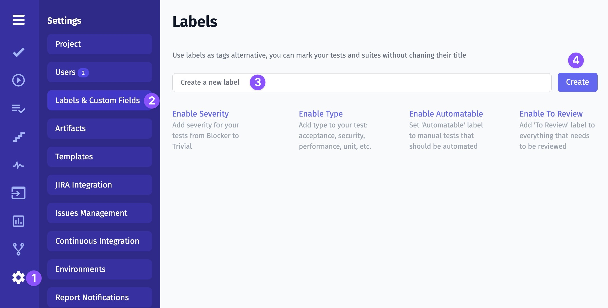

## How To Setup A Label

Before setting up Labels & Custom Fields we need to learn about **Scope** and **Visibility** parameters.

**Scope** defines what pages you want to apply the Label & Custom Field. Here you can define on what pages you want to use it. You can apply it to tests, suites, runs, plans, and steps.

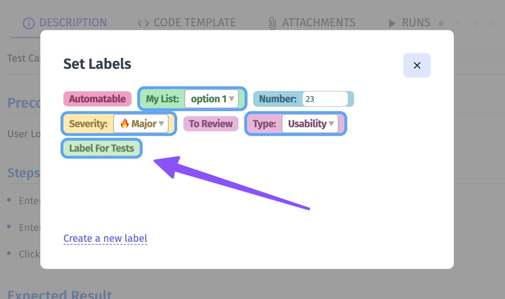

**Visibility**  defines how a Label & Custom Field should be shown in UI. 

- Filter visibility will show a Label or Custom Field in the Filter Bar, so you can sort your items quickly.
- List visibility will show a Label or Custom Field in the tests tree, a list of runs, plans, or steps.

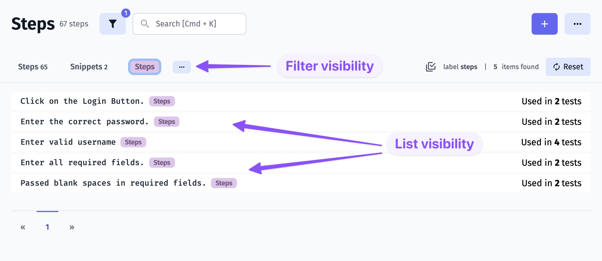

Now it's time to set up your label!

1. Scope - pick entities you want this label to be applied
2. Visibility - labels can be shown in the Filter bar, in the list of entities, or in both views
3. Custom Field - expand label capability to a custom field

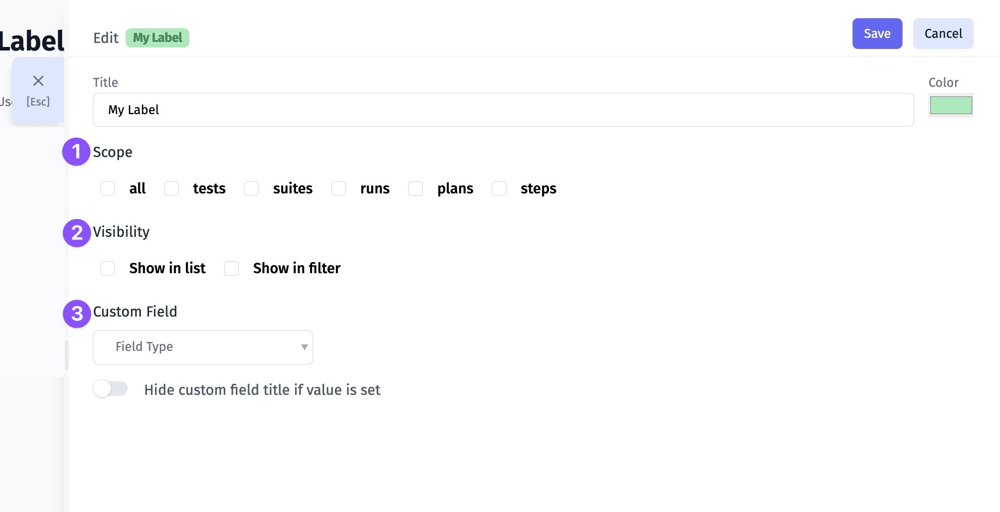

## How To Setup A Custom Field

There are such Field Types in Custom Fields: List, Number, and String. Let's take a look at each type.

### Custom Field: List

Custom Field with List type allows creating a list of your choice. You can put there any values to meet your testing needs. 
1. Pick a List type of Custom Field
2. Add a new item per line
3. Toggle **Hide custom field title if value is set** if you don't want to show Custom Field title
4. Click Save

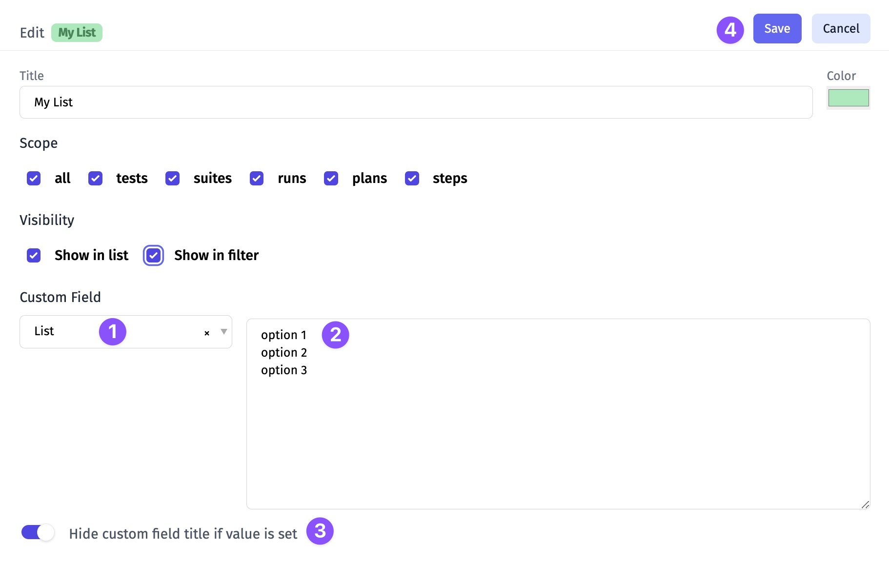

### Custom Field: Number

1. Pick a Number type of Custom Field
2. Toggle **Hide custom field title if value is set** if you don't want to show Custom Field title
3. Click Save

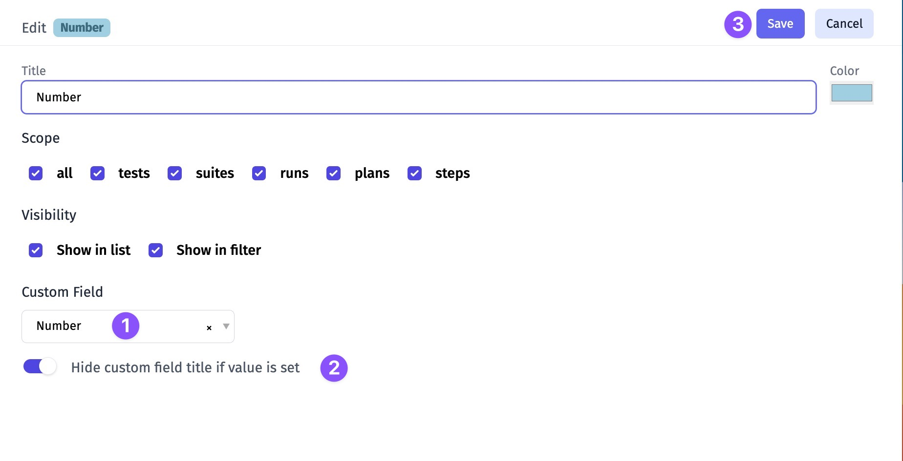

### Custom Field: String

1. Pick a String type of Custom Field
2. Toggle **Hide custom field title if value is set** if you don't want to show Custom Field title
3. Click Save

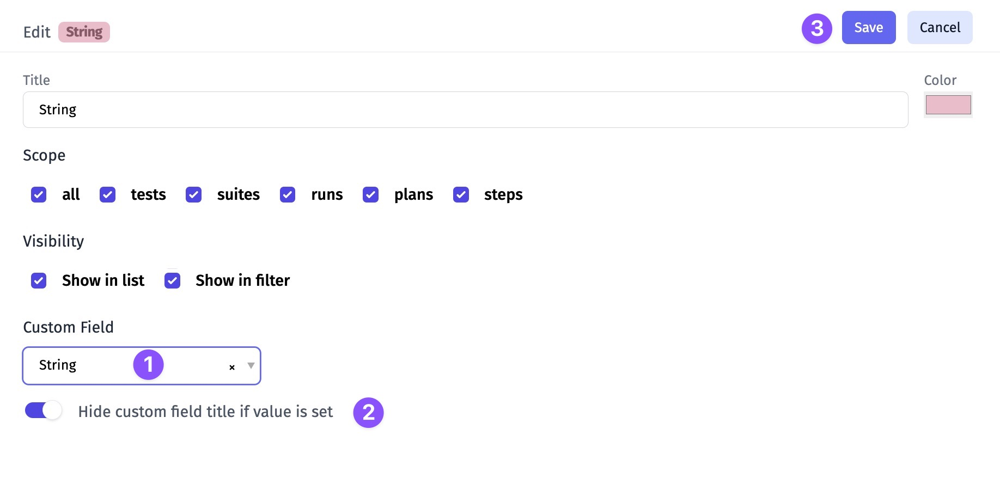

## How To Assign Labels & Custom Fields

- Add labels on the entity level

1. Open a suite/ test
2. Click Extra button
3. Click Labels 

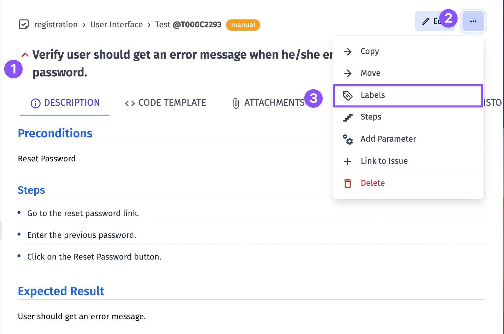

4. Pick Labels & Custom Fields

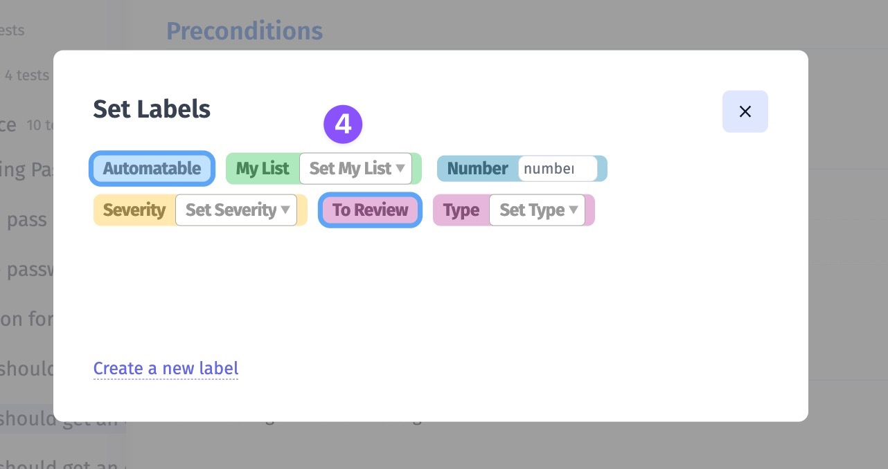

- Mass-assign labels using our multiselection mode

1. Enable multiselection mode
4. Pick tests/ suites
5. Click Labels button

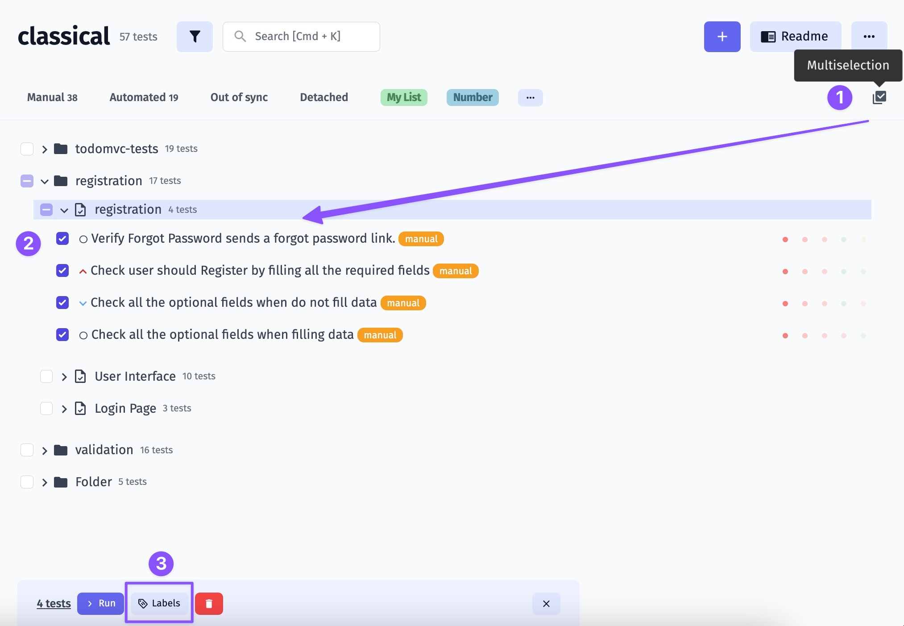

4. Pick Labels & Custom Fields
5. Click Add

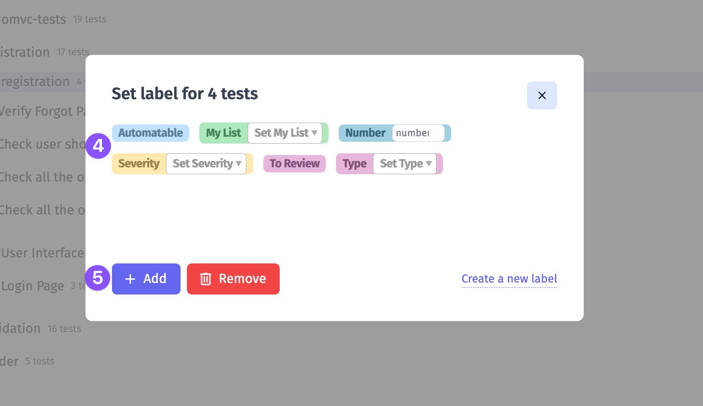

## How To Filter By Labels

You can click the Label on the Filter Bar

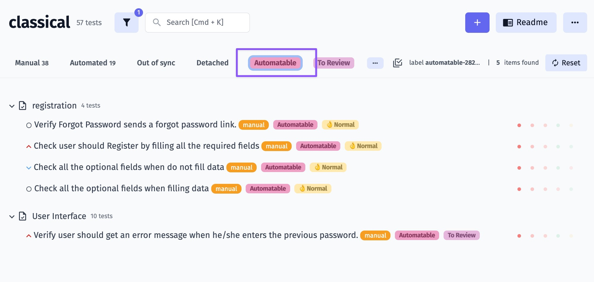

Or enable Filters, pick fields and values then click Apply

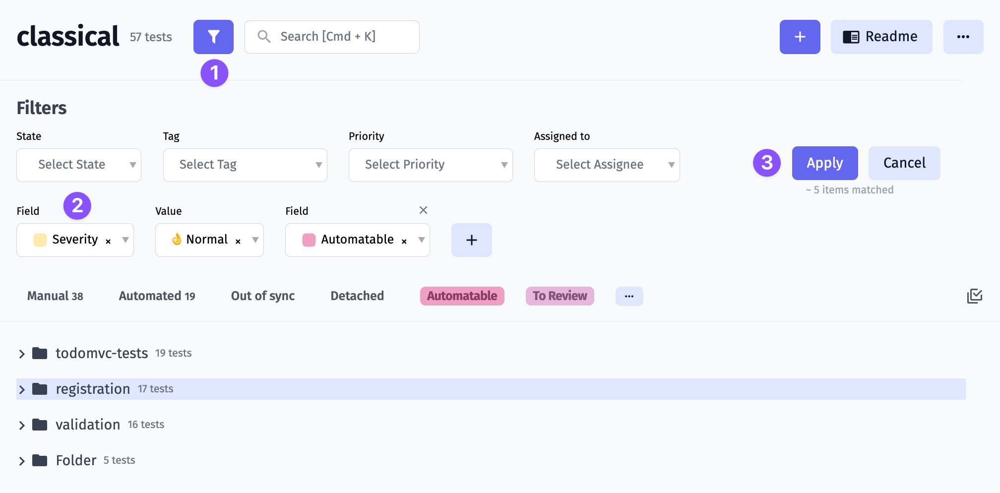

