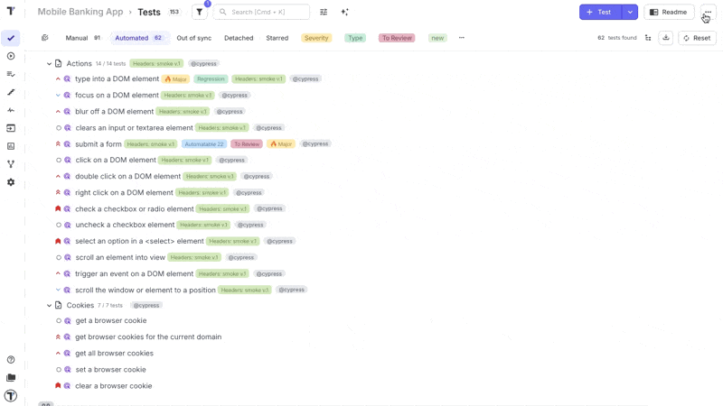
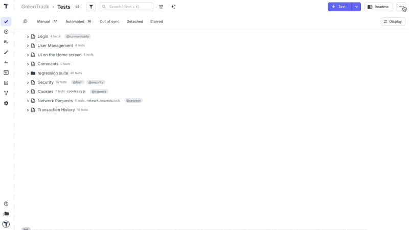
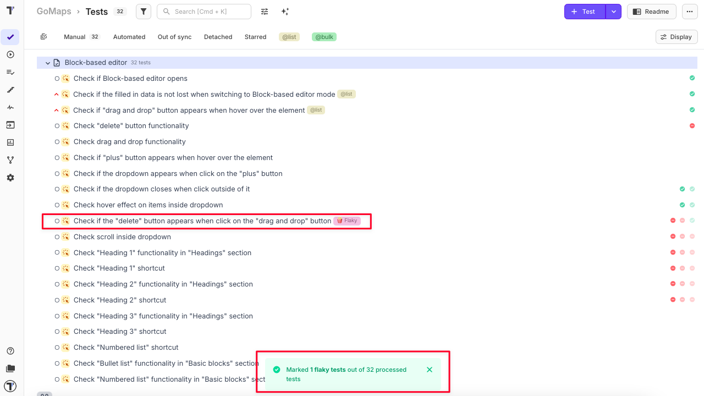
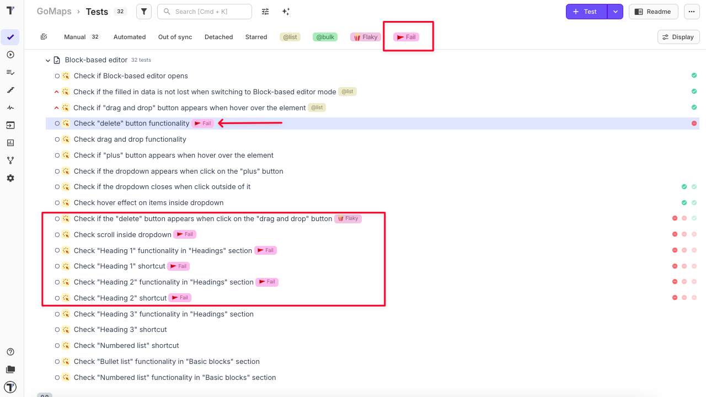
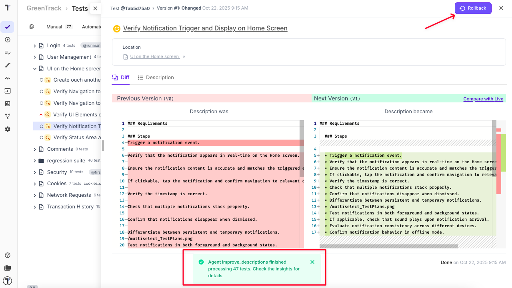
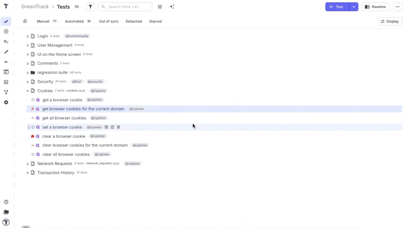
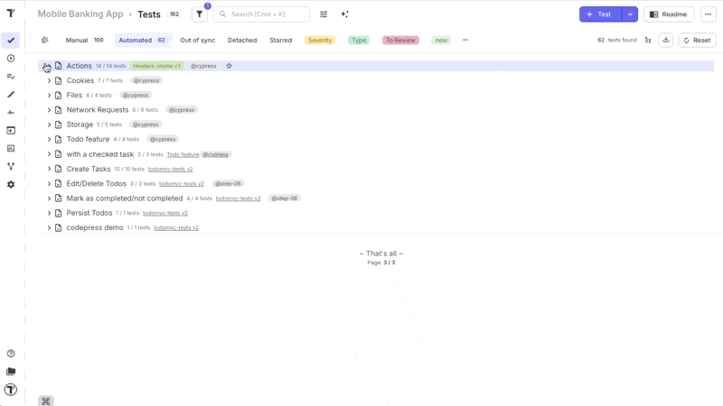
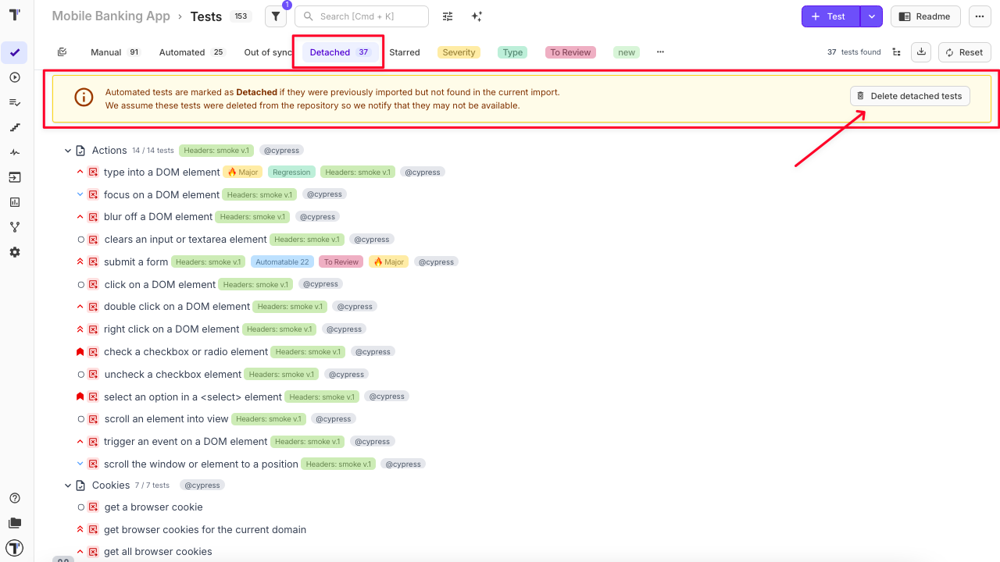

## AI-Agents

Testomat.io introduces another AI-powered feature — **AI-Agents** — designed to automate and enhance key aspects of your test management workflow using machine learning and intelligent logic.

- **Deep Analyze** - Deeply analyzes the project and provides a comprehensive overview of the running status and coverage of tests.
- **Improve Test Descriptions** - Go through all tests with descriptions and improve their markdown formatting. This action won't change the content, only improves the formatting. Applied changes can be safely reverted in Pulse.
- **Write Descriptions from Code** - Updates all automated tests which have no description by analyzing their code and writing descriptions.
- **Mark Flaky Tests** - Adds "Flaky" label to all flaky tests detected by analytics. Update analytics settings to customize flaky detection.
- **Mark Failed Tests** - Adds "Failed" label to all tests that failed all the time. Analytics will detect tests that failed for last month.
- **Transform Project to BDD** - Creates a new project with all the tests converted to BDD Gherkin format.

:::note

These powerful AI-features are available in the **Enterprise plan**.

:::

### 1. 🔎 Deep Analyze

**'Deep Analyze'** is an intelligent AI-agent that performs a comprehensive audit of your testing project. It provides a clear overview of test execution, coverage, and identifies critical gaps that could block a release — ideal for QA leads, product managers, and teams preparing for production readiness.

#### Key Capabilities

- **Analyzes entire test suites** for execution status, stability, and coverage.
- **Summarizes functional areas** by mapping tests to key modules or features.
- **Identifies missing, never-executed, or placeholder tests**.
- **Highlights critical gaps** in business logic, security, and performance testing.
- **Assesses release readiness** based on test data from the last 14 days.
- **Provides actionable recommendations** to close gaps and improve completeness.

---

### 2. 🍿 Mark Flaky Tests

**'Mark Flaky Tests'** uses execution analytics to automatically detect flaky tests—those that intermittently pass or fail without code changes—and labels them accordingly. This improves visibility and helps teams isolate unstable tests.

#### Key Capabilities

- **Automatically labels flaky tests** based on execution patterns.
- **Isolates unreliable tests** to reduce CI/CD noise and instability.
- **Improves test reliability** by enabling targeted review.
- **Streamlines triage** with a consistent "Flaky" label.
- **Supports customization** through Analytics Settings for detection rules and thresholds.

---

### 3. 🚩 Mark Failed Tests

**'Mark Failed Tests'** identifies tests that have failed 100% of the time over the past month and labels them as "Failed." This helps surface persistent issues that could block releases or degrade pipeline reliability.

#### Key Capabilities

- **Labels tests as "Failed"** if they have a 100% failure rate over the past month.
- **Highlights critical failures** that require immediate attention.
- **Improves visibility** into long-standing issues across the suite.
- **Enables targeted filtering** and prioritization through labeling.

---

### 4. 📝 Improve Test Descriptions

**'Improve Test Descriptions'** automatically enhances the formatting and readability of test case descriptions using Markdown — without changing the original content. It ensures descriptions are structured, easy to scan, and consistent across the project.

#### Key Capabilities

- **Parses existing descriptions** to detect structure and intent.
- **Applies clean Markdown formatting**, including bullet points, emphasis, and separation of steps/results.
- **Preserves original meaning** while improving presentation.
- **Standardizes phrasing** for clarity and consistency.
- **Cleans up grammar and punctuation** for professional polish.
- **Non-destructive edits** — all changes can be reverted via **Rollback** button in Pulse.

---

### 5. 🧙‍♂️ Write Descriptions from Code

**'Write Descriptions from Code'** generates human-readable test descriptions by analyzing the test logic directly from code. It helps teams understand test intent without diving into implementation — especially useful in large repositories or during onboarding.

#### Key Capabilities

- **Generates descriptions** for automated tests lacking documentation.
- **Analyzes code logic** to produce accurate summaries.
- **Reduces manual effort** in documenting test cases.
- **Improves onboarding** and cross-functional understanding.
- **Supports traceability** and project clarity.
- **All changes are reversible** via Pulse.

---

### 6. 🎁 Transform Project to BDD

**'Transform Project to BDD'** automatically converts your existing test project into BDD format using Gherkin syntax. It rewrites each test into the Given/When/Then structure, creating a new project that follows behavior-driven development practices.

#### Key Capabilities

- **Analyzes existing test cases** and rewrites them in Gherkin format.
- **Creates a new project** with the converted BDD test suite.
- **Supports Given/When/Then syntax** for clarity and structure.
- **Eliminates manual rewriting**, accelerating BDD adoption.
- **Improves collaboration** with non-technical stakeholders.
- **Standardizes test style** across teams and projects.

---

### 7. 🐷 Auto Detach Automated Tests

**'Auto Detach Automated Tests'** identifies automated tests that haven’t been executed in the last 45 days and marks them as "Detached." This helps keep your test suite clean, relevant, and easier to manage.

#### Key Capabilities

- **Scans execution history** to detect unexecuted tests.
- **Automatically detaches inactive tests**, flagging them for review.
- **Supports test suite optimization** by surfacing potentially obsolete tests.
- **Reduces noise** in dashboards and analytics.
- **Improves test lifecycle management** by highlighting stale cases.
- **Non-destructive** — detached status can be reverted via Pulse.

