Testomat.io introduces **AI-powered generative features** to simplify and enhance your test management workflows. These tools leverage artificial intelligence to assist QA engineers by automating test documentation, generating actionable insights, and providing answers about their projects.

Testomat.io uses **Groq** (not Grok designed by xAI by Elon Musk) as the main AI provider, it was founded in 2016 by a group of former Google engineers.

**Groq** uses opensource models like Llama or Mixtral and doesn't train its own models. However, we urge you to ensure compliance with data privacy regulations when sharing sensitive information. Enable AI features only if you are sure that your data is not sensitive. 

Testomat.io supports **Amazon Bedrock** as a custom AI provider, allowing teams to use Testomat.io AI features with their own configured models. This gives teams more flexibility and control over AI-driven workflows while staying compatible with Testomat.io AI capabilities.

:::note

By default, AI-powered generative features are disabled for your confidence. 
You can enbable AI at any time on Company Settings page by following the instructions in the [Administration section](https://docs.testomat.io/management/company/administration/#ai).

:::

## AI-Powered Chat with Tests

**'Chat with Tests'** feature — an AI-powered assistant that allows you to ask questions about existing tests in your project. The AI analyzes your test repository and responds with insights, summaries, or clarifications based on the actual test content.

This interactive capability makes it easier to explore, understand, and manage large sets of tests without manually browsing through them.

You can use **'Chat with Tests'** feature on Project or Folder level.

### Use 'Chat with Tests' Feature at the Project Level

1. Go to 'Tests' page.
2. Click **'Chat with tests'** AI icon displayed in the header.

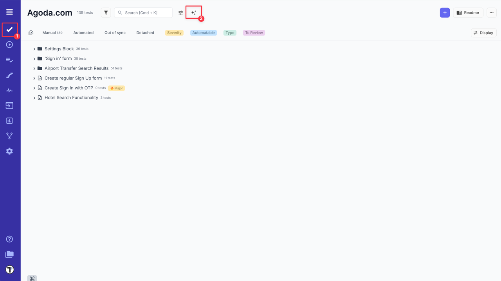

3. Select a pre-configured AI promt offered by Testomat.io, update it as needed:

- **Summarize this project, list all features tested, separate by sections, use bullet points** - if you want to have short overview on your project.

- **Suggest new test cases for the first suite in the project** - if you want AI to gerenare new test cases.

- **Create plan with 30 tests for smoke testing max. Pick at least one test from each suite, trying to cover most crucial features** - if you want AI to generate smoke test plan for you.

OR

Create you own AI-promt.

4. Click **'Ask'** button.

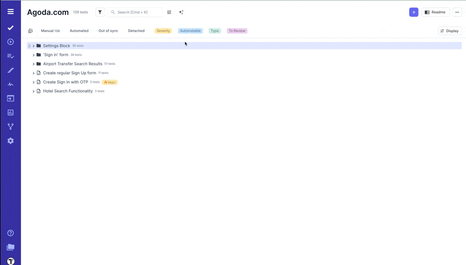

### Use 'Chat with Tests' at the Folder Level

You can also use **'Chat with Tests'** on folder level to analyze and summarize information within the selected folder:

1. Go to 'Tests' page.
2. Select the Folder.
3. Click **'Chat with Tests'** button.

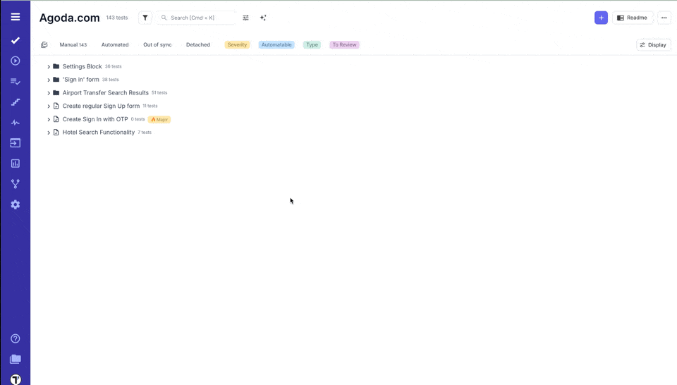

## Summarize Suite Description Based on Test Cases

You can automatically generate a suite description by analyzing the test cases within it. This saves time by eliminating the need for manual suite documentation and ensures descriptions accurately reflect the test content:

1. Go to 'Tests'.
2. Select Suite with test cases.
3. Click **'Summarize'** button.

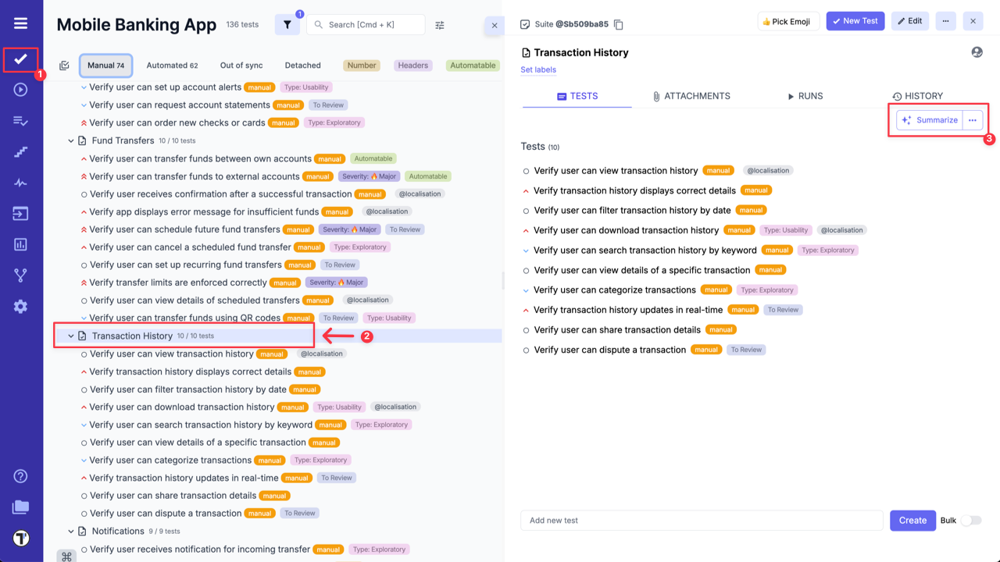

:::note

**'Summarize'** button appears only when the Suite contains tests (testCount > 0) and 'Suite Summary' modal is open.

:::

AI-generated response will include the suggested **suite summary** and **suggested actions**.

You can copy (1) AI-generated response, regenarate it (2), and as well, you can edit it, improve, change formatting, or add specific sections using **'Follow up'** input field (3) if suggestion is unsatisfactory:

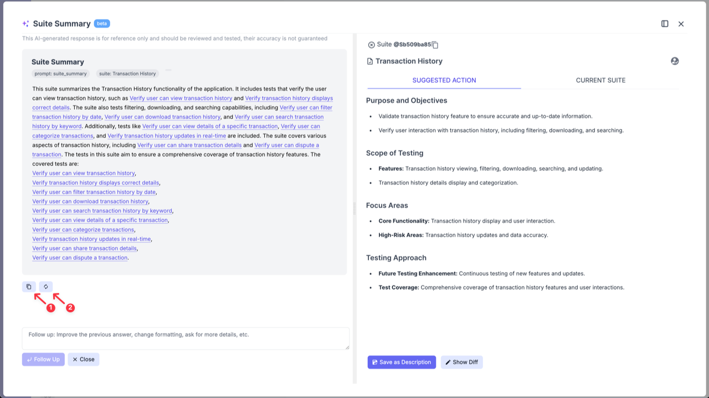

On **'Suggested Actions'** side, you can directly save the description to your suite (4).

If your suite already has a description, you can click the 'Show Diff' button (5) to compare your current description with the AI’s suggestion.

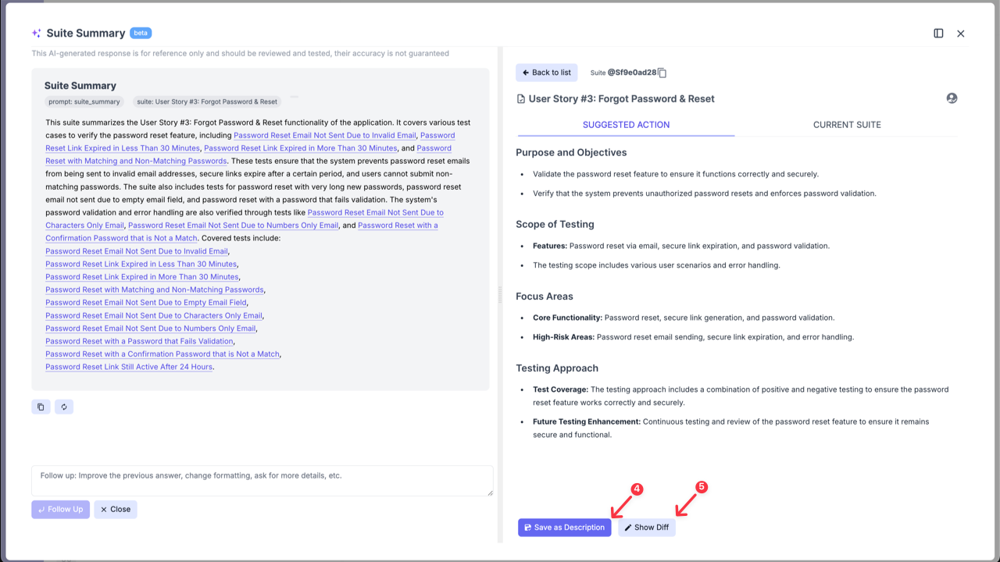

## Suggest Test Cases

You can also use AI to enhance your test coverage by creating additional test cases based on test cases that you already have in your test suite, as well they can be created based on Suite description or Requirements.
This feature makes it easier to create comprehensive test suites. 

### Suggest Test Cases Based on Existing Test Cases

If you have at least one previously created test case, you can use this AI-feature to generate more test cases.

1. Open Test Suite that already contains Test Cases.
2. Click **'Extra menu'** button.
3. Select **'Suggest Tests'** option from the dropdown list.

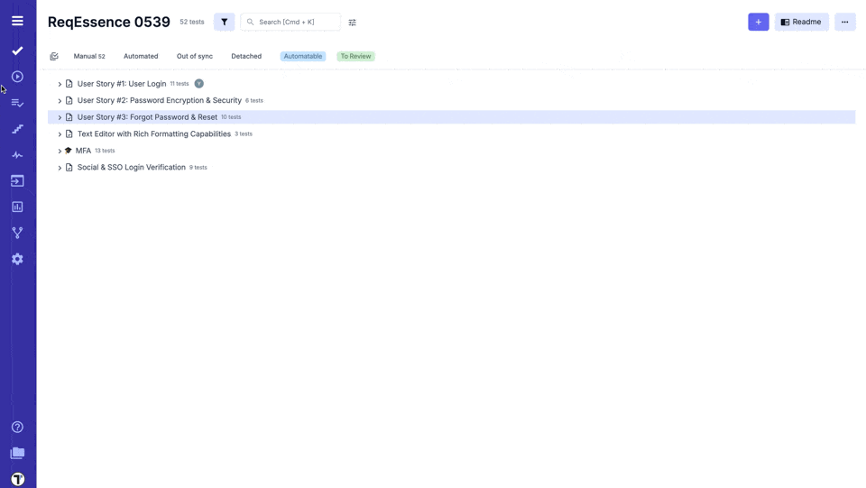

You can review the suggested tests, select those that align with their needs, and directly add them to the suite.
As well, you can generate more test cases, by clicking the **'Suggest More Tests'** button (1). 

Testomat.io recommends adding only the necessary tests cases to your suite!

### Suggest Test Cases Based on Suite Description

You can also use this AI feature to suggest tests based solely on the Suite Description.

1. Open Test Suite with a description.
2. Click **'Extra menu'** button.
3. Select **'Suggest Tests'** option from the dropdown list.

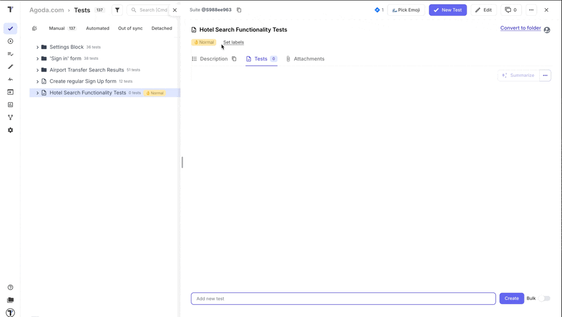

### Suggest Test Cases Based on Requirements

Testomat.io also allows you to create test cases based on added requirements. For detailed instructions, refer to the **'AI-requirements'** page:

- [Generate Test Cases from Requirements Page](https://docs.testomat.io/advanced/ai-powered-features/ai-requirements/#generate-test-cases-from-requirements-page).
- [Suggest Test Cases Based on Requirements from Suite Level](https://docs.testomat.io/advanced/ai-powered-features/ai-requirements/#suggest-test-cases-based-on-requirements-from-suite-level).

If your test suite is linked to requirements (e.g., User story in Jira), AI will suggest checking your existing test cases for redundancy by clicking the **'Remove Redundant Tests'** button (2).

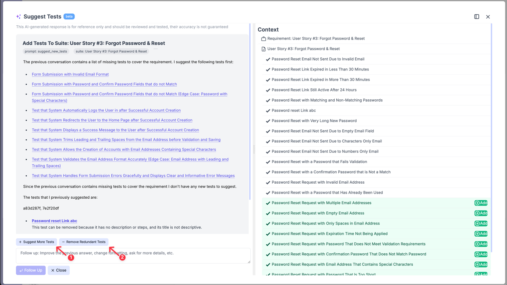

You can remove redundant test cases directly within the AI-assistance window:

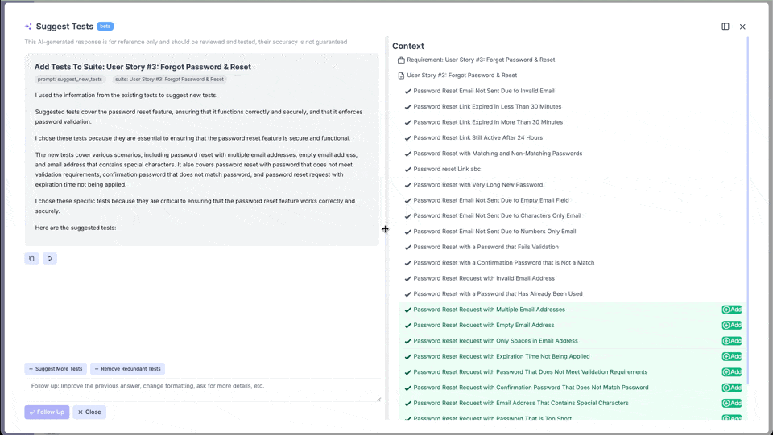

:::note

You always need explicitly select which test cases to add or remove.

:::

This feature accelerates test creation, enhances coverage by identifying overlooked scenarios, and streamlines workflows by reducing manual effort while maintaining test quality.

### AI Test Data Suggestions

Instead of manually creating input values, AI can generate realistic test data based on a test case description.

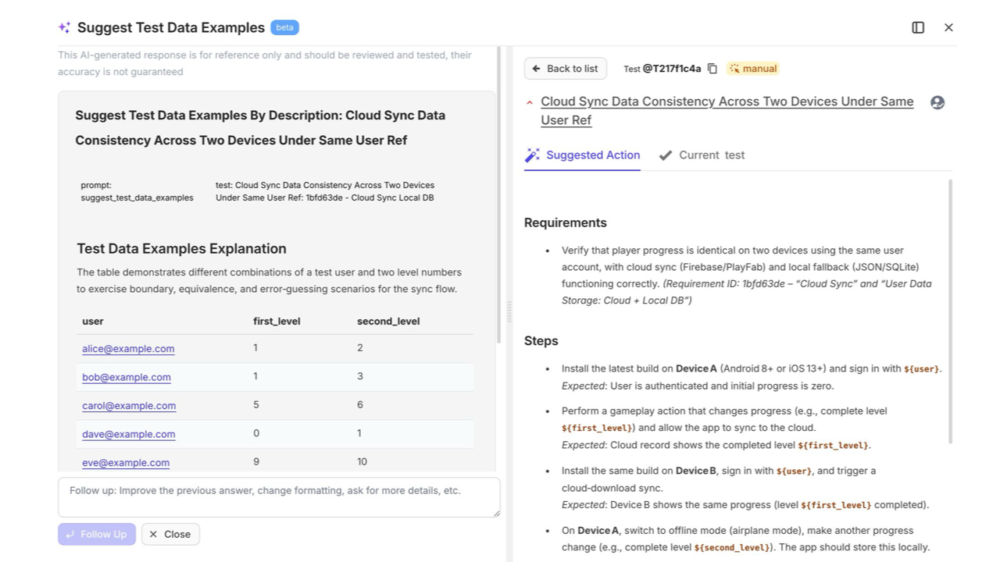

Suggested data can help:

* Increase test coverage
* Discover edge cases
* Reduce preparation time
* Improve manual and automated testing scenarios

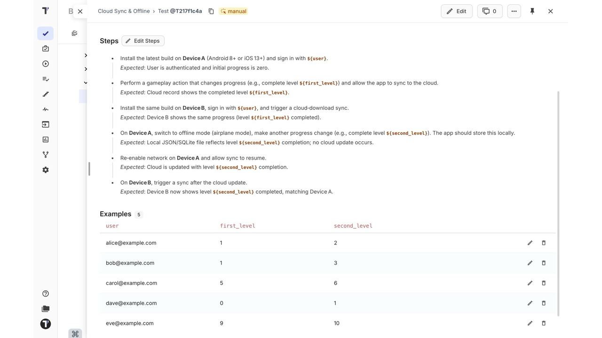

:::note

AI-generated data can be used as-is or modified before execution.

:::

## Suggest Test Case Description

This feature allows you to create test case description based just on its name or improve description that you previously added to your test case.

1. Open Test Case.
2. Click **'Suggest Description'** button.

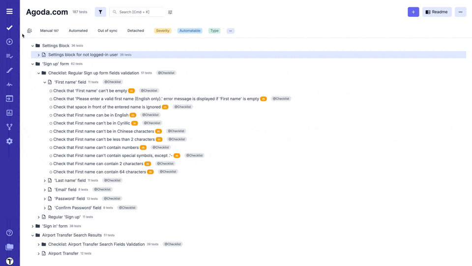

## Suggest Description for BDD Project

This AI-powered feature functions in BDD projects exactly as it does in Classical projects. It analyzes your previous Gherkin scenarios to create a new one automatically.

1. Open a Test Case within your BDD project.
2. On **'Scenario description'** tab click **'Suggest Description'** button.

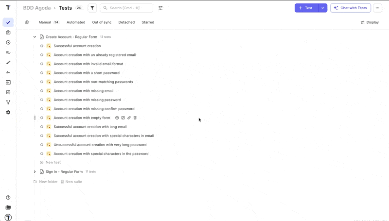

The AI will populate the description with a human-readable overview of your Given/When/Then steps, saving you the manual effort and keeping your documentation consistent. And allowing you to edit the suggested description directly from the AI modal.

## Suggest Better Test Case Description

**'Suggest Better Description'** AI-feature is your shortcut to turning rough notes into professional test cases.

If you have a "draft" description that is messy or lacks detail, the AI rewrites it using testing best practices—adding structure, clear objectives, and necessary context.

**How to use this feature:**

1. Open Test Case with you want to refine.
2. Click **'Extra menu'** button on 'Description' tab.
3. Select **'Suggest Better Description'** option from the dropdown menu.

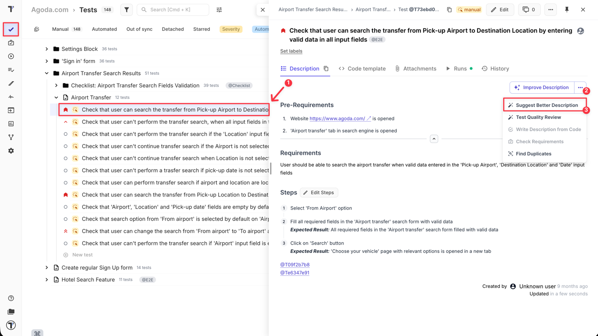

4. Click **'Show Diff'** to see a side-by-side comparison of your original text and the AI’s suggestions.
5. Click **'Update Test Description'** to apply the improvements.

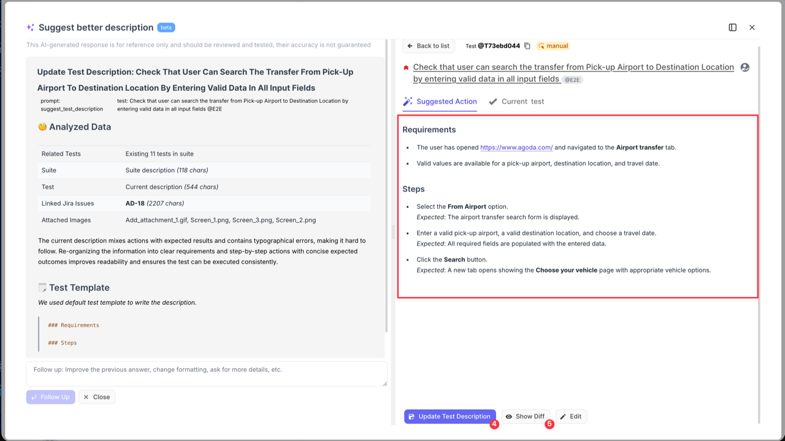

## Generate Test Case Description Based on Test Code

Use AI to analyze your test code and produce detailed test descriptions. Bridges the gap between technical code and human-readable documentation, improving collaboration between technical and non-technical team members:

1. Go to 'Tests'.
2. Select Test Case with code.
3. Click **'Write Description from Code'** button.

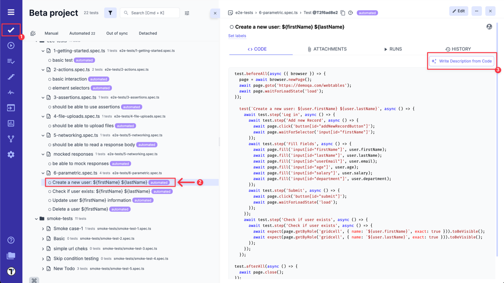

Test Summary is created:

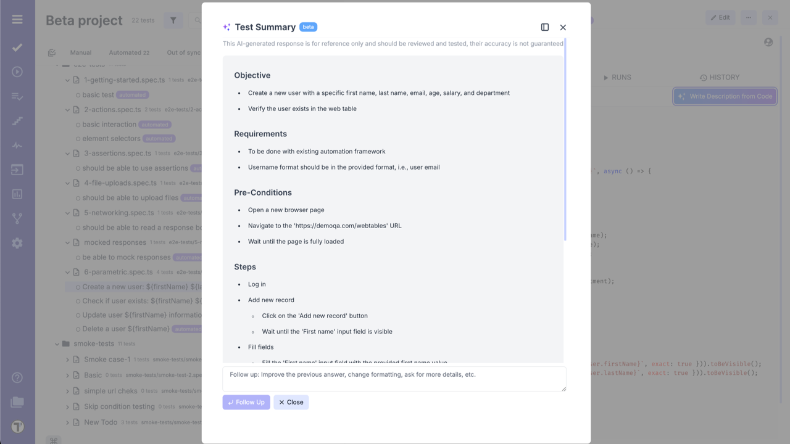

:::note

**'Write Description from Code'** button shows only when the test has code.

:::

## Generate Code Based on Test Case Description

Provide a test description, and the AI generates the corresponding test automation code. Please note that generated code may be not completely comprehensive.

Code will be created based on the project framework settings and other tests in this suite.
Use it as boilerplate code only.

To check your Project framework settings go to Project Settings page:

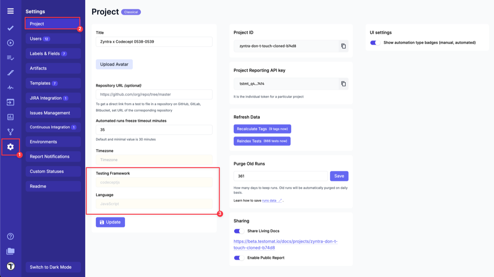

## Test Case & Code Quality Review

The AI-powered **Quality Review** feature can be used for for both manual test descriptions and automated test code. It allows you to analyze your tests and provides intelligent feedback with actionable advice to improve clarity, structure, and adherence to best practices.

The AI reviewer analyzes your Test Case for "adequacy" and clarity across key dimensions.

**Key Quality Dimensions:**
- **Title Clarity:** Is the title understandable even to someone who doesn't know the project context? A good title should tell you what's being tested at a glance, no decoder ring required.
- **Preconditions:** Are they listed clearly, especially for complex or multi-step tests? Missing preconditions are one of the biggest reasons test cases fail in the hands of new team members.
- **Steps Defined:** Are the steps structured and described well enough for another tester to repeat them easily? Think of it like a recipe, if someone can't follow it without calling you, it needs improvement.
- **Expected Results:** Do we clearly know what success looks like at the end? Vague expected results like "system works correctly" won't cut it. Be specific.
- **Reusability:** Could a new team member pick up this test and understand it without extra help? This is the ultimate litmus test for quality.

When these aspects are well-covered, you can confidently say your test case is high quality, written in an accessible way, reusable across contexts, and easy to maintain in the future.

This review is especially valuable for large projects with multiple testers, helping QA Leads and Managers monitor consistency and control the quality of testing documentation across the team.

Based on its analysis of these **Key Quality Dimensions**, AI reviewer returns a **Test Case Score** and a list of improvement recommendations.

**Key benefits of AI Review:**

- **Consistency:** Unlike human reviewers, AI focuses on the same aspects every time.
- **Scalability:** AI easily reviews large volumes of tests (e.g., 500 test cases) without burnout.
- **Speed:** AI review is instant, unlike human review, which can be slow under tight deadlines.
- **Availability:** AI is always available, even when senior reviewers are not.

AI doesn't replace human judgment, but it provides a consistent baseline that every test case should meet before human eyes review it.

### Test Case Quality Review

This feature evaluates the quality of a manual test’s description, suggesting improvements for readability, consistency, and completeness.

1. Go to 'Tests'.
2. Select the Test Case with description you want to review.
3. On 'Description' tab, click **'Extra menu'** button.
4. Select **'Test Quality Review'** option from the dropdown list..

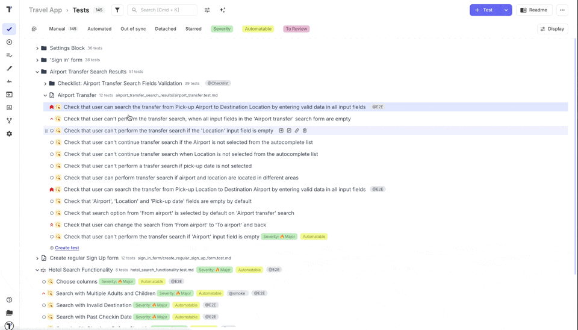

### Test Code Quality Review

This feature reviews your automated test code to detect potential issues, enhance maintainability, and align with testing standards.

1. Go to 'Tests'.
2. Select Test Case with the code that you want to review.
3. On 'Code' tab, click **'Extra menu'** button.
4. Select **'Test Quality Review'** option from the dropdown list..

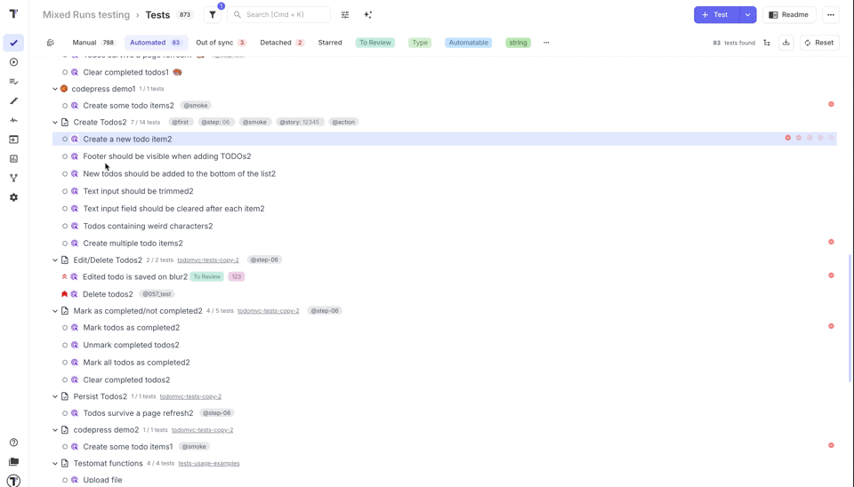

Test cases are the backbone of systematic testing. Clear, consistent, and well-maintained tests ensure your entire QA process runs smoother.

By combining human expertise with AI-powered review, you can create test documentation that actually effectively serves its purpose, helping teams test better, faster, and more reliably.

## Find Duplicates by Test Descriptions

Instead of manually searching through all your test cases for duplicates, you can use the AI-powered **'Find Duplicates'** feature. The AI analyzes your project, identifies duplicate test descriptions, and suggests their removal to keep your repository clean.

To use this feature:

1. Go to 'Tests'.
2. Select a Test Case that you want to check for duplicates.
3. On 'Description' tab, click **'Extra menu'** button.
4. Select **'Find Duplicates'** option from the dropdown list..
5. Click **'Remove'** button to delete the identified duplicate tests from your project.

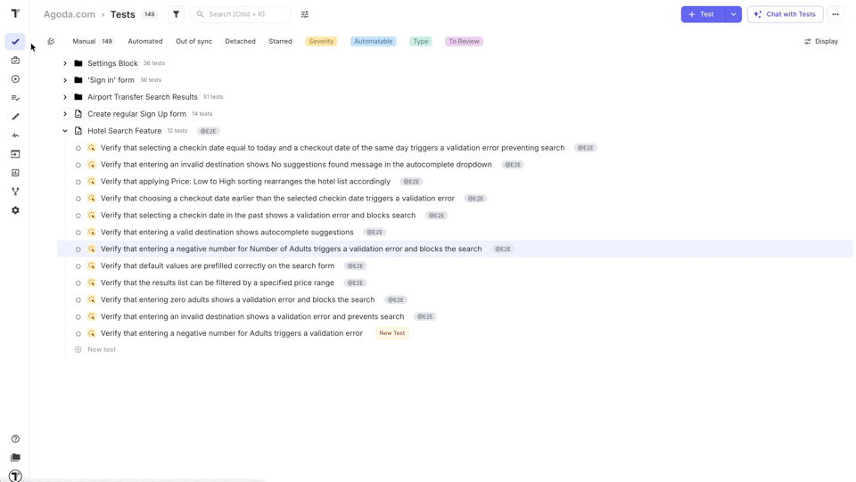

:::note

If you accidentally remove a test or want to audit the changes, you can navigate to the **'Pulse'** page to verify the deletions or restore the tests.

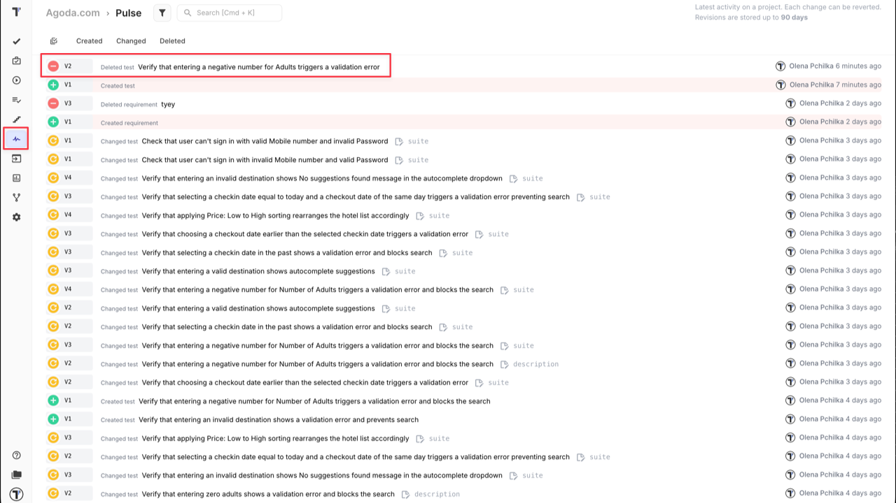

:::

## Generate Bug Description Based on the Test Case

When you executing tests and creating a new defect, Testomat.io will automatically suggest a concise, context-aware bug title and a description. These suggestions are based on the test case content and its execution results, helping teams report issues faster and more consistently.

**Why is this useful:**

- **Speeding up defect logging:** Testers can instantly use or refine AI-suggested bug details, reducing time spent writing repetitive or obvious issue reports.
- **Maintaining consistent bug reporting standards:** The AI helps standardize descriptions across team members, which improves clarity and communication with developers.
- **Assisting less experienced testers:** Junior team members or non-technical testers can rely on AI-generated suggestions as a starting point, ensuring important details aren’t missed.

## Analyze Failed Automated Test Cases

Use AI to analyze your failed automated tests to understand ans summarize main reasons for your tests to fail.

:::note

Shows only for finished, automated runs with 5+ failures.

:::

1. Go to 'Runs' page.
2. Open finished automated run.
3. Click **'Clusterize Errors'** button.

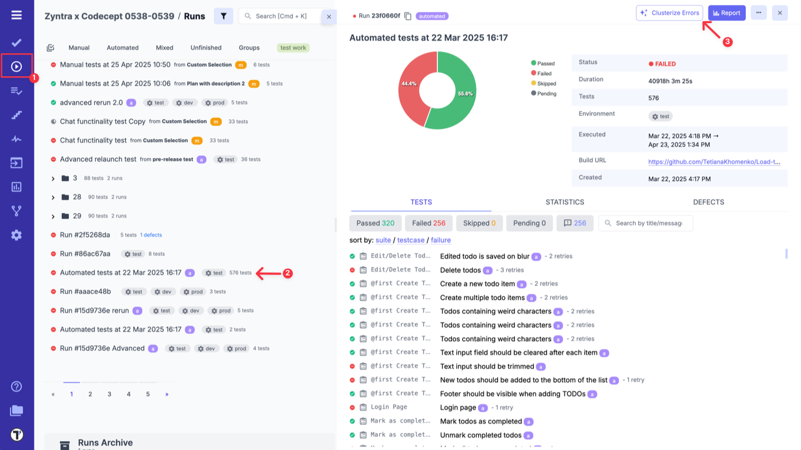

Example of errors clustarization:

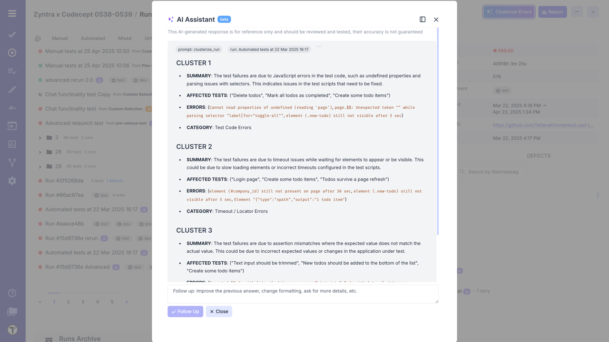

## Explain Autotest Failures Based on Logs

Using stack trace, code of test, test execution logs and screenshot of failure, AI will identify and explain reasons behind failures. It helps to reduce debugging time by providing actionable insights directly within the Testomat UI. It also offers you a possible fixes.

The same as in the previous case, it also available only for finished, automated runs with 5+ failures.

1. Go to 'Runs' page.
2. Open finished automated run.
3. Click on Failed Test Case.
4. Click **'Explain Failure'** button.

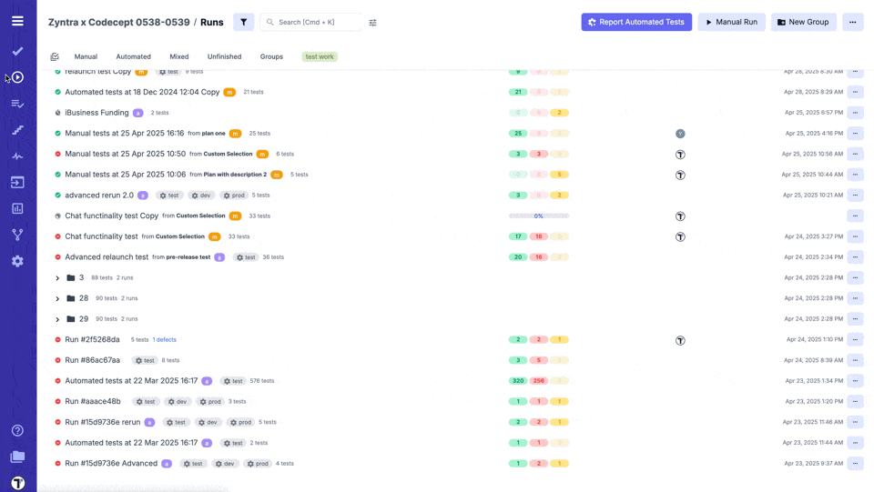

## Test Run Summary 

Testomat.io allows you to use AI-powered feature to analyze and summarize your finished test runs. It highlights risk areas and provides recommendations for improvements based on test results.

1. Go to 'Runs' page.
2. Select finished test run for statistics snalysis.
3. Click **'Run Summary'** button.

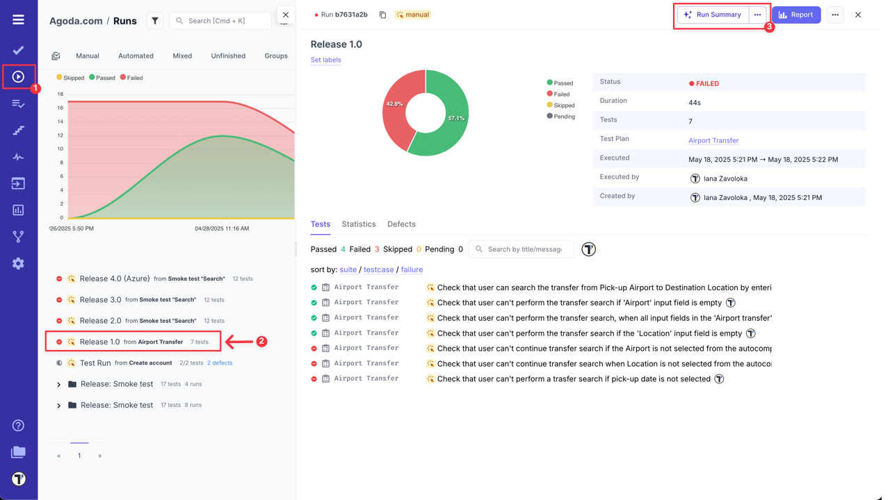

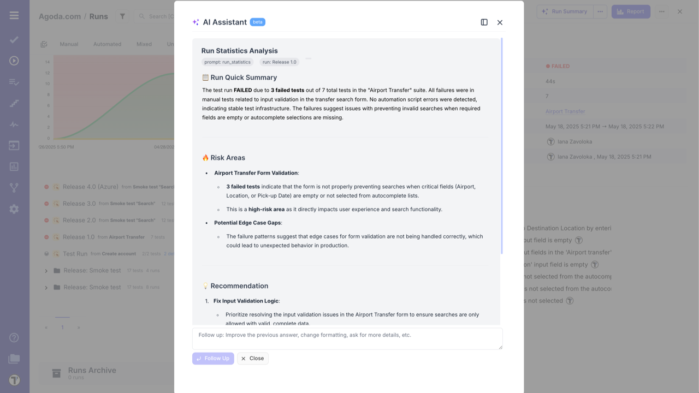

:::note

**AI-powered features** are available for Classic and BDD projects.

:::

## Analyze Suite 

**Analyze Suite** tool brings AI-powered analytics directly to individual suites, helping you assess both **functional coverage** and **suite stability** without navigating the entire project view.

**What’s included:**

- **Functional area coverage mapping** – analyzes tests within a suite to determine which parts of your product it covers.
- **Suite Stability Report** – evaluates recent test execution results to highlight flakiness, instability, or recurring issues.
- **Focused insight** – ideal for monitoring the health of specific product modules or critical flows.

**To access this feature:**

1. Go to 'Tests'.
2. Select the Suite that you want to analyze.
3. Click **'Extra menu'** button on 'Summarize' button.
4. Select **'Analyze Suite'** option from the dropdown menu.

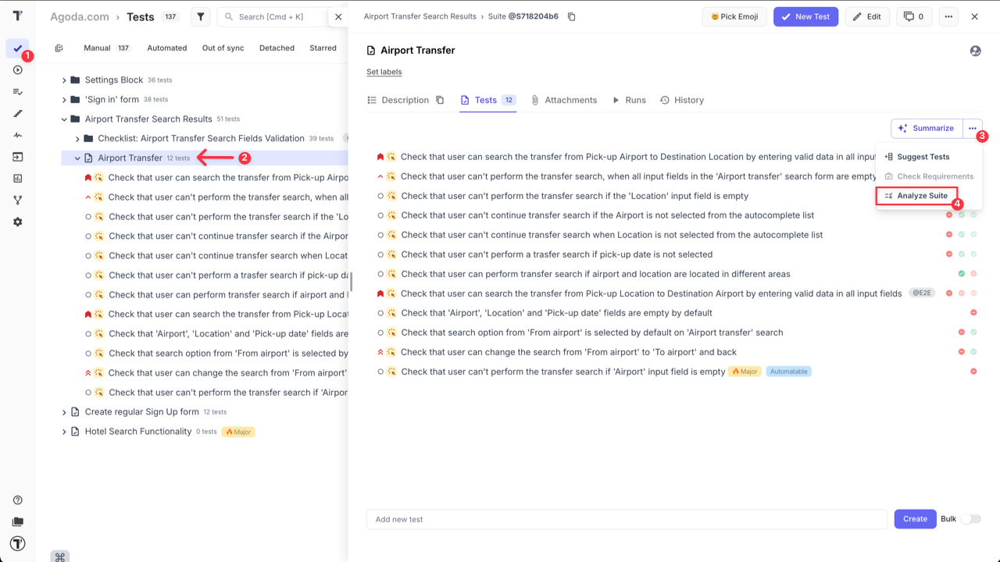

By providing actionable insights at the suite level, teams can quickly identify improvement areas, address instability, and maintain high-quality standards in critical parts of their projects.

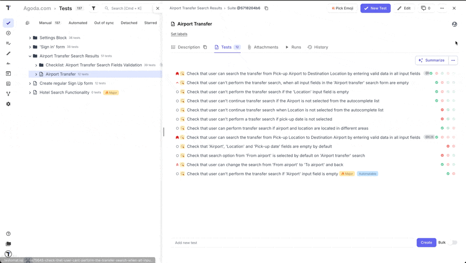

## Project Runs Status Report

**AI-Powered Project Runs Status Report** feature automatically generates a **high-level status report** based on the latest project's test runs information — powered by AI.

The **Runs Status Report** gives you a quick overview of test stability, critical issues, and performance trends across recent runs. It helps QA teams and stakeholders understand what’s working well and where attention is needed — without digging through individual test logs.

**What’s included:**

- **Summary Overview** – Total test runs, overall pass rate, trends, and key action items.
- **Area-Specific Stability** – Performance insights grouped by feature areas (e.g. subscriptions, user roles, etc.).
- **Flaky & Failed Tests** – Highlights of recurring issues or flaky behavior with potential risk.
- **Execution Time Trends** – How test durations are behaving over time.
- **Top Errors** – Most frequent failure messages to help speed up debugging.
- **Systematic Failures** – Pinpointed test cases that failed consistently and may block critical flows.
- **Note** - Hightlights the test runs that were analyzed in the Runs Status Report by AI.

**To access this feature:**

1. Go to 'Runs' page.
2. Click **'Run Status Report'** button. 

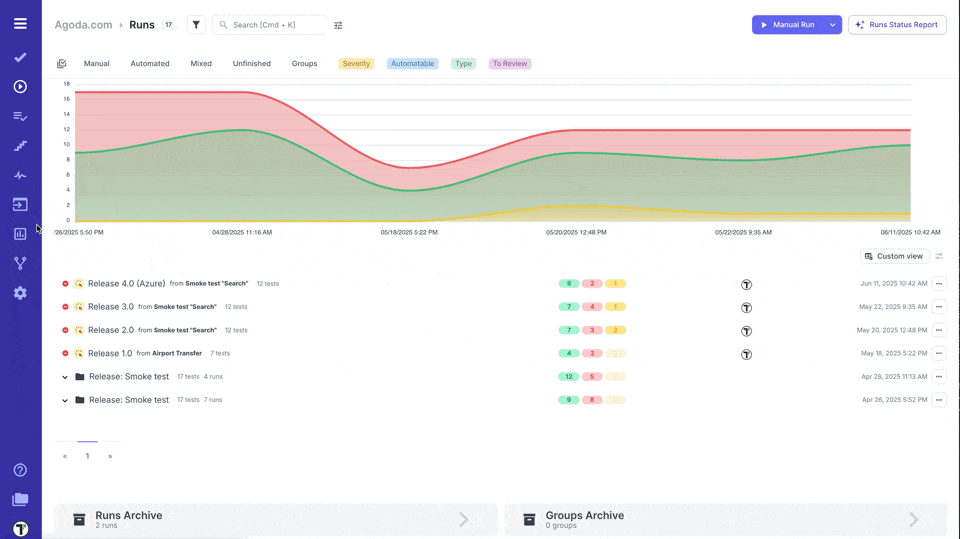

This report is available automatically based on recent test run history, giving your team instant visibility into the health of your project.

## RunGroup Statistic Report

The **'RunGroup Statistic Report'** — a new way to analyze the health and progress of test runs grouped together.

**This report includes:**

- **Run Execution Summary** – a quick breakdown of passed, failed, and skipped tests across all runs in the group.
- **Detailed Analytics by Run Status** – view trends, patterns, and key metrics within each run.
- **TOP Failed Tests** - view tests that failed the most in total.
- **AI-Powered Recommendations** – suggested actions to improve stability and address recurring issues
Perfect for teams managing large-scale test executions across multiple environments or test types.

**To access this feature:**

1. Go to 'Runs' page.
2. Select RunGroup you want to analyze.
3. Click **'RunGroup Statistic Report'** button.

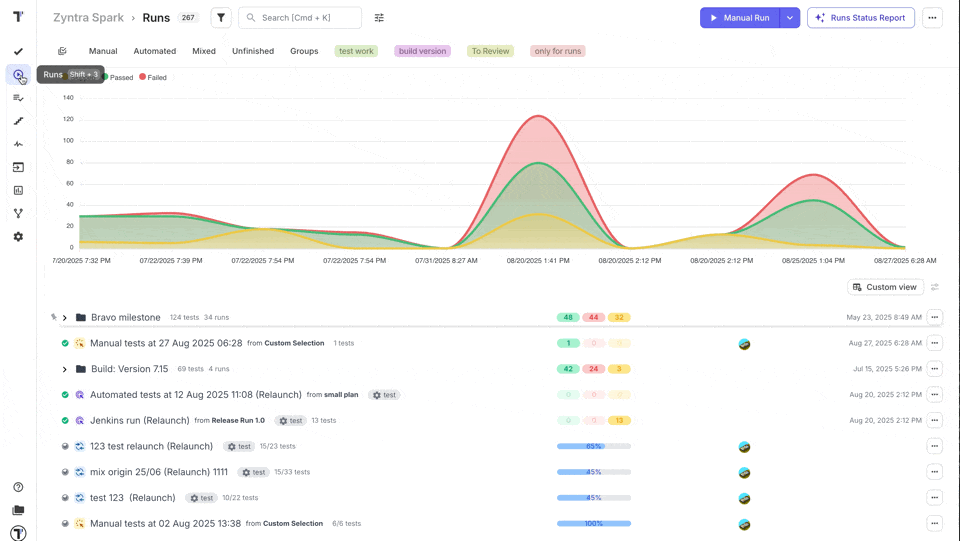

This report is perfect for teams managing large-scale test executions across multiple environments or test types.

## Insights for AI-Generated Reports

Results generated by AI-features are automatically saved to the **'Insights'** section, this ensures you can confidently close the AI-assistant window, knowing your analysis is safely stored for later review.

**How to Access the 'Insights' Section:**

1. Go to 'Tests' page.
2. Click **'Extra menu'** button in the header.
3. Select **'Insights'** option from the dropdown menu.

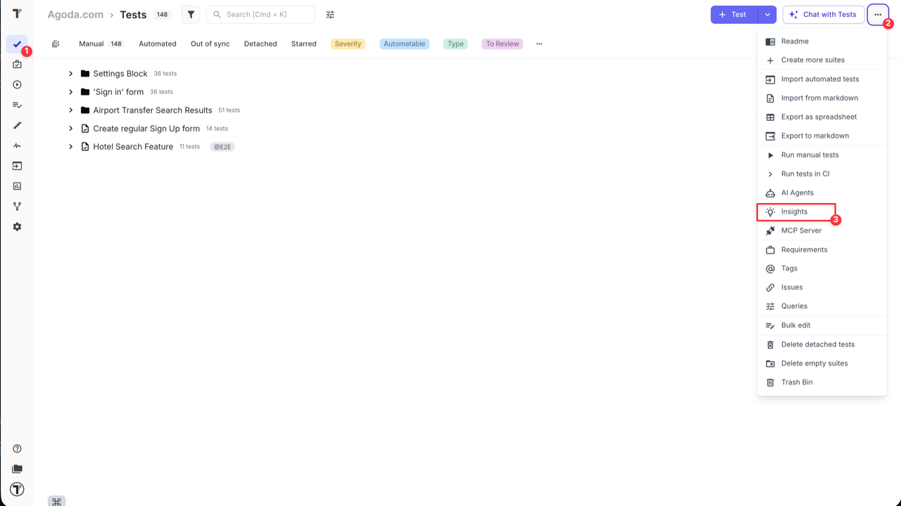

**'Insights'** are saved for all [AI-agents](https://docs.testomat.io/advanced/ai-powered-features/ai-agents/) and some promts, like:
- [Run Statistics Analysis](https://docs.testomat.io/advanced/ai-powered-features/ai-powered-features/#test-run-summary).
- [RunGroup Statistic Report](https://docs.testomat.io/advanced/ai-powered-features/ai-powered-features/#rungroup-statistic-report).
- [Analyze Suite](https://docs.testomat.io/advanced/ai-powered-features/ai-powered-features/#analyze-suite).

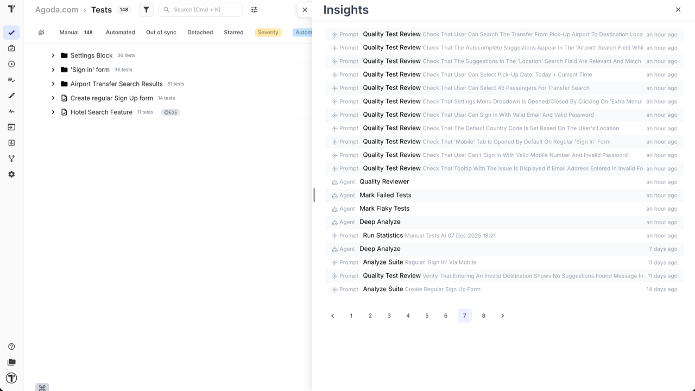

To view the full details of a specific report, simply click on its entry in the list.

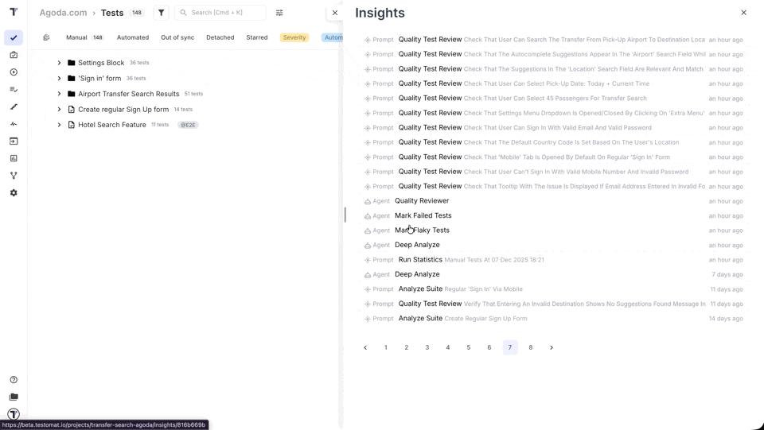

:::note

If an AI-prompt result is designed for persistent storage inside **'Insights'** section, a specific notification will be visible within the AI-assistant window. 

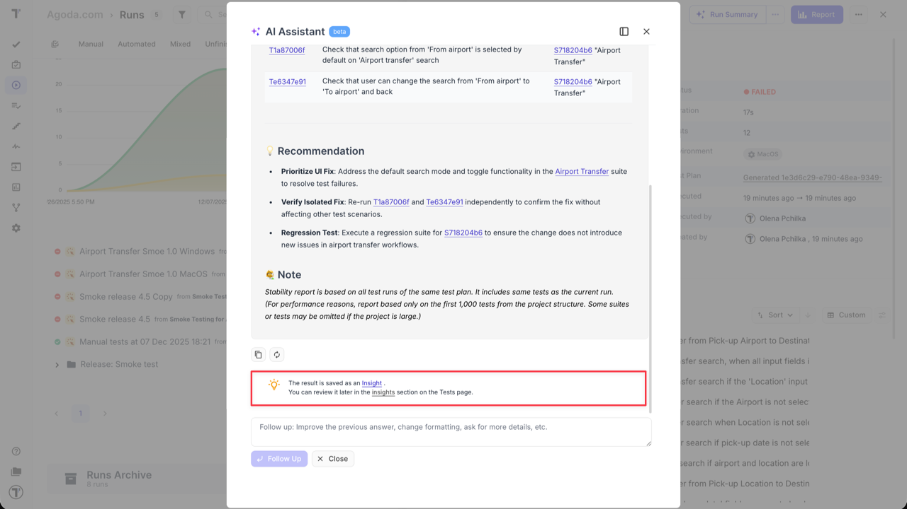

:::

### Export Insights as PDF

The **'Insights'** feature doesn't just let you view your AI-reports, it also lets you to **export** it as a **PDF file**. This ensures your analytics aren't trapped within Testomat.io, making it easy to share critical data with teammates, stakeholders, or management.

**This makes it simple to:**

- Distribute test health and coverage reports during sprint reviews or release planning.
- Attach detailed insights to documentation or presentations.
- Keep a snapshot of project quality for historical tracking or audits.

With just a few clicks, you can generate a professional, shareable PDF version of your Insights report.

**How to export AI-report:**

1. Go to 'Tests' page.
2. Click **'Extra menu'** button in the header.
3. Select **'Insights'** option from the dropdown menu.

4. Click on the specific report you want to export.

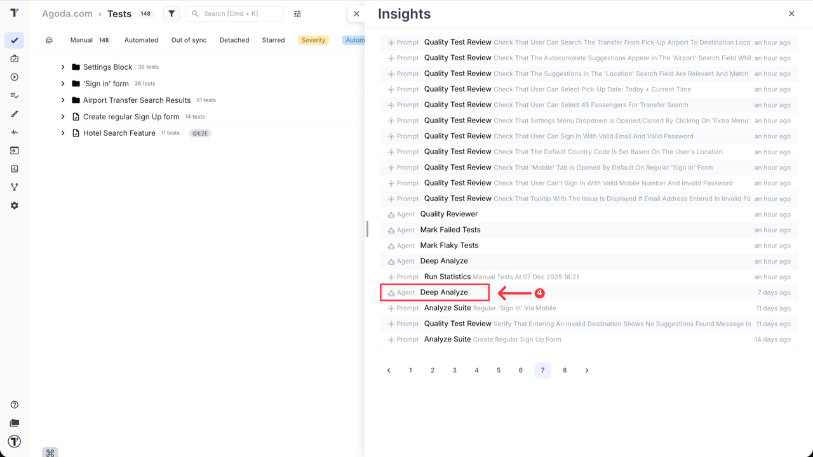

5. Click **'Extra menu'** button within the report view.
6. Select **'Export as PDF'** from the dropdown menu.

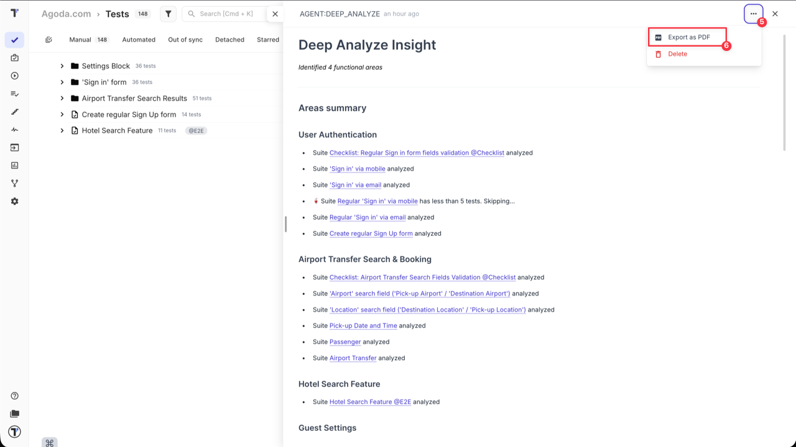

The system will generate a PDF file containing all the data from the AI-report, ready for distribution.

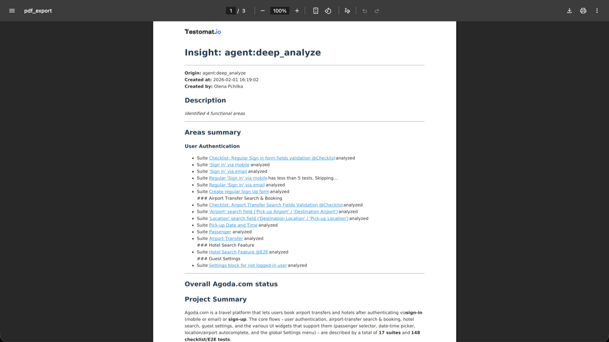

## Frequently Asked Questions (FAQ)

**Q: What are the available AI provider options in Testomat.io, and what is their approach to data usage and model training?**

A: Testomatio offers flexible options for AI providers to accommodate different company needs and policies. You can choose from the following:
- [Groq Inc.](https://groq.com/): This is a US-based company that uses open-source models and does not train its own models on user data, so the input data won't be consumed to train new models, as they just provide hosting for it. Testomat.io can provide access to Groq as part of its service.
- Other Providers: If your company has a specific policy or preferred vendor, you can use an alternative provider like OpenAI, Azure, etc. These can be configured at a global level for the entire organization.

**Q: How is user data handled and secured when using Testomat.io's AI features?**

A: Testomat.io's AI features are designed with data privacy and user control in mind. Here's how it works:
- **User-Initiated Actions:** No data is sent to the AI provider in the background. A user must manually select a specific test or run and click an AI button to send the data for analysis.
- **Context-Based Prompts:** The AI prompts are run on specific contexts, including tests, suites, runs, and run results. This ensures that only the relevant, selected data is sent for analysis.

**Q: What is the approximate AI usage in terms of tokens or API calls?**

A: AI consumption depends on the size of your project — including test cases, suites, run messages, stack traces, and requirements. In short, the more tests and requirements you have, the larger the prompts will be.
