## AI-Powered Requirements

Testomat.io introduces another AI-powered feature - **AI-Requirements** that helps to streamline test coverage alignment with product requirements. 
When you link a Jira issue as a requirement in Testomat.io, the system will analyze the issue’s description and automatically suggest a structured requirement description. Based on the analysis, you’ll be offered two intelligent options:

- Generate a new test suite with suggested test cases.
- Analyze existing suites and suggest test coverage improvements.

This feature is available both at the **project level** and within individual **test suites**, enabling flexible, requirements-driven testing whether you’re planning at a high level or working in a focused domain.

**Key benefits:**

- Automates the transition from requirements to test cases.
- Ensures traceability and alignment between business goals and test coverage.
- Reduces manual effort and potential gaps in test planning.

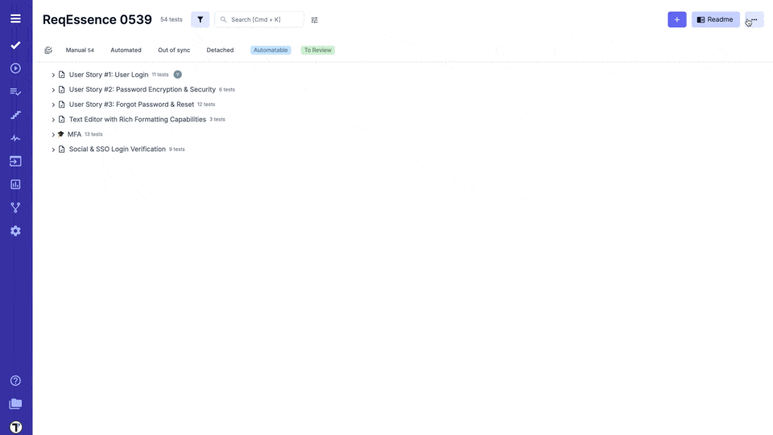

:::note

By default, AI-powered generative features are disabled for your confidence. 
You can enbable AI at any time on Company Settings page by following the instructions in the [Administration section](https://docs.testomat.io/management/company/administration/#ai).

:::

## Jira as a Requirement Source

**To add Jira as a Requirement Source:**

1. Open your Project in Testomat.io.
2. Click on **'Extra menu'** button.
3. Select **'Requirements'** option from the dropdown list.
4. Click **'+ Add'** button.
5. Select **'Jira'** as your Requirement Source.
6. Enter **'Jira Issue ID'**.
7. Click **'Save'** button.

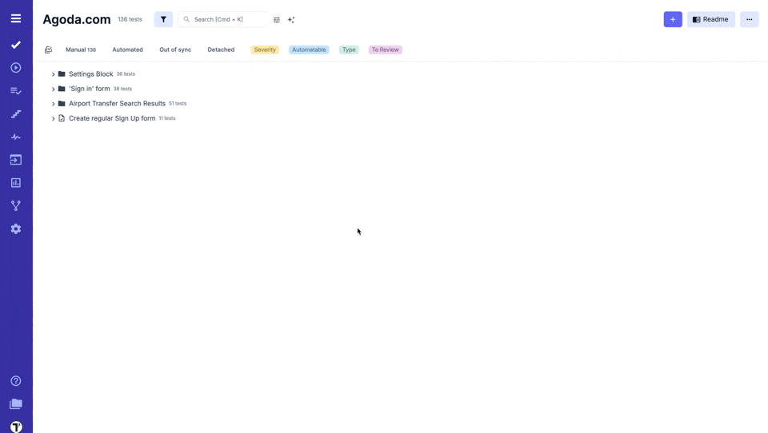

After the requirement is linked to Testomat.io you can use AI Assistant to analyze requirements for edge cases and potential solutions. You can also create suites and test cases based on these requirements.

:::note

To use AI-Requirements feature, first connect Testomat.io to your Jira project. See detailed instructions in the [Connecting to JIRA project section](https://docs.testomat.io/integrations/issues-management/jira/#connecting-to-jira-project).

:::

## Confluence as a Requirement Source

Testomat.io allows you to use your Confluence space as a source of requirements. First, connect your Confluence space to your Testomat.io project, similar to setting up Jira. For detailed setup instructions, refer to the [Confluence section](https://docs.testomat.io/integrations/issues-management/confluence).

Once connected, the system can analyze your Confluence pages to extract requirement descriptions, assess traceability, identify edge cases, and generate relevant test suites and test cases.

This integration bridges the gap between documentation and test planning, enabling seamless test coverage based on the requirements your teams already maintain.

**To add Confluence as a Requirement into your project:**

1. Click on **'Extra menu'** button.
2. Select **'Requirements'** option from the dropdown list.
3. Click **'+ Add'** button.
4. Select **'Confluence'** as your Requirement Source.
5. Enter **'Confluence page url'**.
6. Click **'Save'** button.

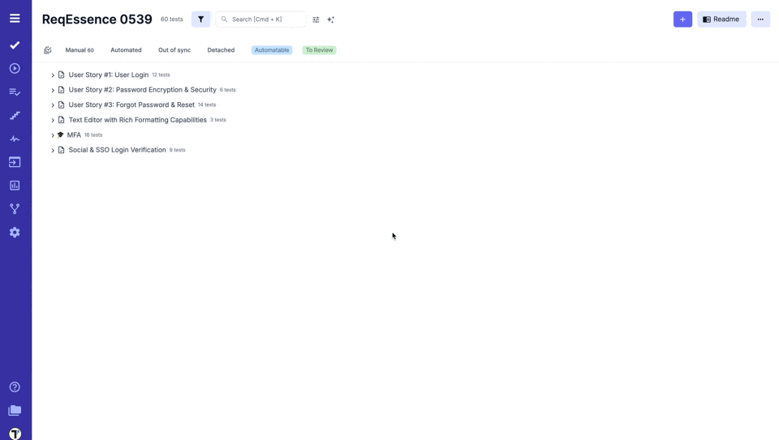

## Analyze Requirements for Edge Cases

1. Open added Requirement.
2. Click **'Analyze Requirement'** button.

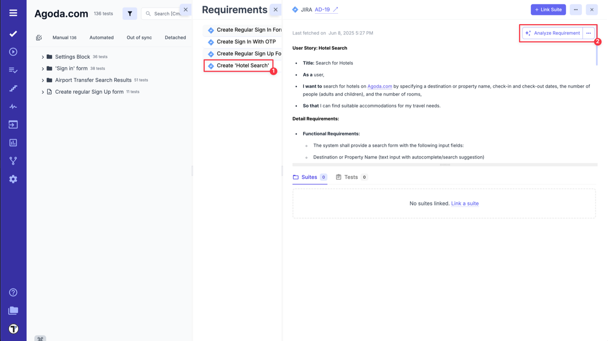

3. Click **'Analyze For Edge Cases'** button inside the AI Assistant.

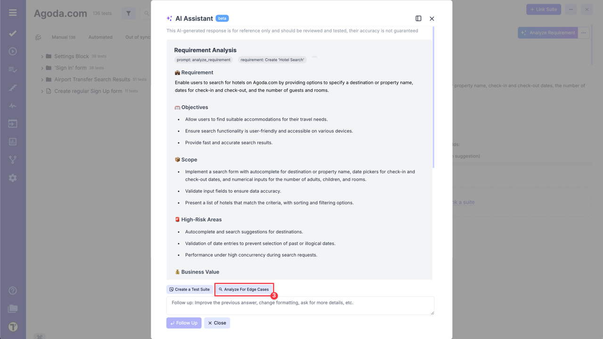

4. Check suggestions from AI Assistant and add them as the edge cases solution.
5. Click **'Save Clarification'** to the requirement if needed.

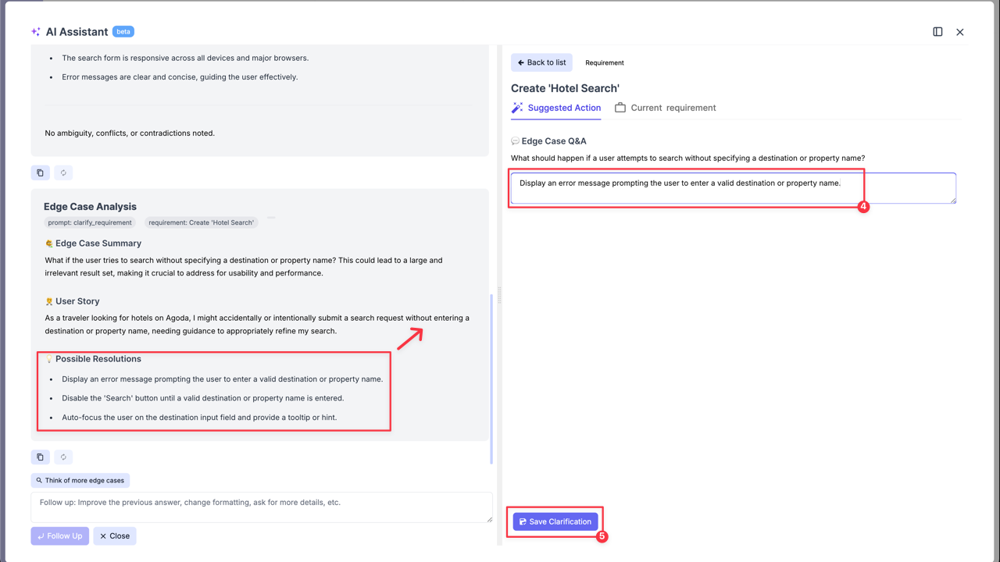

6. Ask AI to generate more Edge cases by clicking on **'Think of more edge cases'** button.
7. Improve the previous answer or ask about more details by sending relevant request via the **'Follow up'** input field.

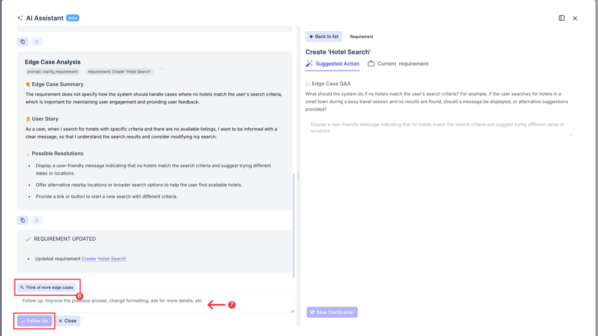

## Create a Suite Case from Requirements

1. Open added Requirement.
2. Click **'Analyze Requirement'** button.

3. Click **'Create a Test Suite'** button inside the AI Assistant.

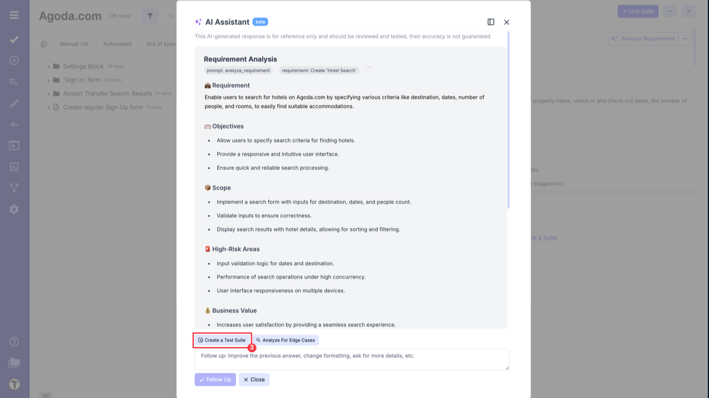

4. Add suggested test suite to your project.

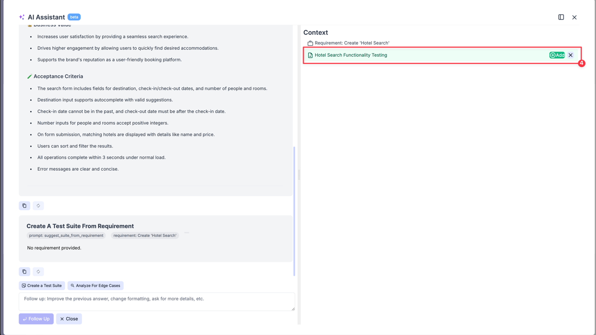

After adding the Suite Case to your project, you can begin creating your test cases or use AI to generate them for you.

## Generate Test Cases from Requirements

1. Open added Requirement.
2. Click **'Analyze Requirement'** button.

3. Click on **'Add tests to {Suite_name} Suite'** option.

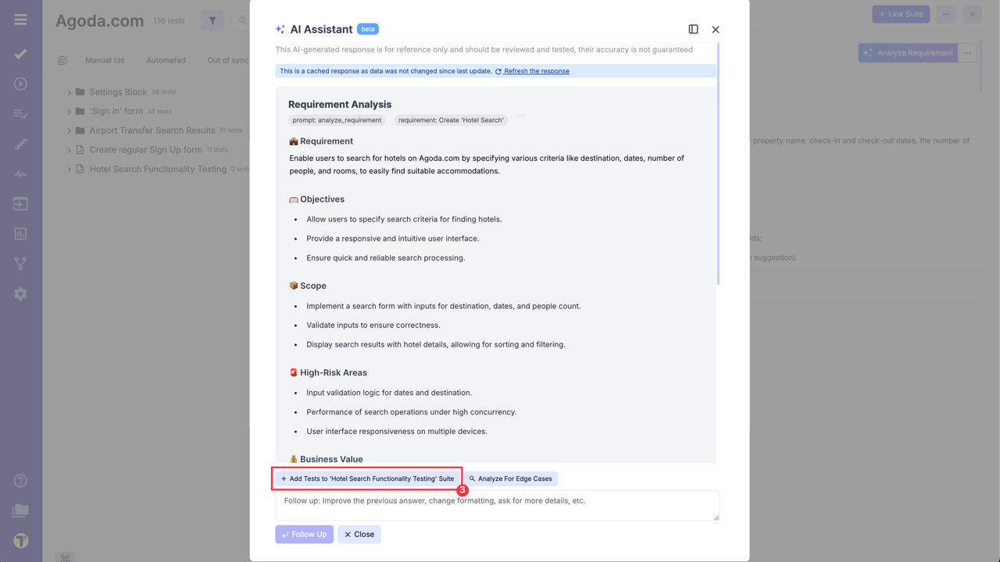

4. Check suggested test cases and add the relevant ones by clicking on **'Add'** button.

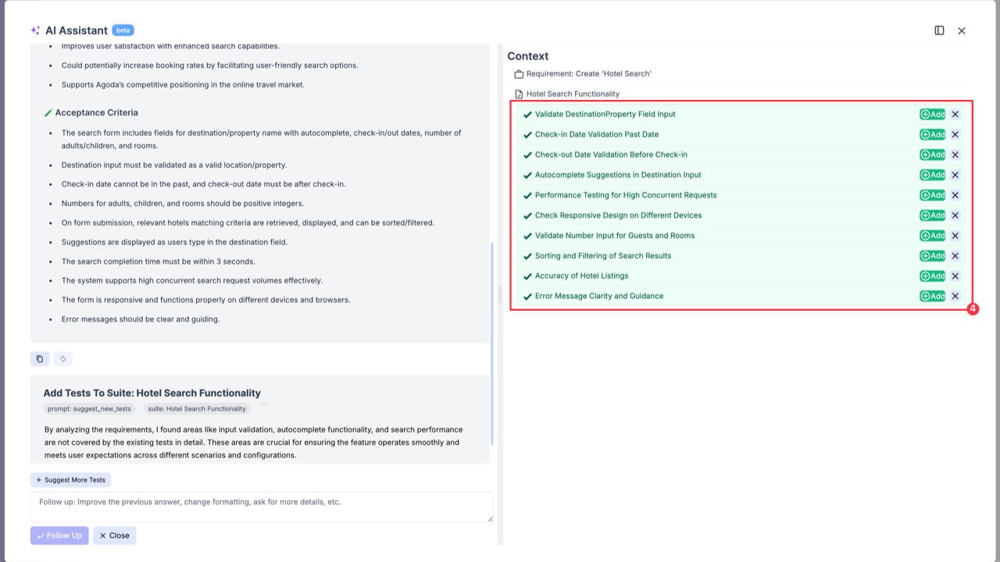

5. Click on **'Write Description'** button to add description to the selected test case.

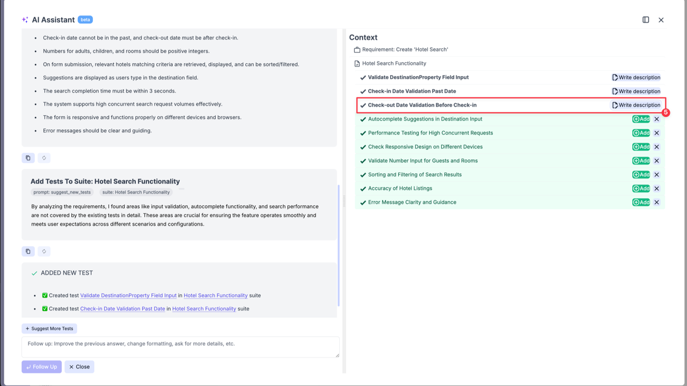

6. Click on **'Update Test Description'** button to add genearted test description to the test case.

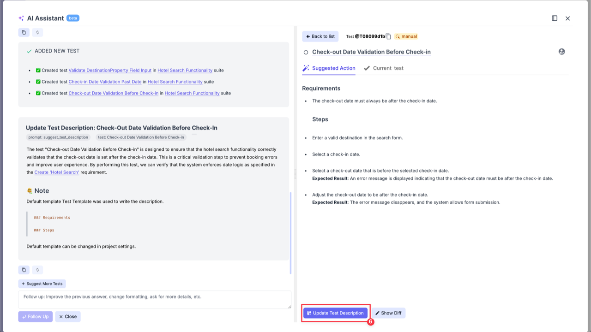

:::note

You always need explicitly select which test cases to add and update their descriptions as needed.

:::

## Link Requirement to an Existing Suite Case

Testomat.io allows you to link a requirement to an existing suite case directly from suite case page. To do that, follow these steps:

1. Open your Suite Case.
2. Click on **'Extra menu'** button.
3. Select **'Add Requirements'** option from the dropdown list.
4. Select the requirement from the list by clicking on **'Attach'** button.

After linking the requirement to your suite case, you can use AI to generate test cases and verify requirement coverage. This will save time and help identify missing or redundant tests.