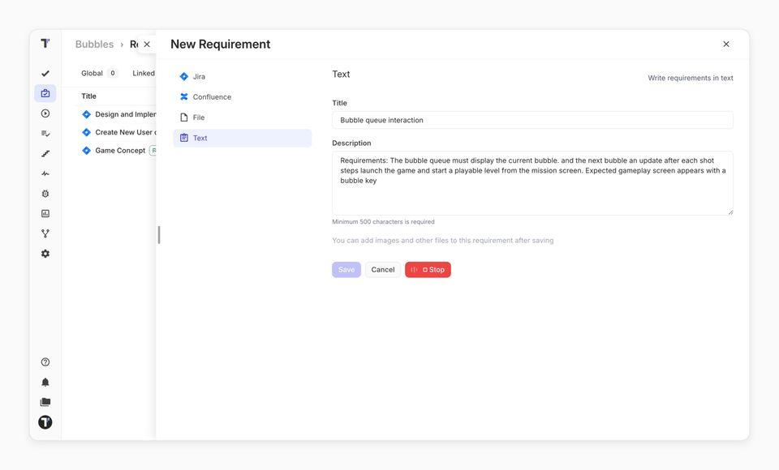

Voice Mode lets you dictate text instead of typing it. Speak your test steps, requirements, or exploratory testing notes, and Testomat.io writes them into the editor for you. Dictating saves time on long test steps and gives an option to people who find typing hard.

## Turn Voice Mode on

Voice Mode is part of the AI-powered features, so it follows the same setting.

1. Open your project settings.
2. Enable **AI features**.

The microphone icon appears in every editor that supports dictation.

:::note

If the microphone icon is missing, your company or project has AI turned off. See the
[Administration section](https://docs.testomat.io/management/company/administration/#ai) to enable it.

:::

## Dictate the text

1. Open the field you want to fill in:

- test description,
- suite description,
- requirement,
- comment,
- TQL filter,
- **Chat with Tests** input.

2. Click the **Dictate** icon.
3. Speak your text.
4. Click **Stop** when you finish.

The button turns red while it records, and the bars on it move when Testomat.io hears you. AI improves the grammar, punctuation, and formatting as it goes, and once more after you stop.

:::note

The editor is briefly read-only while AI formats the text. If formatting is unavailable, the raw transcription stays in place, so you don't lose your input.

:::

## What to expect while recording

| Behavior | What it means |
| -------- | ------------- |
| Only one field records at a time | The **Dictate** button is disabled in every other field until you stop. |
| Text is in short bursts | Audio is sent for transcription in segments, so text appears during the recording. |
| English by default | Dictation uses English unless your project sets another AI language. |
| Closing the editor stops the recording | Navigating away ends the session — click **Stop** to keep the text. |

If this doesn't work:

- **No microphone icon**, or a message asking you to enable AI features — AI is
  off for the project.
- **Microphone access denied** — allow microphone access for `app.testomat.io`
  in your browser settings, then click **Dictate** again.
- **No sound recognized. Please try again.** — nothing audible was captured.
  Check that the right input device is selected in your system settings.
- **Transcription failed** or **Transcription timed out** — the request did not
  reach the service. Record a shorter passage and try again.
- The text is unformatted — AI formatting was unavailable at that moment.
  The transcription is still yours to edit.

## Next steps

- [AI-Powered Features](./ai-powered-features.md)
- [AI-Requirements](./ai-requirements.md)
- [TQL](https://docs.testomat.io/advanced/tql)
