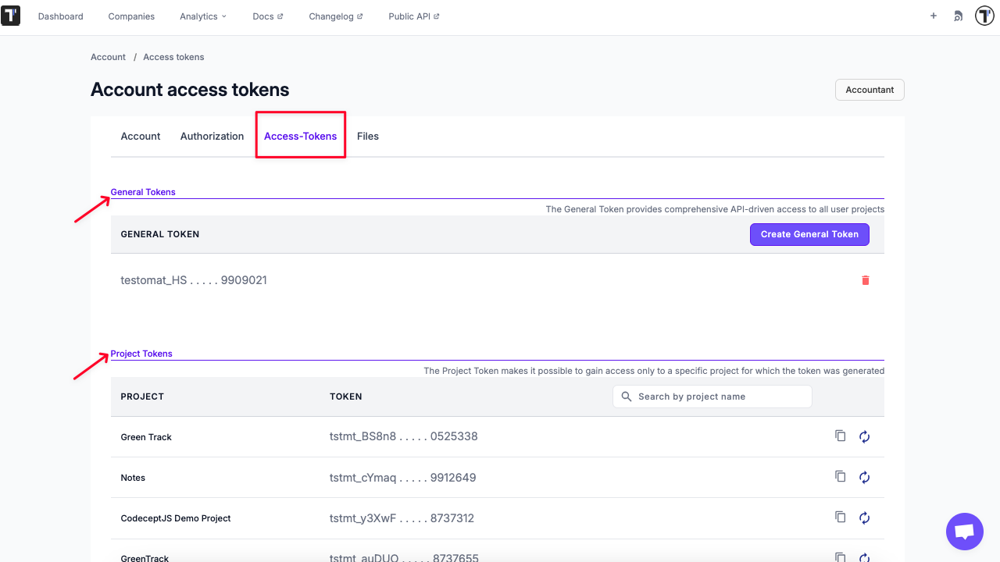

# API Access Guide

Testomat.io provides a robust API that allows users to integrate, automate, and extend their test management workflows. Testomat.io uses [JSON API](https://jsonapi.org) as standard for Request and Response data.
Access to the API is secured using **Access Tokens**, which ensure that only authorized systems and users can interact with your projects.

---

## Access Tokens Overview

There are two main types of access tokens in Testomat.io:

### **1. General Tokens**
- Provide full API-driven access to **all projects** within your Testomat.io account.
- Ideal for administrative or automation tasks that span multiple projects.

### **2. Project Tokens**
- Limit API access to a **specific project** only.
- Recommended for importing and reporting.

---



---

## Public API v2

Public API v2 provides a user-friendly and agent-friendly interface with a consistent request and response structure across all endpoints. It is designed to simplify integrations and make API behavior more predictable.

---

## Testomat.io MCP Server v2.0

The MCP Server supports the Model Context Protocol (MCP), enabling AI assistants to interact directly with the Testomat.io Public API v2.

Key capabilities include:

- Full CRUD support for core entities
- Read-only tags access
- Issues management
- Smart search
- Issue linking
- API compatibility layer
- Run management
- TQL-based search standardization
- Safe TQL usage guidance

---

## API Authentication with either General Token or Email + Password

Before interacting with the Testomat.io API, you must authenticate and obtain a JWT token, which is required for all subsequent requests.

You can authenticate in one of two ways:

### Option 1 **Log In Using Your API Token**

**Request Example:**

```bash
POST /api/login

{
  "api_token": "testomat_EXAMPLETOKENt7dp5VFPR_h8b8SO12EXAMPLETOKEN"
};
```

### Option 2 **Log In Using Your Email + Password**

**Request Example:**

```bash
POST /api/login

{
  "email": "test.testomat@gmail.com",
  "password": "Test123!"
};
```

### **Step 2: Receive JWT Token**

After sending your login request, you’ll receive a **JSON Web Token (JWT)** in the response.
This token is used to authenticate all subsequent API calls.

**Response Example:**
```json
{
  "jwt": "eyJhbGciOiJIUzI1NiIsInR5cCI6IkpXVCJ9"
}
```
### **Step 3: Use the JWT for Authorization**

Include the received JWT in the Authorization header for all subsequent API requests.


## Listing Suites and Tests

Because test suites are nested, you’ll need to fetch them in multiple requests to reconstruct the full hierarchy.

### **Step 1 List Root Suites**

```bash
GET /api/<project_name>/suites
```

### **Step 2: Fetch Child Suites**

Iterate over each returned suite ID and retrieve its details:

```bash
GET /api/<project_name>/suites/:suite_id
```

Repeat this process recursively for each child suite to build the complete suite + test tree.

Each suite response includes:

- Suite metadata (name, ID, description, etc.)

- Child suite IDs

- Tests contained within that suite

## Working with Runs Results

You can use the API to list, create, and inspect runs within a project.

**Important:** In the testomat.io API, the path parameters `/run/...` and `/testrun/...` refer to **two different resources**:

- **`/run/...`** endpoints return information about a **Run** — the execution session itself — including the list of tests that belong to it.
- **`/testrun/...`** endpoints return **Test Run** records — the *results* of individual tests executed within a run.


### **List Runs**

Retrieve all test runs associated with a project.

```bash
GET /api/{project_id}/runs
```

### **Get Run Details**

Retrieve details of a specific run by ID.

```bash
GET /api/{project_id}/run/{id}
```


To get all test results from a specifc run:

```bash
GET /api/{project_id}/testruns?run_id={run_id}
```


## API Reference

For a complete list of available endpoints, request parameters, and schemas, see the official documentation:

[**Testomat.io API Reference**](https://app.testomat.io/docs/openapi)

## Importing and Reporting with Project Token

**Project Tokens** are used when working with **Importing** and **Reporting APIs** in Testomat.io.
These tokens provide access specifically for operations such as importing tests or reporting test results to a given project.

Please check the documentation below for for details:

[**Importing API (1.0.0)**](https://testomatio.github.io/check-tests)

[**Reporting API (1.0.0)**](https://testomatio.github.io/reporter)

---


