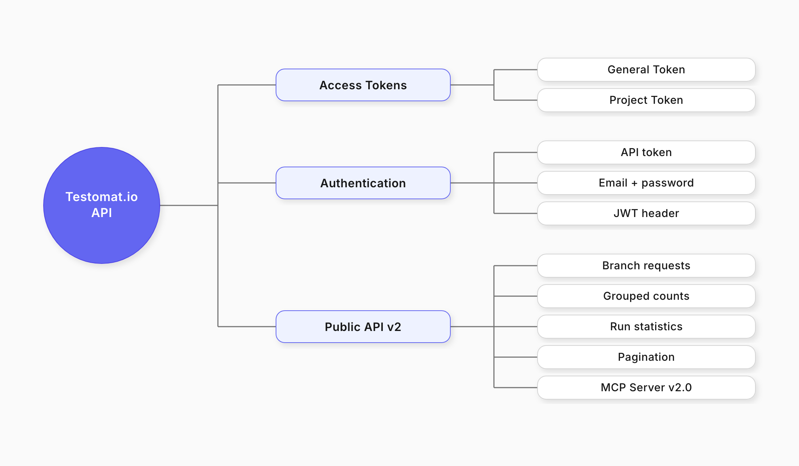
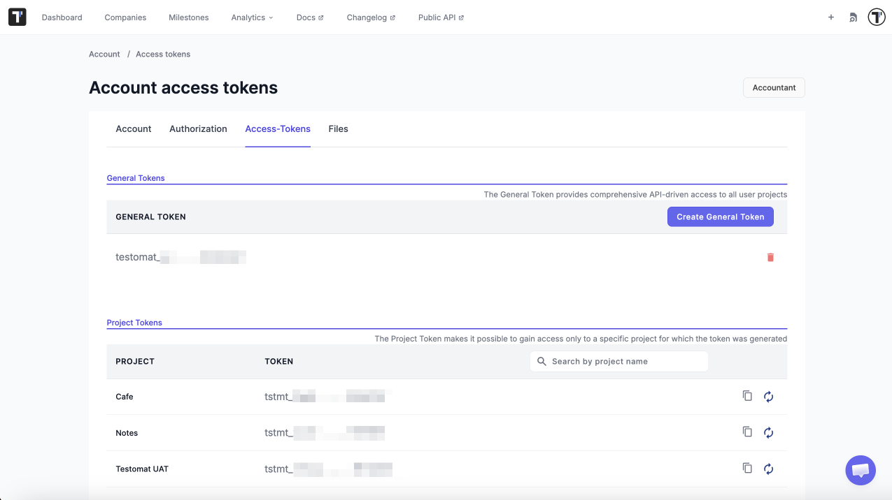

 
Testomat.io has an API you can use to connect your own tools to your projects, automate work, and pull data out. Requests and responses follow the [JSON API](https://jsonapi.org) standard.


 
## Access Tokens

Access to the API goes through **access tokens**. Only a system or a person with a token can reach your projects. There are two types of tokens.
 
| Token | What it opens | Use it for |
| ----- | ------------- | ---------- |
| **General token** | All projects in your account | Admin work and automation across several projects |
| **Project token** | One project | Importing tests and reporting results |
 

 
## Log in to the API
 
Every API call needs a JWT token. You get one by logging in first.
 
1. Send a login request. **Use your API token:**

   ```bash
   POST /api/login
 
   {
     "api_token": "testomat_EXAMPLETOKENt7dp5VFPR_h8b8SO12EXAMPLETOKEN"
   };
   ```
 
   **Or use your email and password:**
   ```bash
   POST /api/login
 
   {
     "email": "test.testomat@gmail.com",
     "password": "Test123!"
   };
   ```
 
2. Take the JWT from the response:
   ```json
   {
     "jwt": "eyJhbGciOiJIUzI1NiIsInR5cCI6IkpXVCJ9"
   }
   ```
 
3. Put that JWT in the Authorization header of every request you send next.

## Listing Suites and Tests
 
Because test suites are nested, one request is not enough. You build the tree step by step.
 
1. List Root Suite:

   ```bash
   GET /api/<project_name>/suites
   ```
 
2. Take each suite ID from the response and ask for that suite:

   ```bash
   GET /api/<project_name>/suites/:suite_id
   ```
 
3. Repeat step 2 for every child suite you get back, until nothing new comes.

Each suite response holds the suite metadata (name, ID, description, and so on), the IDs of its child suites, and the tests inside it.
 
## Working with Runs Results

You can use the API to list, create, and inspect runs within a project.

**Important:** In the testomat.io API, the path parameters `/run/...` and `/testrun/...` refer to **two different resources**:

- **`/run/...`** endpoints return information about a **Run** - the execution session itself - including the list of tests that belong to it.
- **`/testrun/...`** endpoints return **Test Run** records - the *results* of individual tests executed within a run.

### **List Runs**

Retrieve all test runs associated with a project.

```bash
GET /api/{project_id}/runs
```

### **Get Run Details**

Retrieve details of a specific run by ID.

```bash
GET /api/{project_id}/run/{id}
```

To get all test results from a specifc run:

```bash
GET /api/{project_id}/testruns?run_id={run_id}
```

## Public API v2
 
Public API v2 uses the same request and response shape for every endpoint. That makes it easier to write an integration and easier for an AI agent to use. It supports requests to a branch, grouped counts, run statistics, analytics, and pagination. For additional information see [Testomat.io API Reference](https://app.testomat.io/docs/openapi).
 
### Testomat.io MCP Server v2.0
 
The MCP Server speaks the Model Context Protocol, so AI assistants can work with [Public API v2](./public-api-v2.md) directly. It can do the following:
 
- Full CRUD support for core entities.
- Read-only tags access.
- Issues management.
- Smart search.
- Issue linking.
- API compatibility layer.
- Run management.
- TQL-based search standardization.
- Safe TQL usage guidance.

## Importing and Reporting
 
Importing and reporting use a **project token**, not a JWT. One token opens one project, which is all these operations need: sending tests into a project, and reporting results back to it.
 
- [Importing API (1.0.0)](https://testomatio.github.io/check-tests)
- [Reporting API (1.0.0)](https://testomatio.github.io/reporter)
