The typical day-to-day workflow includes constant code changes made by developers. As the code evolves, quality assurance teams must update tests to maintain accurate test coverage. You may need to add tests for a new feature without affecting existing suites, or your team may include multiple specialists who need to work independently.

For all these cases, Testomat.io provides **test branching and versioning** — allowing teams to work on isolated changes without impacting each other or the Main branch.

These are the core actions available when working with branches:

- Create new branches (including directly from [Jira](https://docs.testomat.io/advanced/jira-plugin/branches/))
- Switch between branches
- Compare changes with Main (Diff)
- Merge changes to Main (excluding diverged items)
- Replace changes in Main (including diverged items)
- Revert a merge (branch returns to Active)
- Delete a branch permanently

## Supported Merge Changes

Here’s a quick overview of what changes are **supported** in Testomat.io branches and will be merged into Main:

- **CRUD actions** in folders, suites, and tests
- **Labels** (assign / unassign)
- **Tags** (assign / unassign)
- **Attachments** (add to the **test body** or delete)
- **Jira issue linking** (link / unlink)
- **CRUD actions** in **comments**

## How to Create a Branch

1. Navigate to the **Branches** page
2. Enter a branch title
3. Click the **Create** button

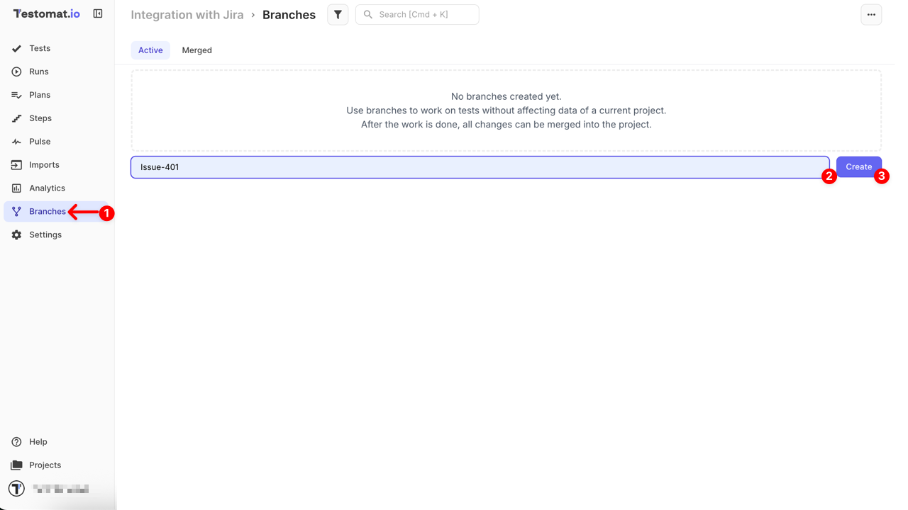

Your new branch will appear under the **Active** tab. You can create as many branches as needed and switch between them at any time.

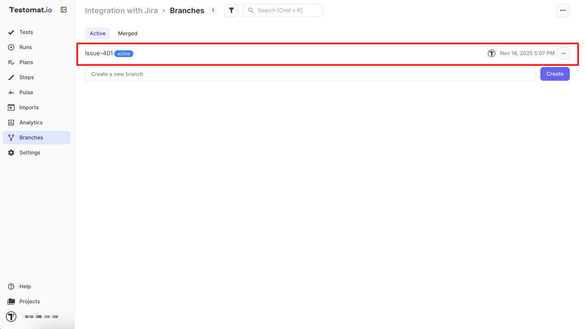

## How to Work within a Branch

After creating a branch, switch to it to start working.

### Switch to a Branch

1. Click **'...'** menu next to the created branch
2. Click the **Switch to this branch** button

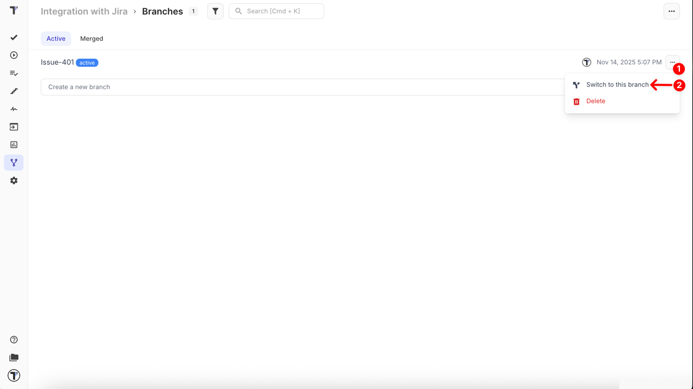

Alternative way to switch to a branch:

1. Open the created branch
2. Click **Switch to Branch** button

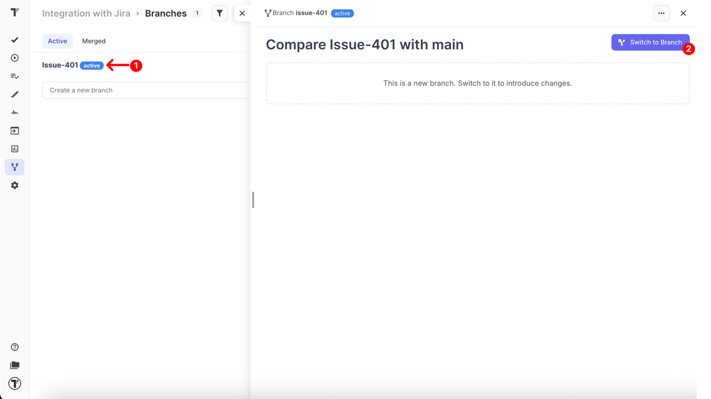

Inside the branch, you can manage folders, suites, and tests. All new or modified items are marked with a badge.

:::note

**Drag & Drop** and the **Move** option are disabled in branches to prevent potential data loss and accidental structural conflicts.

:::

While working in a branch, the **current branch name** is displayed as a **badge in the bottom-right corner** of the any page. Clicking this badge takes you directly to the **Branches** page and highlights the current branch, allowing you to quickly **compare it with Main**.

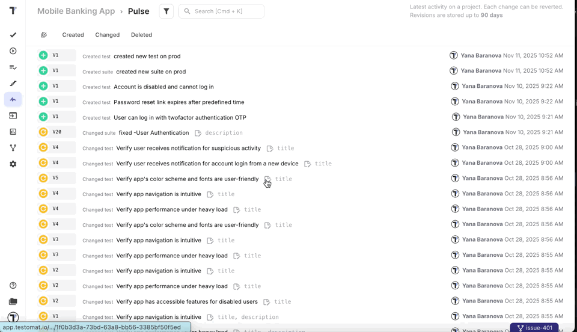

### Automated Tests in Branches

When testing different versions of your software you may need to add automated tests to a specific branch for some reason. Testomat.io allows working with automated tests within a branch, separately from Main:

- create a new branch during import using `TESTOMATIO_BRANCH` parameter, learn more [here](https://docs.testomat.io/project/import-export/import/import-js/#import-into-a-branch)
- import tests into a chosen branch, learn more [here](https://docs.testomat.io/project/import-export/import/)

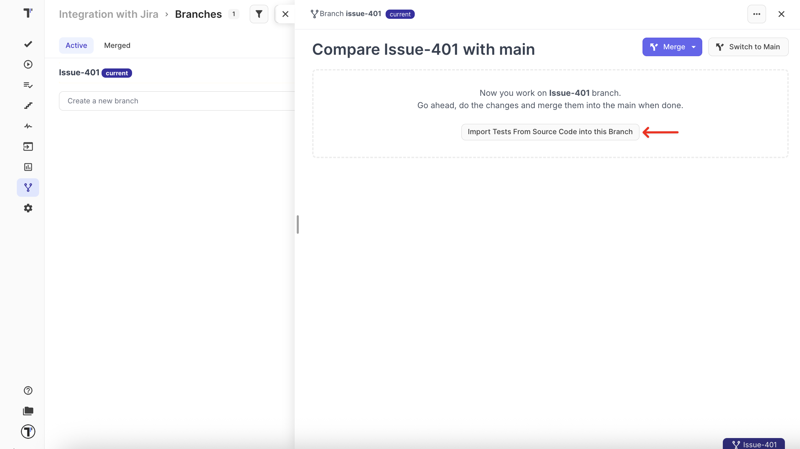

### Switch Back to Main

If you need to switch back to Main before merging, you can do it from the **Branches** page:

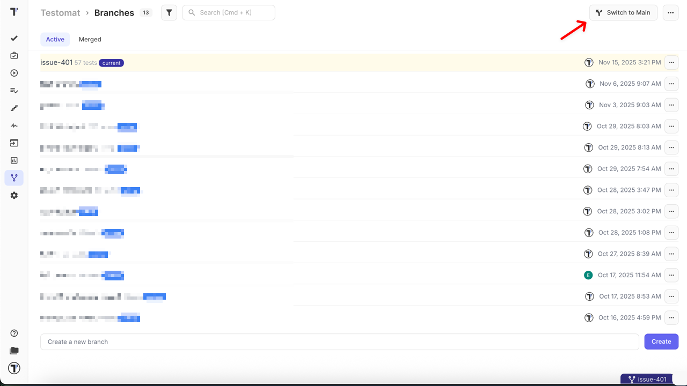

Or from a specific branch:

1. Navigate to the **Branches** page
2. Open the **Active** tab
3. Click the branch you need
4. Click the **Switch to Main** button

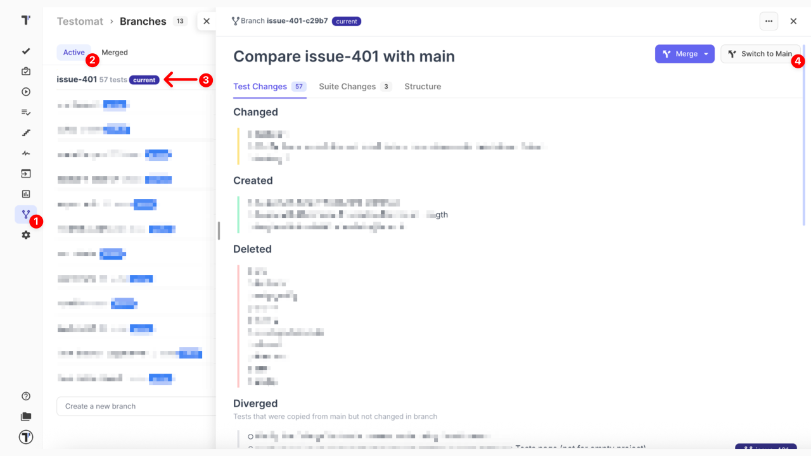

## Compare Changes with Main

You can compare changes with **Main**:

1. Navigate to the **Branches** page
2. Open the **Active** tab
3. Click the branch you want to compare:

- **Test Changes** tab – displays changes at the individual test
- **Suite Changes** tab – displays changes at the suite level
- **Structure** tab – displays all changes to the structure using a side-by-side diff view

4. Open the test/suite you want to compare

See the **diff** for a test or suite between Main and the current branch.

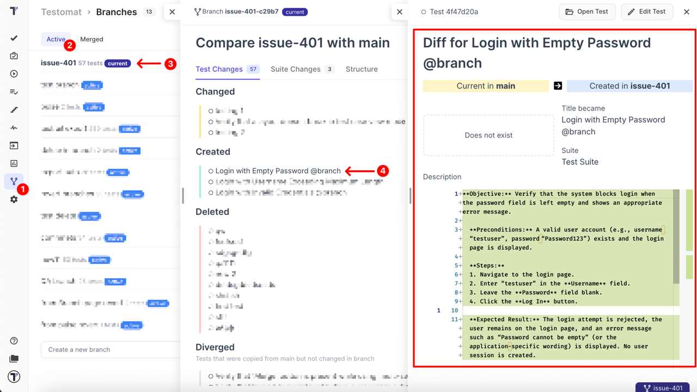

## Merge and Replace to Main

After completing work in a branch, you can **merge** or **replace** your changes in Main.

### Merge a Branch

1. Navigate to the **Branches** page
2. Open the branch you want to merge
3. Click the **Merge** dropdown
4. Select the **Merge** button

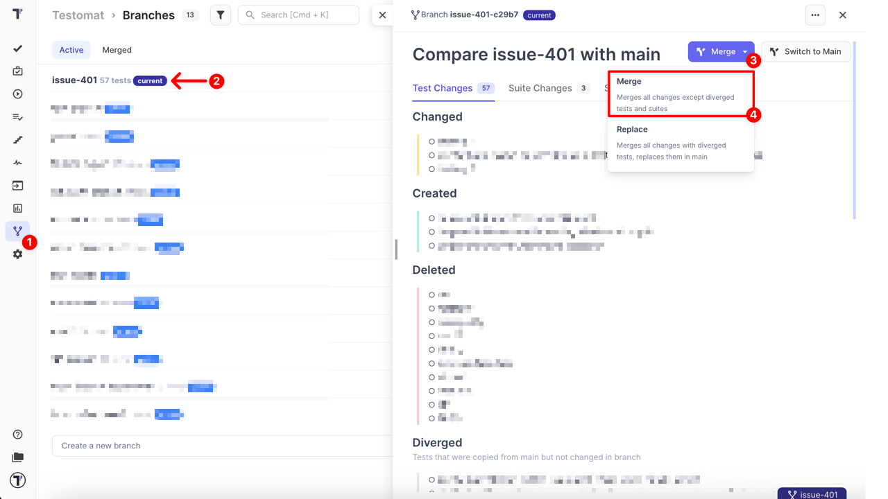

### Replace a Branch

1. Navigate to the **Branches** page
2. Open the branch you want to replace
3. Click the **Merge** dropdown
4. Select the **Replace** button

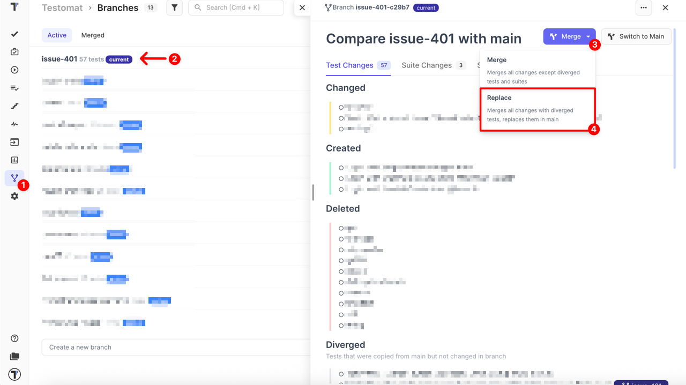

## Difference between Merge and Replace

- **Merge**: applies all changes from the current branch **except diverged tests and suites**. Only modifications made in the branch are merged into Main.

- **Replace**: applies all changes from the current branch, **including diverged tests and suites**. This fully replaces Main with the branch, so the Main can be off-track.

## Merging Tests with Parameters (Examples)

When merging a branch into Main, Testomat.io also carries over **test parameters** — the example data tables attached to parametrized test cases. See [Classical Tests Markdown Format — Examples](https://docs.testomat.io/project/import-export/export-tests/classical-tests-markdown-format/#examples) for details on how parameters are structured.

### Choosing the Right Merge Option for Parameters

| Situation                                             | Recommended action |
| ----------------------------------------------------- | ------------------ |
| Test with Parameters Created in a Branch              | **Merge**          |
| Test Created in Main, Parameters Modified in a Branch | **Replace**        |

:::note

**Replace** applies to the entire branch, not just the parametrized tests. Any other diverged tests or suites in the branch will also overwrite their **Main** counterparts. Review the diff carefully before using **Replace** to make sure you're not accidentally overriding unrelated changes.

:::

### Scenario 1: Test with Parameters Created in a Branch

If a test case — including its parameters — was **first created inside a branch**, merging that branch into Main works as expected out of the box.

- Use the standard **Merge** option
- The test case and its full example table are brought into Main automatically
- No special handling is required

**Example workflow:**

1. Create a new branch `feature/login-params` and switch to it
2. In the branch, create a new test **"Login with multiple roles"** and add an examples table with rows for `admin`, `editor`, and `viewer`
3. Open the branch compare view and click **Merge → Merge**
4. The test and all its examples appear in Main

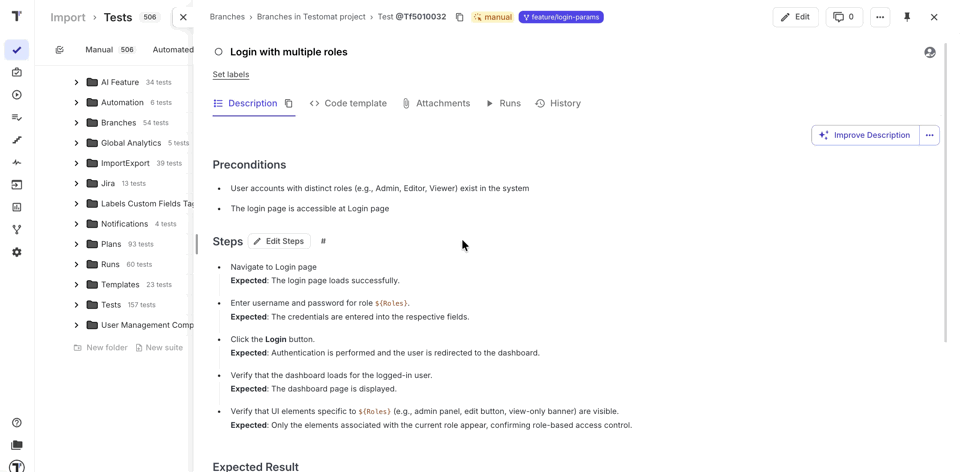

### Scenario 2: Test Created in Main, Parameters Modified in a Branch

If a test case already exists in Main and you need to update its parameters in a branch (add, remove, or change example rows), use **Replace instead of Merge**. Replace is designed exactly for this: it applies all branch changes — including updated parameters — directly into Main, giving you full control over how parameterized tests evolve across branches.

**Example workflow:**

1. A test **"Checkout with payment methods"** exists in **Main** with two example rows: `credit_card` and `paypal`
2. Create a new branch `update/checkout-params` and switch to it
3. Add a third row: `apple_pay` to that test's examples table
4. Open the branch compare view:

- the view may appear empty if **only** parameters were changed
- or show other edits if the test body was also modified

5. Click **Merge → Replace** to apply the updated parameters to **Main**

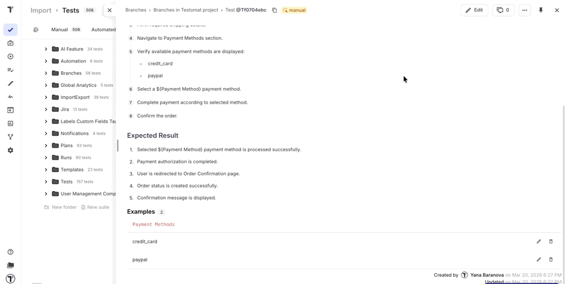

## Revert Merge

If a merge caused unintended changes or issues, you can **revert a merge** using one of the following methods:

### From the Branches Page

1. Navigate to the **Branches** page
2. Open the **Merged** tab
3. Find the branch you want to revert
4. Click **Revert Merge** button

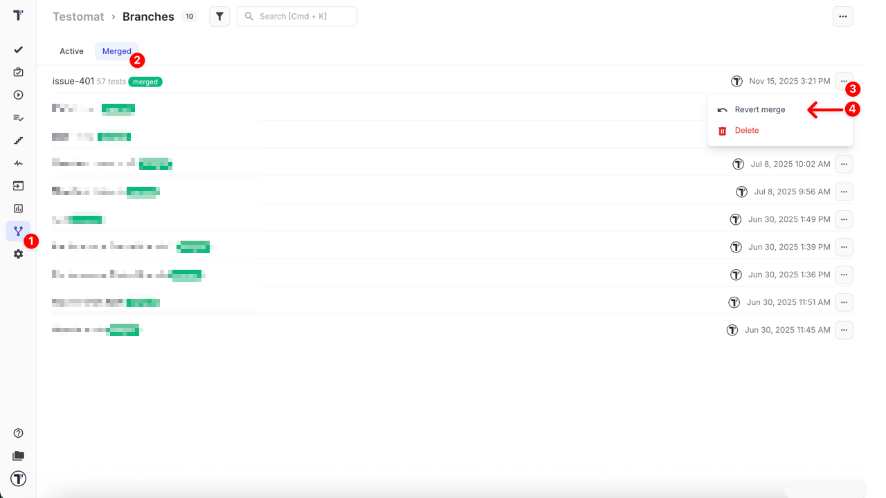

### From the Pulse Page

You can also revert a merge directly from the project activity log:

1. Navigate to the **Pulse** page
2. Find and open the merged branch entry labeled **Bulk edit applied**
3. Click the **Rollback** button

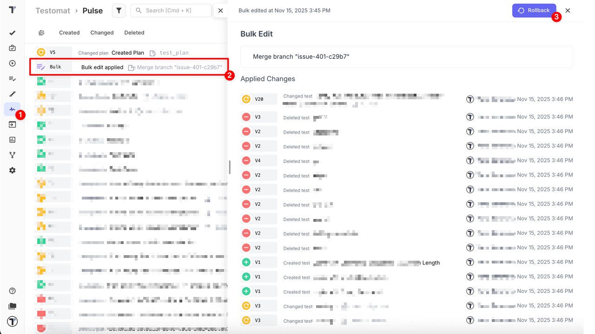

After the revert/rollback:

- the branch returns to the **Active** tab
- all merged changes are undone
- a new log entry appears **Bulk edit applied → Restored bulk operation** in Pulse

This log confirms that the merge has been successfully reverted.

## Working with Forks

When the same test is modified in different branches, Testomat.io automatically creates **Forks**. You can switch between the original item and its forks at any time from this tab.

1. Navigate to the **Tests** page
2. Open the desired test
3. Open the **Forks** tab
4. Click the **Switch to it** button

This makes it easy to track differences between branches and navigate to the version you need.

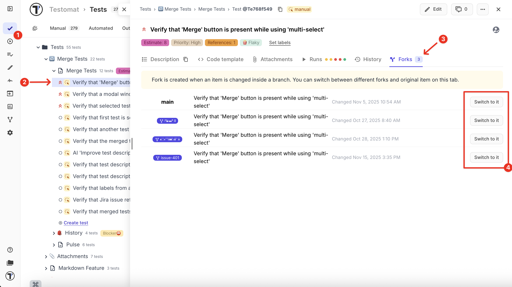

## How to Delete a Branch

You can delete branches when they are no longer needed.

### Delete a Single Branch

1. Navigate to the **Branches** page
2. Open the **Active** or **Merged** tab
3. Click the **'...'** menu next to the branch you want to delete
4. Select **Delete** button

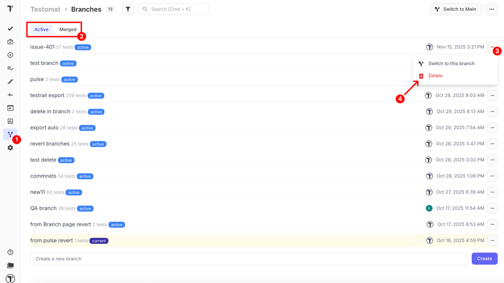

### Delete All Merged Branches

1. Navigate to the **Branches** page
2. Open the **Active** or **Merged** tab
3. Click the **'...'** menu in the **top-right corner** of the tab
4. Select **Delete All Merged Branches**

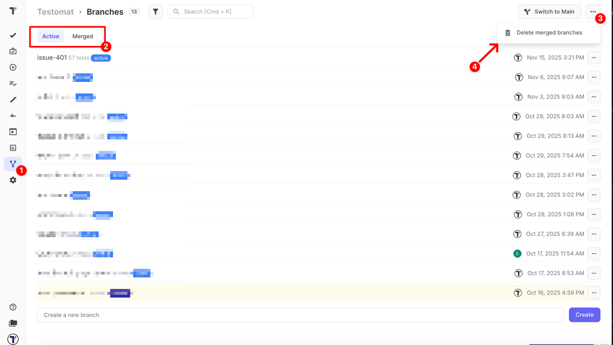

:::note

Deleting a branch is permanent and cannot be undone. Once deleted, the branch cannot be restored, and any previously merged changes cannot be reverted.

:::
