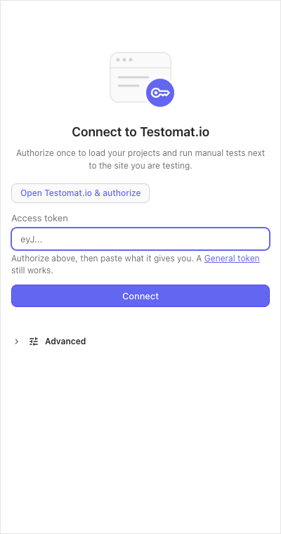
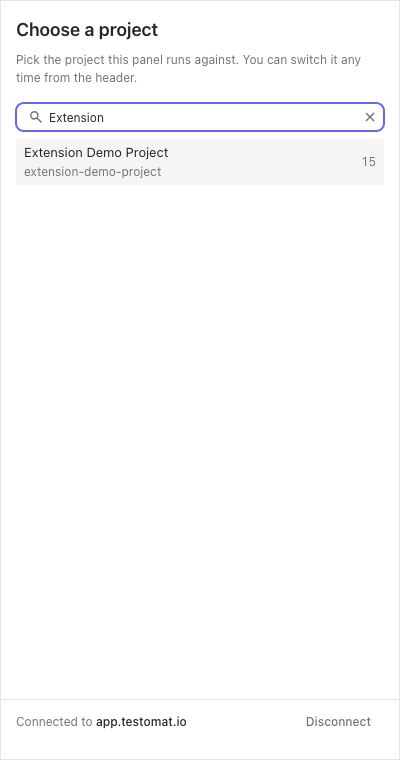
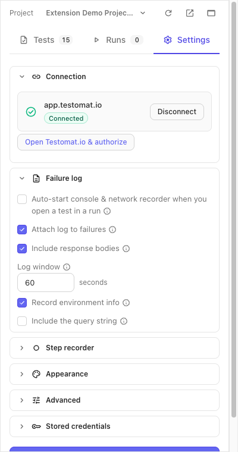

:::note
Taken from [Browser Extension documentation](https://github.com/testomatio/browser-extension/tree/main/docs/guide/connect.md).
:::

One authorization connects the panel to your account. It then reads each
project's own API key by itself — there is nothing else to find or paste.

## Authorize

1. Click the extension icon. On first run the panel opens its **Connect to
   Testomat.io** screen.

   

2. Press **Open Testomat.io & authorize**. Testomat.io opens in a new tab —
   sign in there if you are not — and shows you a token.
3. Copy the token, paste it into **Access token**, press **Connect**.
4. The **Choose a project** screen lists your projects: search, click one,
   done. You can switch projects any time from the panel header.

   

A **General token** (Testomat.io → Account → Access Tokens) works in the same
field.

## Self-hosted instance

Using your own Testomat.io server? Before authorizing, open **Advanced** and
put its `https://` URL into **Instance** — the authorize button follows that
field. HTTP URLs are refused.

## Check or end the connection

**Settings → Connection** shows the card: which host, the **Connected**
badge, and the current project. **Disconnect** forgets the instance and
returns the panel to the connect screen.

## Basic mode

Normally you never see this. But when the panel loses its session — an old
token, for example — it does not break, it switches to *basic mode*: runs,
statuses and comments keep working, while finish run, priority, custom
statuses and assignee switch off, and ticked steps stay only in the panel.
A banner says it happened: sign in to Testomat.io in this browser, press
**Refresh** on the banner, and the full panel is back.

## If it didn't work

- **"Token rejected by …"** — the token is stale; press **Open Testomat.io &
  authorize** again and save the new one.
- **"Instance URL must be https://"** — the panel only connects over HTTPS.
- **"Your access to this project is read-only"** — your role in the project
  can't write results (or the project is archived); pick another project or
  ask a project owner.
- **A "Basic mode" pill in the run view** — see [Basic mode](#basic-mode)
  above.
