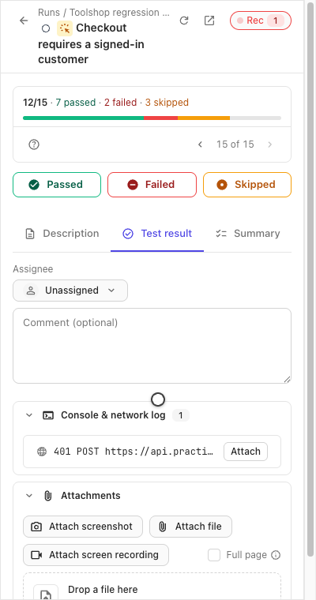
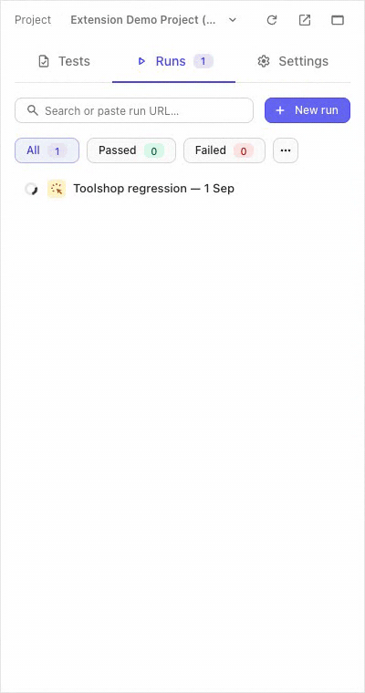

:::note
Taken from [Browser Extension documentation](https://github.com/testomatio/browser-extension/tree/main/docs/guide/console-network-log.md).
:::

The panel records what the tab under test is doing — console messages and
network calls — into a rolling window, and attaches it to a failed result
as a readable text file.

## Record

1. Open the test and press the **Rec** chip in the panel header. Start it
   **before** reproducing the bug, not after: the recorder keeps only the
   last **60 seconds** (the window size is a Settings → Failure log field).
2. Reproduce the problem on the page.
3. The chip counts errors as they happen, and the **Console & network
   log** fold on the test's result tab reads them inline — a failed
   request shows its method, URL and status.

   

The whole pass, live:

## Attach

Mark the test **Failed** — the recorded window uploads by itself as a
`.txt` with Console and Network sections, and is linked on the result.
That auto-attach is on by default; **Settings → Failure log** holds the
switches:

- **Attach log to failures** — the auto-attach itself.
- **Include response bodies** — bodies are kept for failed requests.
- **Record environment info** — browser and system context rides along.
- **Include the query string** — off by default: URLs are logged without
  their query part, so tokens in parameters stay out of the file.
- **Auto-start … when you open a test in a run** — arms Rec for you.
- **Log window** — the seconds the recorder keeps.

## If it didn't work

- **The log is empty** — recording started after the bug happened, and
  the window had already rolled past it. Start Rec first, then reproduce.
- **A request you need isn't there** — the recorder binds to the tab it
  was started on; a bug reproduced in another tab was never seen.
- **No log on the result after failing** — check **Attach log to
  failures** in Settings → Failure log; in basic mode uploads need the
  full session too.
