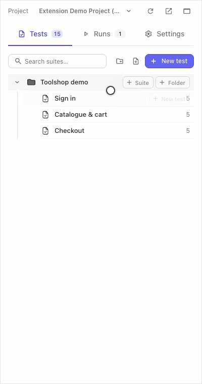
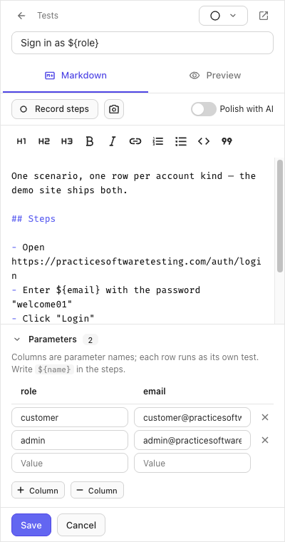
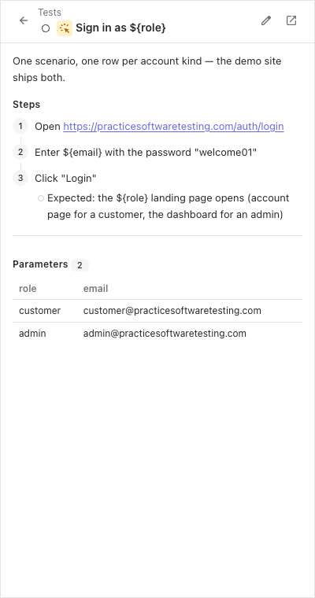

:::note
Taken from [Browser Extension documentation](https://github.com/testomatio/browser-extension/tree/main/docs/guide/create-tests.md).
:::

The **Tests** tab browses the project's suites and lets you add test cases
without leaving the panel — by title alone, or written out in the editor.

## Browse

The tab shows the suite tree with test counts. Folders group suites;
clicking a suite opens its test list; clicking a test opens it — an
existing case renders read-only until you choose to edit.

## Add by title

Open a suite. The bar at the bottom adds a test **right here**:

1. Type the title into **Add new test**, press **Create** (or Enter) —
   the case appears in the list, empty for now.
2. Flip **Bulk** and the field becomes a list — one title per line, one
   press, the whole list is created in order.

Bulk add needs the full (not basic) mode.

## Write it out in the editor

**New test** opens the editor: the title, a Markdown body with live
preview, and a suite picker if you started from the tree root. Steps are
plain Markdown lists; the toolbar records steps for you (see
[Step recorder](step-recorder.md)) and can hand the draft to your
Testomat.io AI to be rewritten — with an Undo.

New suites and folders are made from the tree's own + buttons.

## Parameters

A test that should run once per data row gets **parameters** — edited in
the same editor:

1. Name the columns (say `role`, `email`).
2. Fill one example row per variant.
3. Write `${role}` and `${email}` in the title or steps.

In a run, such a test shows one row per example, each marked on its own.

## If it didn't work

- **Create is greyed out** — the title is empty, or the panel is in basic
  mode (bulk add and the editor's server features need the session).
- **`${name}` shows literally in a run** — the test has no example rows
  yet; add at least one in the editor's Parameters.
- **A new test is not in the web app yet** — give the panel a moment or
  press Refresh there; the panel writes through the same API the web
  reads.
