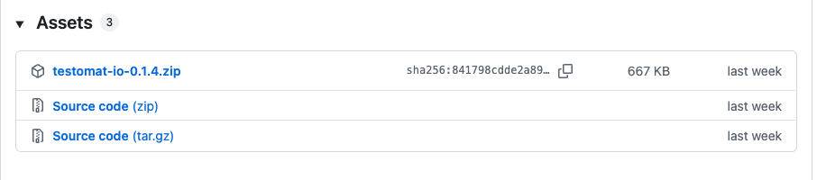
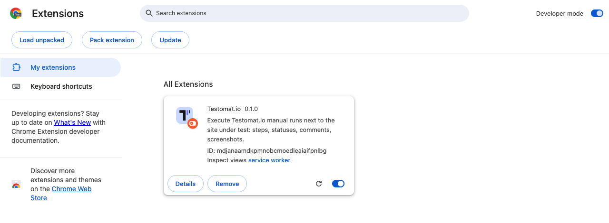
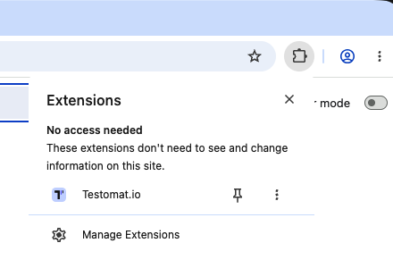
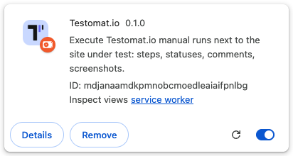

:::note
Taken from [Browser Extension documentation](https://github.com/testomatio/browser-extension/tree/main/docs/guide/install.md).
:::

The extension is not in the Chrome Web Store yet. You load it from a folder on
your disk, once, and Chrome keeps it. Chrome 123 or newer.

## Install

1. Get the folder — either way works:
   - download the newest `testomat-io-<version>.zip` from
     [Releases](https://github.com/testomatio/browser-extension/releases) —
     the single file under **Assets** — and unpack it, **or**

     

   - `git clone https://github.com/testomatio/browser-extension.git`
2. Open `chrome://extensions` and switch on **Developer mode** (top right).
3. Click **Load unpacked**:

   

   …and pick the folder:
   - from the zip — the folder you unpacked;
   - from the clone — the **`extension/`** folder inside it, not the
     repository root.

   Either way, the right folder is the one with `manifest.json` directly
   inside.

4. Click the puzzle icon in Chrome's toolbar and pin **Testomat.io** with the
   pushpin:

   
5. Click the pinned icon — the panel opens and asks you to connect
   (**Connect to Testomat.io**). That is the next page: [Connect](connect.md).

There is nothing to build or install beyond that — the folder runs as is.

## Update

There is no auto-update. To get a new version:

1. Replace the folder contents: unpack a newer zip over the same folder, or
   `git pull` in the clone.
2. On `chrome://extensions`, press the reload (↻) icon on the Testomat.io
   card:

   

Your token, settings and unsent results survive the reload.

## If it didn't work

- **"Load unpacked" is missing** — Developer mode is off; the switch is in
  the top right corner of `chrome://extensions`.
- **"Manifest file is missing or unreadable"** — you picked the repository
  root; pick the `extension/` folder inside it.
- **Chrome refuses to load it** — check your Chrome is 123 or newer
  (`chrome://settings/help`).
- **Updated, but behaves like the old version** — press reload (↻) on the
  extension's card; replacing the files alone is not enough.
