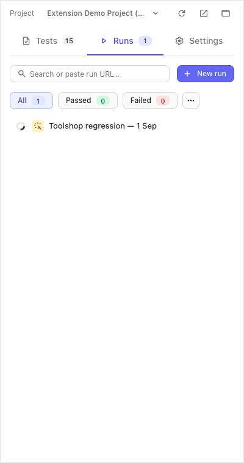
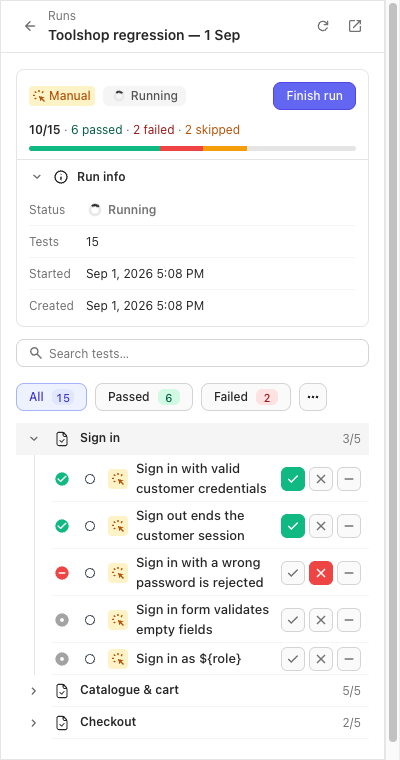
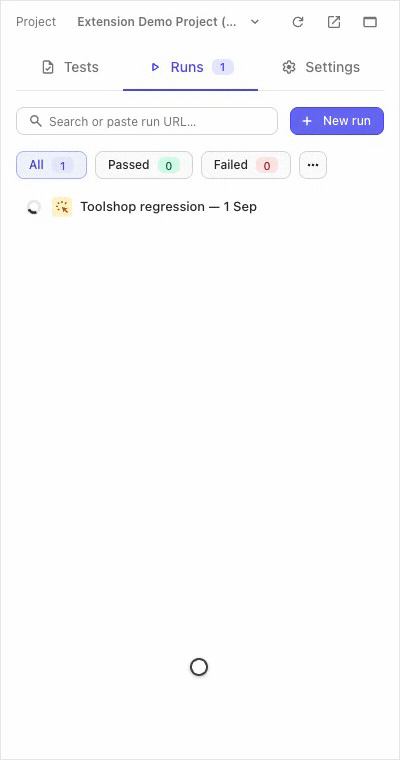
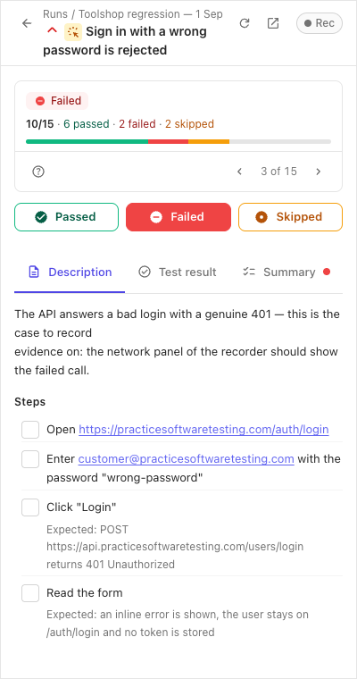

:::note
Taken from [Browser Extension documentation](https://github.com/testomatio/browser-extension/tree/main/docs/guide/run-tests.md).
:::

You open a run, walk its tests next to the site under test, and mark each
one. Nothing ever navigates on its own — you move on when you choose to.

## Open a run

1. **Runs** tab. The list shows the project's runs with their progress.
2. Click a run — or paste a run's URL from the web app into the search box;
   the same box also filters the list by title as you type. (**New run**
   opens the web app's create-run page — runs are made there and then show
   up in this list.)

   

The run opens as a checklist grouped by suite, with a progress bar and
status chips to filter by.

## Mark a test

Quick marks live right on the checklist: every row carries its own
✓ / ✗ / − buttons. For everything else — steps, a comment, the log —
click the test's title to open it.

- **Steps** tick on click: once for pass, again for fail, again for skip.
  Ticks sync to the server so a colleague sees them (in basic mode they
  stay local).
- **Passed / Failed / Skipped** save immediately and stay put — moving on
  is the **›** arrow of the *n of N* pager under the progress bar, or the
  hotkeys below.
- A comment saved with a status lands on the result in the web app too.
- Failing a test can attach the console & network log of the tab under
  test automatically — that is the [Rec recorder](console-network-log.md).
- A parametrized test shows one row per example; each row is marked on its
  own.

Hotkeys, in the test view only:

| Keys | Action |
|---|---|
| `Cmd/Ctrl+Enter` | Passed |
| `Cmd/Ctrl+U` | Failed |
| `Cmd/Ctrl+I` | Skipped |
| `N` | Next still-untested test |
| `↓` / `→`, `↑` / `←` | Next / previous test |

## Stay in sync

An open run re-reads itself about every 20 seconds while you look at it, so
a colleague's marks land on their own. The server's state wins; your own
in-flight write is never overwritten by a poll.

## Finish the run

**Finish run** on the run screen asks once — *"Finish run? Pending tests
will be marked skipped."* — and closes the run. It needs the full (not
basic) mode.

## If the network drops

A status that fails to save is not lost: it queues in the panel, the row
gets a `queued` badge, and a bar counts the *changes pending*. They replay
when the connection returns — or press **Retry** on the bar.

## If it didn't work

- **The run you pasted doesn't open** — the panel says when a URL leads
  nowhere it can reach: check the project the panel is on matches the URL.
- **Finish run is greyed out** — *"Finish run needs an active … web login"*:
  you are in basic mode; see [Connect](connect.md#basic-mode).
- **Ticked steps aren't visible to a colleague** — basic mode again; steps
  sync only with a session.
- **Marks from a colleague don't appear** — the panel polls only while the
  run is open and the panel is visible; press the header's Refresh for an
  immediate pull.
