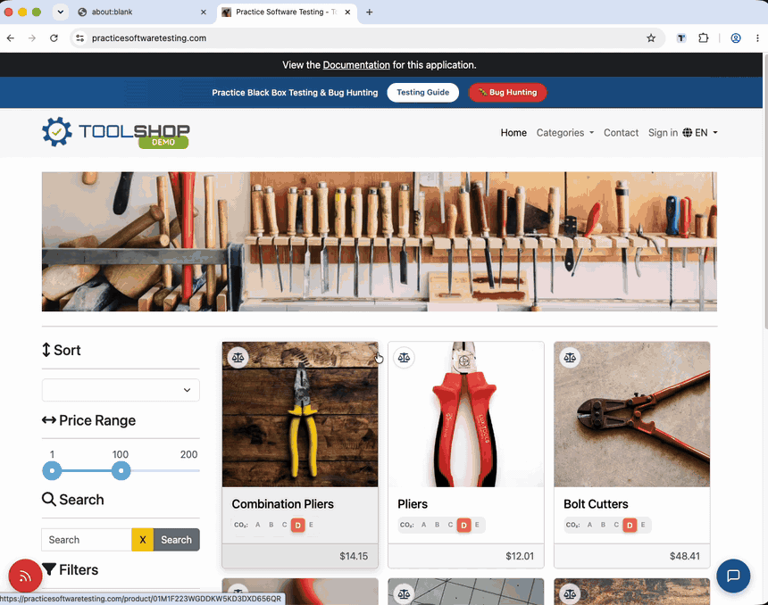
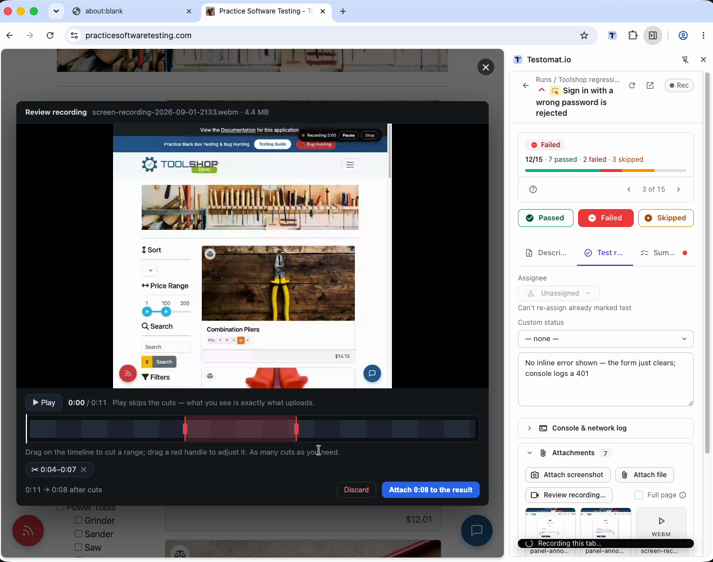

:::note
Taken from [Browser Extension documentation](https://github.com/testomatio/browser-extension/tree/main/docs/guide/screen-recording.md).
:::

The panel records the tab you are testing into a `.webm` — no audio — and
lets you review and trim it before anything uploads.

## Record

Three ways to start, same recording:

- **Attach screen recording** in the test's **Attachments** fold;
- `Alt+Shift+R` while you are on the page;
- right-click the page → **Testomat.io** → start recording.

While it runs, the controls sit on the page itself, where you are looking:
a timer, **Pause / Resume**, **Stop**.

The recording stops itself at **5 minutes** or **50 MB** — the bar says
which limit was hit.

One Chrome quirk worth knowing: the fast capture route works when you
start *from the page* (the hotkey or the right-click item). Starting from
the panel button records over Chrome's DevTools protocol instead — same
file, but Chrome shows its *"…is debugging this browser"* bar while it
runs. That bar is expected; it goes away at Stop.

## Review and trim

Every **Stop** opens a review right over the page: a player and a
timeline.

- **Play** previews exactly what will upload — it skips what you cut.
- **Drag on the timeline** to cut a range out; cut as many ranges as you
  like, anywhere. Each cut becomes a chip under the timeline with an ✕ to
  undo it.
- **Attach to the result** uploads the kept parts. With cuts, the panel
  re-records the kept ranges once ("replays" them) — the uploaded file is
  a normal video, and the uncut original is destroyed in the same moment.
- **Discard** deletes the take. Uploading never happens by itself:
  closing the review keeps the take parked, and the panel button reads
  **Review recording…** until you decide.

## If it didn't work

- **"…is debugging this browser" appeared** — expected on a panel-started
  recording; see above.
- **Chrome refuses to start on this page** — the panel quotes Chrome's own
  reason. A leftover frame from a disabled extension can cause it; the
  panel works around that by itself, but if Chrome still refuses, reload
  the page once and start again.
- **It stopped on its own** — the bar said why: *"Time limit reached"*
  (5 min) or *"Size limit reached"* (50 MB). Attach what you have and
  start another take if needed.
- **No sound in the file** — by design; the tab's audio is never captured.
