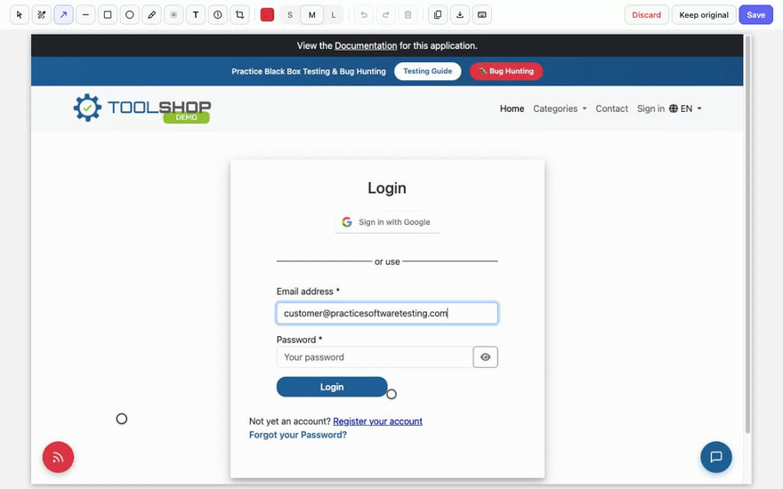

:::note
Taken from [Browser Extension documentation](https://github.com/testomatio/browser-extension/tree/main/docs/guide/screenshots.md).
:::

The panel captures the tab you are testing and opens an annotator right
over that page. Nothing uploads until you press **Save** there.

## Take and annotate

1. Open the test in the panel and unfold **Attachments**.
2. Press **Attach screenshot**. The picture is taken and the annotator
   opens over the page itself.

   

3. Mark it up and press **Save** (`Cmd/Ctrl+Enter`) — the annotated image
   lands on the test's attachments. The other two ways out: **Keep
   original** attaches the raw shot, **Discard** attaches nothing. Both
   ask first once you have marked the picture up, and `Esc` is **Discard**.

The tools, each with a one-letter hotkey:

| Tool | Key | What it does |
|---|---|---|
| Select | `V` | Drag to move an annotation, double-click a label to retype, `Delete` removes |
| Pen | `P` | Freehand line |
| Arrow | `A` | Point at something |
| Line | `L` | Straight line, no head |
| Box | `R` | Box an area |
| Ellipse | `O` | Circle an area |
| Highlight | `H` | Translucent marker ink |
| Blur | `B` | Pixelates an area — hides sensitive data for real, the pixels are destroyed |
| Text | `T` | Click, type, `Enter` |
| Number | `N` | Numbered step markers 1, 2, 3…; `S`/`M`/`L` size the badge |
| Crop | `C` | Keep only the dragged part (undoable) |

Every annotation stays editable until Save: select it, move it, delete it.
**Blur is not reversible** — after Save the blurred pixels are gone from
the uploaded file, which is exactly why it is safe for tokens and personal
data.

## Full page

The **Full page** toggle on the Attachments row makes the next shot cover
the whole scrollable page, not just the visible part. It works through
Chrome's debugger, so while it happens Chrome shows its *"…is debugging
this browser"* bar — that is expected and it goes away by itself.

Pages that refuse the debugger (the Chrome Web Store, `chrome://` pages)
fall back to a viewport shot, and the panel says so.

## If it didn't work

- **The annotator didn't appear** — the panel says why instead of hanging;
  usually the page is one extensions cannot touch (Web Store, `chrome://`,
  another extension's page). Switch to the site tab and try again.
- **A full-page shot fails on a page that used to work** — another
  extension's leftover frame can block the debugger; the panel works
  around it by itself, but if Chrome still refuses, reload the page once.
- **The buttons are greyed out** — the reason is written right under the
  row: no saved result yet, a finished (locked) run, or basic mode.
