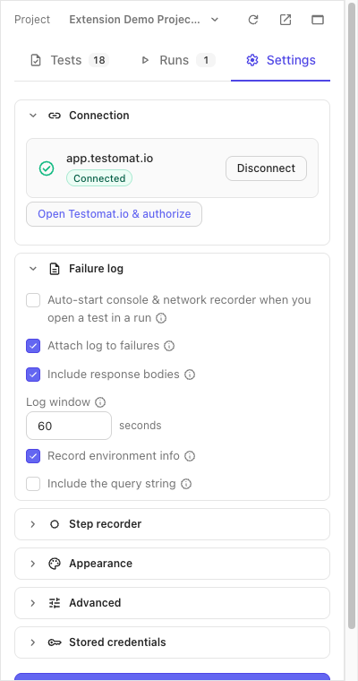
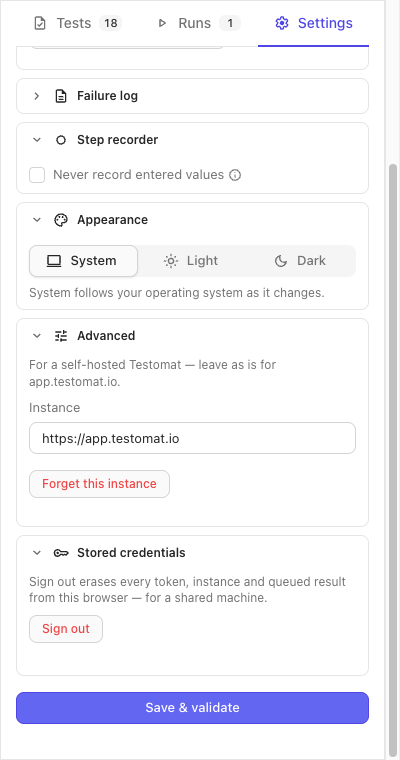

:::note
Taken from [Browser Extension documentation](https://github.com/testomatio/browser-extension/tree/main/docs/guide/settings.md).
:::

The **Settings** tab in the panel header holds six folds. **Connection** and
**Failure log** start open; click a heading to unfold the rest. Every
checkbox and field is committed by **Save & validate** at the bottom — it
also re-checks the connection, then lands you on the Runs tab. The one
exception is **Appearance**, which applies the moment you click it.

Settings are kept per instance: switch to another Testomat.io server and
you get that server's own set.

## Connection

The card names the host you are connected to, shows the **Connected** badge
(or *Project not picked* while the first-time setup is half done — token in,
no project chosen yet) and offers **Disconnect**. Authorizing, picking a
project and ending the connection are on [Connect](connect.md).

## Failure log

What gets recorded, and what leaves the browser, when you mark a test
**Failed**. Details of the recorder itself are on
[Console & network log](console-network-log.md).

| Setting | Default | What it does |
|---|---|---|
| **Auto-start console & network recorder when you open a test in a run** | Off | Rec starts by itself when you open a test in a run, bound to that test, and stops when you leave it. |
| **Attach log to failures** | On | The recorded log is uploaded and linked on a test you mark Failed. Off skips only that automatic upload — **Attach** on a single log entry still works. |
| **Include response bodies** | On | A failed request carries a snippet of what came back, up to 16 KB. Off keeps the request line and writes *(body capture disabled)* where the snippet would be. |
| **Log window** | 60 seconds | How much console & network history is kept and attached. Any value from 10 to 600; blank means 60. A number outside the range is refused — Save reports *Log window must be between 10 and 600 seconds* and nothing is saved. |
| **Record environment info** | On | Browser, OS, the viewport of the tab under test and its page URL are written onto the run as meta, with every status you set — not only a failure. |
| **Include the query string** | Off | The recorded URL — and the step recorder's first `Open` step — is cut to origin + path, so reset tokens and signed links in a query string stay out of the run. On records it whole. |

## Step recorder

| Setting | Default | What it does |
|---|---|---|
| **Never record entered values** | Off | Off, the recorder saves what you type into the steps and masks what it recognises as a password, card number, CVV or one-time code. On, every entry reads *Type text into the … field* — only a password field still says so — and a dropdown choice reads *Select an option in the … dropdown*. Turn it on when the site under test handles real payment or identity data. See [Sensitive values](step-recorder.md#sensitive-values). |

## Appearance

**System**, **Light** or **Dark**. The click is the save — no **Save &
validate** needed. System follows your operating system as it changes.
The choice belongs to the browser, not to an instance: it holds across
projects and servers, applies to the test editor tab too, and survives
**Sign out**.

## Advanced

For a self-hosted Testomat.io. On app.testomat.io leave it as it is — the
fold stays closed; it unfolds by itself once a self-hosted instance is
saved.

- **Instance** — the server's `https://` URL. HTTP is refused. The
  authorize link in Connection follows this field.
- **Pick a saved instance** — this dropdown appears once you have saved two
  or more servers. Picking one loads its saved settings into the form;
  **Save & validate** switches the panel to it. A server you hold no token
  for brings the **Access token** field back.
- **Forget this instance** — deletes the saved token, project and
  preferences of the instance the form points at, after a confirmation.
  If that is the instance you are on, its restored session, queued results
  waiting to be sent, recorded steps, captured log and unsaved drafts go
  too, a running recording is stopped, and the panel returns to the connect
  screen. Other instances are kept.

## Stored credentials

**Sign out** is for a shared machine: after a confirmation it erases every
saved token, instance, history entry, queued result, session, unsaved test
draft, recorded step and captured log from this browser, stops a running
recording, and reloads the panel onto the connect screen. The colour
scheme and the side-panel-or-window choice stay. Site access is Chrome's
own setting for the extension, on `chrome://extensions`, and is not
touched.

## Side panel or window

The header's **Open in window** button reopens the panel as a window of its
own — tall and narrow, like the side panel — for a second screen or a
site that fights the side panel. In that window the same button reads
**Dock to side panel**. The choice is remembered: the toolbar icon opens
whichever surface you used last.

## Keyboard shortcuts

In the test view, when no field has the focus:

| Keys | Action |
|---|---|
| `Cmd/Ctrl+Enter` | Passed |
| `Cmd/Ctrl+U` | Failed |
| `Cmd/Ctrl+I` | Skipped |
| `N` | Next still-untested test |
| `↓` / `→`, `↑` / `←` | Next / previous test |

Cmd and Ctrl both work on every system. The **?** button beside the
test pager at the bottom of the test view opens the same list in the
panel. None of the marks moves you on — that is `N`.

From any tab, `Alt+Shift+R` starts or stops a
[screen recording](screen-recording.md) of the tab in front; change it on
`chrome://extensions/shortcuts`.

## If it didn't work

- **"Instance and access token are required"** — the Access token field is
  empty for a server the panel holds no token for; authorize and paste.
- **"Instance URL must be https://"** / **"Instance is not a valid URL"** —
  fix the Instance field; the fold opens on the error.
- **"Log window must be between 10 and 600 seconds"** — the number in **Log
  window** is outside the range; nothing was saved, and the field still holds
  what you typed. Leave it blank for 60.
- **"Token rejected by …"** — the token is stale for that server; press
  **Open Testomat.io & authorize** again and save the new one.
- **"This token reaches no projects"** — ask for access to a project on that
  server, then save again.
- **"Couldn't load your projects from …"** — the server did not answer;
  check the connection and save again.
- **"Nothing saved for …"** — Forget was pressed for a server that was never
  saved; nothing was erased.
- **A warning about the recording after Forget or Sign out** — the erase
  happened, but the console & network recorder could not be stopped;
  restart the browser to be sure its log is gone.
