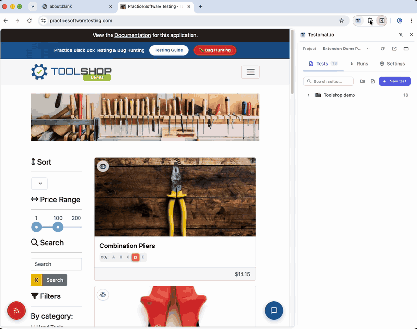
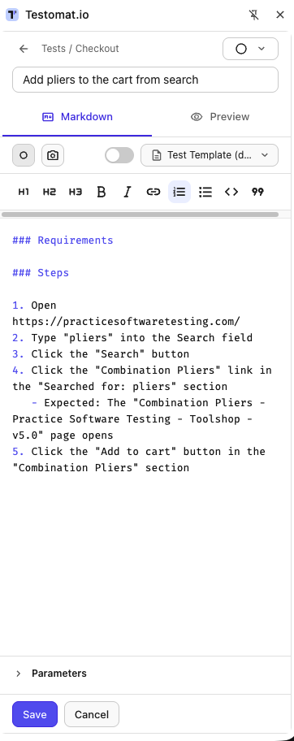

:::note
Taken from [Browser Extension documentation](https://github.com/testomatio/browser-extension/tree/main/docs/guide/step-recorder.md).
:::

Instead of typing steps, do the flow once on the page and let the panel
write it down — as readable Markdown, not code.

## Record

1. Open the page you want to record, then start a new test in the panel
   (see [Create tests](create-tests.md)).
2. Press **Record steps** in the editor. A dark pill appears in the
   page's bottom-right corner: `Recording · N steps`, with **+ Expected**,
   **Pause** and **Stop**.
3. Do the flow. Every click, entry, selection and navigation lands in the
   test's Steps list a second or so after you do it, while you keep going.
4. Press **Stop** — in the pill or in the editor. The steps are already
   there; Stop only ends the recording.

What landed in the editor after Stop:

What a step looks like: *Click the "Add to cart" button*, *Type "pliers"
into the Search field*, *Select "Hand Tools" in the Category dropdown*. A
control gets named by its label, text or placeholder; one inside a table
row or a card carries that row's name, so *Click the button in the "Bolt
Cutters" row* rather than a bare *Click the button*. A page change hangs
under the step that caused it as an `Expected:` line — *The "Cart" page
opens*.

## Expected results as you go

Checked something? Press **+ Expected** in the pill, type what you saw,
Enter (Esc cancels). It attaches to the step you just did, as the same
`Expected:` line a run shows under that step. The page never sees those
keystrokes.

## Pause, limits, continue

- **Pause** in the pill drops everything until **Resume** — handy for a
  detour that is not part of the scenario.
- The recorder pauses itself at **50 steps** and asks *"Still
  recording?"* — **Continue** grants another 50.
- Closing the recorded tab or the editor ends the recording; what was
  recorded up to then is already in the test.

## Sensitive values

A password, card number, CVV, expiry, one-time code, passport or tax id
records as *Type the password / the card number / the value into the …
field* — the field is named, the value is not. Recognition uses the
field's type and `autocomplete`, its wording, and for cards the number's
own checksum. A dropdown recognised the same way — a card expiry month,
a birth year — records as *Select the value in the … dropdown*. It is
best-effort: if the site handles real payment or identity data, switch on
**Settings → Step recorder → Never record entered values** and every entry
reads *Type text into the … field*, every dropdown *Select an option in
the … dropdown*.

## Polish with AI

The **Polish with AI** switch next to Record steps is off by default.
With it on, nothing changes while you record; when you stop, your
Testomat.io AI rewrites the recorded steps into cleaner prose. **Undo
polish** puts the recorded wording back. If the AI is unavailable, the
raw steps are kept and the editor says so.

## If it didn't work

- **Record steps does nothing / says the page can't be recorded** — the
  tab in front is one extensions cannot touch (Web Store, `chrome://`,
  another extension's page); switch to the site under test first.
- **A click wasn't recorded** — the recorder was paused, or the control
  is drawn on a canvas; type the step by hand.
- **Steps stopped at 50** — the soft cap; press **Continue**.
