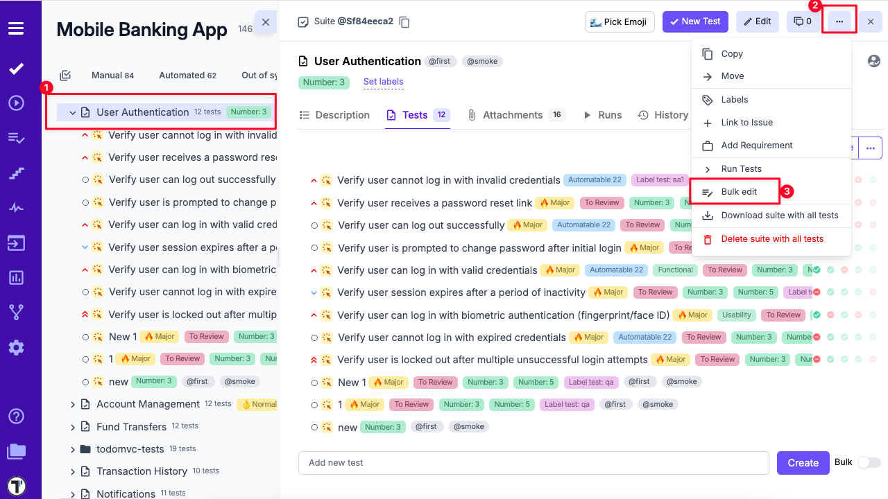
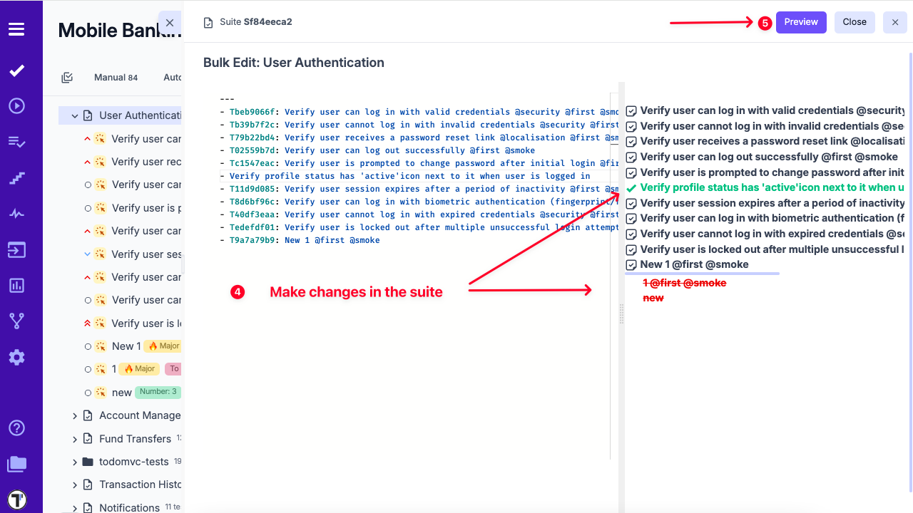
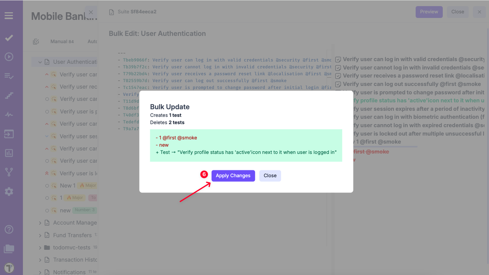

## File and Folder Patterns

In order to reflect the BDD paradigm in the best way and to support the consistency of the project structure, Testomat.io provides a Folder and File pattern. 
A suite with tests is considered to be a **file** (like a file with tests in your filesystem).
A suite that contains other suites is a **folder** (like in a filesystem).
So the main rule here is **suite can contain only tests or suites but not both**.

## How to Use Bulk Edit on Suite Level

Your project may contain a huge amount of tests and suites. It's more efficient to edit tests at the suite level. See how it works: 

1. Select the test suite you want to edit from the project view.

2. Click the three-dot menu (⋮) next to the suite name.

3. Choose **Bulk Edit** from the dropdown menu.

4. Modify the suite content in the YAML editor as needed.

5. Click **Preview** to review the proposed changes.

6. In the confirmation pop-up, click **Apply Changes** to save your updates.

## Bulk Tests Creation

Sometimes, you may want to quickly add multiple test cases by name and save them for further completion. Our Bulk Tests Creation feature is intended to help you:

1. Create a new or open existing test suite where your tests will be added.

2. Enable the **Bulk** toggle to switch to bulk creation mode.

3. Enter one test per line in the input field.

4. Click **Create** to add all the tests at once.

5. Your tests will appear immediately under the newly created suite.

