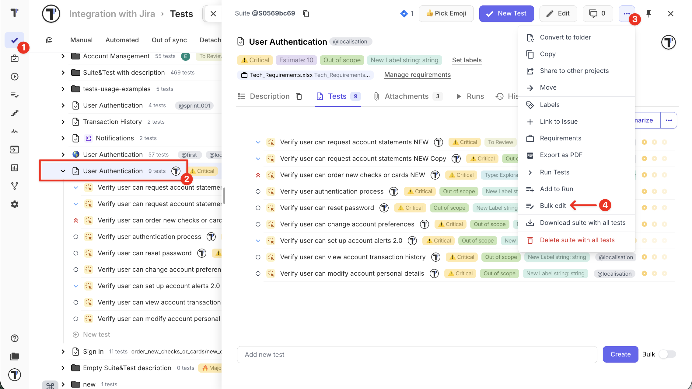
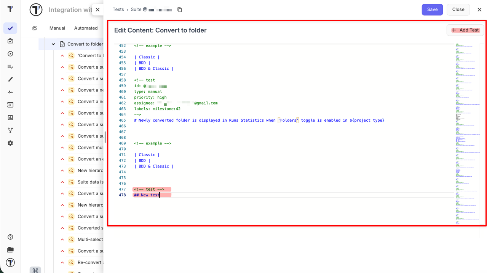
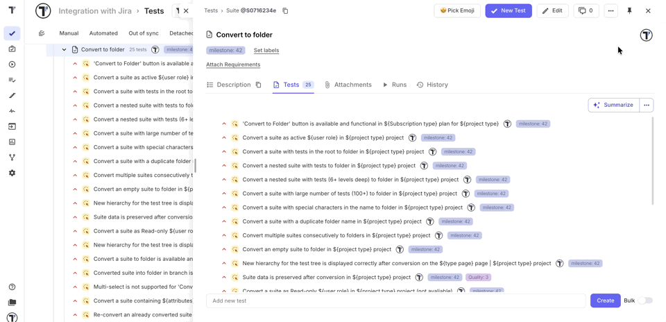
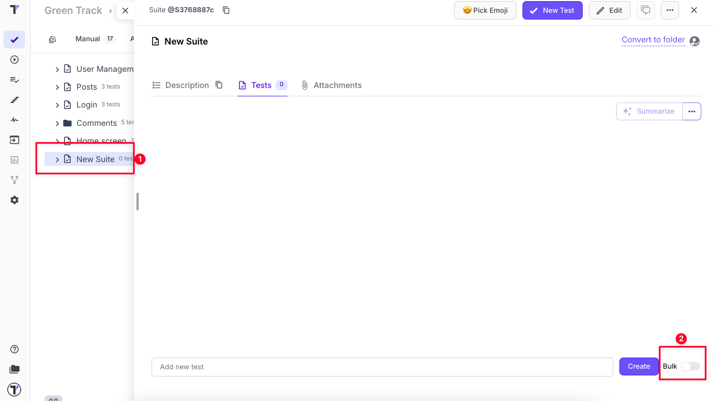
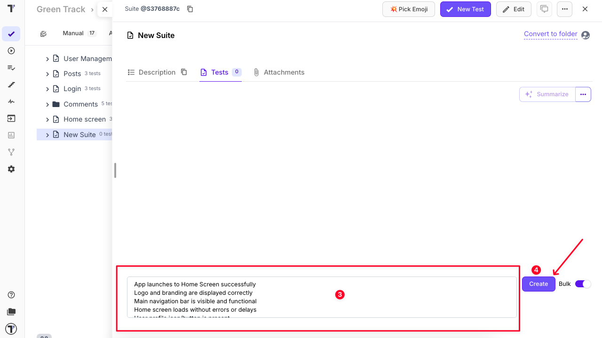
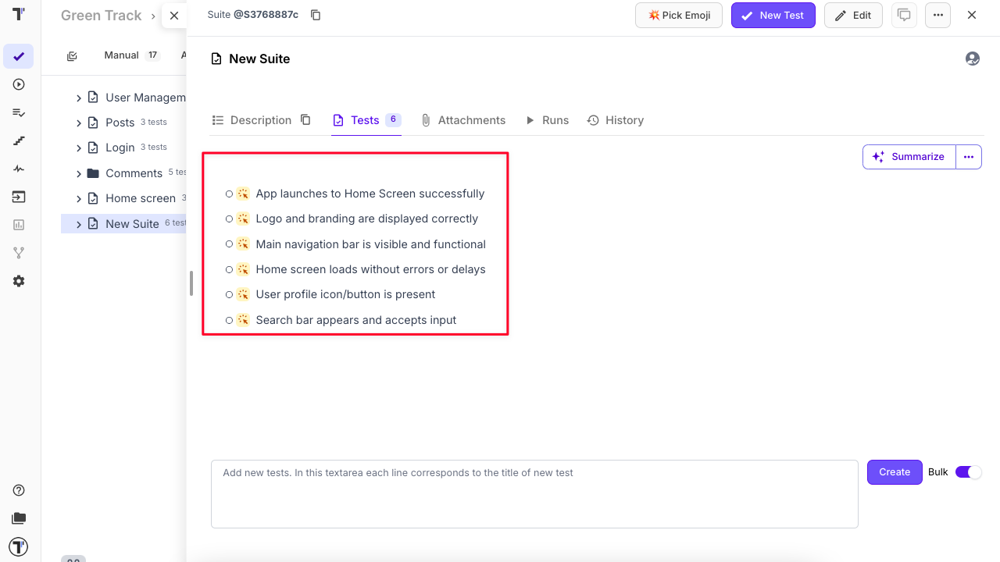

## File and Folder Patterns

In order to reflect the BDD paradigm in the best way and to support the consistency of the project structure, Testomat.io provides a Folder and File pattern.
A suite with tests is considered to be a **file** (like a file with tests in your filesystem).
A suite that contains other suites is a **folder** (like in a filesystem).
So the main rule here is **suite can contain only tests or suites but not both**.

## How to Use Bulk Edit on Suite Level

Bulk Edit allows you to update an entire suite as a single Markdown document.

Instead of opening tests one by one, you modify all tests directly inside the suite file. This speeds up large-scale updates and keeps test documentation consistent, especially for large regression suites or when multiple tests require the same change.

### Why Use Bulk Edit

In real QA workflows, updates rarely affect only one test. Bulk Edit is ideal for:

- Updating or adding examples across multiple **parametrized tests**
- Aligning labels, priorities, or tags across a feature area
- Updating wording after UI changes
- Refactoring test descriptions
- Quickly drafting multiple new tests with the same description
- Applying global text updates with **Change All Occurrences**

By working at the suite level, all changes are applied automatically when the suite is saved, avoiding manual synchronization of individual tests. The editor works with the [Classical Tests Markdown Format](https://docs.testomat.io/project/import-export/export-tests/classical-tests-markdown-format/), where suites and tests are structured as blocks in a single Markdown document.

:::note

Deletions made in Bulk Edit are **not applied when saving** to prevent accidental removals. If you need to delete items, use the regular **multi-select** workflow instead.

:::

### Step-by-Step Guide

1. Navigate to the **Tests** page
2. Open the suite you want to edit
3. Click the **'...'** extra menu
4. Select the **'Bulk edit'**

5. The Markdown editor opens, displaying the full suite file

From here, you can modify or create:

- Suite metadata (emoji, overall tags, labels, assignees, etc.)
- Test metadata (including tags, labels, priorities, assignees, etc.)
- Test descriptions (steps, expected results, etc.)
- Examples (parametrized tests)
- Add a new test - either by clicking **Add Test** (which automatically inserts `<!-- test -->` and a new `##` block) or by writing it manually in the suite file

All changes follow the [Classical Tests Markdown Format](https://docs.testomat.io/project/import-export/export-tests/classical-tests-markdown-format/), so you can learn more about the structure and formatting rules.

### Practical Example: Parametrized Tests

**Scenario:** You need to update examples across multiple parametrized tests.

**Without Bulk Edit:** Each test must be opened and updated individually.

**With Bulk Edit:**

1. Open the suite in Bulk Edit
2. Select the parameters (examples) you want to update — they will be highlighted in the editor for easy identification
3. Use **Change All Occurrences** to apply updates globally
4. Update the parameters (examples)
5. Click **Save**

All tests instantly reflect the new or updated examples.

Bulk Edit makes managing parametrized tests extremely efficient — whether adding new examples, correcting existing ones, or updating shared datasets.

### Best Practices

- Treat the suite file as a single source of truth for related tests
- Make grouped, logical updates instead of many small edits
- Review global replacements before saving
- Keep formatting consistent to ensure correct parsing

Bulk Edit works best for structured updates affecting multiple tests, rather than small individual corrections.

## Bulk Tests Creation

Sometimes, you may want to quickly add multiple test cases by name and save them for further completion. Our Bulk Tests Creation feature is intended to help you:

1. Create a new or open existing test suite where your tests will be added.

2. Enable the **Bulk** toggle to switch to bulk creation mode.

3. Enter one test per line in the input field.

4. Click **Create** to add all the tests at once.

5. Your tests will appear immediately under the newly created suite.

