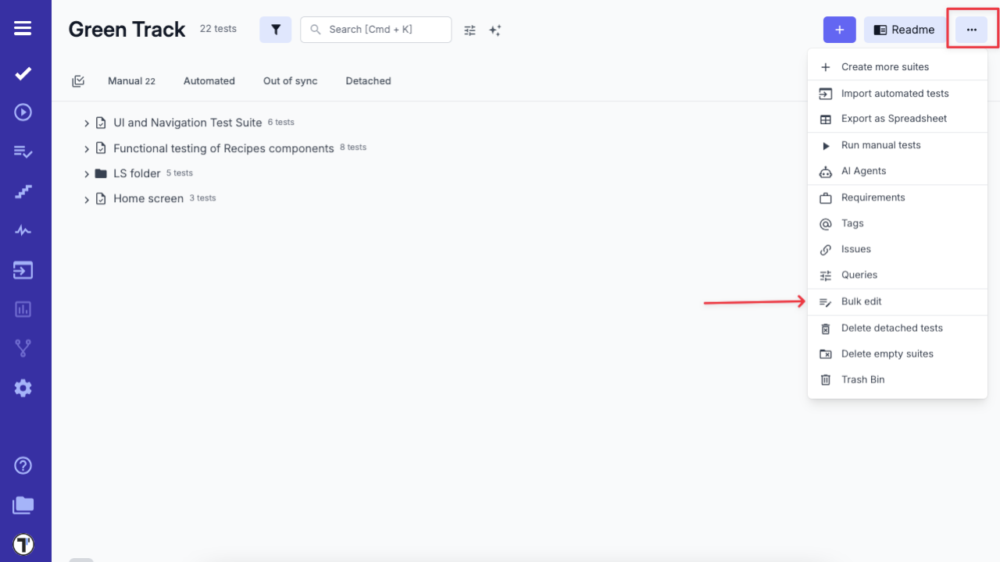
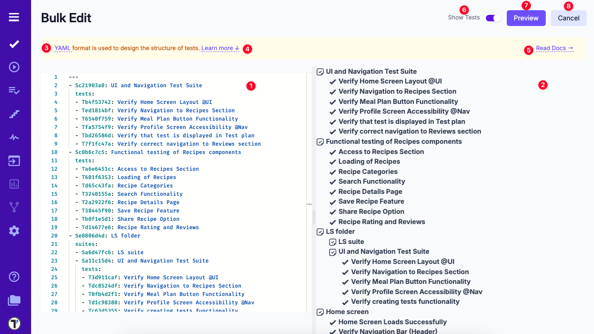
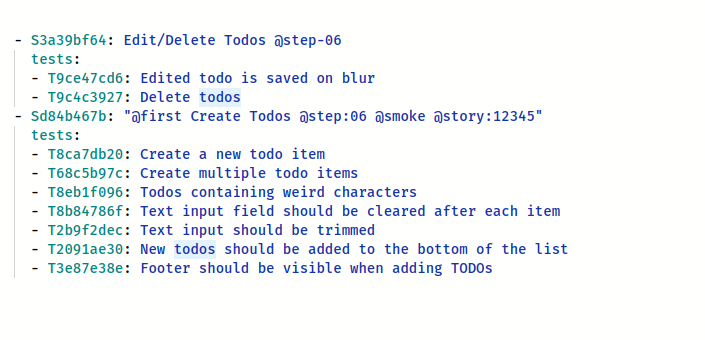
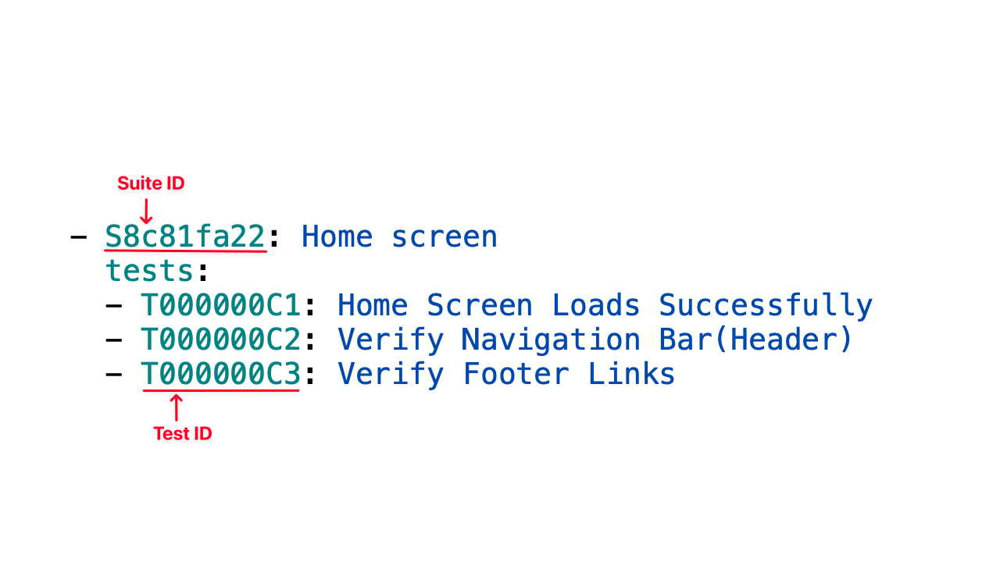
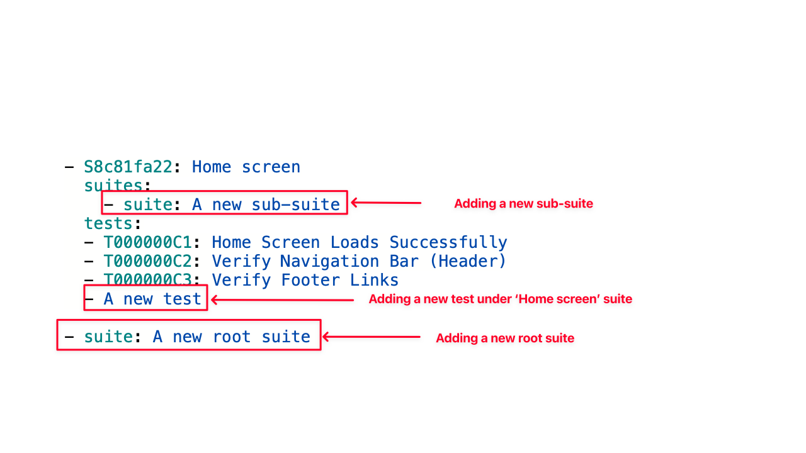
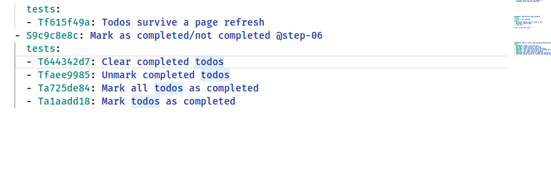
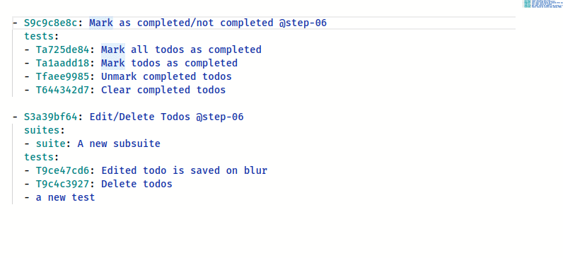
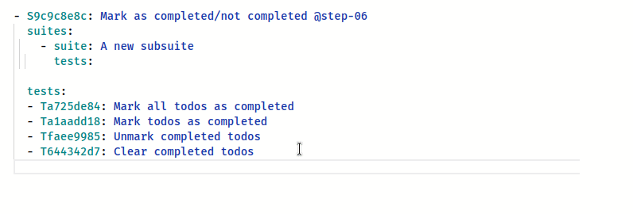
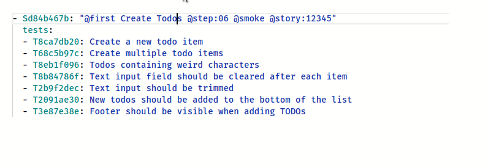

Bulk Edit is an advanced tool that allows to restructure tests within a project. With Bulk edit, you can

- reorder tests
- create new suites
- move tests to another suite
- delete tests

## Enabling Bulk Edit

Bulk edit mode can be opened from the Tests screen:



:::note

If your project contains **more than 1,000 tests**, the **Bulk Edit** button will be **disabled**.

This limitation helps maintain optimal performance for very large projects.

:::

A bulk editor may look confusing at first:



## Bulk Editor Overview

The Bulk Editor provides a powerful interface for managing your project in a structured text format. Here's a breakdown of its key features:

1. **Text-Based Editor** - Edit your project directly in YAML format for precise control and bulk updates.

2. **Live Preview** - Instantly see a visual representation of your changes as you make them.

3. **YAML Guide Link** - Access a quick reference guide to better understand and work with the YAML format.

4. **‘Learn More’ Button** - Opens a mini-tutorial section with tips and examples for using the Bulk Editor effectively.

5. **‘Read Docs’ Link** - Redirects you to the official [Testomatio documentation](<[https://docs.testomat.io/](https://docs.testomat.io/advanced/bulk-edit-folder/)>) for in-depth guidance.

6. **‘Show Tests’ Toggle** - Switch between viewing both test suites and test cases or just the test suites.

7. **‘Preview’ Button** - Displays a summary of your changes before applying them.

   > _Note:_ Don't worry, clicking "Preview" won't execute any changes on the project. You will see the list of planned changes and a confirmation button to accept them.

8. **‘Cancel’ Button** - Closes the editor and discards any unsaved changes.

To make yourself comfortable with bulk editor follow the next sections:

## YAML format

We use [YAML format](https://yaml.org) to structure data. If you are not familiar with YAML, [learn its basics](https://docs.ansible.com/ansible/latest/reference_appendices/YAMLSyntax.html) before following the guide. The YAML format was chosen as the most popular for defining data structures in text-only mode. It is very powerful as you can edit a whole project from a text editor without extra clicking. YAML is used in Ansible, Kubernetes, CI configs, etc, so it is very popular in the developer community.

## Working with Structure

In "Bulk Edit" mode all suites and tests are presented in YAML format.



It may be hard to understand it from start.
Let's explain it step by step:

- On the top-level we have a list of suites:
- Each element on the top level should start with `- ` char to indicate that it is a part of suites list.
- Suites are defined as objects in YAML
- A new suite should start with `suite:` key

```yaml
- suite: A new suite
```

- Existing suite starts with `S` char plus a suite ID, similarly to this:

```yaml
- S12345678: Existing suite
```

- A suite can contain other suites under `suites` key of the same object. Inside it you can have a list of child suites:

```yaml
- S12345678: Existing suite
  suites:
    - S22345678: Existing sub-suite 1
    - suite: New sub-suite 2
    - suite: New sub-suite 3
```

- A sub-suite can also contain a list of suites... Now you may see the power of YAML format!

```yaml
- S12345678: Existing suite
  suites:
    - S22345678: Existing sub-suite 1
      suites:
        - suite: A new sub-sub-suite!
```

> Please note that we indent our data with 2 spaces (`  `) to indicate which level we are at. We got down to 3rd level in this example, so we used 6 spaces before `- suite: A new sub-sub-suite!`

- A suite may contain tests under `tests` key. Tests should be also represented as a list. If a test has `test:` key or no key at all, it is treated as a new test:

```yaml
- suite: User Management
  tests:
    - test: A new test 1
    - A new test 2 # short format
```

> This structure creates 2 new tests under the new suite "User Management"

- Existing test starts with `T` char plus a test ID, similarly to this:

```yaml
- S12345678: Existing suite
  tests:
    - T12345679: Existing test
```

- to delete a test or a suite - remove it from the structure
- to change the order of tests or suites - move them up or down in the structure

These rules are important to keep in mind when working in Bulk Edit mode.

Let's sum up what we learned so far:

- listing existing suites and tests



- adding new tests and suites:



## Keyboard Shortcuts

To unleash the full power of bulk edit learn these keyboard combinations that will speed up your work.

- Use **Alt+Up** to move current line one level higher.
- Use **Alt+Down** to move one level lower.



- Also you may select a block of text and move it with **Alt+Up** or **Alt+Down**



- Use **Cmd+Right** or **Ctrl+Right** to indent a block to move it to next nesting level



- Use **Cmd+d** or **Ctrl+d** to make a multiple selection. This allows replace values on the fly.


