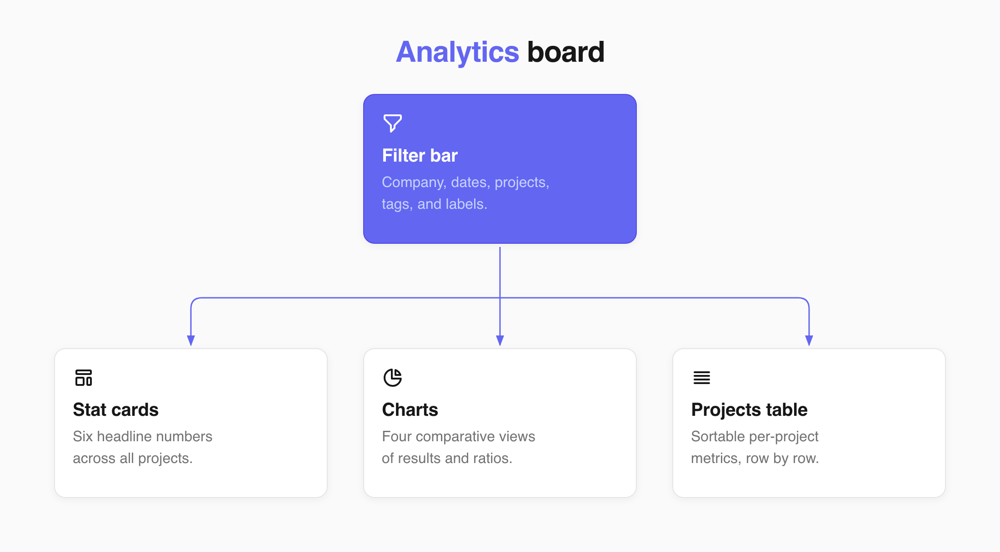
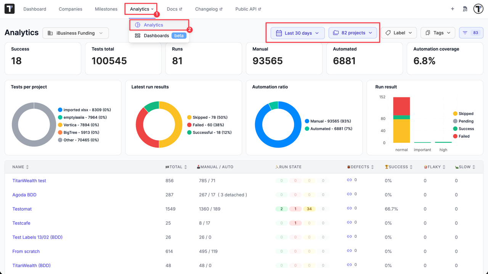
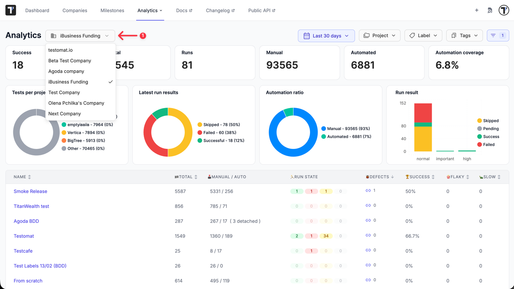
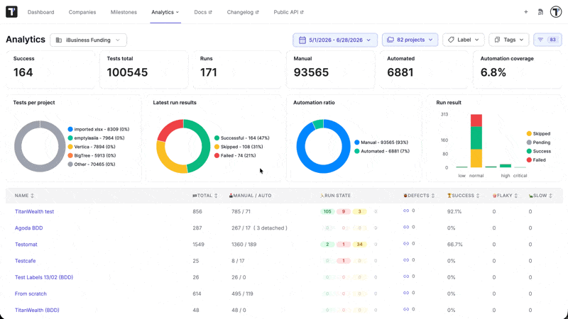
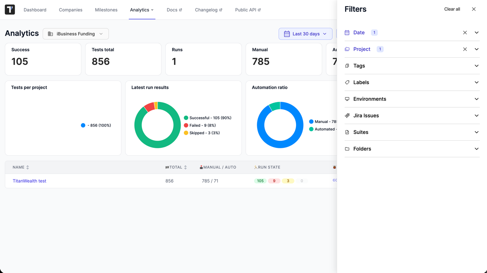

**Global Analytics** provides a consolidated, company-wide view of your test engineering performance. It aggregates data from every project you can access within a company into a single prebuilt dashboard, allowing you to evaluate automation coverage, success rates, and defect counts across projects without navigating into each one individually.

**Global Analytics** works at the company level, so the numbers cover all projects in the company you have selected.

:::note

To build your own charts on top of the same data, see [Analytics Dashboards (Widgets)](https://docs.testomat.io/advanced/global-analytics/analytics-dashboards).

:::

## Access Global Analytics

1. Navigate to **'Analytics'** tab from the main workspace dashboard.
2. Select **'Analytics'** option from the displayed dropdown list.

By default, the overview displays statistics for all your projects within your default company for the **last 30 days**.

The dashboard is structured into four main areas: **the filter bar, the stat cards, the charts, and the projects table.** 

## Filtering Analytics Data

**Filters** at the top of the page and within the side drawer apply globally across all stat cards, charts, and table rows simultaneously. When a filter is modified, the board automatically updates its numbers.

### Available Top-Bar Filters

1. **Company** - Switch between different companies you belong to using the top-level company selector.
2. **Date range** - Select a custom date range or a quick preset (defaults to the **last 30 days**). Date ranges filter run-based metrics according to when test executions occurred.
3. **Projects** - Restrict analytics to one or more specific projects within the company. If no project is selected, all projects are included by default.
4. **Tags** - Filter for tests containing specific technical or workflow tags.
5. **Labels** - Filter to tests that carry a label, with or without a specific value.

### Available Side Drawer Filters

Click the side drawer icon to access additional filter options:
1. **Environments** - Restrict results to specific execution environments (e.g., Staging, Production).
2. **Jira issues** - Filter for tests linked to specific Jira issue keys.
3. **Suites** and **Folders** - Scope metrics to selected sections of your test tree.

The filter options are drawn from the selected company and projects in that company.

## The Stat Cards

Stat cards provide high-level summary metrics calculated across all projects currently in scope.

| Stat Card | What it shows |
|------|---------------|
| **Success** | The share of passed tests among all executed tests. |
| **Tests total** | The number of tests across the selected projects, excluding detached tests. |
| **Runs** | The number of runs across the selected projects. |
| **Manual** | The number of manual tests, excluding detached tests. |
| **Automated** | The number of automated tests, excluding detached tests. |
| **Automation coverage** | The share of automated tests among all tests. |

:::note

Stat Counts exclude **detached tests** (automated tests whose underlying code signature no longer matches the repository). They are left out so they do not inflate your totals.

:::

## The Charts

Four visual charts display comparative metrics across projects, execution statuses, automation levels, and test priorities:

- **Tests per project** - A pie chart that splits the total test count across projects, so you see which projects hold the most tests.
- **Latest run results** - A pie chart of the most recent run outcomes, split into **Successful**, **Failed**, **Skipped**, and **Pending**. Only outcomes with a value above zero appear.
- **Automation ratio** - A pie chart that compares **Manual** and **Automated** test counts.
- **Run result by priority** - A stacked bar chart grouped by test priority. Each bar stacks **Skipped**, **Pending**, **Success**, and **Failed** tests. Only priorities with results appear.

## The Projects Table

The Projects table lists individual project metrics, allowing you to rank and compare project performance directly. Click any project name to jump to its workspace. Click column headers to sort ascending or descending (all columns are sortable except **Run State**).

| Column | What it shows |
|--------|---------------|
| **Name** | The project title, linked to the project. |
| **Total** | The number of tests in the project. |
| **Manual / Auto** | Manual and automated test counts, side by side, plus the detached count when it is above zero. |
| **Run State** | The latest run outcome as status points with a tooltip that breaks the result down by priority. |
| **Defects** | The number of failed tests that have a linked Jira issue, with a tooltip that breaks defects down by priority. |
| **Success** | The success rate as a percentage, to one decimal place. |
| **Flaky** | The number of flaky tests. |
| **Slow** | The number of slow tests. |

## Metric Definitions

The page uses a few precise definitions. Knowing them explains why two numbers that look related do not always add up.

- **Success rate** — passed tests divided by passed plus failed tests. Skipped and pending tests are left out of the calculation, so the rate reflects only tests that produced a pass or a fail.
- **Latest run results** — the status counts come from each project's most recent run, not from every run in the date range. This is why the run-result charts can differ from cumulative totals.
- **Defect** — a failed test that has a linked Jira issue. A failure with no linked issue is not counted as a defect.
- **Detached test** — an automated test that no longer matches code in the repository. Detached tests are excluded from the test counts.
- **Priorities** — tests carry one of five priorities: low, normal, important, high, and critical. The priority breakdowns and the priority bar chart use these.

## Data Collection

**Global Analytics** reads from a dedicated analytics store that records every test execution, so the page reflects recent runs rather than recomputing from the live test database on each visit. The date range filters this data by when each test was executed.

Because the store is company-scoped, the page can aggregate across all projects in the company at once. When you select specific projects, the stat cards and charts sum only those projects; the projects table still lists each project on its own row.

## Next Steps

- [Analytics Dashboards (Widgets)](https://docs.testomat.io/advanced/global-analytics/analytics-dashboards) - build custom dashboards from the same data when the overview does not show the exact metric you track.
- [Milestones](https://docs.testomat.io/advanced/milestones/) - track work across tests, suites, plans, and runs, then scope analytics to a milestone.
