**Dashboards** allow you to create custom analytics views using company-wide data from the [Global Analytics overview](https://docs.testomat.io/advanced/global-analytics/analytics-board). Each dashboard is a customizable grid of widgets designed to track specific metrics or organize analytics by categories such as priority, test type, or milestones.

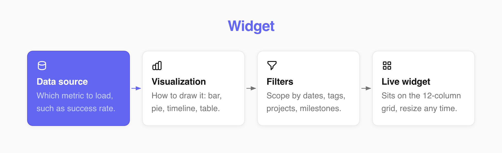

**Dashboards** operate at the **Company level**, aggregating test data across all projects in the selected company.

## Create a Dashboard

**To create a new dashboard:**

1. Navigate to **Analytics** tab from the main workspace dashboard.
2. Select **Dashboards** option from the displayed dropdown list.
3. Click **Create** button to create a new dashboard.

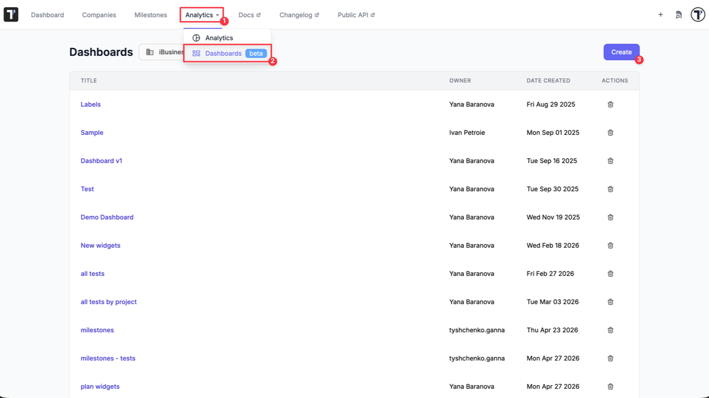

4. Enter dashboard title in the displayed modal.
5. Click **Create** button.

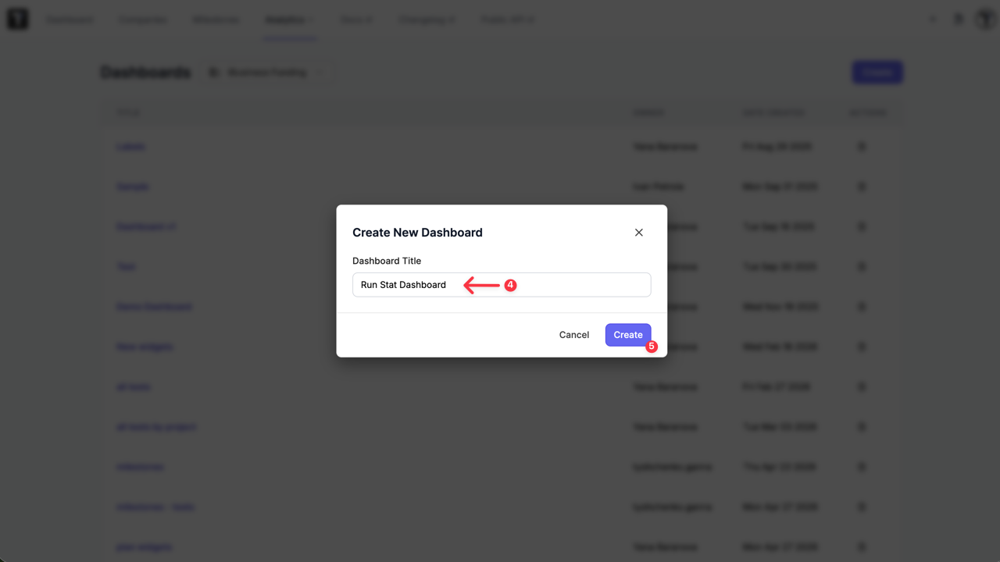

An empty dashboard page will be created and added to your dashboard list. You can now begin adding widgets tailored to your tracking goals.

The user who creates a dashboard is designated as its owner. Since dashboards belong to the company, all members with access to the company can view them.

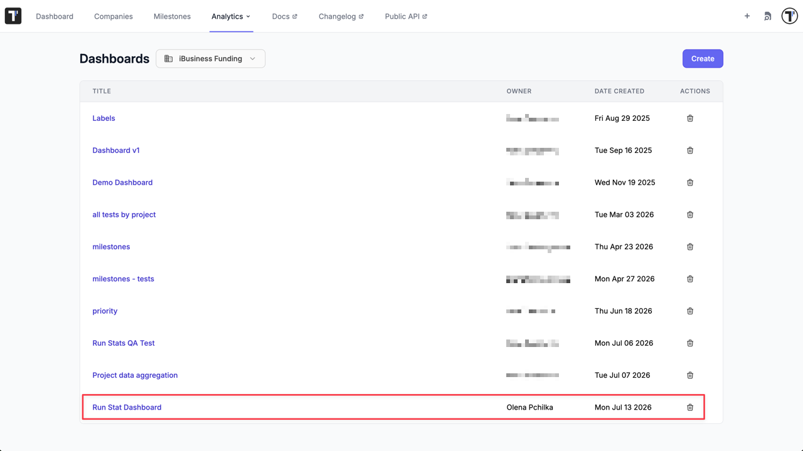

:::note

Only company managers can create, edit, or delete dashboards and widgets. Members with read-only access to the company can open dashboards but cannot change them.

:::

## Add the Widget

A widget is built based on two parameters: a **data source** that decides which metric to load, and a **visualization** that decides how to draw it. The same data source can be rendered in multiple chart styles. For example, success rate by date works as a bar chart, a timeline, or a table.

**To add a widget:**

1. Open your dashboard page, click the **Edit** button.
2. Click **Add Widget** button.
3. Choose a **Data Source**. Each option includes a short description and a list of compatible visualizations.
4. Select your preferred **Visualization** type
5. Enter a **Widget Title** (not required).
6. Save the widget. It appears on the grid and loads its data.

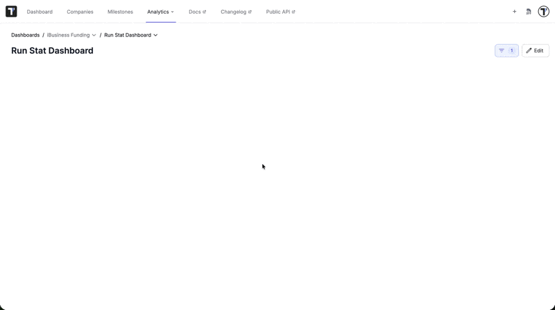

:::note

You can preview live data with active filters applied before saving the widget.

:::

## Widget Visualizations

Each data source supports a subset of different visualizations. The form shows only the ones that fit the data you picked.

| Visualization | What it shows |
|---------------|---------------|
| **Single value** | One headline number, such as total automated tests. |
| **Bar chart** / **multi-bar chart** | Values compared across categories or projects. |
| **Pie chart** / **multi-pie chart** / **circle (donut) chart** | A breakdown as parts of a whole, such as passed, failed, and skipped. |
| **Timeline** | A metric plotted over time, to see trends. |
| **Table** | Raw rows, such as per-project or per-priority figures. |
| **Project stats** | A full card for one project: test counts, automation rate, success rate, and defects by priority. |
| **Run stats** | A summary of run outcomes. |
| **Partial total** | A progress indicator showing part of a total, such as executed versus planned. |
| **Milestone views** | Layouts for a milestone's run stats, tests, plans, and requirements. |

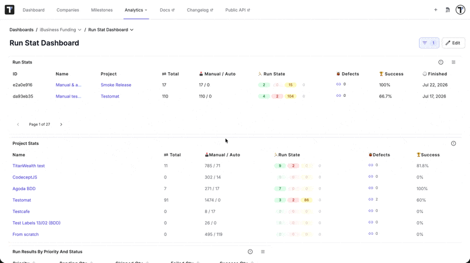

### Setting Default Widget View

You can set or change the Default View for a widget in two ways:

1. **During widget creation:** Choose the default view within the widget configuration modal.

OR

2. **After creation:** Open **Edit** mode on the dashboard page and adjust the view directly on the widget card.

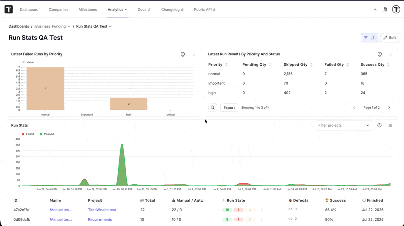

## Available Data Sources

**Data sources** fall into a few groups. Choose a data source based on the key metrics you need to analyze.

| Group | Data sources | Answers |
|-------|--------------|---------|
| **Test counts** | Automated tests, manual tests, all tests - each also available per project | How many tests exist and how automation is split |
| **Run trends** | Success rate by date, automation rate by date, test runs by date | How outcomes and automation change over |
| **Priority and status** | Run results by priority and status, failed runs by priority | Where failures concentrate by priority |
| **Summaries** | Project stats, run stats | A full picture of one project or run |
| **Milestones** | Milestone completion, milestone run stats, milestone tests, plans, and requirements | Progress against a [milestone](https://docs.testomat.io/advanced/milestones/) |

## Arranging and Resizing Widgets Layouts

Dashboards use a **12-column grid** and it allows you to shape the layout directly on the page.

### To customize the layout

1. Click **Edit** on the dashboard page.
2. **Move:** Click and drag a widget by its header.
3. **Resize**: Drag the edges or corners of a widget.
4. Click 'Done' to save your layout.

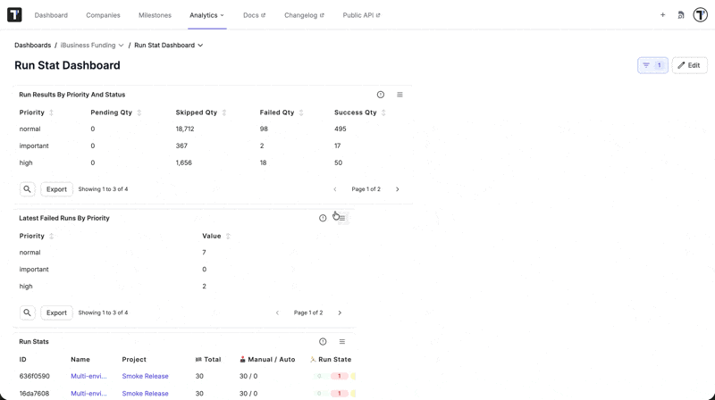

A widget can span from one column up to the full width of the grid, a wide trend chart and a narrow counter can sit on the same row.

After saving the layout, you can quickly switch visualization types directly from the widget header options without entering full edit mode.

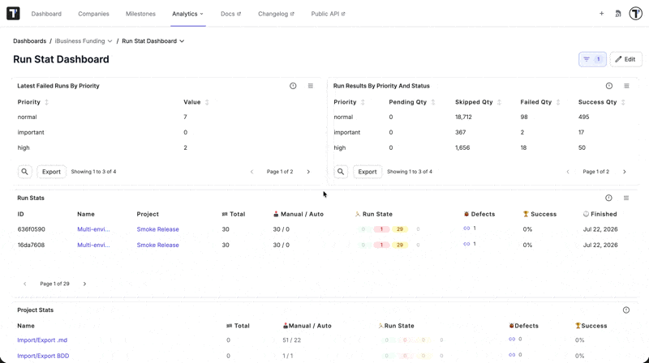

## Filtering Analytics Data

Filters can be applied at the **Dashboard level** (affecting all widgets) or at the **Widget level** (affecting an individual widget).

:::note

**Dashboard-level** filters override individual **Widget-level** filters.

:::

### Available Filter Criteria

- **Date range** - restrict run-based metrics to a period.
- **Projects** - limit analytics to one or more projects in the company.
- **Tags** and **labels** - narrow to tests that carry a tag or a label value (e.g., @smoke, Priority: High).
- **Environments** - focus on a specific test environment (e.g., Staging, Production).
- **Jira issues** - focus on tests linked to specific issues.
- **Suites and folders** - limit to part of the test tree.
- **Milestones** - scope data to a milestone.

Available filter values (tags, labels, environments, suites) are dynamically populated from all accessible projects across your company.

### Applying Dashboard-Level Filters

1. Click **Filter** icon in the top-right corner on the Dashboard page.
2. Configure your filter criteria. The selected filters will instantly apply to all widgets on the board.

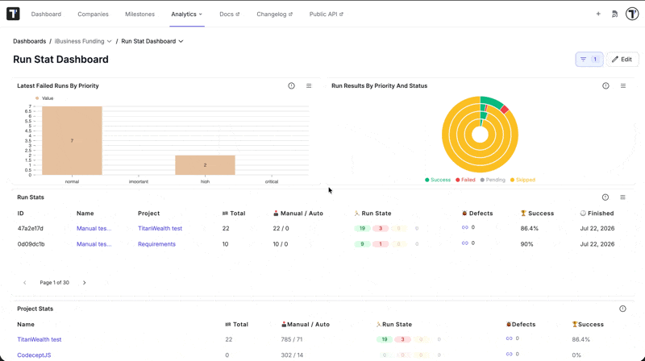

### Applying Single Widget Filters

1. Click **Edit** and then **New widget**.
2. Select your data source and configure specific filters within the creation panel.
3. Add the widget to your board.

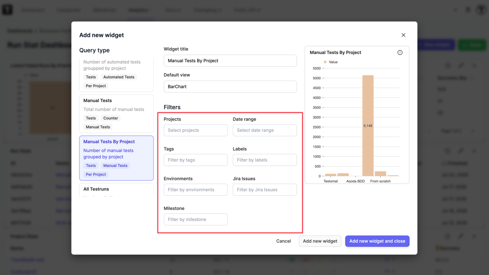

### On an Existing Widget (Date Filter)

1. Click **Edit** in the top-right corner of the Dashboard page.
2. Click the **Edit** (pencil) icon on the specific widget card.
3. Adjust the date range filter.
4. Save your changes.

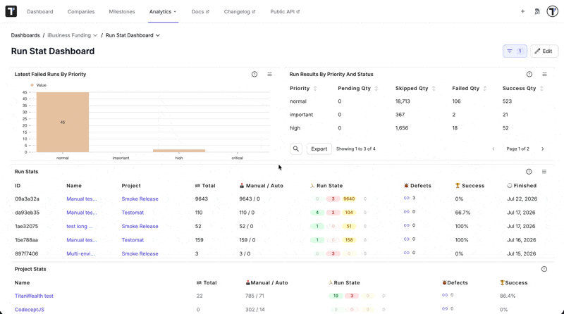

## Performance & Caching

To ensure rapid loading times across large datasets, widget results are cached automatically. The cache updates periodically on a set schedule to reflect new test runs. Reopening a dashboard or adjusting filters automatically triggers a fresh data load.

## Next Steps

- [Analytics Board](https://docs.testomat.io/advanced/global-analytics/analytics-board) - read the prebuilt company overview your widgets are built from.
- [Milestones](https://docs.testomat.io/advanced/milestones) - group tests, plans, and runs into a milestone.
- [Project Analytics](https://docs.testomat.io/project/analytics) - drill into a single project when a company-wide view is not enough.
- [Tags or Labels](https://docs.testomat.io/advanced/tags-labels/tags-or-labels) - tag and label your tests.
- [Users Roles & Access](https://docs.testomat.io/management/company/users-and-permissions) - check who can create and edit dashboards in your company.