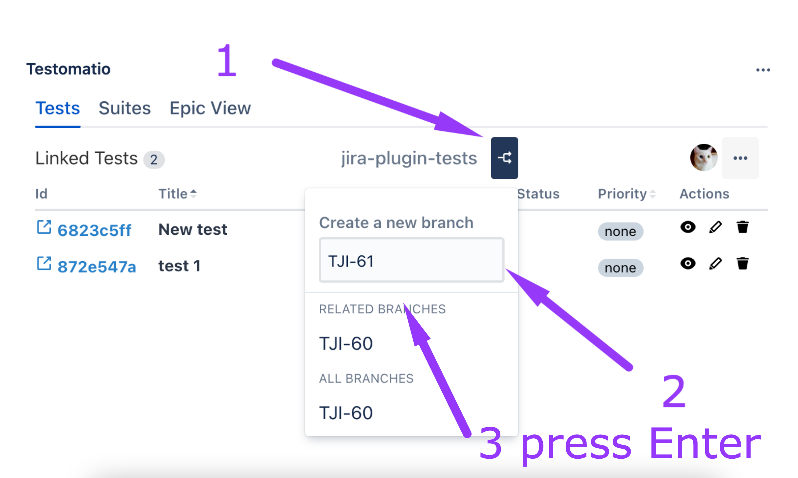
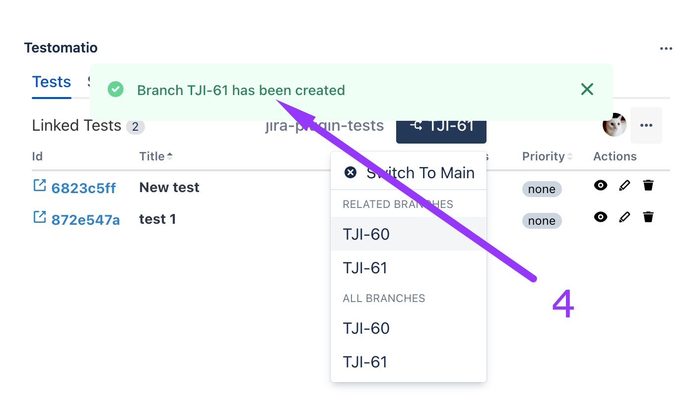
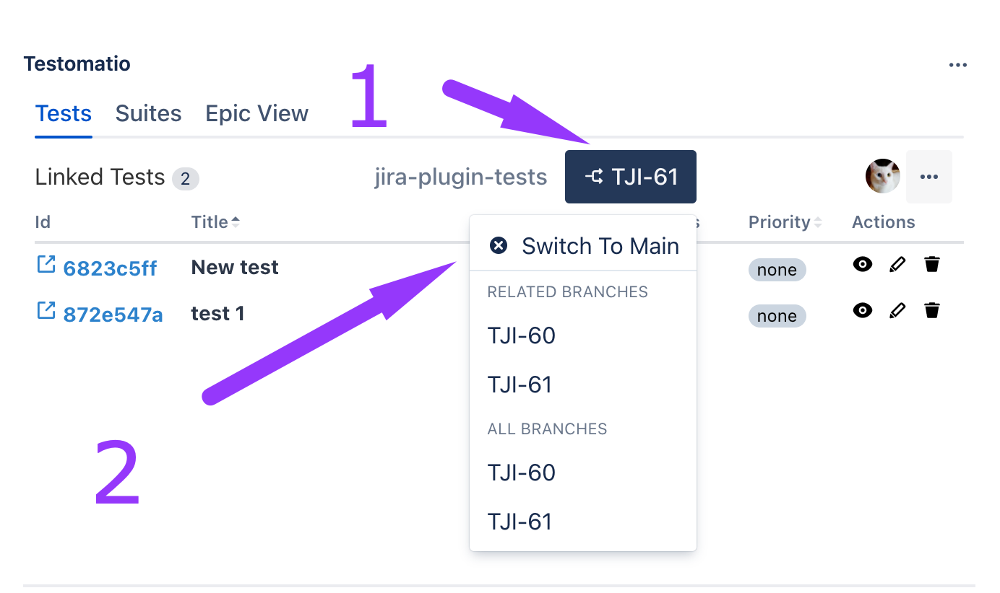
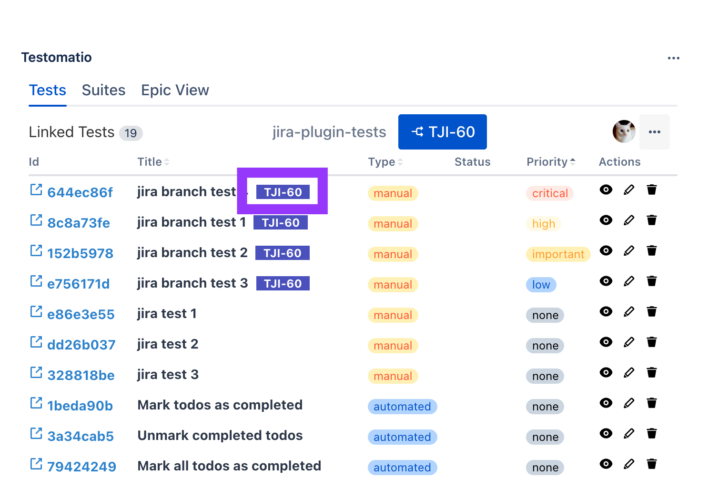

With Testomatio Plugin you can work with branches within your project directly from Jira. Namely, you can:

- add new branches to the existing project 
- switch between your branches
- make changes within existing branches 

## How To Add a New Branch

1. Click on the branches button
2. Enter a branch name or leave it as an issue name
3. Press Enter
4. See your branch was created

## Switch Between Branches

You can switch between branches and Main by clicking on the branches button (1) and clicking on Switch To Main (2)

## How To Work Within Branches 

Within the branch, you can do all actions described previously view, edit, unlink, edit Feature File. 
Test and Suites related to the branch will be marked with a badge with the name of the branch.

