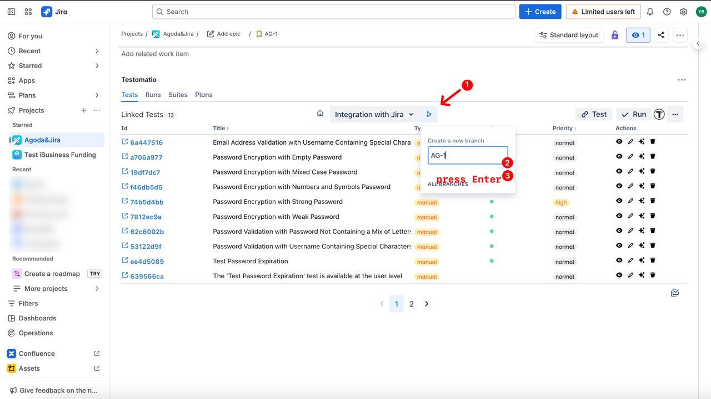
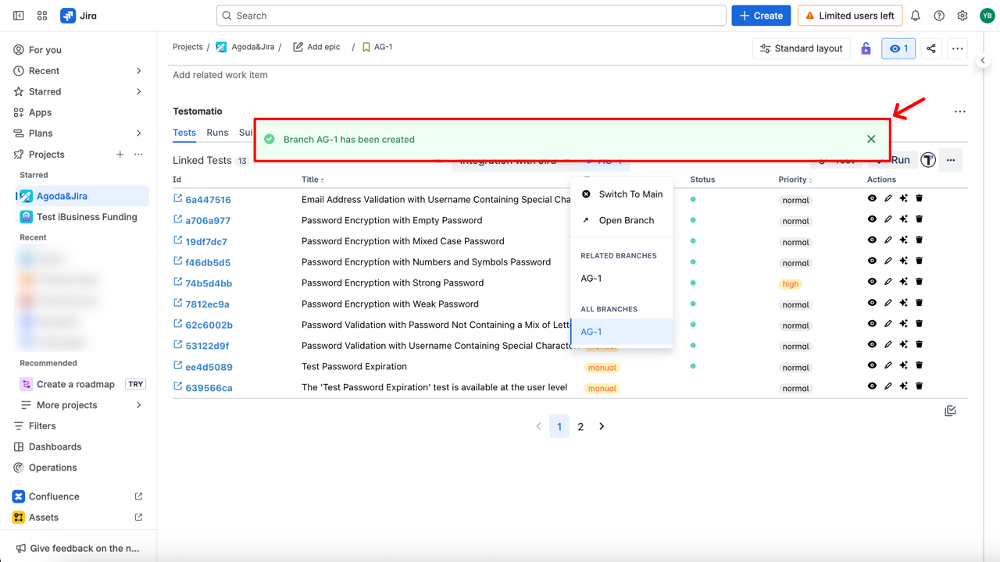
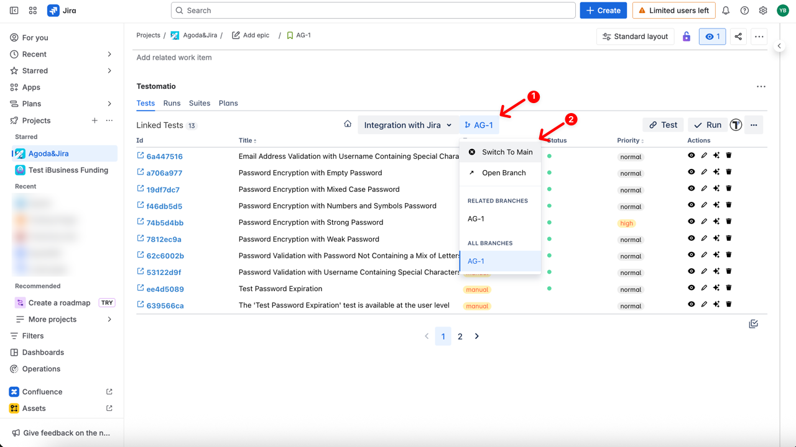
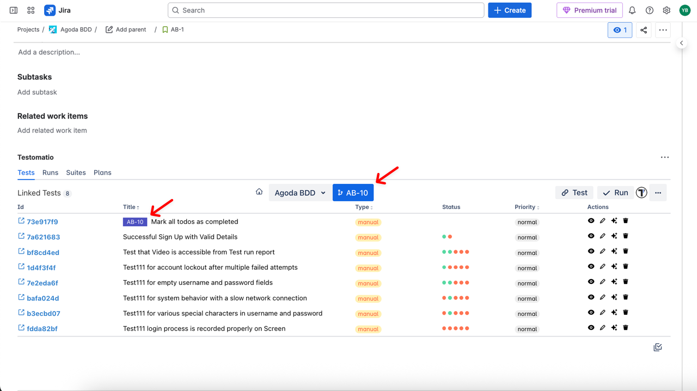

With the Testomat.io Jira Plugin, you can manage branches directly from Jira. This allows you to organize your tests and suites for different features or releases. Namely, you can:

- Add new branches to the existing project
- Switch between branches, including the Main branch
- Make changes within existing branches

## How To Create a New Branch

1. Click on the **Branches** button
2. Enter a branch name or leave it as the issue name
3. Press **Enter**

Your branch has been created successfully, and you are automatically switched to the newly created branch.

## How to Switch Between Branches

You can switch between branches and Main.

1. Click on the **Branches** button
2. Select the branch you want to switch to (e.g., **Switch to Main**)

## How To Work Within Branches

Within a branch, you can perform all actions available in Jira Plugin after logging in:

- View linked tests and suites
- Edit tests and suites directly
- Unlink items if needed
- Edit BDD Feature Files

Tests and suites related to the current branch will be marked with a badge showing the branch name.

[Learn more about what you can do after logging in](https://docs.testomat.io/advanced/jira-plugin#what-you-can-do-after-logging-in).

