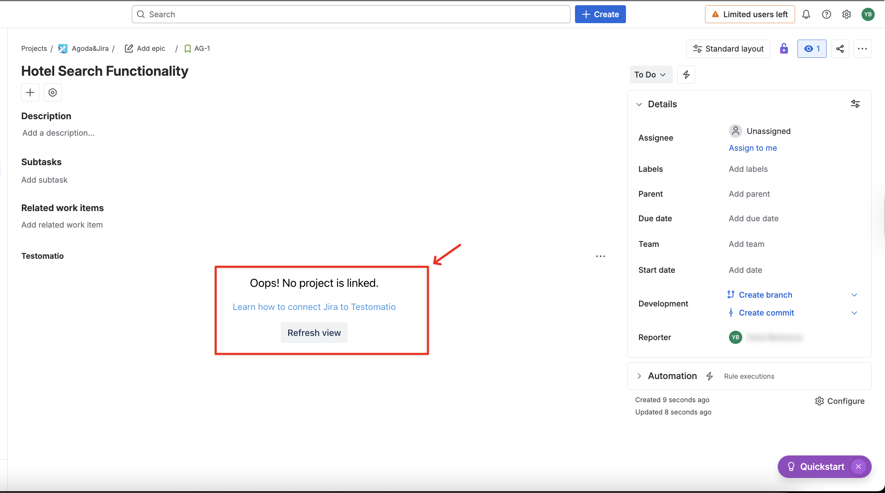
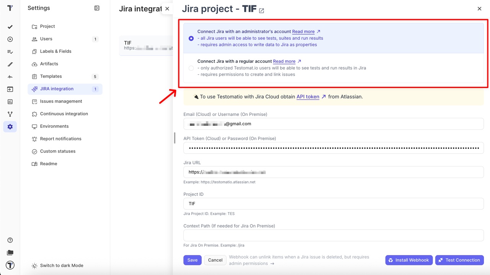
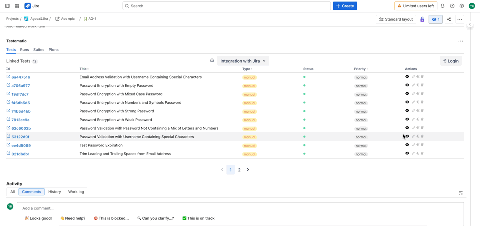
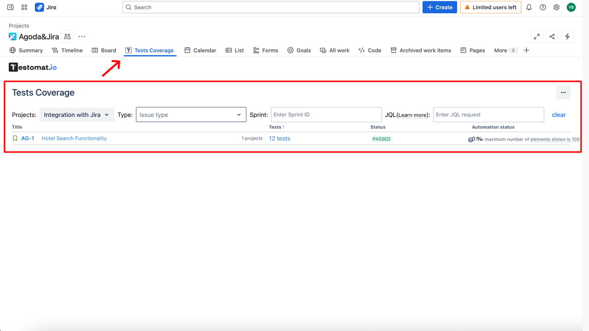
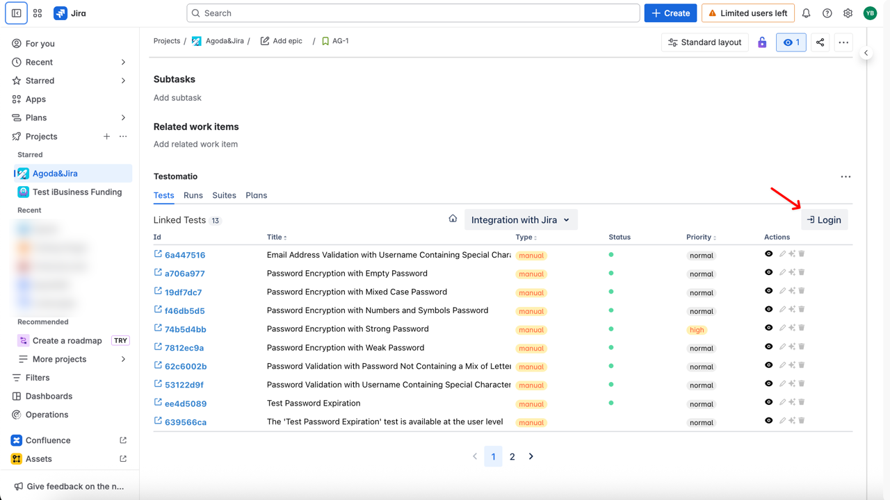
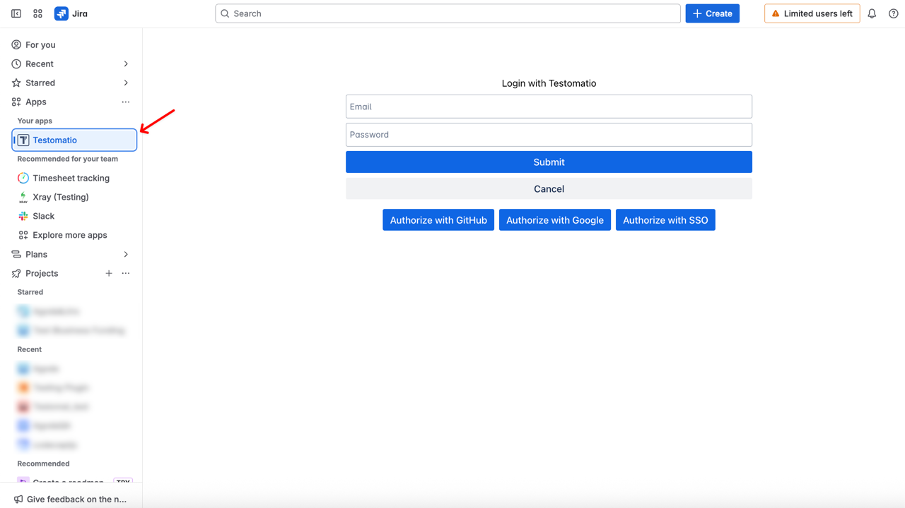
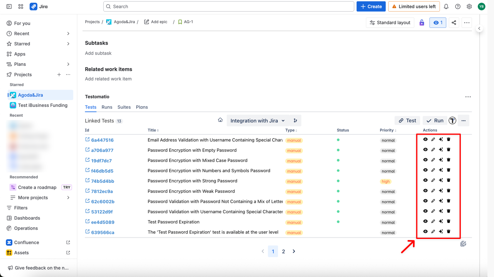

import DirectoryLinks from "/src/components/DirectoryLinks.astro";

<DirectoryLinks directory="advanced/jira-plugin" />

The Testomat.io Jira Plugin enhances your Jira experience by enabling you to manage tests directly inside Jira. With this plugin you can:

- Connect multiple Testomat.io and JIRA projects easily
- Quickly link/unlink tests, suites, and plans to JIRA issues
- View and edit tests directly in JIRA
- Use autocomplete and smart suggestions for creating tests
- Easily modify BDD/Gherkin feature files and scenarios
- Create multiple tests at once from checklists from bulk create
- Run manual and automated tests from JIRA tickets
- Attach test reports to JIRA issues with a click
- Use tracebility matrix and reports to check test coverage in sprints and project
- Manage project branches
- Use AI prompts to generate or improve test descriptions directly in Jira

:::note

Jira Plugin requires an active Jira integration in your Testomat.io project. If Jira is not connected yet, please follow [How to Connect Jira Project](https://docs.testomat.io/integrations/issues-management/jira/#connecting-to-jira-project).

:::

## How to Use Jira Plugin Without Logging in

When you open a Jira issue with linked Testomat.io items **without logging in**, the visibility depends on the type of **Jira connection** used. For full details on connection types and their permissions, see [Jira connection type](https://docs.testomat.io/integrations/issues-management/jira/#jira-connection-types).

**Connected with an administrator's account**

You can still:

- View **tests and suites** linked to the issue

- Browse the **Tests Coverage** screen

**Connected with a regular account**

- only authorized Testomat.io users will be able to see tests and run results in Jira

## How to Log in to Testomat.io from Jira

-To access all Jira Plugin features, you need to log in to Testomat.io. You can log in directly from:

- a Jira issue

- or you can do this from Apps

### Login Options

You can authorize using any of the following methods:

- **Email + Password** — enter your Testomat.io credentials and click **Submit**
- **Authorize with GitHub** — sign in with your GitHub account
- **Authorize with Google** — sign in with your Google account
- **Authorize with SSO** — use your company’s Single Sign-On provider

### What you can do after logging in

Once logged in, you can:

- view linked tests and suites
- edit them directly in Jira
- unlink items when needed
- use AI prompts to enhance test descriptions:
  - Suggest Description – generate a clear and concise description for a test based on its title and similar tests
  - Improve Description – refine the existing description to make it clearer
  - Suggest Better Description – provide an alternative improved description

## JIRA Plugin Permissions and Security

Testomat.io’s JIRA plugin is designed to integrate seamlessly with your JIRA projects, requiring specific permissions to operate effectively. The plugin has **read access** to all issues of an enabled project to display tests that can be attached to any JIRA issue and can **write properties** to save test data into JIRA storage attached to a specific issue. Importantly, Testomat.io **does not perform any update or delete operations** on your JIRA issues, maintaining the integrity of your project data. The plugin accesses several JIRA API endpoints strictly necessary for its functionality, adhering to high standards of data security and integrity. For detailed information on permissions and security, refer to the [JIRA Permissions](https://docs.testomat.io/legal/security/jira) section in our documentation.
