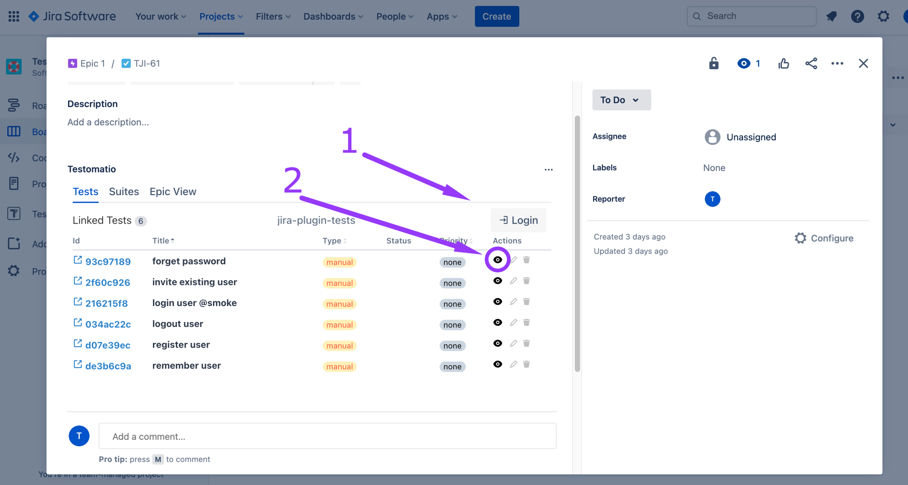
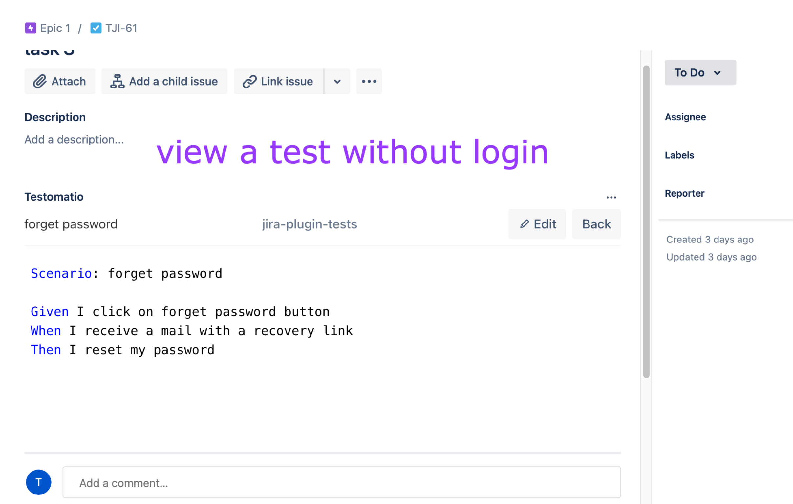
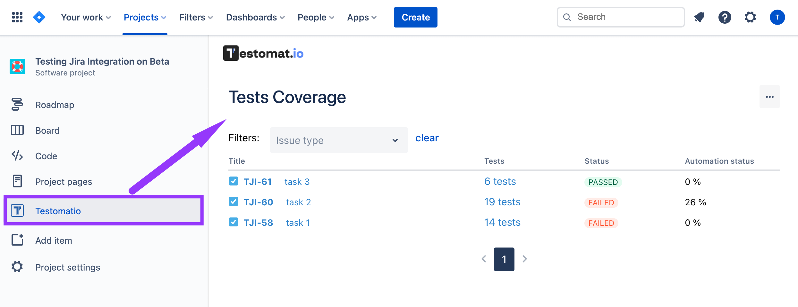
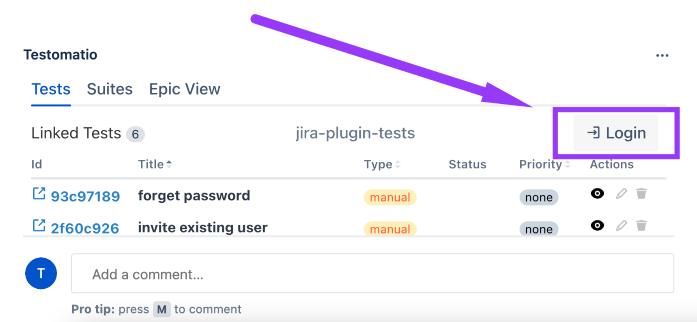
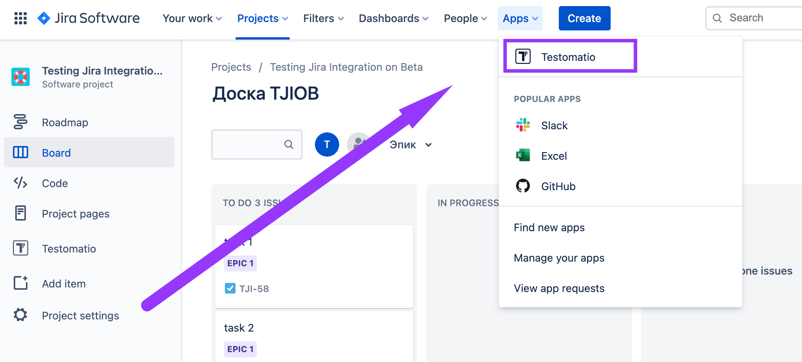
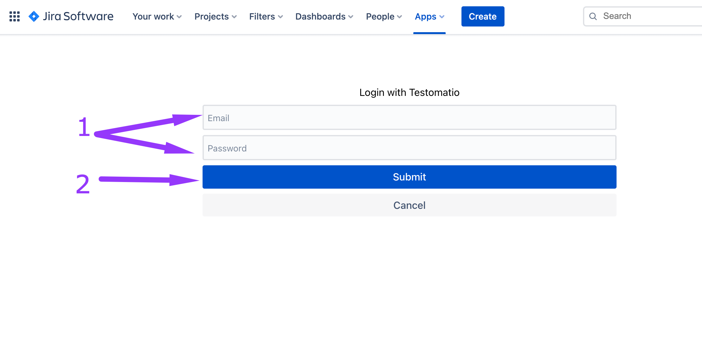

import DirectoryLinks from '/src/components/DirectoryLinks.astro';

<DirectoryLinks directory="advanced/jira-plugin" />

The Testomat.io Jira Plugin enhances your Jira experience, enabling a host of actions to be performed directly and seamlessly from Jira, streamlining your workflow and boosting efficiency.

Namely, you can:

- Connect multiple Testomat.io and JIRA projects easily.
- Quickly link/unlink tests, suites, and plans to JIRA issues.
- View and edit tests directly in JIRA.
- Use autocomplete and smart suggestions for creating tests.
- Easily modify BDD/Gherkin feature files and scenarios.
- Create multiple tests at once from checklists from bulk create 
- Run manual and automated tests from JIRA tickets.
- Attach test reports to JIRA issues with a click.
- Use tracebility matrix and reports to check test coverage in sprints and project.
- Manage project branches.

## Options Without Loggin in Testomatio

When you are not logged in Testomatio (1), you are able to view tests and suites linked to the issue and (2)

Also, you can look through the Test Coverage screen 

## How To Log In

To use more Testomatio Jira Plugin options you need to log in to Testomatio.
This can be done directly from the Jira issue

Or you can do this from Apps

Here you need to (1) enter **your Testomatio** email and password (2) click on Submit button

Now you can view (1), edit (2), and unlink (3) tests and suites.

## JIRA Plugin Permissions and Security

Testomat.io’s JIRA plugin is designed to integrate seamlessly with your JIRA projects, requiring specific permissions to operate effectively. The plugin has **read access** to all issues of an enabled project to display tests that can be attached to any JIRA issue and can **write properties** to save test data into JIRA storage attached to a specific issue. Importantly, Testomat.io **does not perform any update or delete operations** on your JIRA issues, maintaining the integrity of your project data. The plugin accesses several JIRA API endpoints strictly necessary for its functionality, adhering to high standards of data security and integrity. For detailed information on permissions and security, refer to the [JIRA Permissions](https://docs.testomat.io/legal/security/jira) section in our documentation.