**Jira integration in Testomat.io** helps QA teams quickly turn test results into actionable bug reports. This feature eliminates the manual effort of copying failed test data into Jira and ensures full traceability between test execution and defect tracking.

With a few clicks, you can:

- **Create a Jira issue** directly from a failed test or run
- **Link existing Jira issues** to tests or suites
- **Attach contextual details** (test steps, results, environment, and run links) automatically

This integration was designed to improve collaboration between **QA, development, and management teams**, speeding up feedback loops and ensuring visibility across all project stakeholders.

## How to Create a Jira Issue for a Failed Test

To create a JIRA issue for a Failed Test, open a Run with a failed test. Find a test in list, move the cursor over it and click on the **Link to Issue** icon:

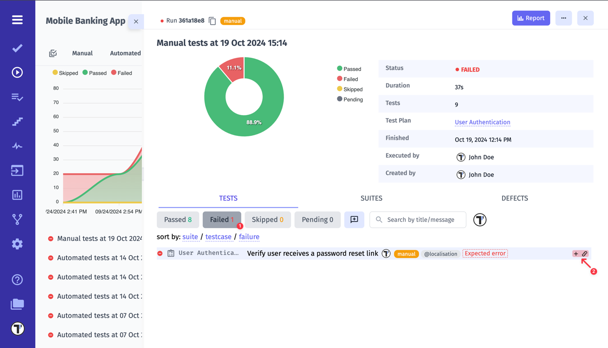

You can link it to an existing issue **(1)** or create a new one **(2)**.

Once you have decided to create an issue in your Jira project, you can select its ticket types **(3)**.

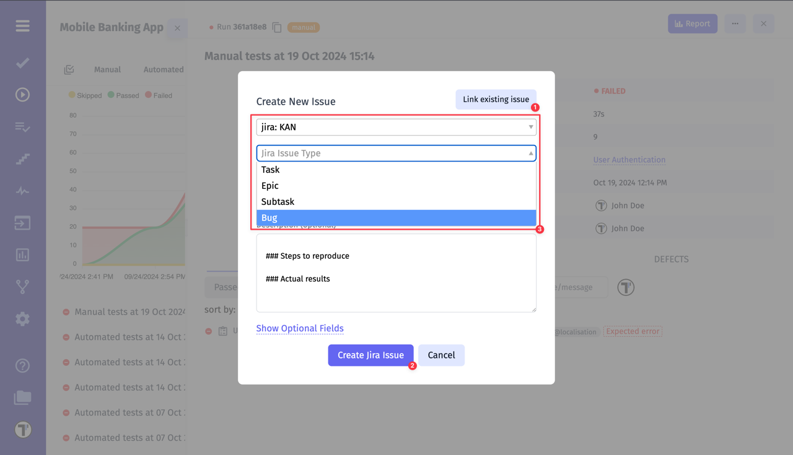

You can even create an issue as a subtask by **specifying a Parent ticket**:

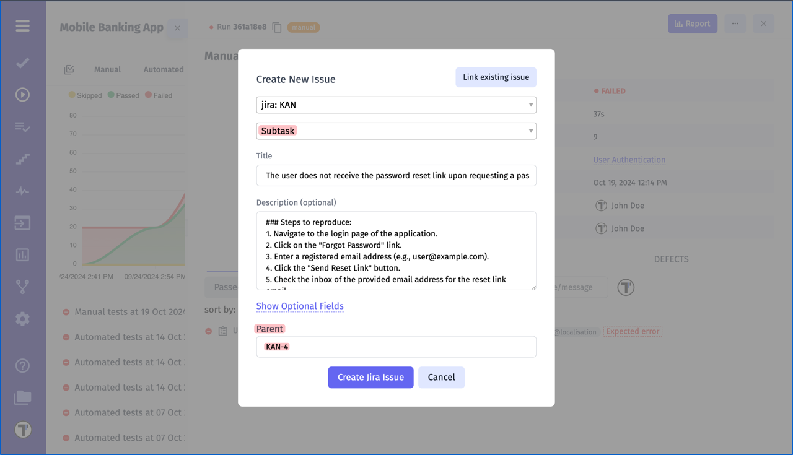

- Once created, the linked issue appears under the test run, indicated by the **issue icon**
- Hovering over the icon shows the **issue title** and **current status**
- Clicking the icon redirects to the issue in Jira
- This icon remains visible both during test execution

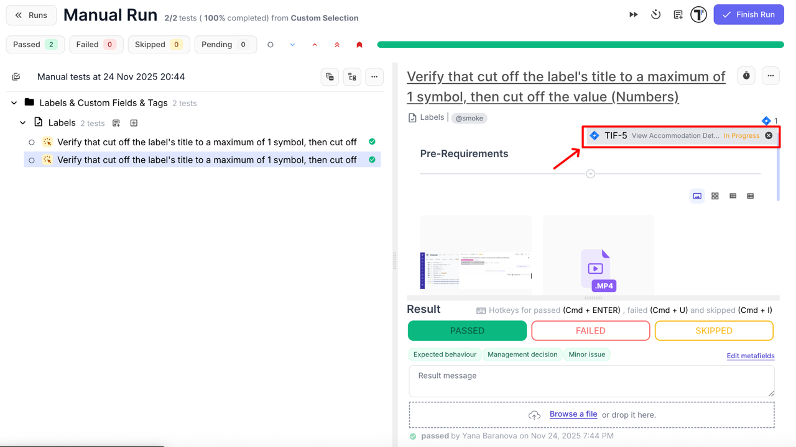

- and after the run is completed, making it easy to track related issues at a glance

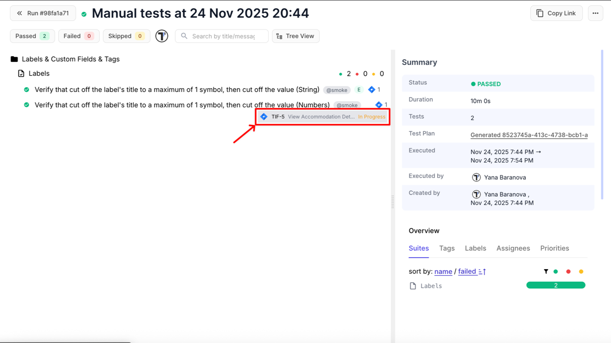

The generated ticket will contain the specified information, as well as information about the test run and a web link to the test run report:

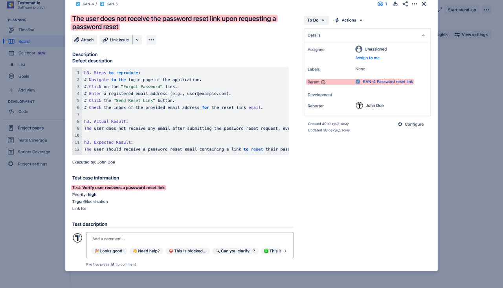

## How to Create a Jira Issue for a Failed Run

To create a JIRA issue for a Failed Manual or Automated Run, open the run and select the **Link to Issue** option from the dots menu:

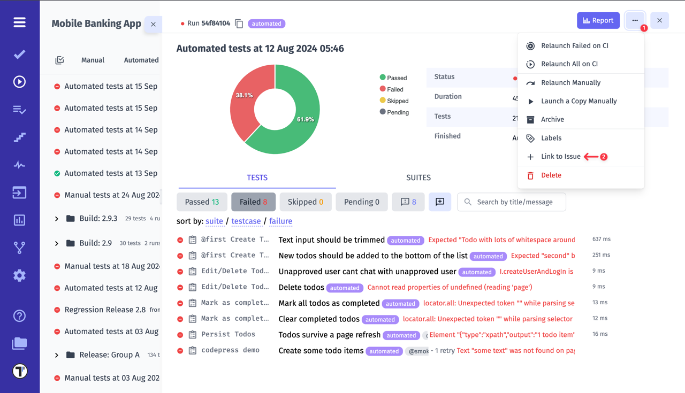

Create a new issue for a run or append to an existing issue.

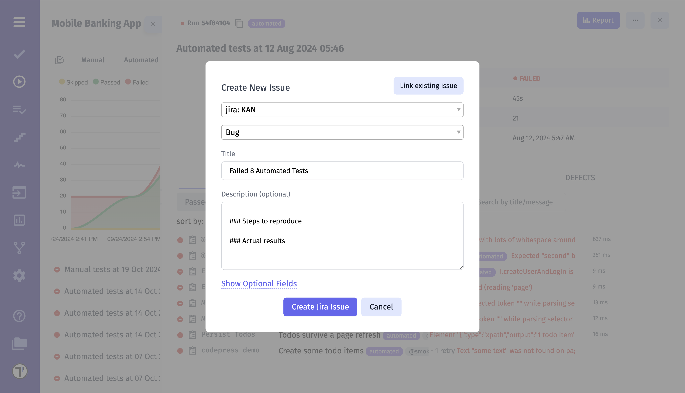

- Once created, the linked issue appears **under the completed run**, indicated by the **issue icon** in the run’s sidebar
- Hovering over the icon displays the **issue title** and **current status**
- Clicking the icon redirects directly to the issue in the Jira project

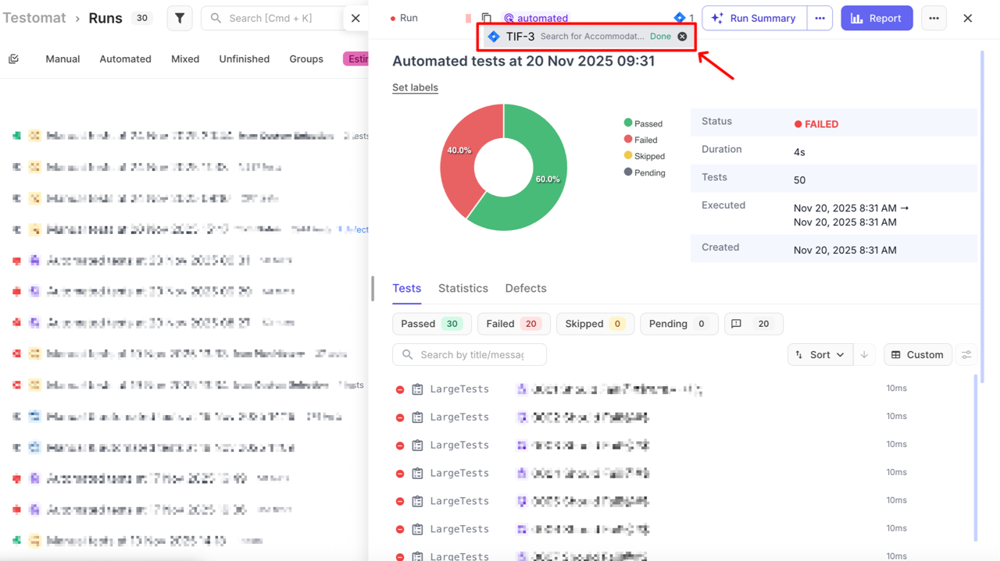

## How to Link a Test to a Jira Issue

You can easily connect any individual **test** in Testomat.io to an existing or new Jira issue. This allows quick traceability between your test cases and related Jira tickets.

1. Navigate to the **Tests** page in your Testomat.io project
2. Open the test you want to link
3. Click the **extra menu (⋯)** button in the top-right corner
4. Select **Link to Issue**

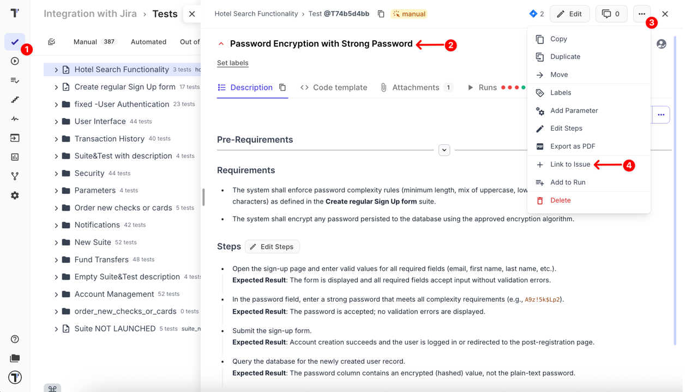

Once the **Link to Issue** modal window appears:

5. To **link to an existing Jira issue**, paste or enter the issue key and click **Link Issue**
6. To **create a new Jira issue**, click **Create new issue**

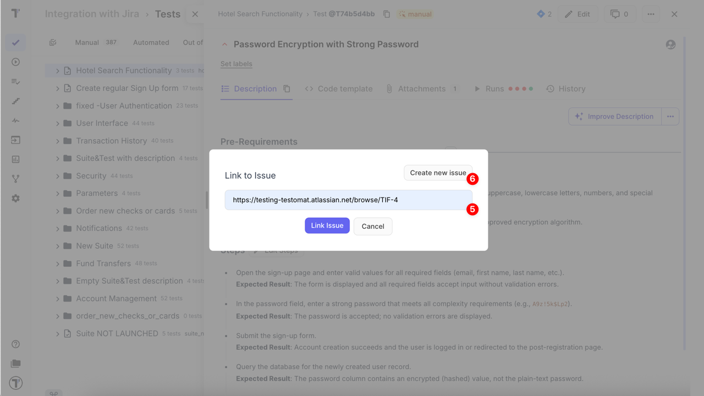

7. Select your **Jira profile** (see details: [Connecting Jira Integration](https://docs.testomat.io/integrations/issues-management/jira/)).
8. Choose the **Issue Type** from the dropdown (e.g., Bug, Task, Sub-task)
9. Add a **Title**
10. Optionally, include a **Description** to provide test context
11. Fill in any **Jira fields** available in your configuration.

Testomat.io automatically displays all supported fields — such as **Parent**, **Components**, **Fix versions**, **Priority**, **Labels**, or other custom fields defined in your Jira project.

These may appear immediately or after clicking **Show Optional Fields**, depending on your project setup.

:::note

The available fields depend on your Jira project configuration. To see all supported field types in Testomat.io, refer to [Supported Jira Field Types](https://docs.testomat.io/integrations/issues-management/jira/#supported-jira-field-types).

:::

12. Once all required information is filled in, click **Create Jira Issue** to finish linking.

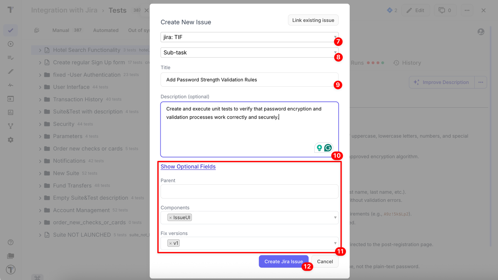

The linked issue appears under the test, indicated by the **issue icon**, which redirects to the issue in the Jira project. In addition, Testomat.io also displays the linked Jira issue’s **title** and **status**, making it easier to recognize the issue at a glance.

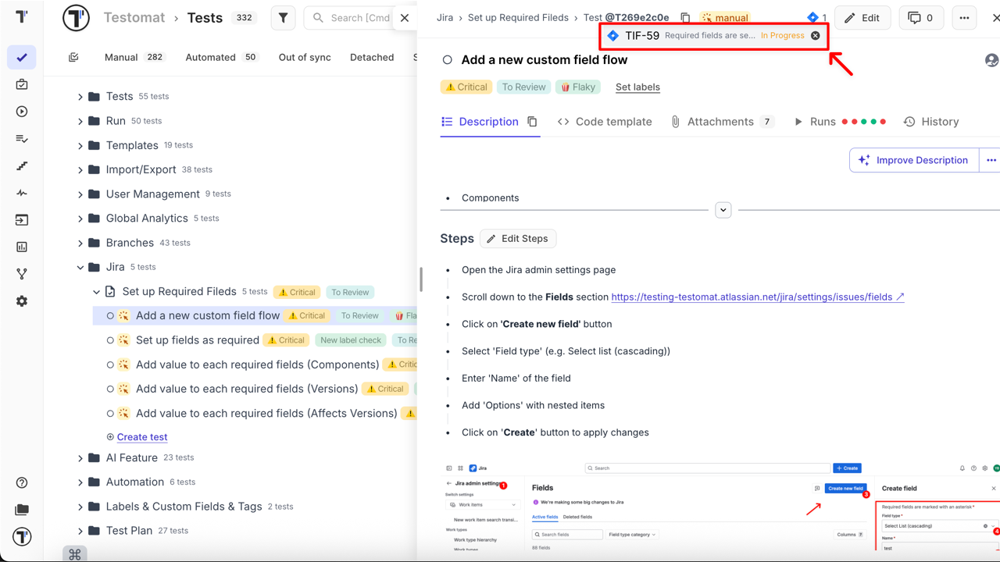

:::note

You can link a test to multiple issues. In this case their IDs will be displayed in test view in Testomatio.

:::

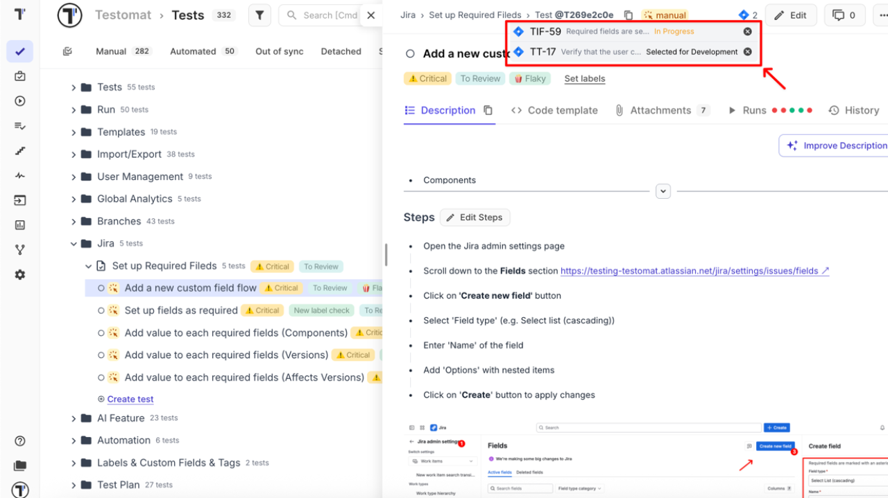

## How to Link a Suite to a Jira Issue

Linking a suite to a Jira issue works similarly to linking an individual test, with one key difference: **all tests within the suite will automatically be linked to the Jira issue.**

:::note

Linking is available only at the **suite level**. You cannot link a Jira issue to a folder, and the **Link to Issue** button does not appear on folder level.

:::

1. Navigate to the **Tests** page in your Testomat.io project
2. Open the suite you want to link
3. Click the **extra menu (⋯)** button in the top-right corner
4. Select **Link to Issue**

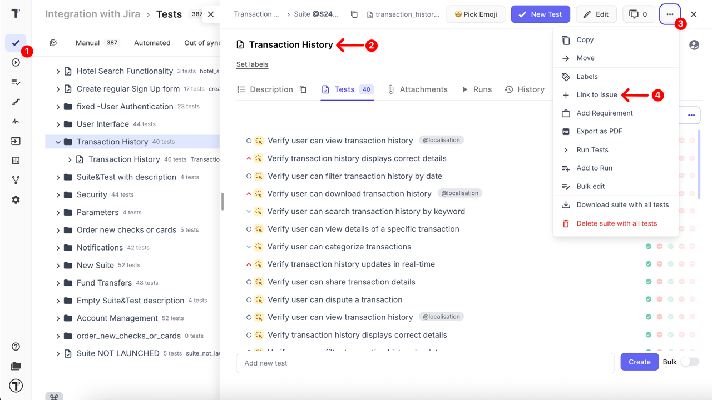

Follow the same steps above as linking a single test: link an existing issue or create a new one, select issue type, fill required fields, and click Create Jira Issue.

When a suite is linked, both the suite and all its tests will display the linked Jira issue icon along with its title and status, providing immediate context.

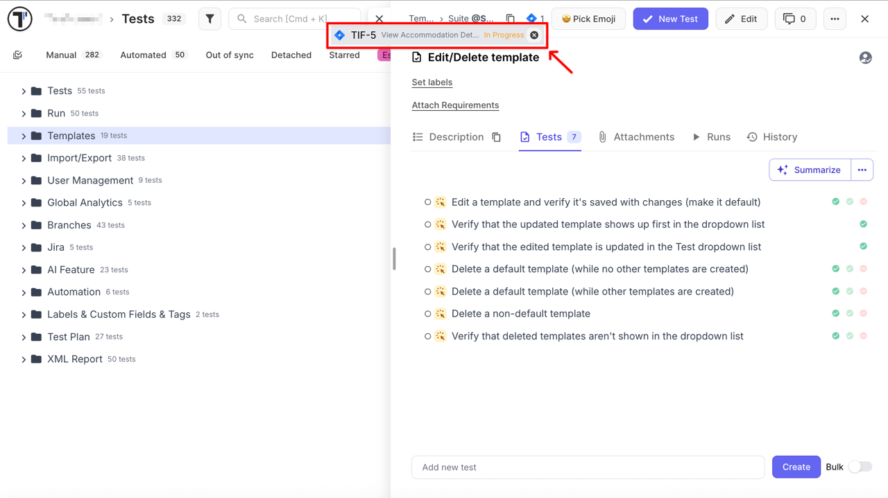

:::note

If you unlink a suite from a Jira issue, all its linked tests will be unlinked automatically.

:::
