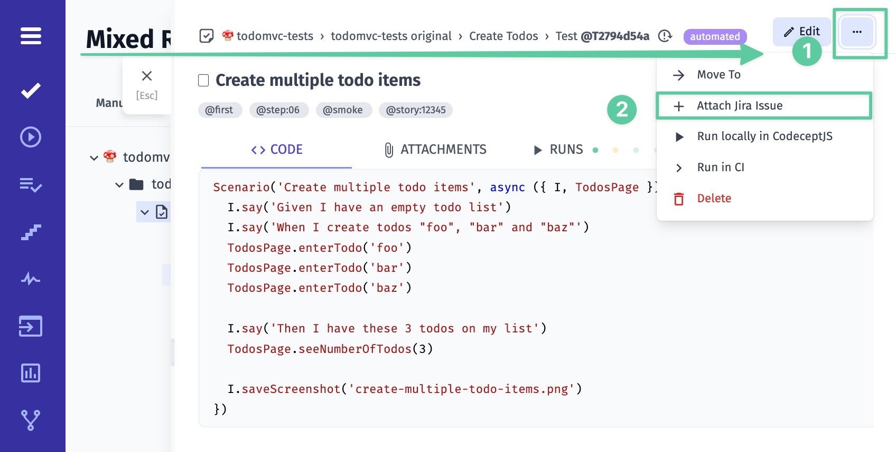
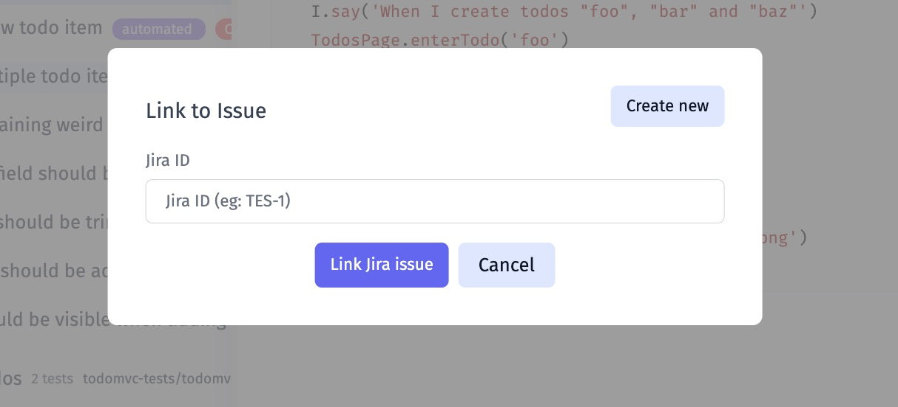
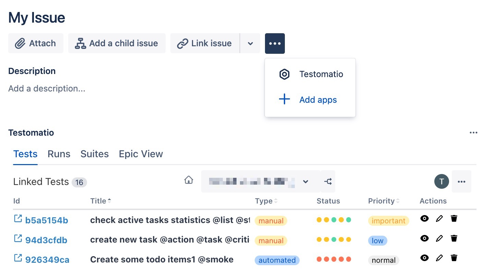
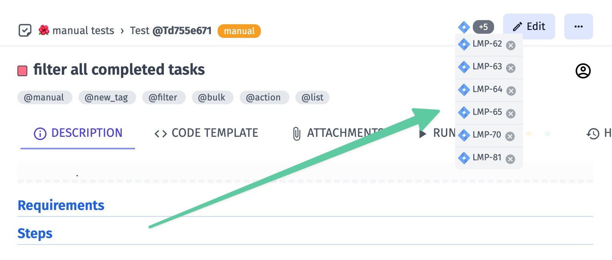
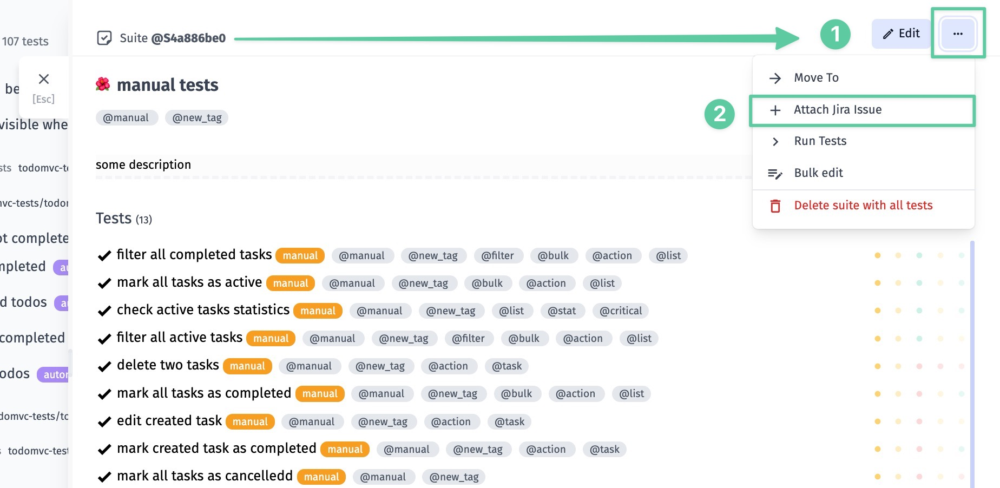
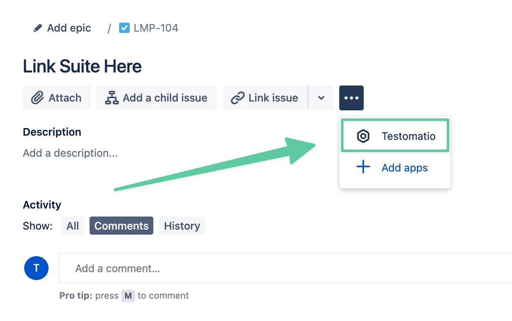
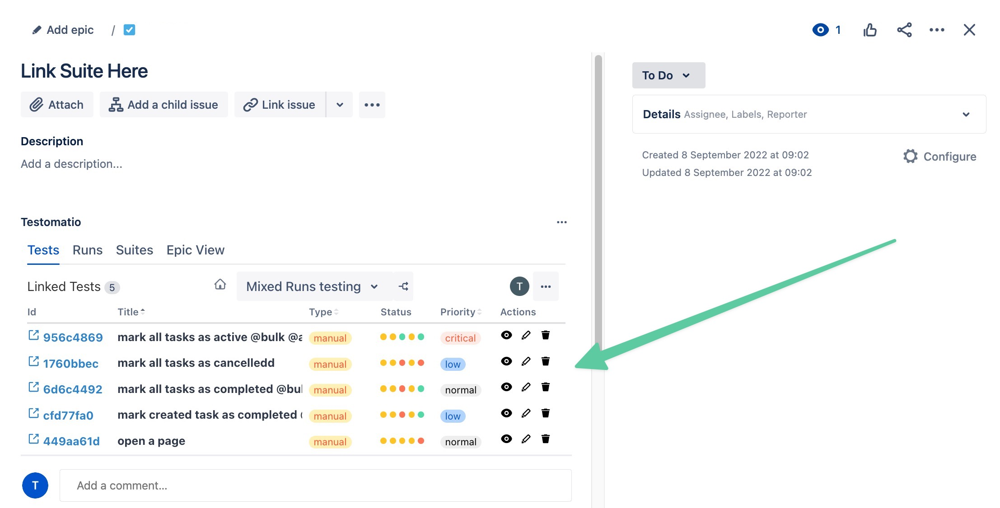

Testomat.io makes it incredibly convenient to create issues for Jira directly from your Runs. With just a few clicks, you can instantly log detailed bug reports, complete with test context and steps to reproduce. 

## Creating Issue For Failed Test

To create a JIRA issue for a Failed Test,  open a Run with a failed test. Find a test in list, move the cursor over it and click on the **Link to Issue** icon:

You can link it to an existing issue **(1)** or create a new one **(2)**.

Once you have decided to create an issue in your Jira project, you can select its ticket types **(3)**.

You can even create an issue as a subtask by **specifying a Parent ticket**:

The generated ticket will contain the specified information, as well as information about the test run and a web link to the test run report:

### Creating Issue For Failed Run

To create a JIRA issue for a Failed Manual or Automated Run, open the run and select the **Link to Issue** option from the dots menu:

Create a new issue for a run or append to an existing issue.

## Linking Test to JIRA Issue

To link a test to an issue, open a test in a Testomatio project that previously was connected to JIRA project. Select "Attach Jira Issue" in the dots menu.

When attaching a test to an issue you can either link to an existing issue or create a new one.

This test will be displayed in Jira under the Issue view:

Please note, that you can link a test to multiple issues. In this case their IDs will be displayed in test view in Testomatio:

## Linking Suite to JIRA Issue

A suite can be attached to a JIRA issue similarly to a test. When attaching a suite, **all tests inside that suite will be linked to a JIRA issue** (this doesn't include tests from sub-suites). 

If your tests from the linked Suite are not shown in the Jira issue, click on the menu-button and on "Testomatio"

Now tests from added Suite are shown in the Jira issue:

If you unlink an issue from a suite, all tests of this suite will be unlinked as well.