With the **Testomat.io plugin in Jira**, your team can efficiently execute and manage test runs directly from Jira. Launch manual, automated, or mixed tests, configure environments and assignees, group related runs, and get a clear overview of all test executions with their current statuses. This integration keeps QA, development, and management aligned, providing full visibility into testing workflows without leaving Jira.

This page explains how to:

- Launch **Manual**, **Mixed**, or **Automated in CI/CD** runs from Jira issues or linked test plans
- Configure **Advanced Settings** such as environment, assignee (email), RunGroup, CI profiles, and custom parameters
- Track execution progress and view the current status of each run directly in Jira
- Receive **Report Notifications** in Jira for failed test runs, with automatically created issues containing detailed run results and optional public report links

## Run Flow

Testomat.io supports three types of test executions **directly in Jira**:

- **Manual Run** - execute tests manually
- **Automated Run (CI/CD)** - execute automated tests via connected CI service
- **Mixed Run** - run a combination of manual and automated tests in a single execution

Choose the type of run that fits your workflow and follow the detailed steps below to execute tests directly in Jira.

### How to Launch a Manual Run

Use Manual Run in Jira to execute tests step-by-step directly from the Jira issue. Ideal for fully manual test cases, exploratory testing, or verifying features not yet automated. You can launch a Manual Run in Jira in three different ways:

**Option 1** – From the '...' Menu on the **Tests** Tab

1. Navigate to the **Tests** tab
2. Click the '...' (extra menu) button on the **Tests** tab
3. Select **Schedule Run** from the dropdown list

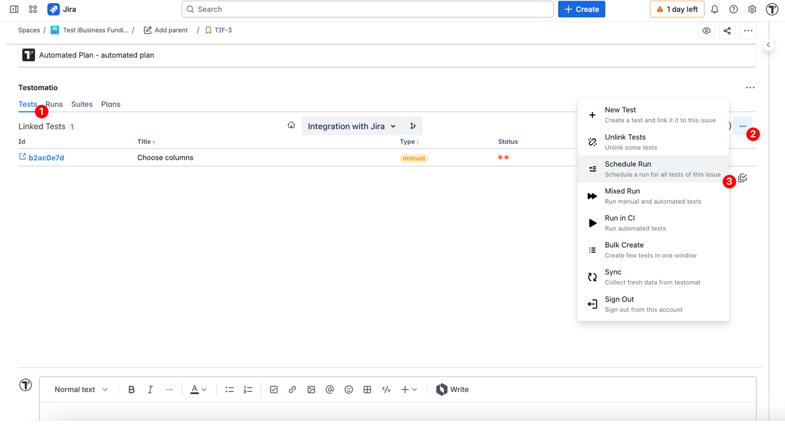

4. In the **'Select tests to run'** dialog, choose the tests you want to include
5. (Optional) Enable **Run as Checklist** toggle - if enabled, marks tests to be executed as checklist
6. (Optional) Enable **Run Automated as Manual** toggle - if enabled, allows automated tests to be executed manually

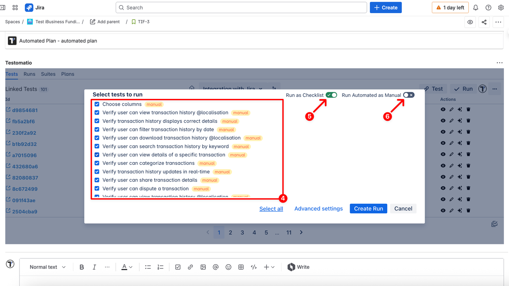

7. (Optional) Open the **Advanced settings** to select:

- **Environment** – select where the tests will run (e.g., macOS, Chrome, staging, production)
- **Assign user** – select the **email of the user added to the project** who is responsible for this run
- **RunGroup** – optional grouping of related runs for easier tracking and reporting
- **Title** - provide a descriptive title for the run

8. Click **'Create Run'** to start execution

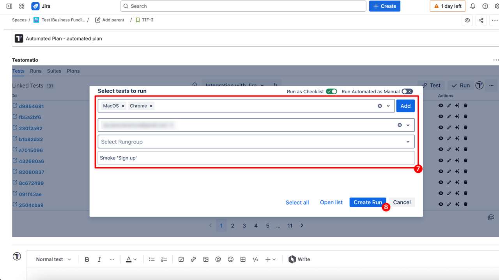

9. Mark all tests with specific status (e.g., ✔ passed / ✖ failed / ➖ skipped)
10. Click the **Finish Run** button

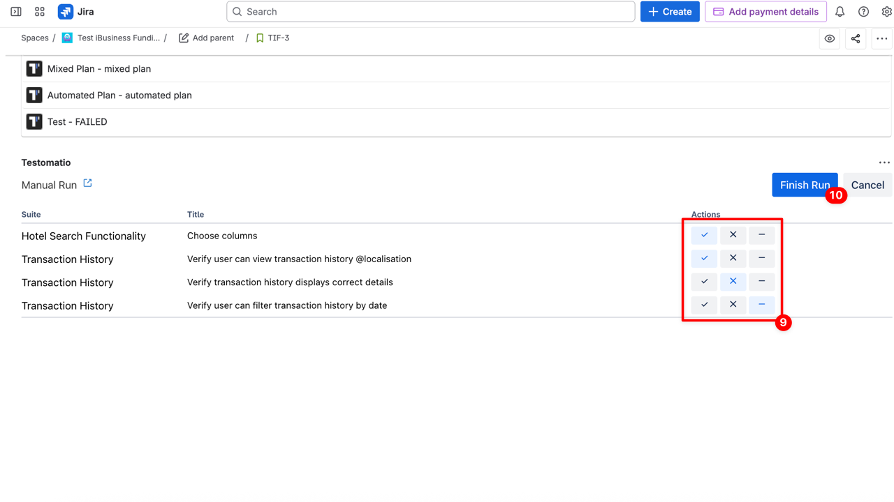

**Option 2** – Using the 'Run' Button on the **Tests** Tab

1. Navigate to the **Tests** tab
2. Click the '✔ Run' button
3. In the **'Select tests to run'** dialog, choose the tests you want to include
4. (Optional) Enable **Run as Checklist** toggle - if enabled, marks tests to be executed as checklist
5. (Optional) Enable **Run Automated as Manual** toggle - if enabled, allows automated tests to be executed manually

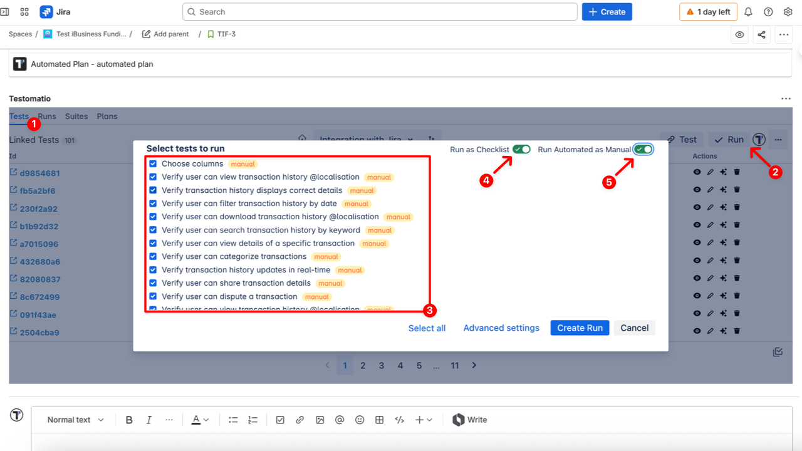

6. (Optional) Use **Advanced settings** to select:

- **Environment** – select where the tests will run (e.g., macOS, Chrome, staging, production)
- **Assign user** – select the **email of the user added to the project** who is responsible for this run
- **RunGroup** – optional grouping of related runs for easier tracking and reporting
- **Title** - provide a descriptive title for the run

7. Click **'Create Run'** to start execution

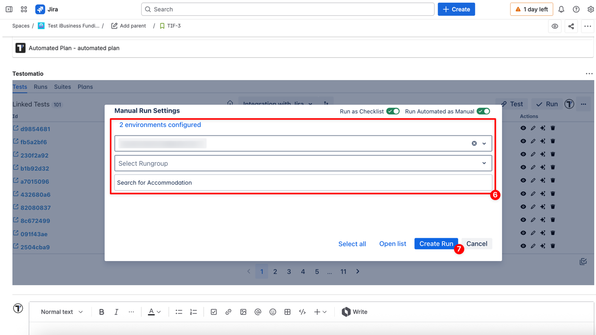

8. Mark all tests with specific status (e.g., ✔ passed / ✖ failed / ➖ skipped)
9. Click the **Finish Run** button

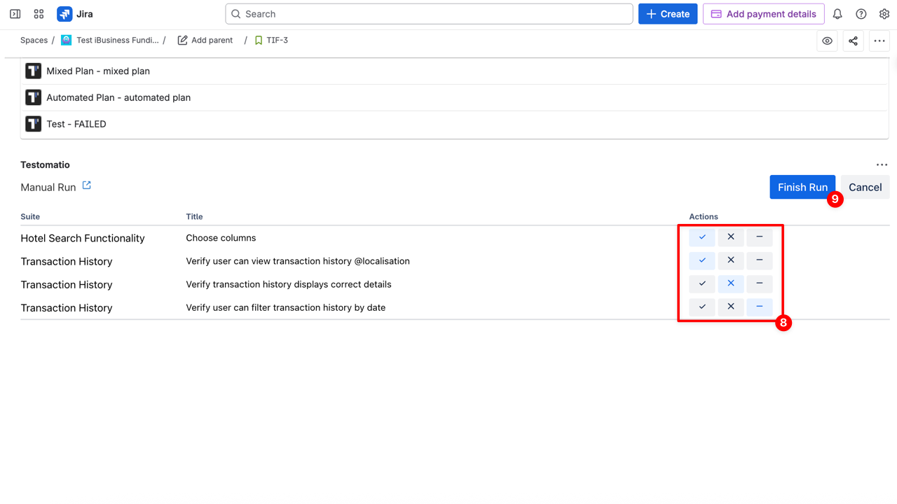

**Option 3** – From the **'Plans'** Tab

1. Navigate to the **Plans** tab in the Jira issue
2. Click the **▶︎ icon** (Launch a plan) next to the linked Plan to quickly start a run
3. or click the **⚙︎ icon** (Launch with advanced options) to configure **Advanced Settings**

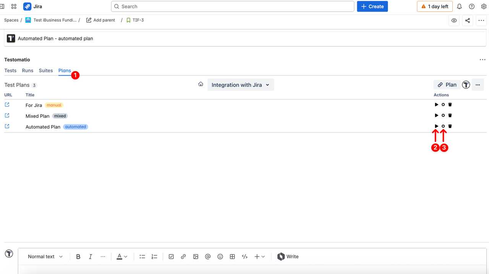

Once the **Manual Run Settings** window opens (this appears only if you clicked the **⚙︎ icon**):

4. (Optional) Enable **Run as Checklist** toggle - if enabled, marks tests to be executed as checklist
5. (Optional) Enable **Run Automated as Manual** toggle - if enabled, allows automated tests to be executed manually

:::note

**Run Automated as Manual** option is disabled if the selected Plan contains only manual tests.

:::

6. Configure **Advanced Settings**

- **Environment** – select where the tests will run (e.g., macOS, Chrome, staging, production)
- **Assign user** – select the **email of the user added to the project** who is responsible for this run
- **RunGroup** – optional grouping of related runs for easier tracking and reporting
- **Title** - provide a descriptive title for the run

7. Click **'Create Run'** to start execution

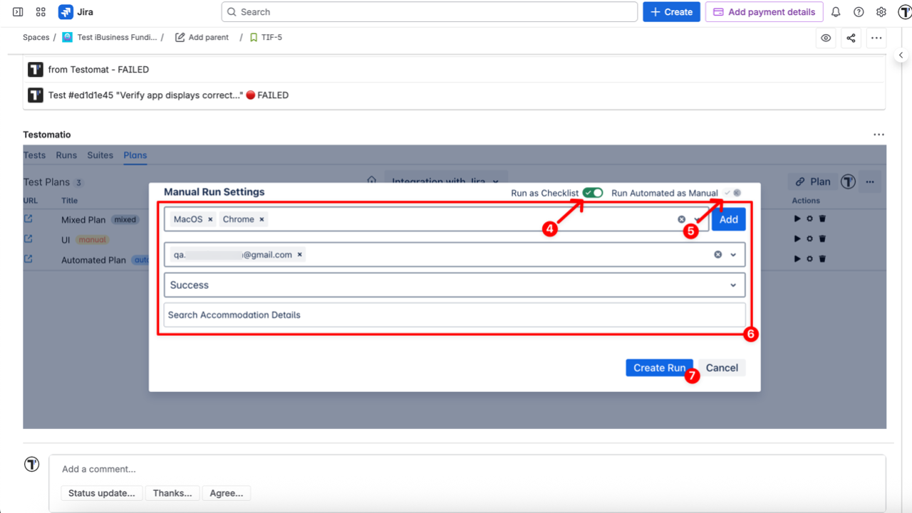

8. Mark all tests with specific status (e.g., ✔ passed / ✖ failed / ➖ skipped)
9. Click the **Finish Run** button

### How to Launch an Automated Run (CI/CD)

Use Automated Run in Jira to trigger tests automatically via a connected CI/CD service without leaving your Jira issue. Ideal for running regression suites, nightly builds, or executing fully automated test cases directly from the Jira interface.

**Option 1** – From the '...' menu on the **Tests** Tab

1. Click the '...' (extra menu) button on the **Tests** tab
2. Select **Run in CI** from the dropdown list

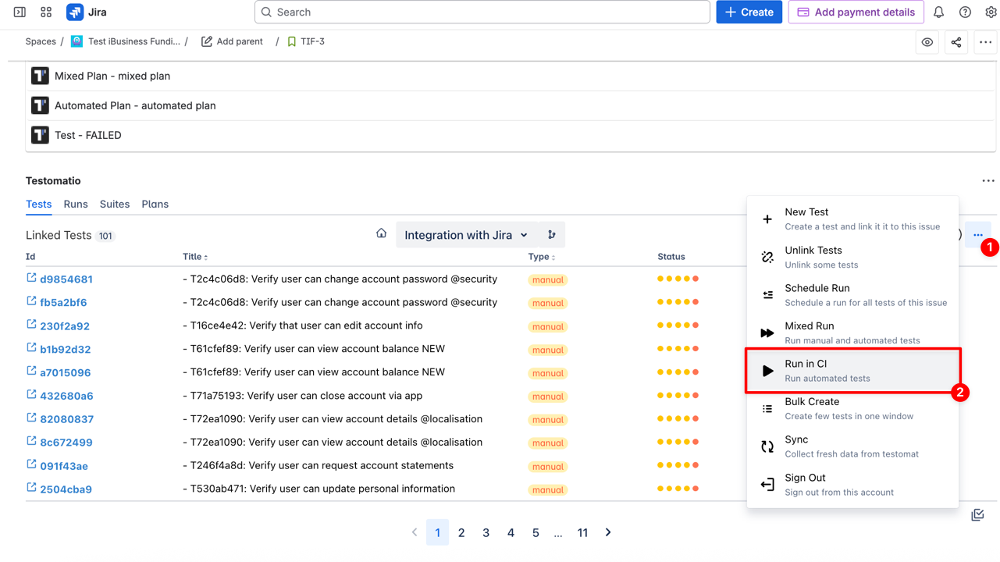

:::note

If your CI service is not connected, you will see the message: 'Continuous Integration service is not enabled. Connect a CI service to run automated tests from the Testomat.io Jira Plugin.' To enable CI runs, connect your preferred [CI/CD service](https://docs.testomat.io/integrations/continuous-integration/) in your Testomat.io project settings.

:::

3. Add specific tests to run by selecting one by one or **Select all** option

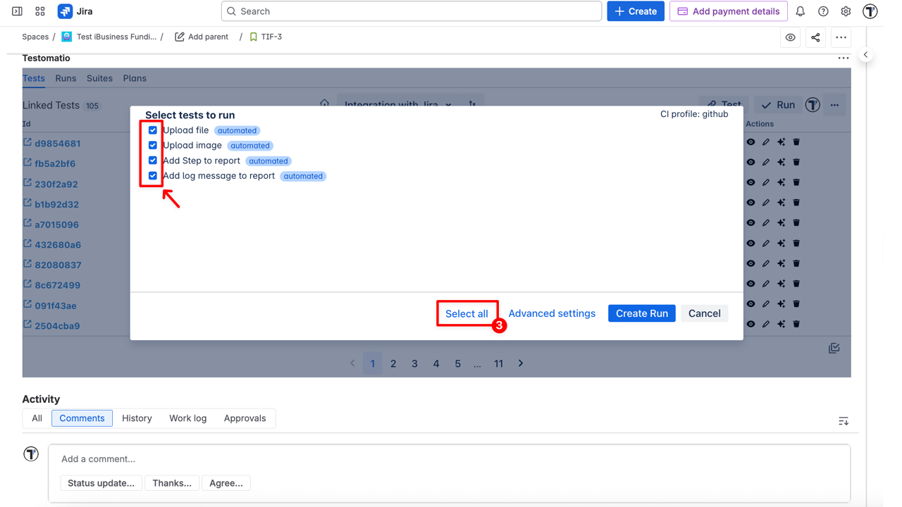

4. (Optional) Open the **Advanced settings** to select:

- **Title** - provide a title for the run
- **CI profile** – select the CI configuration profile for automated test execution
- **Enter config** – specify custom environment variables (e.g. `ref=main`)
- **Environment** – select where the tests will run (e.g., macOS, Chrome, staging, production)
- **Assign user** - select the **email of the user added to the project** who is responsible for this run
- **RunGroup** - optional grouping of related runs for easier tracking and reporting

5. Click **'Create Run'** to start execution

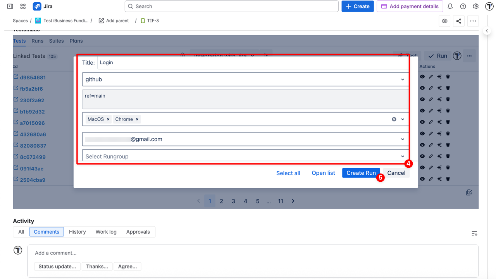

**Option 2** – From the **'Plans'** Tab

1. Navigate to the **Plans** tab in the Jira issue
2. Click the **▶︎ icon** (Launch a plan) next to the linked Plan **(recommended)** in CI
3. or click the **⚙︎ icon** (Launch with advanced options)

4. Once the **Run settings** window opens (this appears only if you clicked the **▶︎ icon**), select:

- **Title** - provide a title for the run
- **CI profile** – select the CI configuration profile for automated test execution
- **Enter config** – specify custom environment variables (e.g. `ref=main`)
- **Environment** – select where the tests will run (e.g., macOS, Chrome, staging, production)
- **Assign user** – select the **email of the user added to the project** who is responsible for this run
- **RunGroup** - optional grouping of related runs for easier tracking and reporting

5. Click **'Create Run'** to start execution

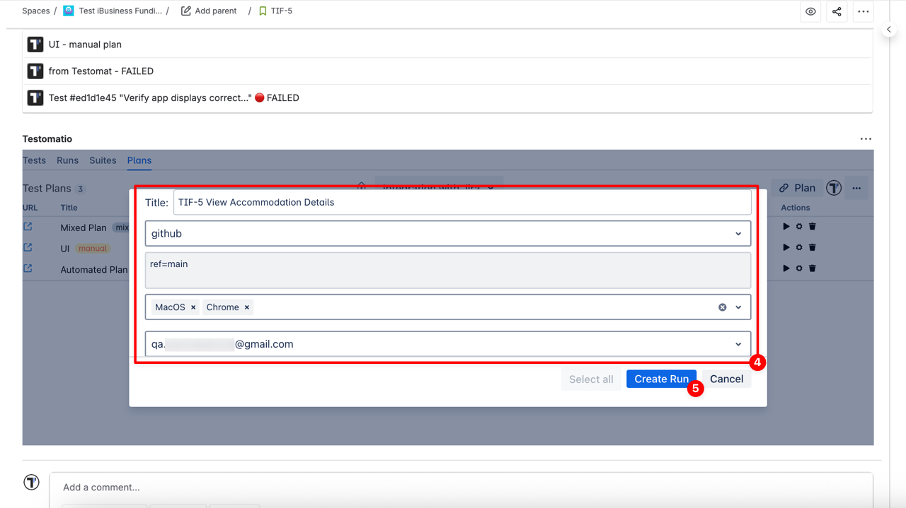

6. Once the automated run is created, it appears in the **Runs** tab with the **Pending** status

- The test results will update automatically when your CI job completes — showing the final status
- No manual action is required in Jira

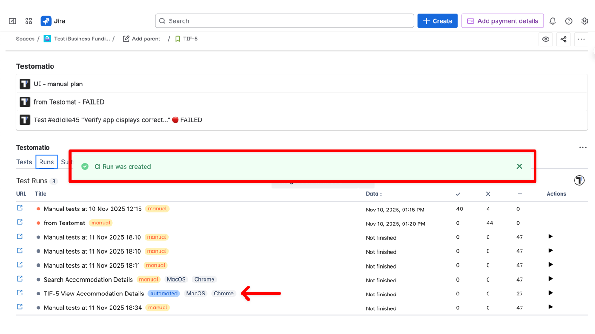

### How to Launch a Mixed Run

Use Mixed Run in Jira to execute both manual and automated tests in a single run directly from the Jira issue. Ideal when part of the test suite is automated, but some tests still require manual verification. You can launch a Mixed Run in Jira in two different ways:

**Option 1** – From the '...' Menu on the **Tests** Tab

1. Click the '...' (extra menu) button on the **Tests** tab
2. Select **Mixed Run** from the dropdown list

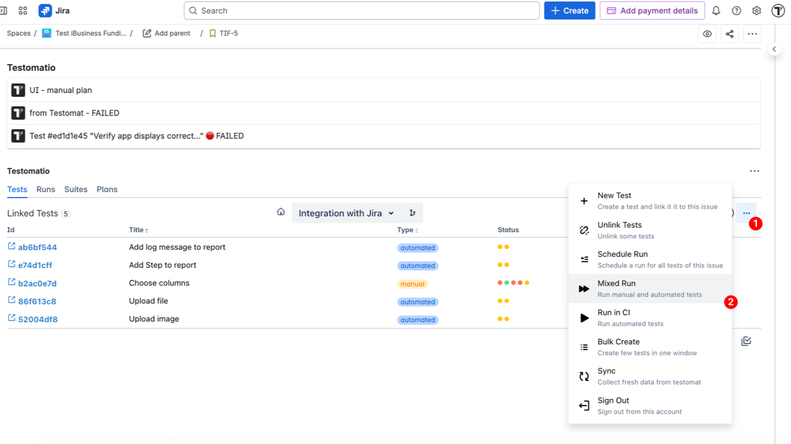

:::note

If your CI service is not connected, you will see the message: 'Continuous Integration service is not enabled. Connect a CI service to run automated tests from the Testomat.io Jira Plugin.' To enable CI runs, connect your preferred [CI/CD service](https://docs.testomat.io/integrations/continuous-integration/) in your Testomat.io project settings.

:::

3. In the **'Select tests to run'** dialog, choose the tests you want to include

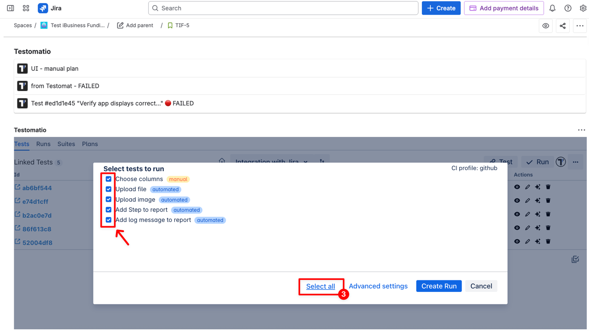

4. Configure **Advanced Settings**:

- **Title** - provide a title for the run
- **CI profile** – select the CI configuration profile for automated test execution
- **Enter config** – specify custom environment variables (e.g. `ref=main`)
- **Environment** – select where the tests will run (e.g., macOS, Chrome, staging, production)
- **Assign user** - select the **email of the user added to the project** who is responsible for this run
- **RunGroup** - optional grouping of related runs for easier tracking and reporting

5. Click **'Create Run'** to start execution

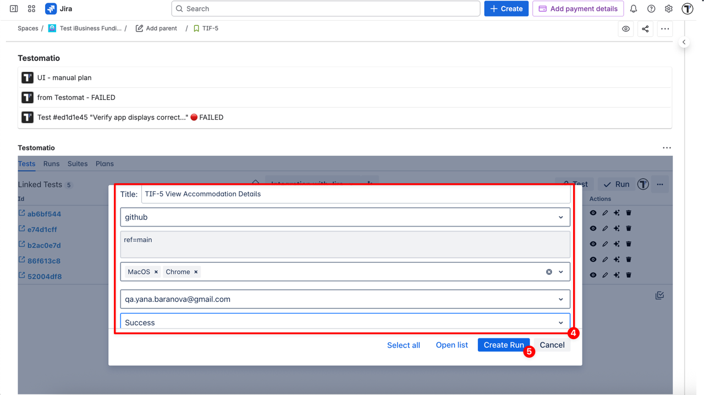

Once the mixed run starts:

6.  **Automated tests** are sent to your connected **CI service** for execution. Their results will update automatically in Jira once the CI job completes.
7.  **Manual tests** can be executed directly inside Jira — mark each test with its result (e.g., ✔ passed / ✖ failed / ➖ skipped)
8.  Click the **Finish Run** button to close the run

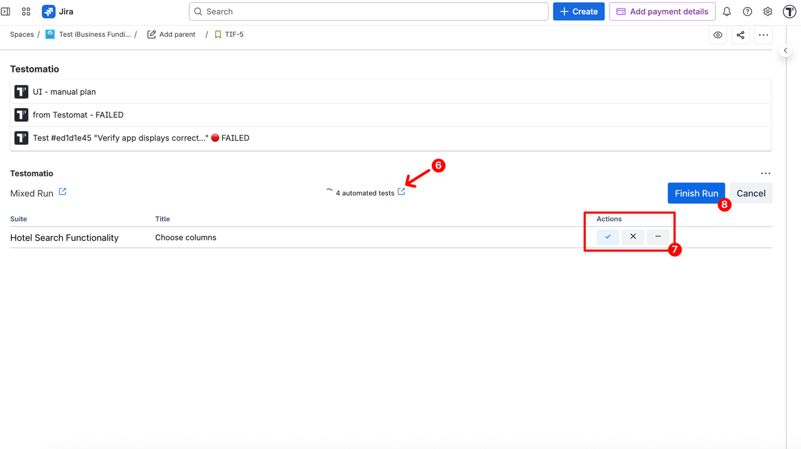

**Option 2** – From the **'Plans'** Tab

1. Navigate to the **Plans** tab in the Jira issue
2. Click the **▶︎ icon** (Launch a plan) next to the linked Plan
3. or click the **⚙︎ icon** (Launch with advanced options)

4. Once the **Run settings** window opens (this appears only if you clicked the **▶︎ icon**), select:

- **Title** - provide a title for the run
- **CI profile** – select the CI configuration profile for automated test execution
- **Enter config** – specify custom environment variables (e.g. `ref=main`)
- **Environment** – select where the tests will run (e.g., macOS, Chrome, staging, production)
- **Assign user** – select the **email of the user added to the project** who is responsible for this run
- **RunGroup** - optional grouping of related runs for easier tracking and reporting

5. Click **'Create Run'** to start execution

6.  **Automated tests** are sent to your connected **CI service** for execution. Their results will update automatically in Jira once the CI job completes.
7.  **Manual tests** can be executed directly inside Jira — mark each test with its result (e.g., ✔ passed / ✖ failed / ➖ skipped)
8.  Click the **Finish Run** button to close the run

## Run Reports in Jira

Once a run is completed, it automatically appears in **Testomat.io** and in the **Runs** tab within Jira. In this tab, you can view all runs that were **launched in Jira** or **linked in Testomat.io project**, and quickly access key information about each run.

- **External link (URL)** – opens the detailed report in Testomat.io
- **Status icon** – shows the color of the run’s status (Passed / Failed / Skipped)
- **Title** – the title provided for the run
- **Run type** – a badge indicating the type of run (e.g., manual / automated / mixed)
- **Environment** – selected environments for the run (e.g., macOS, Chrome, staging)
- **Execution date** – date the run was completed (or **Not finished**)
- **Test statuses** – number of tests with each status (e.g., ✔ Passed / ✖ Failed / ➖ Skipped)
- **Actions** – **▶︎ icon** appears if the run is not yet completed

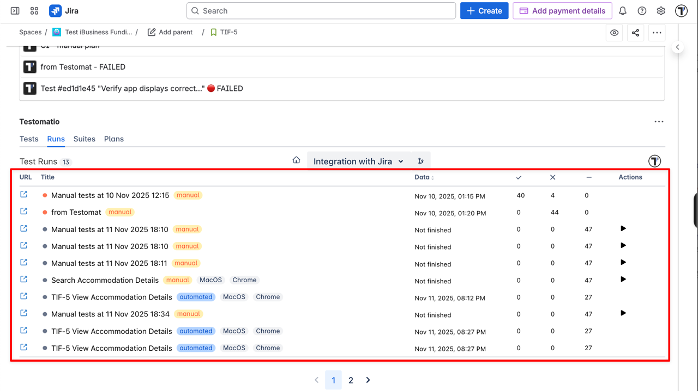

For full report options (filters, exports, comparisons, etc.), you can **open the Run Reports in Testomat.io**, or to learn more, visit the [Run Reports documentation](https://docs.testomat.io/project/runs/reports/).

### Receive Reports in Jira

You can receive a summary report directly inside Jira by enabling **Report Notifications** in your Testomat.io project settings. This integration automatically posts key information about each test run into your Jira project, including:

- Run ID and Status
- Project name
- Number of Executed Tests
- Execution Date and Duration
- Failed Tests
- Environment
- Link to Full Report

This summary allows you to quickly see the key results of each run directly in Jira, while full details remain accessible via the Testomat.io report link.

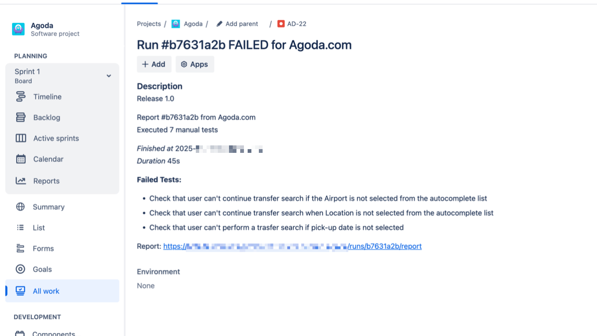

Learn how to set it up in [Report Notifications in Jira.](https://docs.testomat.io/integrations/report-notifications/jira/)

## Tests Coverage

The Tests Coverage screen provides a traceability matrix showing all Jira issues with their linked
  tests. For each issue you can see:

  - Title — Jira issue key and name
  - Tests — number of linked tests
  - Status — current test run status (e.g., Failed, Passed)
  - Automation status — percentage of automated tests among linked ones

This gives the team a quick overview of which requirements are covered, how many tests back each issue, and how far automation has progressed per story.

To open the Tests Coverage screen:

1. Open the specific space
2. Click the 'More' option
3. Select the 'Tests Coverage' tab

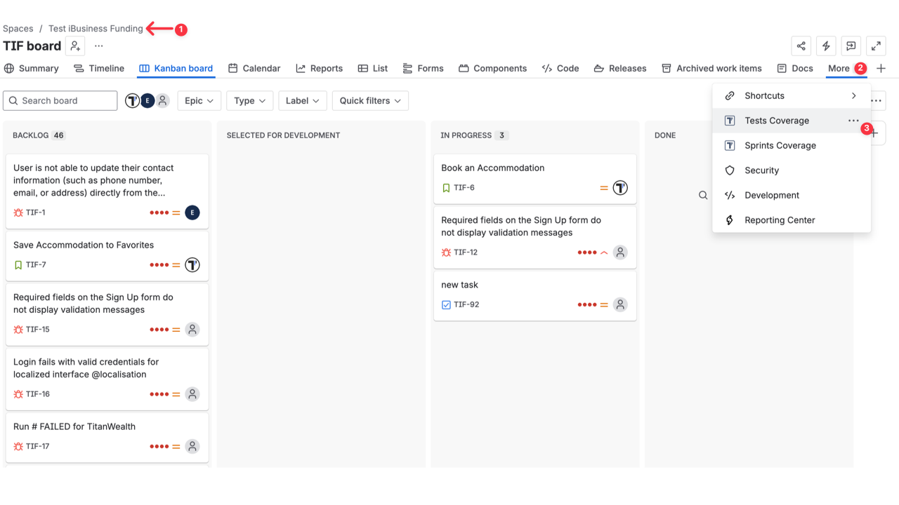

The automation percentage reflects how many of the linked tests are automated — from 0% (all manual) to 100% (fully automated). Issues with no linked tests signal coverage gaps that need attention.

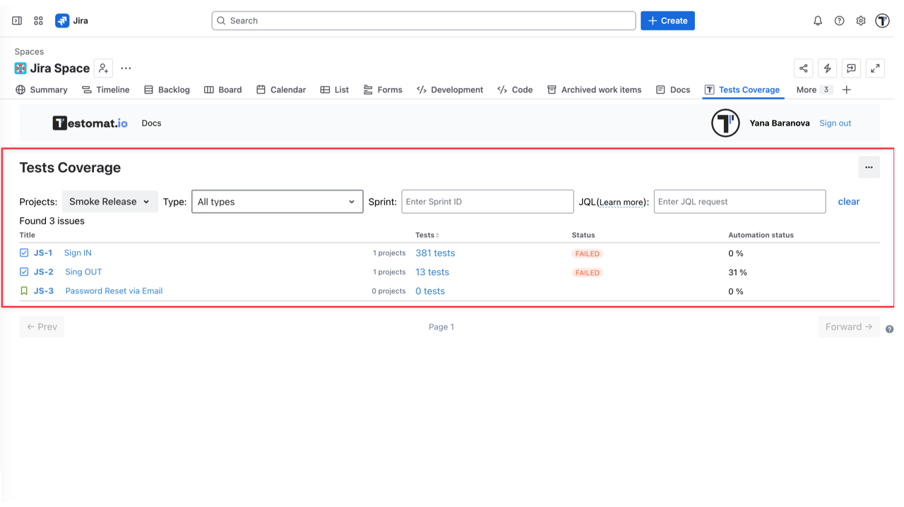

## Sprint Coverage

The Sprint Coverage tab gives a high-level summary of test execution health across a sprint. Use it to understand how well a sprint is covered with tests and how the execution is progressing — without leaving Jira.

For each sprint it shows:

- Issues with tests / Issues without tests — how many sprint issues have linked tests and how many are left uncovered
- Manual tests / Automated tests — breakdown of test types across the sprint
- Passed / Failed / Skipped / Pending / Not executed — full execution status breakdown

This makes it easy to spot coverage gaps, track automation progress, and assess sprint readiness at a glance.

To check test coverage for a sprint:

1. Open the specific space
2. Click the 'More' option
3. Select the 'Sprints Coverage' tab

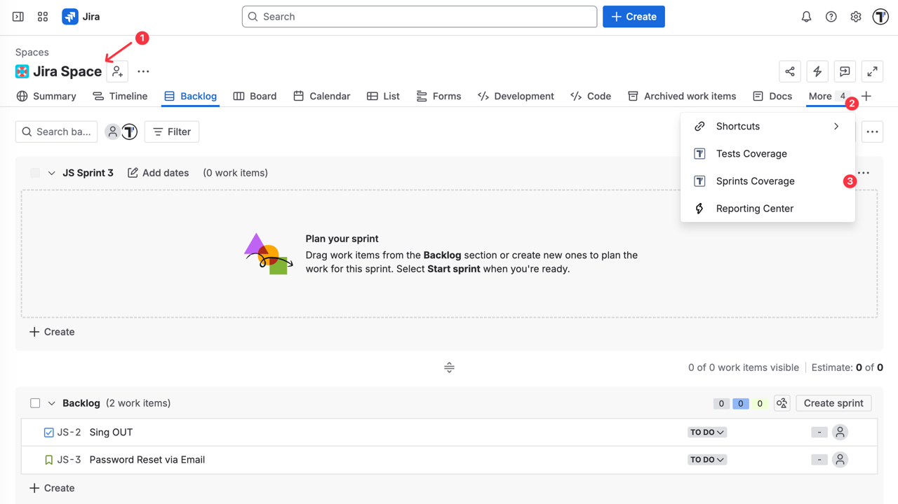

4. Enter the sprint ID(s)
5. Click the 'Submit' button

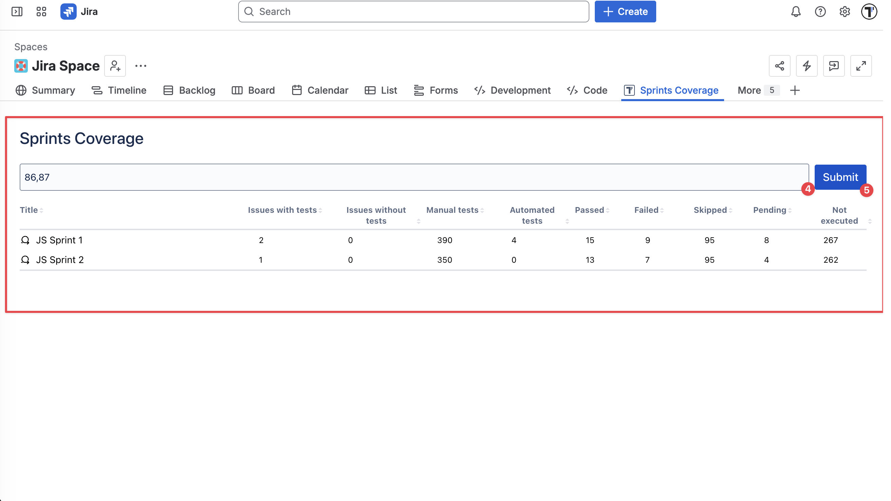

:::note

To find your sprint ID, visit the [Jira Software sprint ID guide](https://support.atlassian.com/jira/kb/jira-software-how-to-identify-the-id-of-a-sprint/).

:::

## Data Sync in Jira

Testomat.io and Jira are continuously synchronized to ensure test data stays up to date across both systems. This **two-way sync** keeps all team members — QA, development, management, and stakeholders — aligned.

**Automatic Sync**

All key updates are automatically synchronized:

- Linked test cases, test suites, and plans remain aligned in both systems
- Statuses of linked Jira issues are synchronized
- Executing a run in Testomat.io updates the corresponding Jira issue with the latest run status
- Launching or updating a run from Jira instantly reflects in Testomat.io
- Testomat.io settings — including environments, branches, users, run groups, and CI integrations — are synchronized and visible in Jira

This real-time, two-way sync ensures that everyone sees the same up-to-date information, eliminating confusion and reducing manual updates.

**Manual Sync**

If your Jira issue view or run list does not show the latest data, you can trigger synchronization manually. This ensures that all test results, linked issues, and run information are up-to-date in both Jira and Testomat.io.

To manually refresh data:

1. Open the **Tests** tab in the Jira issue
2. Click the '⋯' (extra menu) button
3. Select **Sync** from the dropdown list

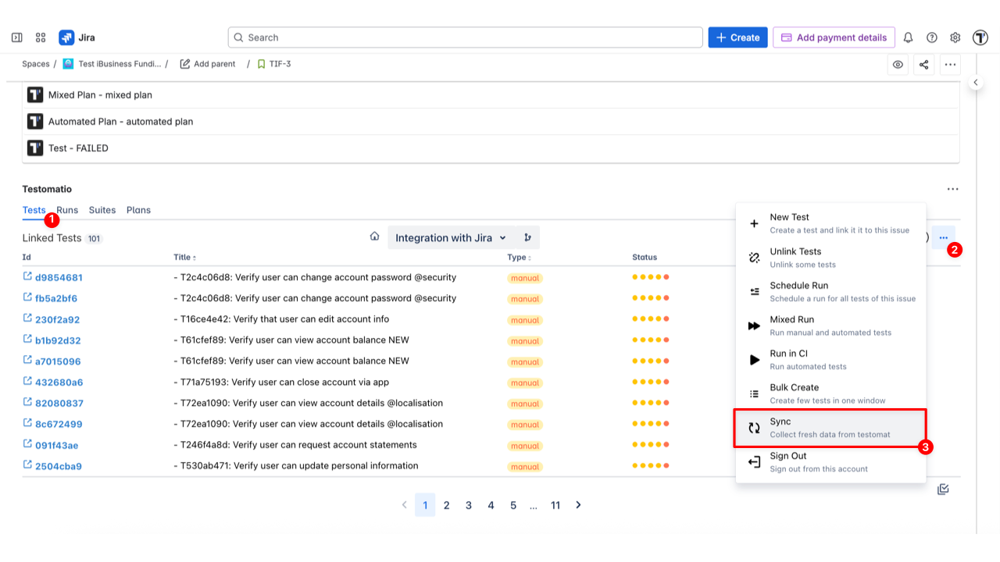

Testomat.io will re-fetch the latest information and update linked test results, statuses, and settings inside Jira. This keeps your Jira and Testomat.io data fully consistent — whether you rely on automatic background sync or perform a quick manual refresh when needed.

