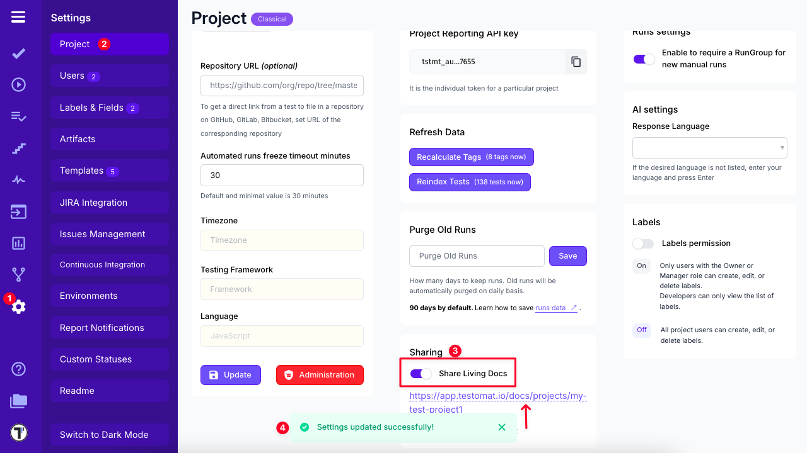
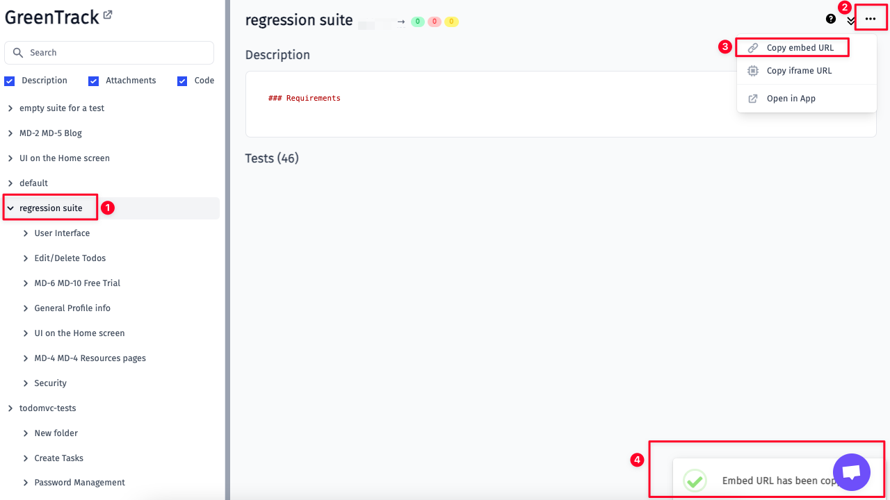
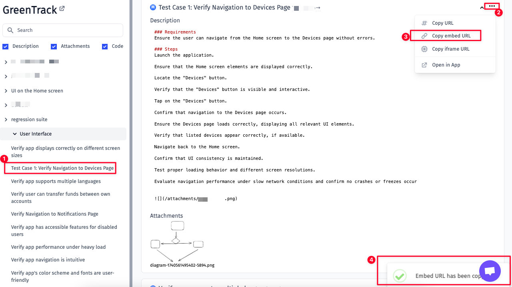
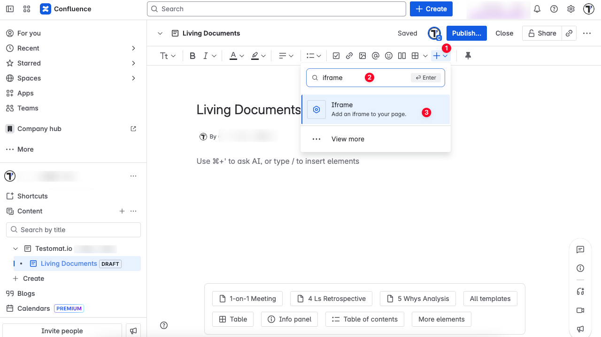
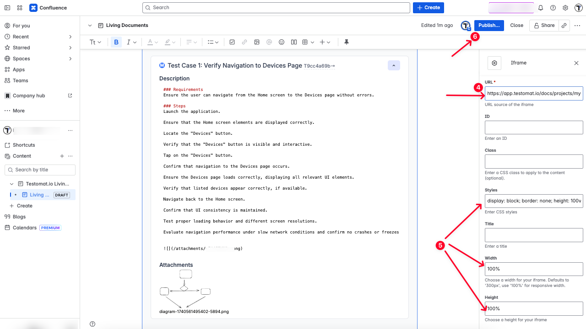
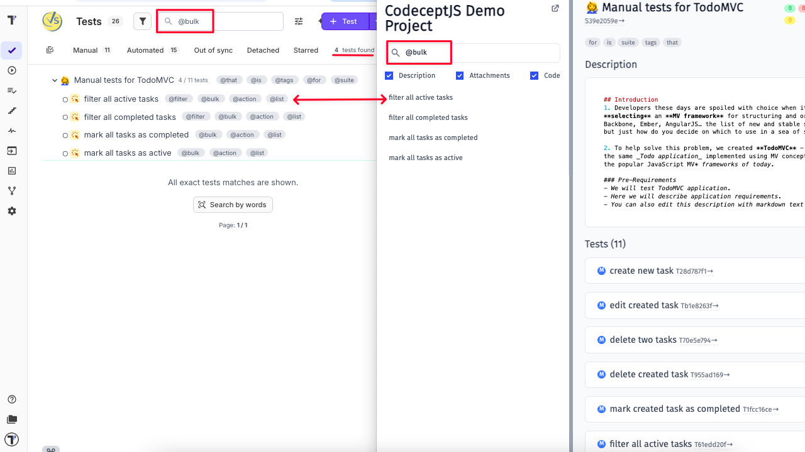

Living Documentation is a dynamic, always-up-to-date view of your tests, test suites and system behavior. Instead of relying on static documents that quickly become outdated, teams can use Living Documentation to share **test coverage, scenario details, and real-time results** directly within their development tools. Living Documentation provides a single source of truth that evolves with your code and test cases. In Testomat.io, this means your automated tests don’t just verify functionality — they also become readable, shareable, and traceable documentation that supports collaboration and decision-making across the team.

- Non-technical stakeholders (e.g., Product Managers, Compliance Teams) can view test coverage and feature behavior without diving into code.
Makes it easy to review acceptance criteria or BDD scenarios.

- You can embed tests tied to specific Jira tickets directly in documentation or dashboards.
Easily include documentation in Confluence pages, sprint reports, or product specs.

- You can trace a test to a suite, feature, user story, or Jira ID.

- In Behavior-Driven Development (BDD), living documentation becomes the specification.

- Make tests or suites publicly viewable, or embed internally for team access.
Useful for partners, clients, or external QA vendors.


## How To Enable Living Documentation

Living Documentation can be enabled in Project Settings:

1. Go to Settings
2. Click on the Project tab
3. Enable **Share Living Docs** toggle
4. See the confirmation and generated link for Living Documentation



## How To Embed Living Documentation

Living documentation can be embedded into your website, you have a possibility to:

- Embed specific suite
- Embed specific test
- Embed tests with a specific tag or Jira id

## Suite

To embed a suite you have to:
1. Select a suite on a living documentation page.
2. Open a drop-down menu under three dots (...) 
3. Select **Copy embed URL** option.
4. See the confirmation message that embed URL has been copied to your clipboard.




## Test

To embed a test you have to :

1. Select a specific test on a living documentation page.
2. Open a drop-down menu under three dots (...) 
3. Select **Copy embed URL** option.
4. See the confirmation message that embed URL has been copied to your clipboard.




## Tests by Tag or Jira ID

To embed tests by `@smoke` tag you need to follow this template (don't forget to replace {project_slug} with the real value):

```
<iframe src="https://app.testomat.io/docs/projects/{project_slug}/tests/embed?tag=@smoke"></iframe>
```

To embed test with Jira id you need to follow this template (don't forget to replace {project_slug} and {jira_id} with the real values):

```
<iframe src="https://app.testomat.io/docs/projects/{project_slug}/tests/embed?jira_id={jira_id}"></iframe>
```

## Tests parameters

You can provide extra parameters in the query string:

1. frame_params[expand_all] - expand all tests by default
2. frame_params[hide_code] - hide code in tests
3. frame_params[hide_description] - hide description in tests
4. frame_params[hide_attachments] - hide attachments in tests

Example

```
<iframe src="https://app.testomat.io/docs/projects/{project_slug}/tests/embed?tag=@smoke&frame_params[expand_all]=1&frame_params[hide_code]=1"></iframe>
```

## Embed Link For Confluence 

With Testomat.io Living documentation, you can enrich your Confluence by adding tests or suites.
This can be done within a Confluence page:

1. Open your Confluence page editor - click Insert
2. Type 'iframe' in search field
3. Select Iframe plugin



4. Enter the embed URL you generated in the Living documentation
5. Fill in the fields of your choice

For example: display: block; border: none; height: 100vh; width: 100%; height:100%;



6. Click Publish.


## Search within Living Documentation

You can search for specific tests within Living Documentation. The search functionality works the same way as it does in the Tests tab in Testomatio. You can search using two parameters:

1. Search by tags – Type a tag into the search field. A list of tests that match the tag will be displayed under the search field.

2. Search by keywords – Type a keyword into the search field. A list of tests that match the keyword will be displayed under the search field.




