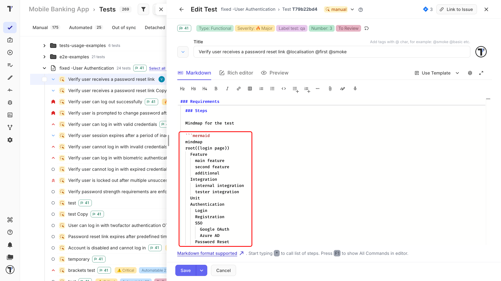
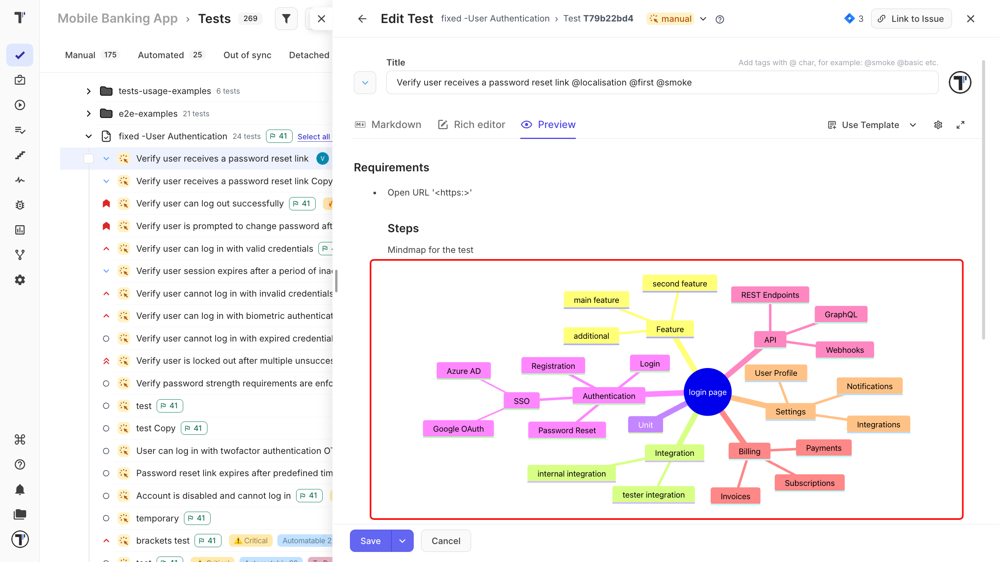

Write the diagram as a code block, and Testomat.io shows it as a picture. Add a Mermaid diagram to any test or suite description. Diagrams are most useful for big features with many states. Use a diagram to show a workflow, the branches of a scenario, or how parts of your product connect. 

## Add a Diagram to a Description

1. Open the test or suite you want to document.
2. Click **Edit**.
3. Switch to the **Markdown** tab.
4. Add a fenced code block that starts with ` ```mermaid `.
5. Write the diagram inside the block.
6. Click **Save**.



The **Preview** tab shows the diagram before you save. After you save, the picture appears in the description instead of the code block. For example, flowchart can look like this:



## Download a Diagram

Each diagram has **SVG** and **PNG** buttons. Click one to download the picture and use it in a slide, a ticket, or a report outside Testomat.io.

**Use a diagram when you need to show how things connect:**
 
- end-to-end user journeys,
- how services work with each other,
- which suites cover which features,
- test data and its variants,
- the steps that reproduce a bug.

:::note
 
Testomat.io can build a mindmap for you. **Generate Project Structure** reads your folders and suites and suggests a new structure as a diagram. Learn more: [AI-Powered Features](https://docs.testomat.io/advanced/ai-powered-features/ai-powered-features).

:::

## Next Steps

- [AI-Powered Features](https://docs.testomat.io/advanced/ai-powered-features/ai-powered-features)
- [Living Documentation](https://docs.testomat.io/advanced/living-doc)
- [Test Case Creation and Editing](https://docs.testomat.io/project/tests/test-case-creation-and-editing)