Testomat.io introduces **Milestones** to support structured test management across your development cycles.

In software development, a **milestone** represents a significant checkpoint or phase in a project (e.g., release, sprint, or major delivery). It is used to group work, track progress, and evaluate results within a defined scope and timeline.

**With Milestones in Testomat.io, you can:**

- Create milestones for releases, sprints, or project phases
- Assign tests and test runs
- Link Requirements
- Link Test Plans
- Track Requirement status
- Track Test Plan progress
- Generate Milestone reports

This enables end-to-end test management aligned with project phases, providing clear visibility into progress and outcomes for each milestone.

## How to Create a Milestone

**Milestone** lives at the **company-level** but can be scoped down to specific projects. It's a tracking mechanism (like a Sprint, Release, or Version) that can be linked to various items in the system (Tests, Suites, Plans, Runs, Rungroups, Requirements). Milestones help organize and track work across related items with state management, automatic propagation, and project scoping.

**To create Milestone:**

1. Navigate to **'Milestones'** tab from the main workspace dashboard.
2. Click **'Create Milestone'** button.

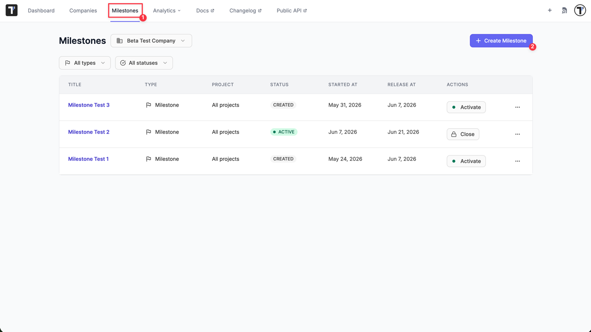

3. **Title:** Enter a name for your milestone (Required).
4. **Type:** Enter a name of category (e.g., Sprint, Release, Iteration, Phase). Milestones are grouped by type. You can create multiple types. If left blank, the system defaults to the **'Milestone'** type.
5. Fill in optional fields as needed:
- **Start date & Release date:** Your start date must occur before or on the release date.
- **Description & goals:** Detail what this milestone aims to achieve.
- **External URL:** Link directly to your matching sprint in Jira, GitHub, or internal tracking documentation.
- **Projects:** Select the specific projects that can access this milestone. By default, it is shared with all projects within the company.
6. **Show milestone in lists:** (Enabled by default). When enabled, this milestone appears in the tests, suites, runs, and plans lists. Turn this off to hide deprecated, archived, or legacy milestones from daily dropdown selection menus while safely preserving historical links attached to old test runs or plans.
7. Click **'Create'** button.

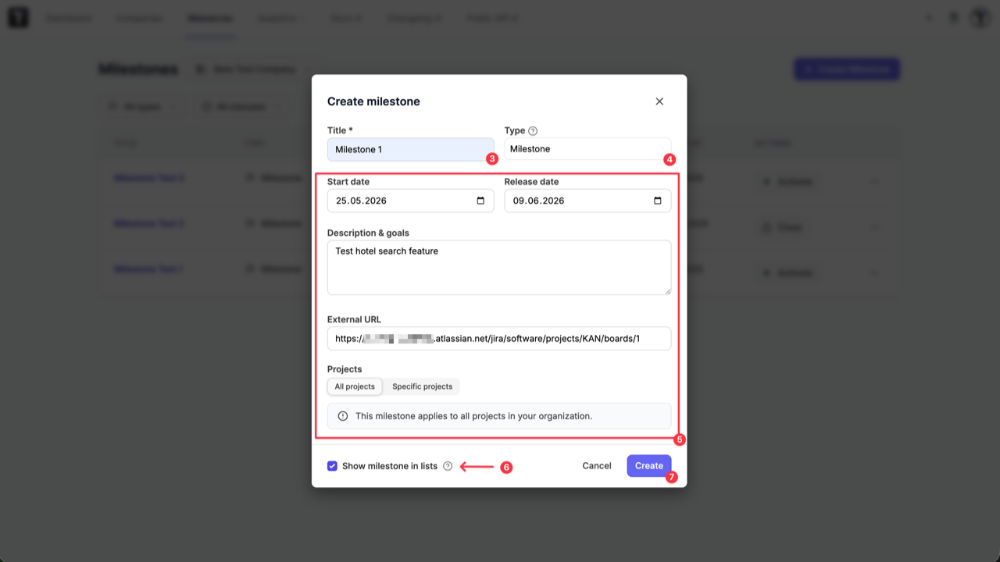

After milestone is created, it automatically appears in the list on **'Milestones'** page and can be assigned to test, suites, plans and runs. Milestone can be activated at any time.

:::note

Milestones are automatically grouped by type name in a case-insensitive manner. For example, entering `"Sprint"` or `"sprint"` maps them to the exact same milestone type category. New milestones automatically inherit project scope settings from existing sibling milestones of the same type to keep your environment synchronized.

:::

## Milestone types

Milestones are grouped by type. Testomat.io ships with built-in types - **Milestone**, **Release**, and **Sprint** - and you can add your own.

To create a type, enter a name in the **Type** field on a milestone form.

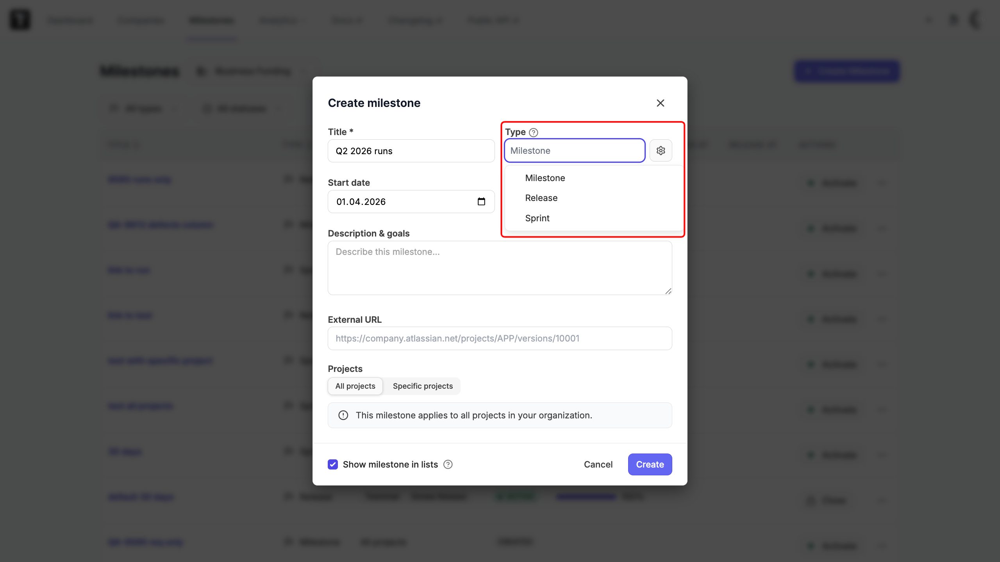

To manage types, click the gear icon next to the **Type** field. The modal lists the built-in types and any custom types in use across the company.

Deleting a type depends on whether it is in use:

*  An unused type is removed entirely.
*  An in-use type asks you to pick a new type for the affected milestones, tests, and plans to move to.

## How to Edit & Delete Milestone

You can modify or remove milestones at any point using two different ways: from main **'Milestones'** page and from the **'Milestone details'** page.

**Edit a milestone from the main 'Milestones' page:**

1. Click on three dot to open the extra menu for selected milestone.
2. Click **'Edit'** button.

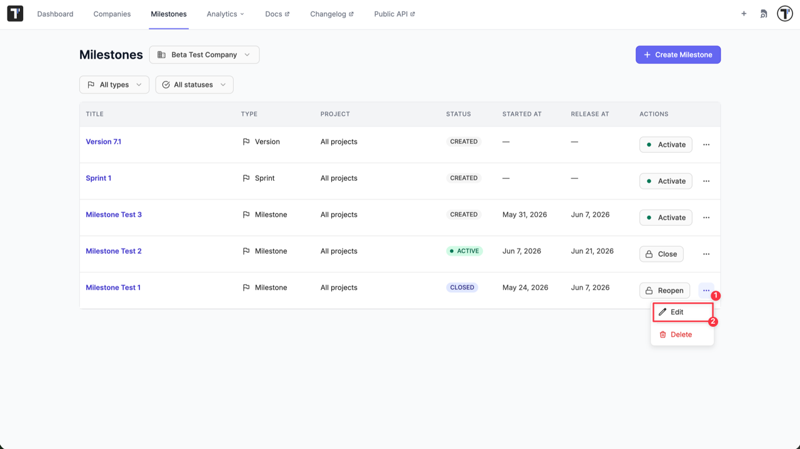

3. Apply your updates in the **'Edit Milestone'** modal and click **'Save'**.

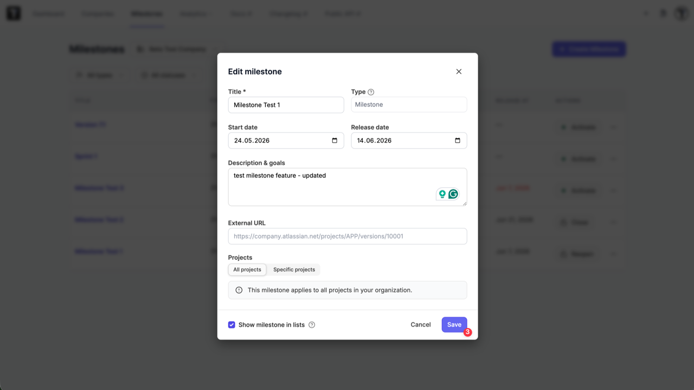

**Edit a milestone from the 'Milestone details' page:**

1. Click on milestone name.

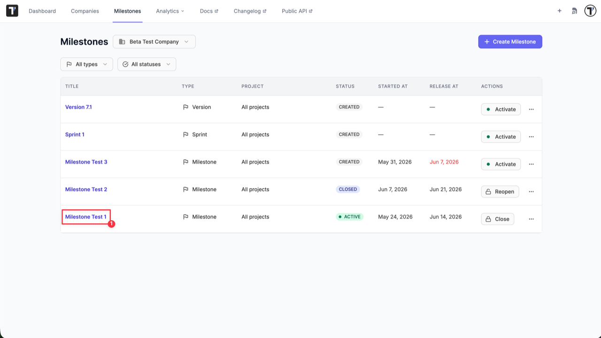

2. Click **'Edit'** button.

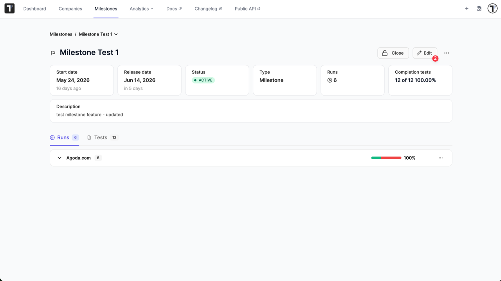

3. Apply your updates in the **'Edit Milestone'** modal and click **'Save'**.

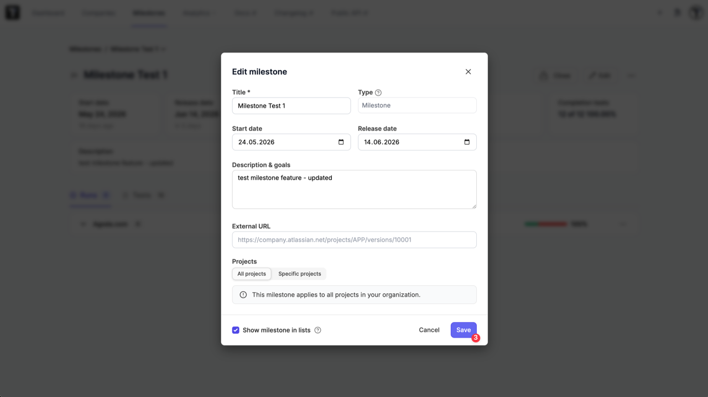

**Delete a milestone from the main 'Milestones' page:**

1. Click on three dot to open the extra menu for selected milestone.
2. Click **'Delete'** button.

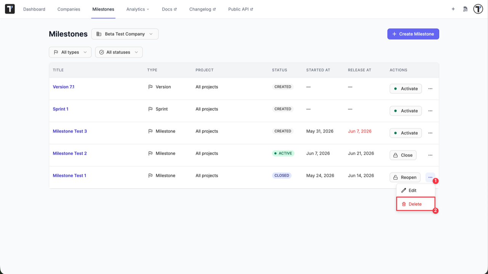

3. Click **'Delete milestone'** button to confirm your action.

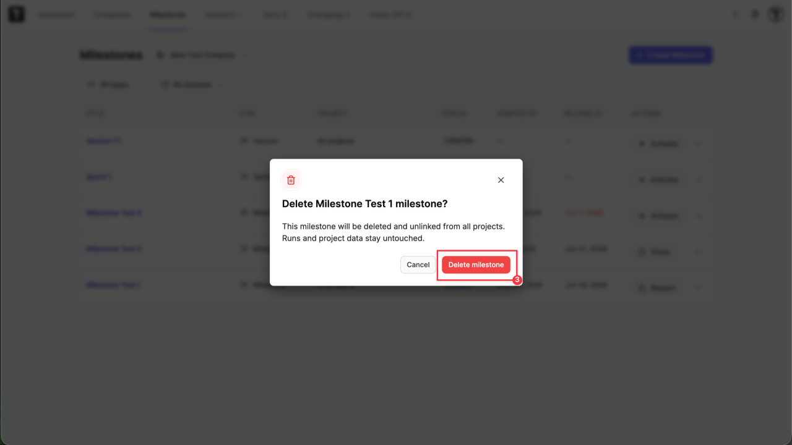

Milestone as well can be deleted from the **'Milestone details'** page:

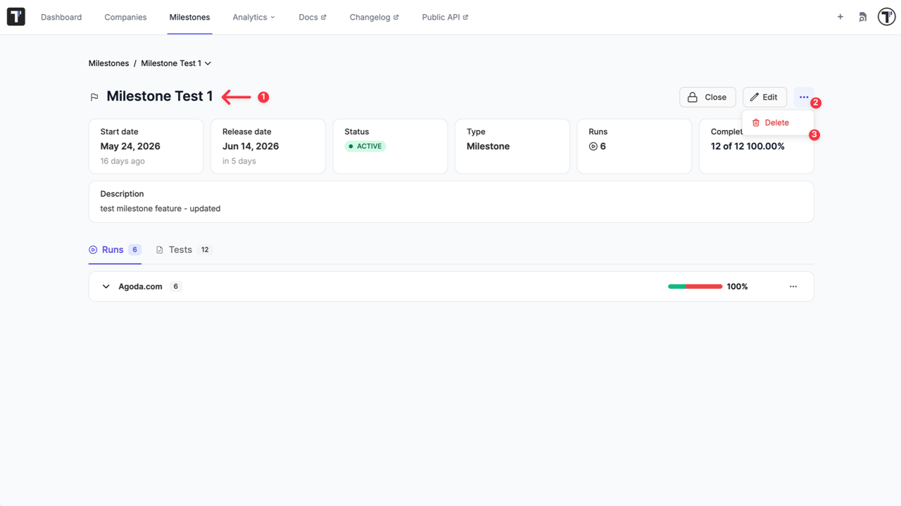

:::note

Deleting a milestone removes its association and unlinks it from all projects, tests, and runs. Your historical test execution results, runs, and core project data remain completely untouched.

:::

## How To Activate a Milestone

To avoid confusion about what your team is currently working on, **only one milestone of the same type can be active at a time.**

**To activate milestone:**

1. Click **'Activate'** button.

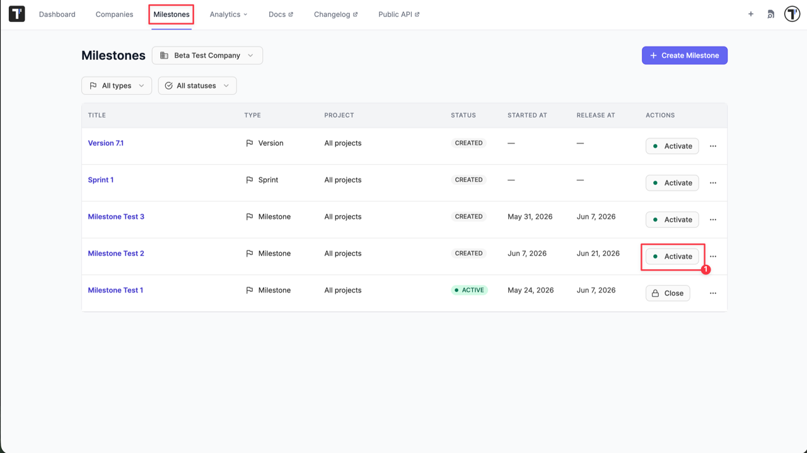

2. Confirm action on **'Activate Milestone'** modal.

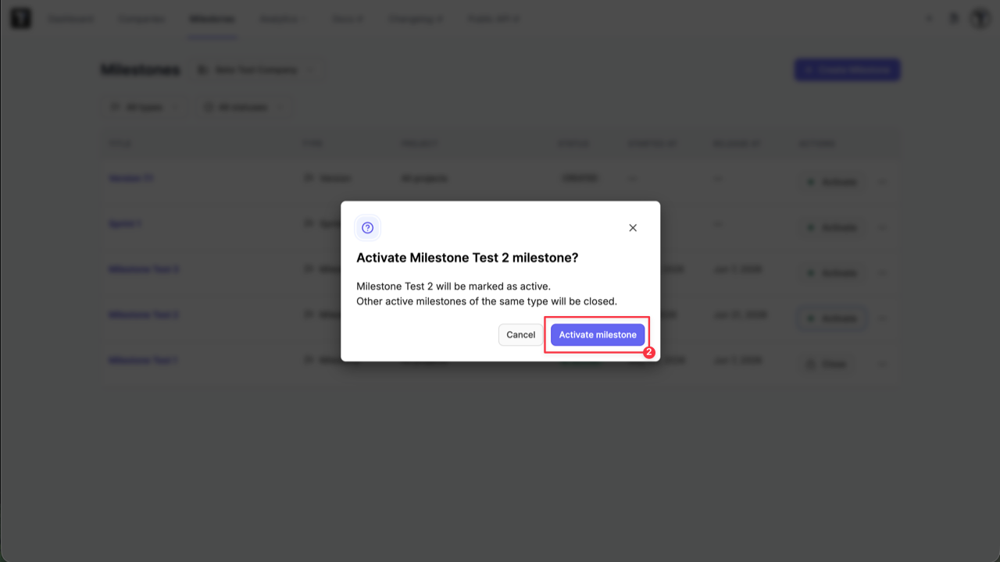

When you activate a milestone, Testomat.io automatically shifts any previously active milestone of that same type into a **Closed** state and timestamps the exact moment of closure (`closed_at`).

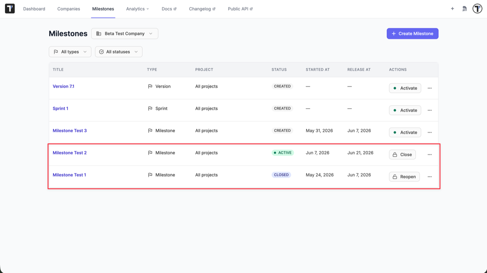

### Expired Milestone Warnings

If a milestone reaches its target **Release Date** but has not been manually marked as **Closed**, the system keeps it open but automatically flags it as **Expired**.

This automatic status change provides a clear visual indicator on your team dashboards, helping you instantly spot slipping deadlines, overdue deliverables, or uncompleted tasks that require immediate attention.

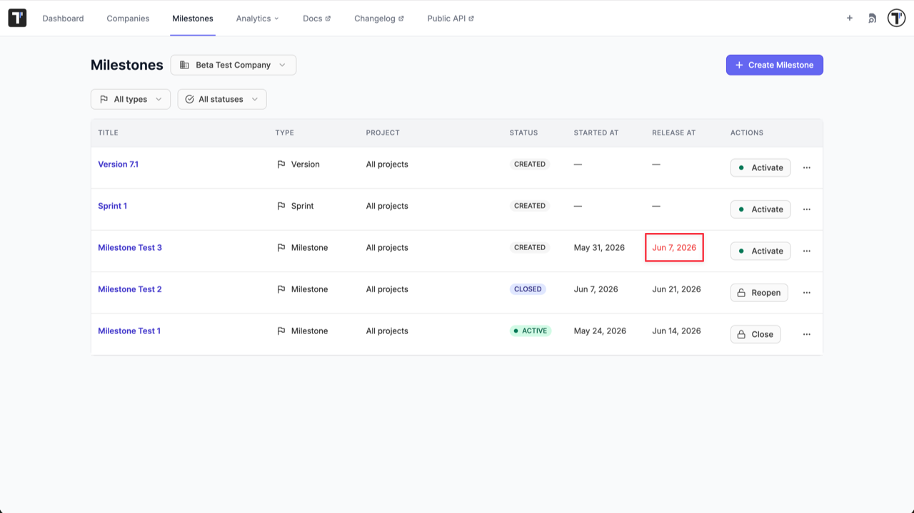

## How to Assign Milestones

You can associate milestones with six distinct structural components: **Test, Suite, Plan, Run, Rungroup, Requirement**.

**Core Rules of Milestone Linking:**

1. **Smart Link Switching**

An item can only belong to one milestone per type at a time. If a test case is currently linked to `Sprint 1` and you assign it to `Sprint 2`, the system automatically replaces it. Don't worry — milestones of other types (for ex. `Release v1.0`) will stay perfectly intact.

2. **Automatic Downward Sharing (Cascading)**

You don't need to manually assign a milestone to hundreds of individual test cases. When you link a milestone to a parent container, the system automatically shares it downwards to all nested elements in the background:

- **Suites:** Assigning a milestone to a Suite cascades it to **all tests inside that suite**.

- **RunGroups:** Assigning a milestone to a RunGroup cascades it to all test runs inside that group automatically.

**Steps to Assign a Milestone:**

1. Go to **'Tests'** page.
2. Select the Suite or individual item you want to map.
3. Click the **'Set milestone'** label in the details panel.
4. Select one or more milestones across your available types.
5. Click **'Save'** button.

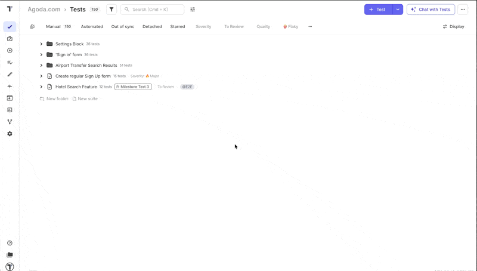

Same logic applies to any other entity a milestone can be assigned to.

## Filter by Milestone

Testomat.io allows you to filter your tests, suites, runs, and plans by Milestone using either the regular interface filter or the advanced Testomatio Query Language (TQL) filter.

### Using the Interface Filter

1. Open the Tests, Runs, or Plans tab.
2. Click on the **Filter dropdown** at the top of the list.
3. Select your Milestone Type (e.g., Sprint or Release) and choose the specific milestone from the list.
4. Click **'Apply'** button to apply selected filter.

The workspace will dynamically update to show only the items linked to that milestone.

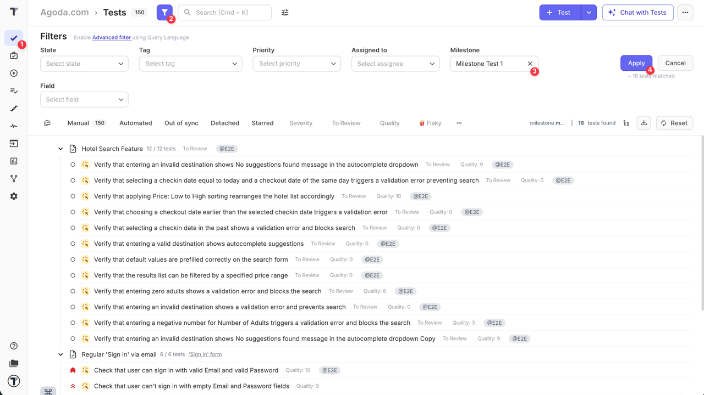

### Using Advanced TQL Filters

For more complex queries or when building custom dashboards, you can use the TQL console to filter by milestone properties.

1. Open the Tests, Runs, or Plans tab.
2. Click 'Query Language Editor' icon at the header of the page.
3. Enter filter query.
4. Click **'Apply'** button.

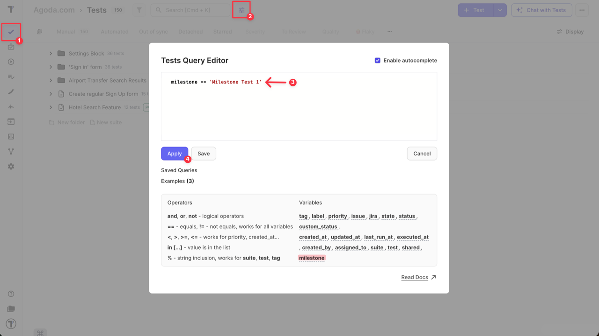

## Milestone Overview

The Milestones contain: the start date, release date, status, type, run count, and the share of completion tests. 

The **Coverage** list breaks the milestone down by run, with each run's status, tests, run state, success rate, defects, assignee, duration, and finish date.

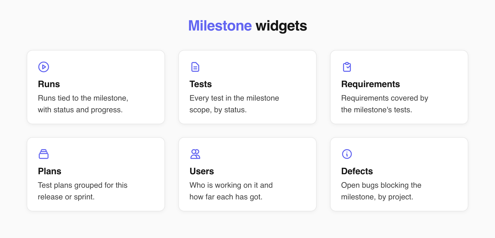

The tabs **Runs**, **Tests**, **Requirements**, **Plans**, **Users**, and **Defects** provide more details about the milestone. 

## Runs in a Milestone

The **Runs** tab lists the runs tied to the milestone. Each row shows the run's status, its test count, run state, success rate, defects, who it is assigned to, its duration, and when it finished, so you can follow execution against the milestone in one place.

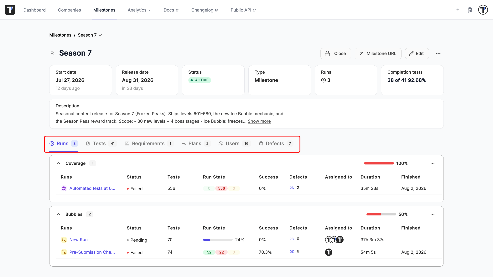

## Tests in a Milestone

The **Tests** tab lists every test in the milestone's scope — tests attached to it directly, tests in its plans, and tests linked to its requirements. Each row shows the test's status and priority, so you can see what the milestone covers and where it stands.

## Requirements in a Milestone

Linking Requirements to a Milestone shows how much of the planned scope is actually covered and verified, so you can judge readiness by feature rather than by raw test count.

* Track each Requirement's status within the Milestone
* See which requirements are covered by tests and which still have gaps
* Assess release readiness by scope, not just pass/fail numbers

**Use case:** A product owner preparing the *2.0* release opens the Milestone and sees that eight of ten Requirements are fully covered and passing, while two still have failing tests — so they know exactly which features are blocking the release.

## Test Plans in a Milestone

Linking Test Plans groups the runs that matter for this Milestone, so progress reflects the plan you intend to ship against instead of every run in the project.

* Monitor the linked Test Plans in one place
* Follow execution progress for the plan tied to this release or sprint
* Keep milestone progress focused on the relevant runs

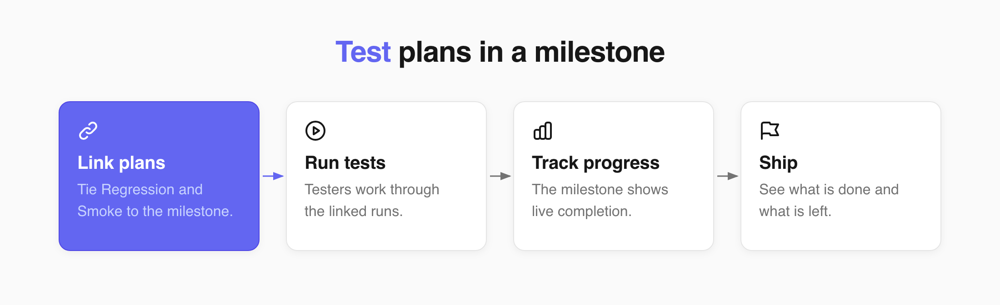

**Use case:** A QA lead ties the *Regression* and *Smoke* plans to a sprint Milestone. As testers work through the runs, the Milestone shows live progress toward completing those plans, without noise from unrelated runs.

This provides a clear overview of what has been completed, what is still in progress, and what remains before a release or sprint is finished.

 ## Users in a Milestone

A milestone has a **Users** tab that shows who is working on it and how far each person has got. Users are grouped by project. Each row shows the tests that person created in the milestone, the tests assigned to them, the tests they have executed, and a progress bar of completed against assigned.

The numbers cover every test the milestone reaches - tests attached to it directly, tests in its plans, tests linked to its requirements, and tests with results in its runs. Execution is credited from manual results, so the completed column reflects hands-on testing rather than automated runs.

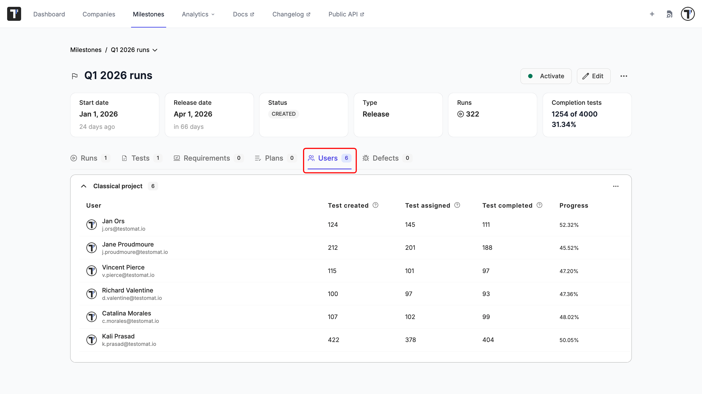

## Defects in a Milestone

A milestone has a **Defects** tab alongside **Runs**, **Tests**, **Requirements**, **Plans**, and **Users**. It gathers the open bugs that stand between the milestone and its release.

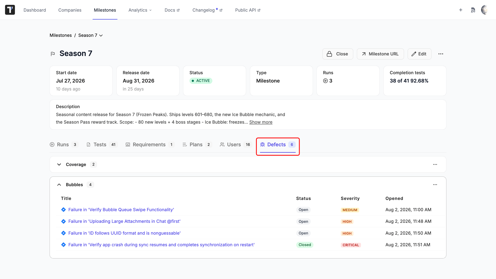

Because a milestone spans projects, so does the tab. Defects are grouped into a collapsible section per project, each with its own count, and the tab header shows the total across all projects.

Each defect shows its status, severity, and the date it was opened, and the tracker it came from is marked on the title. Click a defect to open it on your project's **Defects** board, or open a project straight from its section.

## Milestone Analytics & Progress Reports

### Version Tracking & Audit Logs

Every time a milestone is linked or unlinked from an item, Testomat.io records an audit trail. This version record documents exactly who made the change, when it occurred, and which artifact was modified, making history tracking seamless.

You can review this real-time history stream on the **'Pulse'** page.

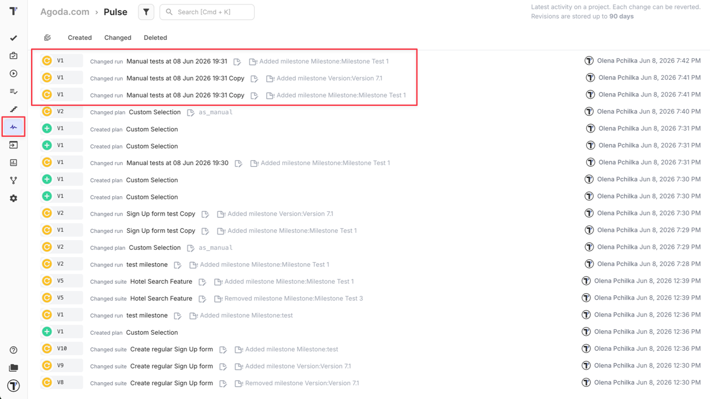

### Milestone Dashboards

Clicking on any **milestone name** opens three dedicated reporting views designed to measure your development and testing velocity:

1. **Milestone Tests:** Displays an automated breakdown of test outcomes, detailing total execution history, pass/fail rates, and overall success percentages for the specific milestone scope.

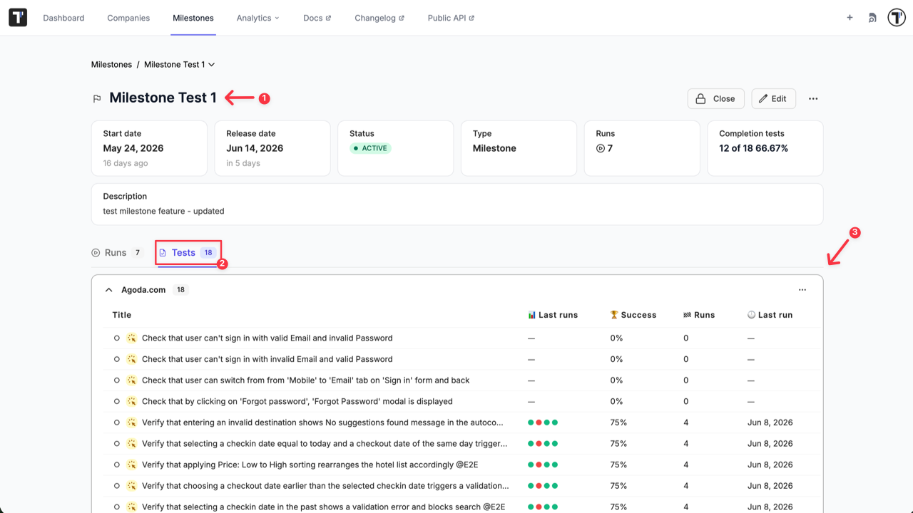

2. **Milestone Completion:** Evaluates overall readiness by tracking total assigned items against fully executed and partially executed tasks to calculate an overall milestone completion percentage.

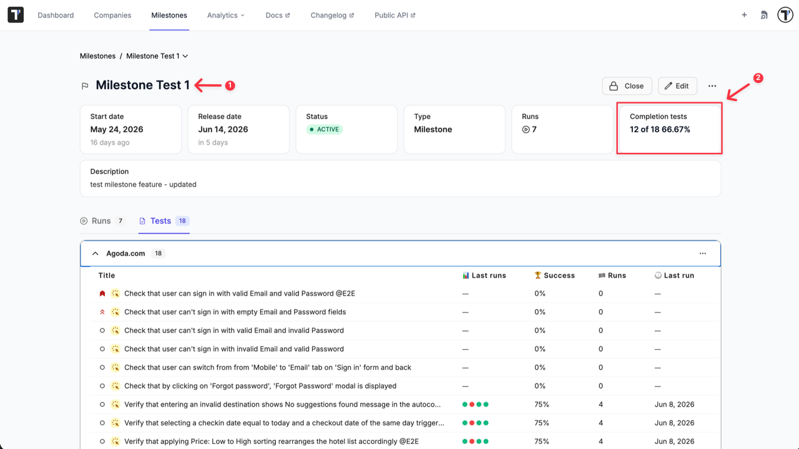

3. **Milestone Run Stats:** Provides deeper technical execution insights, detailing your automation vs. manual testing ratios, current defect/bug counts, and a helpful list of slow-running tests impacting pipeline speed.

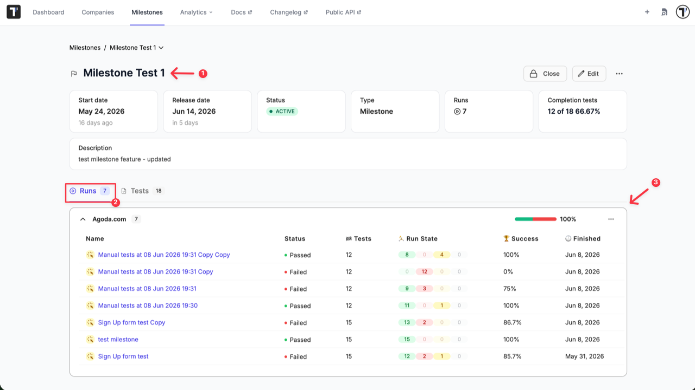

:::note

If a single milestone is shared across multiple projects, Testomat.io dynamically aggregates data from all participating projects into a unified, company-wide health report.

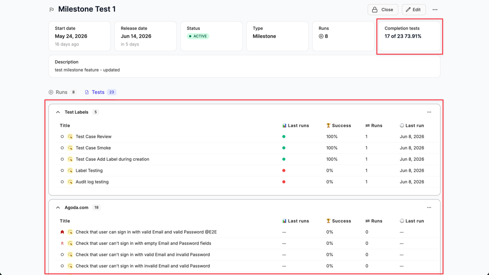
:::
