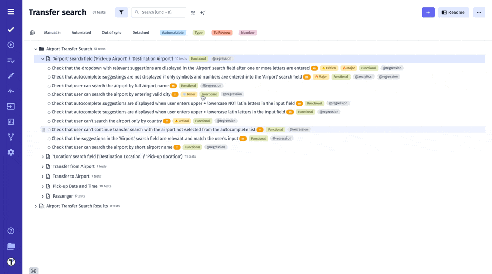
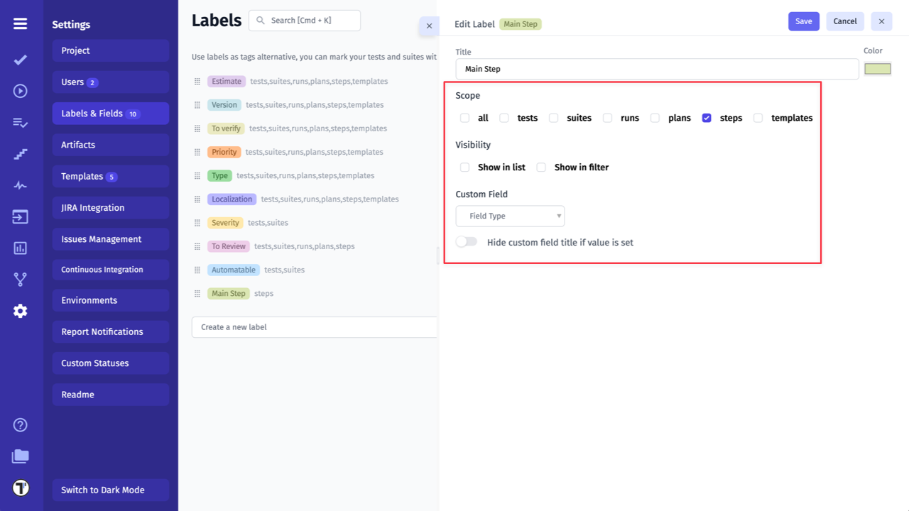

**Tags, Labels & Custom Fields** are powerful features in a test management system that allow users to categorize and organize their testing data.

**Tags and Labels** are keywords or phrases that can be applied to individual tests or test suites to provide an at-a-glance summary of the test's status, type, priority, or any other relevant information. They make it easy for users to filter and sort their tests to quickly find what they need.

**Custom fields**, on the other hand, are user-defined fields that can be added to a test case to capture specific information. For example, custom fields can be used to store information such as the tester's name, the expected result, the test environment, or the date the test was last run. Custom fields make it possible for users to tailor the test management system to their specific needs, and to store and retrieve data in a consistent and meaningful way.

Tags, Labels & Custom Fields can help users to streamline their testing process, increase the accuracy of their test data, and make it easier to find and analyze the information they need.

## Tags vs Labels: What to Choose

While both **Tags** and **Labels** help organize and categorize your tests, they serve slightly different purposes and excel in different situations. Understanding these differences can help you make the most of them.

**Tags** are typically used to assign a specific keyword or category to test cases, making it easier to group, filter, or search for related tests. They are often used for ad-hoc categorization and usually have no strict hierarchy. 
For example, Tags can represent various attributes, such as the type of test (for ex., @Regression, @Smoke, @E2E), associated features, or testing phases.

In automation testing, a **Tag** is a segment of extra metadata that you can include on an individual test case or a group of tests. These tags are directly embedded in the test code, and allows you to specify additional information for your tests, which you can use to enhance your test runs. The testing tool will execute only tests containing that piece of information, as almost all modern testing tools and frameworks have integrated support for running a subset of tests, using tags. For example, execute all tests tagged as @Regression but skip @Smoke tests.

On another side, **Labels** tend to be more structured than tags and can be used to signify specific statuses or groupings (for ex., priority, severity, localization), mark test case status or ownership. Also Testomat.io allows you to add multiple values to the same label. For example, you can create a Type label to categorize tests by type.
They are more flexible, easy to change and manage, you can rearrange created and selected labels, as well as delete them from your project, from **Settings -> Labels&Fields** page, read more about how to set up labels below.

#### Key Differences:

| Criteria | Tag | Label |
|---|---|---|
| Purpose | To categorize and/or organize tests | To identify meta data related to tests or object |
| Generality | More general | More specific |
| Applications | More for automated tests less for manual | More for manual tests, less for automated |
| Usage | Less flexible for describing specific details. More constant | More flexible, easy to change and manage, can have complex types and multiple values |
| Use cases | Categorization, filtering, search, test plans, coverage, analytics | Track the progress, maintain, review, steps, runs, collaboration |

The choice between **Tags** and **Labels** depends on your specific needs. For automated tests and broad categorization, Tags are the better choice.

Conversely, Labels offer greater flexibility. You can mark test cases/ suites without altering their titles, customize Labels with various data types, and even assign multiple values to a single Label. 

By understanding their strengths, you can leverage both Tags and Labels effectively to organize and manage your testing efforts.

## How to Create and Assign Tags 

You can easily create tags directly to Test Cases or Suites via their titles

1. Open Test Case/ Suite
2. Click Edit button
3. Create tag starting with **@** symbol, directly within the Test Case or Suite title
4. Click Save button

All previously created tags are automatically saved in the system. To reuse a tag, simply type the **@** symbol in the Test Case title field and select the desired tag from the autocomplete dropdown.

:::note

In case if you don't see a previously created tag in the autocomplete dropdown, refresh the page. Alternatively, go to **Settings -> Project** and click the **'Recalculate Tags'** button.

:::

## How to Filter by Tags

1. Enable Filters
2. Select one or a few Tags from **Tag** dropdown list
3. Click Apply button

## How to Add Labels & Custom Fields

Labels can be easily added in Project Settings

1. Go to Settings.
2. Select Labels & Fields.
3. Enter a title for the label.
4. Click Create button.

## How to Setup a Label

Before setting up Labels & Custom Fields we need to learn about **Scope** and **Visibility** parameters.

**Scope** defines what pages you want to apply the Label & Custom Field. Here you can define on what pages you want to use it. You can apply it to tests, suites, runs, plans, steps and templates.

**Visibility**  defines how a Label & Custom Field should be shown in UI. 

- Filter visibility will show a Label or Custom Field in the Filter Bar, so you can sort your items quickly.
- List visibility will show a Label or Custom Field in the tests tree, a list of runs, plans, or steps.

Now it's time to set up your label!

1. Scope - pick entities you want this label to be applied.
2. Visibility - labels can be shown in the Filter bar, in the list of entities, or in both views.
3. Custom Field - expand label capability to a custom field.

You can also use **Quick create label** feature to create labels faster:

1. Go to Steps
2. Select Step
3. Click Extra button.
4. Click Labels.
5. Type Label name in 'Quick create label' field.
6. Click Create button.
7. Select newly Created Label.

:::note

**Quick create label** feature available only on Set Labels page for **Runs**, **Plans** and **Steps**.

Labels created via **Quick Create Label** feature use default minimal settings and can be assigned only to the entity level where it was created. You can modify these settings later by navigating to **Settings -> Labels&Fields**.

:::

Example of default settings for Label, created via **Quick create label** feature on Step level:

## How to Setup a Custom Field

There are such Field Types in Custom Fields: List, Number, and String. Let's take a look at each type.

### Custom Field: List

Custom Field with List type allows creating a list of your choice. You can put there any values to meet your testing needs. 

1. Select a List type of Custom Field.
2. Add a new item per line.
3. Toggle **Hide custom field title if value is set** if you don't want to show Custom Field title.
4. Click Save button.

### Custom Field: Number

1. Select a Number type of Custom Field.
2. Toggle **Hide custom field title if value is set** if you don't want to show Custom Field title.
3. Click Save button.

### Custom Field: String

1. Select a String type of Custom Field.
2. Toggle **Hide custom field title if value is set** if you don't want to show Custom Field title.
3. Click Save button.

## How to Assign Labels & Custom Fields

- Add labels on the entity level

1. Open a Suite/ Test.
2. Click Extra button.
3. Click Labels.

4. Select Labels.
5. Click Add Custom Field.
6. Select Custom Fields.
7. Click Save button.

OR: 

1. Open a Suite/ Test.
2. Click Set Labels button the title name.
3. Select Labels & Custom Fields.
4. Click Save button.

- Mass-assign labels using our multiselection mode

1. Enable multiselection mode.
2. Select Tests/ Suites.
3. Click Labels button.

4. Select Labels & Custom Fields.
5. Click Add.

:::note

To edit Labels & Custom fields or add a new one click **Manage labels** button directly from **Set Labels** page -> it will redirect you to **Labels** page.

:::

## How to Filter by Labels and Custom Fields

You can click the Label on the Filter Bar

Or enable Filters, pick fields and values then click Apply

:::note

In case you need to filter your test cases by a few Labels and Custom Fields with multiple values, Testomat.io recommends using TQL for such search queries.

:::

## Multiple Values for Custom Fields

There might be cases where you need to assign the same label with different values to the same test case or suite. 

To address this, Testomat.io enhanced the flexibility of Custom Fields by allowing multiple values to be assigned to test cases, suites, steps, etc.

Lets see how this works:

1. Open Test Case or Suite.
2. Click Extra button.
3. Click Labels.
4. Select Custom Field with multiple values.
5. Choose values from the displayed list for List Custom Field (or type a few values, separated by "," for Custom Field String).

Testomat.io also allows you to filter your test cases by one or a few Custom Field values.

