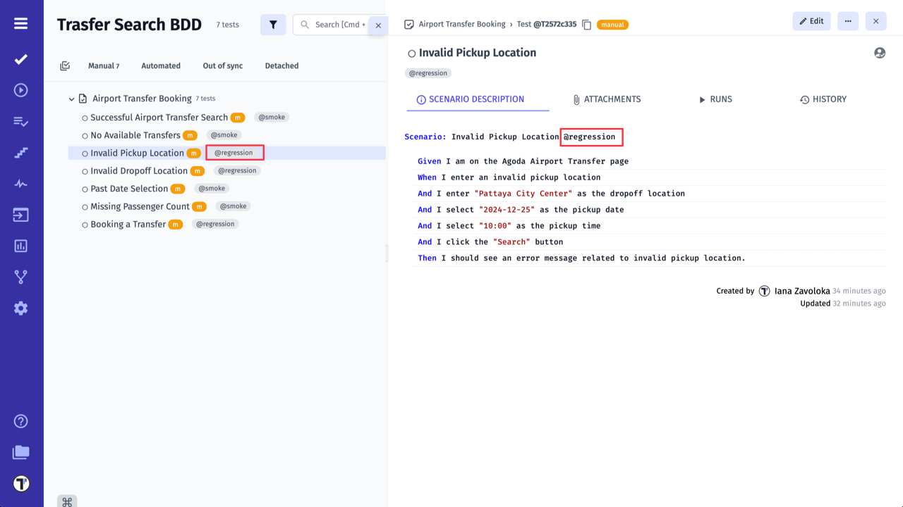
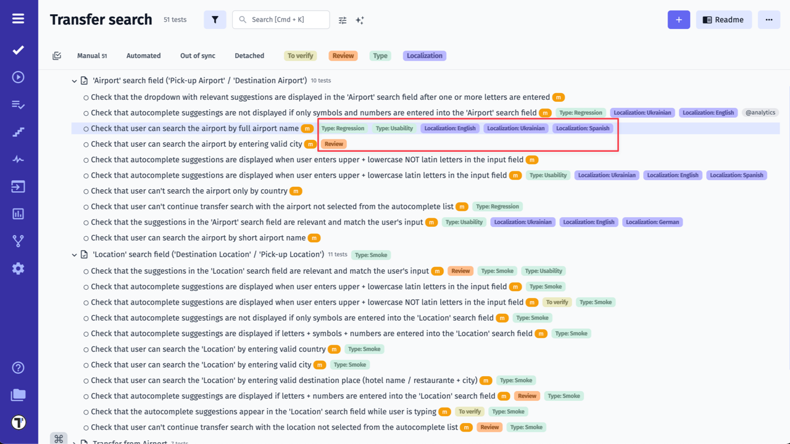

**Tags, Labels & Custom Fields** are powerful features in a test management system that allow users to categorize and organize their testing data.

**Tags and Labels** are keywords or phrases that can be applied to individual tests or test suites to provide an at-a-glance summary of the test's status, type, priority, or any other relevant information. They make it easy for users to filter and sort their tests to quickly find what they need.

**Custom fields**, on the other hand, are user-defined fields that can be added to a test case to capture specific information. For example, custom fields can be used to store information such as the tester's name, the expected result, the test environment, or the date the test was last run. Custom fields make it possible for users to tailor the test management system to their specific needs, and to store and retrieve data in a consistent and meaningful way.

Tags, Labels & Custom Fields can help users to streamline their testing process, increase the accuracy of their test data, and make it easier to find and analyze the information they need.

## Tags vs Labels: What to Choose

While both **Tags** and **Labels** help organize and categorize your tests, they serve slightly different purposes and excel in different situations. Understanding these differences can help you make the most of them.

**Tags** are typically used to assign a specific keyword or category to test cases, making it easier to group, filter, or search for related tests. They are often used for ad-hoc categorization and usually have no strict hierarchy. 
For example, Tags can represent various attributes, such as the type of test (for ex., @Regression, @Smoke, @E2E), associated features, or testing phases.

In automation testing, a **Tag** is a segment of extra metadata that you can include on an individual test case or a group of tests. These tags are directly embedded in the test code, and allows you to specify additional information for your tests, which you can use to enhance your test runs. The testing tool will execute only tests containing that piece of information, as almost all modern testing tools and frameworks have integrated support for running a subset of tests, using tags. For example, execute all tests tagged as @Regression but skip @Smoke tests.

On another side, **Labels** tend to be more structured than tags and can be used to signify specific statuses or groupings (for ex., priority, severity, localization), mark test case status or ownership. Also Testomat.io allows you to add multiple values to the same label. For example, you can create a Type label to categorize tests by type.
They are more flexible, easy to change and manage, you can rearrange created and selected labels, as well as delete them from your project, from **Settings -> Labels&Fields** page, read more about how to set up labels below.

#### Key Differences:

| Criteria | Tag | Label |
|---|---|---|
| Purpose | To categorize and/or organize tests | To identify meta data related to tests or object |
| Generality | More general | More specific |
| Applications | More for automated tests less for manual | More for manual tests, less for automated |
| Usage | Less flexible for describing specific details. More constant | More flexible, easy to change and manage, can have complex types and multiple values |
| Use cases | Categorization, filtering, search, test plans, coverage, analytics | Track the progress, maintain, review, steps, runs, collaboration |

The choice between **Tags** and **Labels** depends on your specific needs. For automated tests and broad categorization, Tags are the better choice.

Conversely, Labels offer greater flexibility. You can mark test cases/ suites without altering their titles, customize Labels with various data types, and even assign multiple values to a single Label. 

By understanding their strengths, you can leverage both Tags and Labels effectively to organize and manage your testing efforts.

::: note

Learn how to create and assign **Tags** in Testomat.io to organize your test cases and suites on the [Tags](https://docs.testomat.io/advanced/tags-labels/tags) page.

Learn how to use **Labels** and **Custom Fields** in Testomat.io to organize and categorize tests, suites, runs, plans, and steps on the [Labels and Custom Fields](https://docs.testomat.io/advanced/tags-labels/labels-and-custom-fields) page.

:::