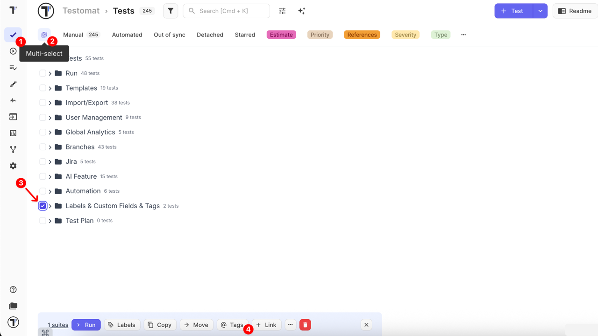
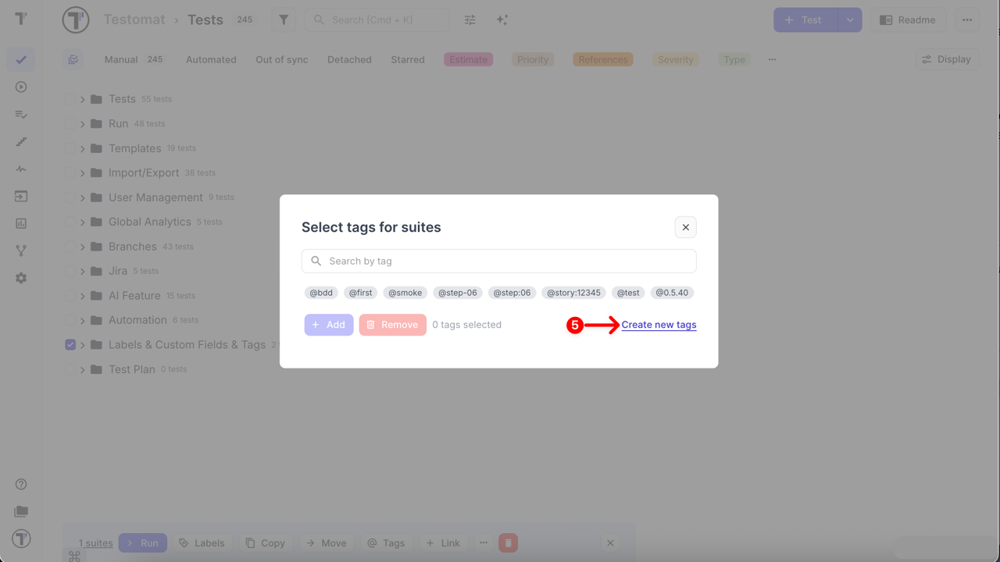
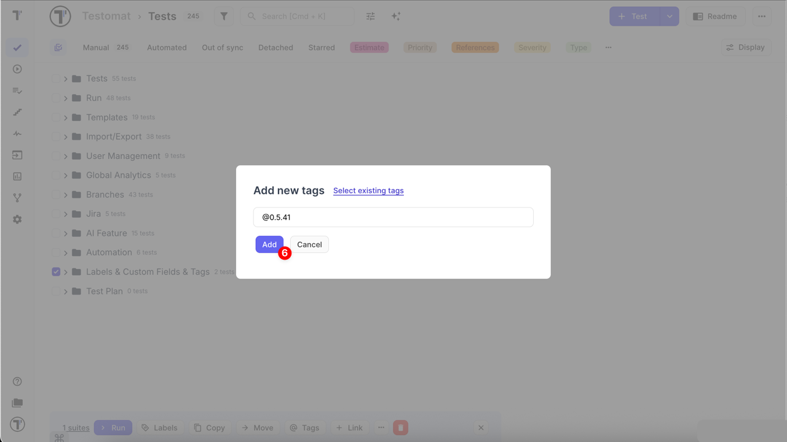
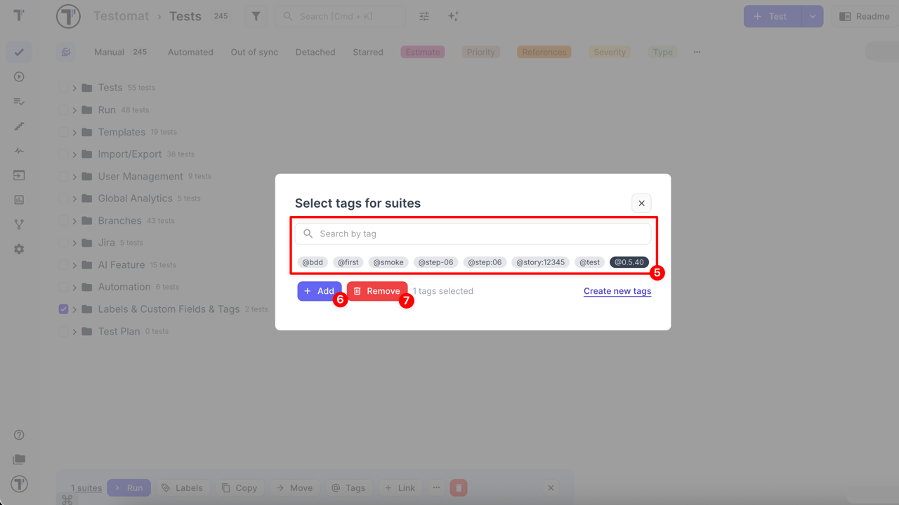

## How to Create and Assign Tags

Tags help organize and categorize Test Cases and Suites for easier filtering, reporting, and management. You can create tags directly in titles or assign them in bulk using the multiselect feature. Tags applied at the Suite or Folder level automatically propagate to nested items, ensuring consistent organization across your project.

### Create Tags via Title Field

You can easily create tags directly to Test Cases or Suites via their titles.

1. Open Test Case/ Suite
2. Click the **Edit** button
3. Create tag starting with **@** symbol, directly within the Test Case or Suite title
4. Click the **Save** button


All previously created tags are automatically saved in the system. To reuse a tag, simply type the **@** symbol in the Test Case title field and select the desired tag from the autocomplete dropdown.


:::note

In case if you don't see a previously created tag in the autocomplete dropdown, refresh the page. Alternatively, go to **Settings -> Project** and click the **'Recalculate Tags'** button.

:::


### Create Tags via Multiselect

You can also create tags for multiple Suites or Tests at once using the **Multi-select** feature.

1. Go to the **Tests** page
2. Enable **Multi-select** mode by clicking the **Multi-select** button
3. Select one or more Folder/Suites or Tests using the checkboxes
4. Click the **@ Tags** button in the bottom action bar



5. In the **Select tags for suites** window, click **Create new tags**



6. Enter a new tag name starting with the **@ symbol** and click **Add** button



This method allows you to **create** and immediately **apply a new tag** to multiple items in just a few clicks. It helps you save time, speed up routine actions, and maintain consistent tagging across a large number of test cases or suites — without having to open them individually.

## How to Bulk Update Tags

Using the same **Multi-select** feature, you can manage tags for multiple **Folders/Suites** or **Tests** at once — adding or removing tags in bulk.

1. Go to the **Tests** page
2. Enable **Multi-select** mode by clicking the **Multi-select** button
3. Select one or more Folder/Suites or Tests using the checkboxes
4. Click the **@ Tags** button in the bottom action bar


5. In the **Select tags for suites** window, choose the tag(s) you want to manage:

- To assign a tag, search for it and/or select it from the list
- To remove a tag, search for it and/or select it from the list

6. Click **Add** to assign the selected tag(s)
7. Click **Remove** to delete the selected tag(s)



This method allows you to efficiently manage tags across multiple items, ensuring consistent organization and saving time.

:::note

When tags are applied at the Suite or Folder level, all nested elements (child Suites or Tests) automatically inherit these tags. However, removing tags from individual nested items is not possible. You can only remove the tags at the same level where they were originally applied.
Partial removal (e.g., deleting a few tags from a single test inside a tagged Suite) is not supported.

:::

## How to Filter by Tags

1. Enable Filters
2. Select one or a few Tags from **Tag** dropdown list
3. Click Apply button


## Tag Extraction Rules in Titles

When writing titles, Testomat.io automatically detects tags marked with the `@` symbol. However, not every `@` occurrence is considered a valid tag.
Below are detailed examples showing when tags **are recognized** and when they are **ignored**.

**✅ Valid Tag Examples**

```text
"title with a simple @tag and some other @tag1"
→ tags: ["tag", "tag1"]

"@tag1 supertitle with leading tag and @tag inside title"
→ tags: ["tag1", "tag"]

"title with commed taglist @tag1: @tag2."
→ tags: ["tag1", "tag2"]

"title with commed taglist @tag1, @tag2.asd"
→ tags: ["tag1", "tag2.asd"]

"title @tag1. zxc"
→ tags: ["tag1"]

"title @tag1.asd zxc"
→ tags: ["tag1.asd"]
```

**🚫 Ignored or Invalid Tags**

```text
"title with email test@test.test"
→ tags: []

"some_text_@tag"
→ tags: []

"some_text-@tag"
→ tags: []

"some_text*@tag"
→ tags: []
```

**➕ Math Operators in Tags**

```text
"title with commed taglist @tag1+@tag2=@tag3"
→ tags: ["tag1"]

"title with commed taglist @tag1-@tag2=@tag3"
→ tags: ["tag1"]

"title with commed taglist @tag1*@tag2=@tag3"
→ tags: ["tag1"]

"title with commed taglist @tag1=@tag2=@tag3"
→ tags: ["tag1"]

"'title @tag1=:-.( asd"
→ tags: ["tag1"]

"'title @tag1=:-.) asd"
→ tags: ["tag1=:-.)"]
```

**🔗 Tags Inside and Outside Brackets**

**Outside brackets (ignored):**

```text
"some_text (sometext)@tag1 [sometext]@tag3"
→ tags: []
```

**Inside brackets (partially detected):**

```text
"title (text @tag1)asda other text"
→ tags: ["tag1)asda"]

"title (text @tag1) asda"
→ tags: ["tag1)"]

"title (text @tag1( asda"
→ tags: ["tag1"]

"title [text @tag1]asda"
→ tags: ["tag1"]

"title [text @tag1] asda"
→ tags: ["tag1"]
```

With these rules, you can better understand how tags are parsed from titles and avoid common pitfalls such as emails, operators, or invalid symbols.

## Best Practices for Using Tags in Titles

To ensure your tags are recognized consistently and remain easy to manage:

- **Use simple words** → keep tags short, lowercase, and descriptive (e.g., `@smoke`, `@regression`).
- **Avoid special characters** → symbols like `+`, `-`, `*`, `_`, or `=` can break parsing or truncate tags.
- **Don’t use emails or URLs** → anything in the form `name@domain.com` is ignored.
- **Separate tags with spaces or commas** → `@smoke, @ui` is correctly detected, while `@smoke@ui` may not be.
- **Prefer placing tags at the end of titles** → improves readability and reduces the chance of misparsing inside brackets or punctuation.
- **Keep consistency across your project** → agree on a common set of tags within your team to make filtering and reporting easier.
