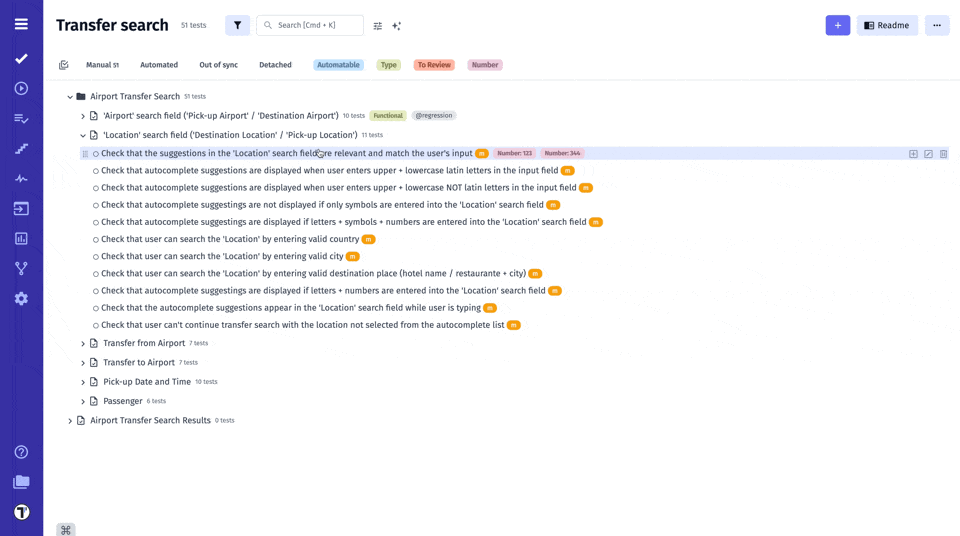
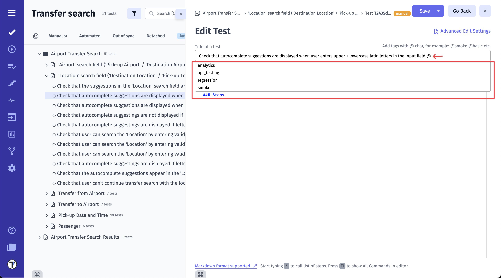
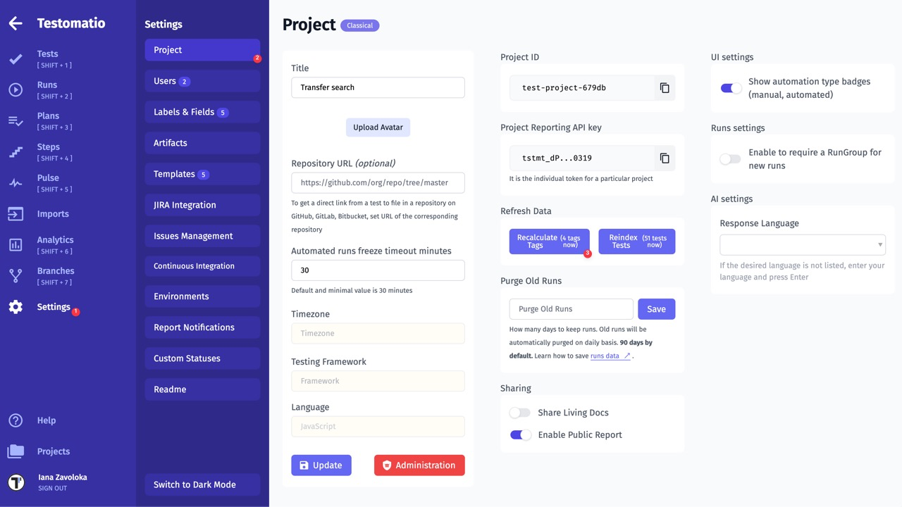
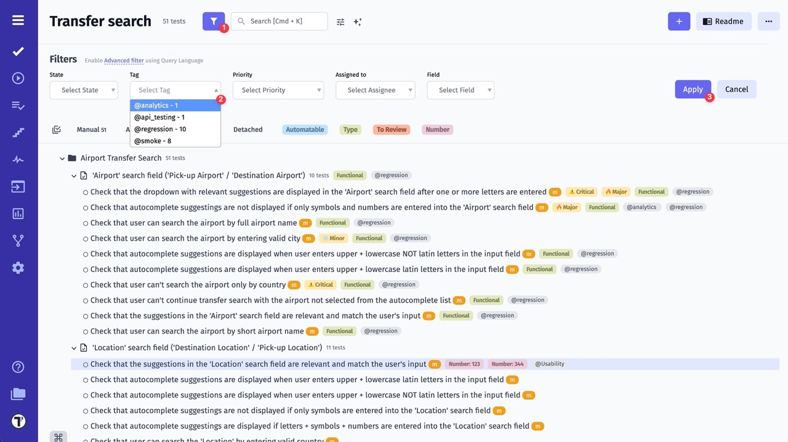

## How to Create and Assign Tags 

You can easily create tags directly to Test Cases or Suites via their titles

1. Open Test Case/ Suite
2. Click Edit button
3. Create tag starting with **@** symbol, directly within the Test Case or Suite title
4. Click Save button

All previously created tags are automatically saved in the system. To reuse a tag, simply type the **@** symbol in the Test Case title field and select the desired tag from the autocomplete dropdown.

:::note

In case if you don't see a previously created tag in the autocomplete dropdown, refresh the page. Alternatively, go to **Settings -> Project** and click the **'Recalculate Tags'** button.

:::

## How to Filter by Tags

1. Enable Filters
2. Select one or a few Tags from **Tag** dropdown list
3. Click Apply button

