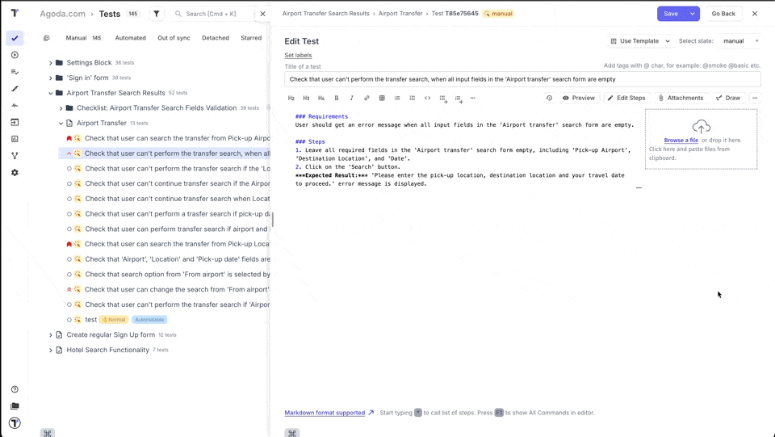
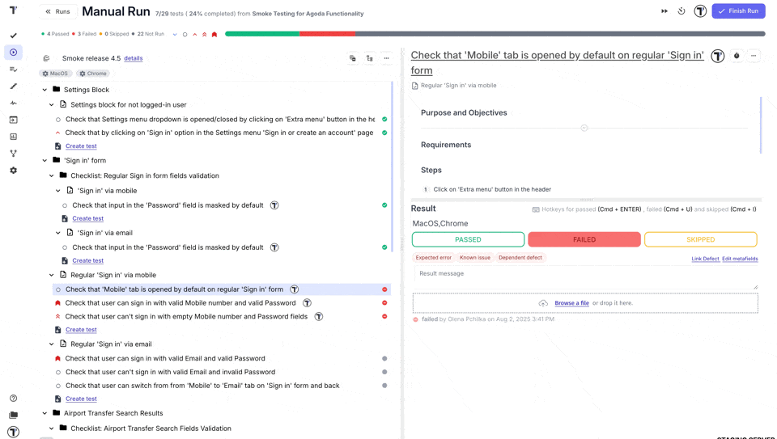
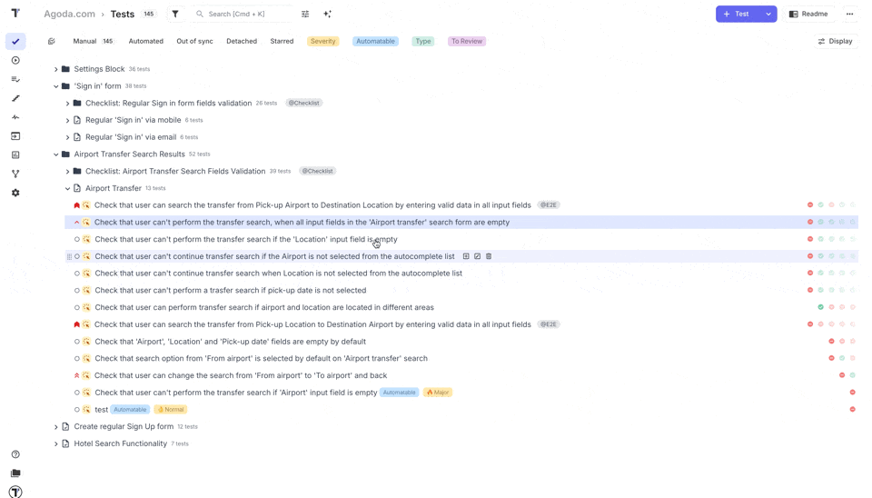
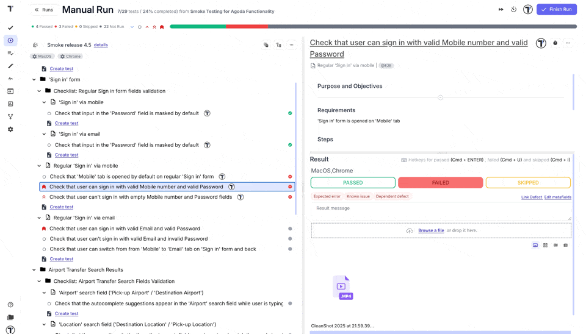
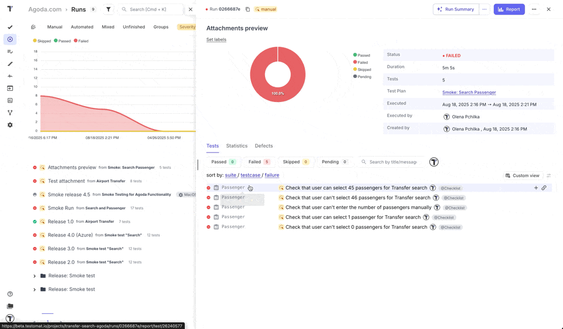

Testomat.io offers various ways to handle test artifacts and attachments, such as screenshots, videos, logs, documents, etc. These features enhance test management, reporting, and debugging by providing visual evidence and supporting documentation.

You can add test artifacts and attachments during **test case creation**, **manual testing**, or **automation testing**.

## Add Attachments to Test Cases

Testomat.io allows you to add attachments, including screenshots, files, and videos to your test cases. It helps to visualize tests, make them more clear and offer additional information for QA managers, developers, other QAs, or stakeholders.

You can add attachments during test case creation or editing by directly **dragging & dropping** them, using the hot key **CTR+C/CTR+V** for copy/past or by using the **browse a file** option.

For more details on adding and managing attachments, refer to the [Add Attachments to Test](https://docs.testomat.io/project/tests/test-case-creation-and-editing/#add-attachments-to-test).

You can also manage attachments across Testomat.io by adding them to **suites**, **folders**, and the **readme section**. This streamline workflows by keeping all relevant files and documentation in one place. Whether you’re sharing important notes, reference materials, or test data, you can now attach them directly to the relevant test structures for easy access.

**Use cases:**

- **Suite-level attachments:** Attach detailed test execution reports or configuration files to specific test suites for easy reference by team members.
- **Folder-level attachments:** Add relevant project documentation or setup instructions to test folders, ensuring that all files related to a specific testing area are easily accessible.
- **Readme section attachments:** Include critical resources or additional context in the readme section, such as diagrams, code samples, or links to external resources, improving overall clarity for team members.

## Delete Attachments

If you no longer need your attachments, you can delete them.

Go to [How to Delete Attachment from Test Case](https://docs.testomat.io/project/tests/test-case-creation-and-editing/#how-to-delete-attachment-from-test-case) section to read more about this feature.

:::note

You can delete attachments from Suite, Folder and Readme section in the same way you would from a Test Case.

:::

## Restore Attachments

Before the attachment is permanently deleted from the store, you can restore it. 

Go to [How to Restore Deleted Attachment](https://docs.testomat.io/project/tests/test-case-creation-and-editing/#how-to-restore-deleted-attachment) section to read more about this feature.

:::note

All deleted Attachments are stored for 30 days before being permanently deleted.

:::

## Add Test Arfifacts During Manual Testing

Attaching a short video or screenshots is highly useful for manual testing, especially for failing tests. These artifacts provide comprehensive information, making it easier for the QA tester to understand what went wrong.

To add test artifacts during manual tests execution:

1. Launch a run.
2. On manual run window, select the test case.
3. **Drag&drop** the test evidence into the **'Attachments'** section (or use **browse a file** or **copy/paste** option).

## Preview Attachments

Attachments are available for viewing without downloading. To preview an attachment, select it in the Test Case Attachment section to view it in the open dialog window.

Testomat.io also allows you to watch attached video or screenshots directly from the **Report** page.

Additionally, you can switch between list and tile views to make reviewing test artifacts easier.

## Add Test Arfifacts During Automation Testing

Testomat.io also allows you to add test artifacts during automation testing.
Test artifacts, which include screenshots and video files, provide a complete picture of your test results as soon as autotests are completed, helping you understand the root cause of a problem.

### Support Artifacts Storing to S3

This kind of implementation of **Video recording** or **Screenshots** artifacts is possible due to our integration with many **S3 Storages**: AWS, DigitalOcean, Azure, and Google Cloud. After a test run is completed, video and other artifacts are uploaded to the chosen storage, and from there, they automatically go to Testomat.io.

Testomat.io provides the ability to download unlimited data by choosing one of the available S3 Storages depending on your company’s priorities or the location of your preferred CI\CD service. 

:::note

All cloud providers charge for their services. Be sure to check their rates in detail before starting.

:::

Thanks to **S3 Cloud Services** integration, you can easily find any test artifacts stored in the test project structure on your local PC or in the cloud when running tests on Github, Jenkins, or any other CI\CD service.

### How Artifact Recording Works

1. **Get test artifacts when you run autotests:** To enable this, you need to set the right parameters – specify the configuration of your cloud storage. As a result, all screenshots or video files from S3 Storage will be placed in the test report, helping you prioritize issues. You can configure artifacts to be collected from failed, passed, or all tests, whatever status was assigned to them after the end of the run. This parameter is typically configured within your testing framework (e.g., Cypress, Playwright), not in Testomat.io.

:::note

Read how to **Set up S3 Bucket** on the relevant [Test Artifacts](https://docs.testomat.io/test-reporting/artifacts/) page.

:::

2. **Upload a public or private test artifacts:** These processes are identical; the artifact travels the same path in both cases. But if a private format is selected, additional settings and data encryption are used. This feature is used by companies that pay special attention to data privacy and security of their projects or when company policy forbids public access to their projects. The necessary settings are set in the **'Artifacts'** tab and apply to all tests of a particular project. For more detail, visit the [Privacy](https://docs.testomat.io/test-reporting/artifacts/#privacy) section in the Docs.

3. **Preview or download test artifact:** You can view videos or screenshots directly on the platform or download them on your device. The latter is relevant if you need to share the test results with stakeholders.

:::note 

If you share a private artifact, your recipient will receive a message that they do not have permission to view the file.

:::

### Associated Test Screenshot-Recording Features

- **Reporters by Popular Testing Frameworks** – real-time reports supporting of popular programming languages give you a complete picture of the software product’s quality level. With Advanced Reporters by popular testing frameworks, you can see the results of end-to-end, integration, unit testing, and API testing. Thanks to the integration with many S3 Storages, our SaaS test management solution retrieves test artifacts (including screenshots during a test runs) and uploads them to the report in a convenient format.

- **Automated Tests Analytics**  – all test results of test executions are used for in-depth analytics. Determining the percentage of test automation, the total number of tests, the ratio of tests to uncompleted tests, failed tests, [flaky tests](https://docs.testomat.io/project/analytics/#flaky-tests), never-run tests help prioritize daily tasks and make the process transparent to all Agile team members.

- **Jira Integration** – after installing the [Jira plugin](https://docs.testomat.io/advanced/jira-plugin/), you have the ability to run test cases from Atlassian Jira and work on projects directly from either Jira or Testomat.io.; switching between tools is no longer necessary. You can also navigate from Jira to the Run Report to view a specific artifact.

- **Video Capturing Artifacts** – in addition to saving screenshots, you can also save videos from tests (passed, failed, or all completed, regardless of the result). From Test Runner and Reporter, video files, like screenshots, are uploaded to S3 Storage and then displayed in the test management system in a user-friendly format, where they can be viewed or downloaded.

- **Artifact S3 Support** – you can store [Test Artifacts](https://docs.testomat.io/test-reporting/artifacts/) in the cloud and choose the provider your company or CI\CD tool is comfortable working with: AWS, DigitalOcean, Azure, and Google Cloud.

