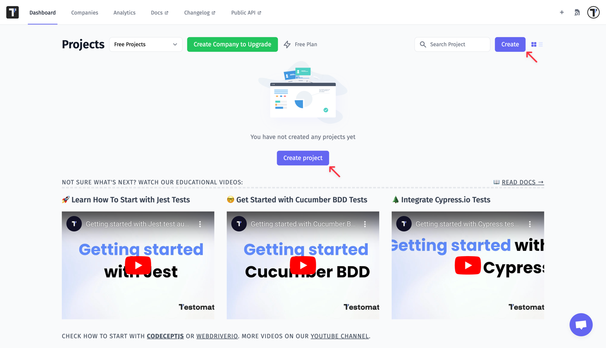

> If you have end-2-end tests or API or unit tests already implemented you can import them into Testomat.io

## Why Do I Need to Import My Tests?

Automated tests are hidden within the code and, as a rule, this gem is seen only by engineers. Even though the tests play an important role in product management, they are not available to the whole team involved in the project. To bring the visibility of the running tests further on and show what pieces of software are actually covered by tests, you can import your tests into Testomat.io. 

Moreover, when you have hundreds and thousands of tests on your hands, some things tend to slip through the cracks and end up neglected. For example, you may need to look up certain features and map them with specifications or Jira tickets. In Testomat.io, whenever automated tests are imported,  you can search with ease throughout all the tests, plan new test cases, receive reports, and much more! 

## Create a New Project

Register at [app.testomat.io](https://app.testomat.io) and activate your user account. Then create a new project.



The type of your new project will influence the look of your interface, as well as its intended audience. Choose **BDD Project** if you plan to follow BDD descriptions or use the Cucumber framework in future. If you haven't decided yet, you can start with default **Classical Project**. Depending on your choice, the interface will differ, as follows:

* Within a **BDD Project**, you will have feature definitions written both in the source code (by engineers) and in Testomatio (by managers and QAs). So you will be able to track and plan Cucumber automation, as well as synchronize the actual feature files with relevant test cases. When a scenario has changed in the system, but has not been updated in the code yet, you will be notified that this certain scenario is out of date.
* Within a **Classical Project**, test cases will be written in free form using markdown. Automated tests will be synced up with test cases, so you will be able to see the test description in one tab and the corresponding test code in another tab. When a description of a test case undergoes changes, you will be notified that a certain test might need to be updated.

> In this section of the Guide, we discuss the issues concerning BDD Projects. If you need to import a Classical Project, go to the [Import Tests From Source Code](https://docs.testomat.io/getting-started/import-tests-from-source-code/#why-do-i-need-to-import-my-tests) section of this guide.


You can provide a URL of a repository hosted on GitHub, GitLab, BitBucket, as well as of a self-hosted one. Testomat.io will use this URL to navigate you from test cases straight to the source code. Please make sure that the URL is pointing to the *directory where the tests are located*. 

> If you have set a repository URL make sure that the path matches the one in URL repository. For instance, if you have URL: "https://github.com/testomatio/examples/tree/master/cucumber/features" you should navigate to "features" within your project to import tests.

Click the **Create** button to start a new project.

## Import Tests from Feature Files

When your project is created, click the **Import from Source Code** button.


Or another case:


When the **Import Project From Source Code** screen opens, you will need to pick Cucumber as your project framework. 


> If you use BDD with CodeceptJS, choose CodeceptJS as your project framework and select "Gherkin" as your project language.

Once you have chosen the framework and the language, you will be provided with a command that you need to copy and execute in a terminal. Before running this command, please note that to parse & import feature files **NodeJS 10+** with NPM is required.

Open a terminal, navigate to the project folder in your project and execute the command. By default, we assume that your features files are located in the **features** folder of your project. If you store them in a different folder, rewrite the --dir  option of the command to use the folder your feature files are actually stored in:

```
TESTOMATIO={apiKey} npx check-cucumber@latest "**/*.feature" --dir features
```


Seeing a report on how many tests were found means that the import command was executed successfully. If you don't see a similar message, you might need to change the pattern to match files or the directory to scan. Open the API reference of check-cucumber command to learn how to do that.

Refresh the page and you will see all the imported test files.


## Import Manual BDD Tests from Source Code

If you have manual tests in the repository and want to import them into Testomatio you can use `.manual.feature` extension in the feature file. Tests will be imported as well as automated tests and will be marked as `manual` in Testomatio. For instance:

```
filename.manual.feature
```


Now run the command we used earlier to import the tests from the source code.


As a result, we got tests divided into automated and manual. This structure allows for more efficient and flexible testing workflows, enhancing our overall testing strategy. 