<!--
> If you don't have any manual or automated tests yet - follow this guide. Otherwise, pick the section of the guide relevant to your project. You might want to start from [this section](https://docs.testomat.io/getting-started/import-tests-from-source-code/) if you consider **importing tests from source code** into Testomat.io. For those interested in importing tests from the **Cucumber** framework, go straight to [this section](https://docs.testomat.io/getting-started/import-tests-from-cucumber/#why-do-i-need-to-import-my-tests)!
-->

Welcome!

This step-by-step guide helps you to create your project, add tests, execute them, and review results with analytics.

By the end of this guide, you will have:

- a project
- suites/folders with suites
- tests
- runs
- a report
- visual analytics with all data

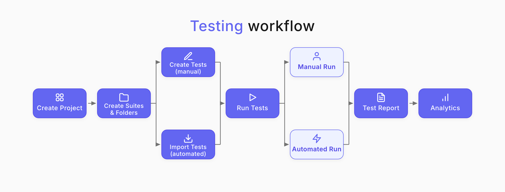

## Create Project

A project is the main entity in Testomat.io that contains all tests, test execution programs, and analytical data on them. Every project can contain any number of suites and folders with any amount of tests, test runs, plans, and reports in them.

:::note

Each project is a separate entity. That means, you can do whatever you want within the Project, but you cannot cross-do staff between Projects.

:::

Register at [app.testomat.io](https://app.testomat.io) and activate your user account. Then create a new project:
1. Go to your account **Dashboard**.
2. In the top-right corner, click **Create**.
3. Enter the project title.
4. Choose the project type:
    - BDD Project
    - Classical Project
5. Decide whether to use demo data or your own data.
6. Click **Create**.

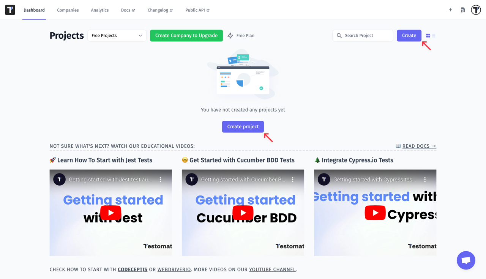

Use [BDD Project](https://docs.testomat.io/project/tests/bdd-test-case-editor/) if you plan to work with BDD descriptions or the Cucumber framework.

Use [Classical Project](https://docs.testomat.io/project/tests/classical-test-case-editor/) if you want free-form markdown test cases with automation synced to test cases.

You have just created your first project! 

Now you can start creating suites and test cases for your projects.

## Create a Suite

Test suite is a collection of tests grouped together. You can create suites or create a folder with suites. 

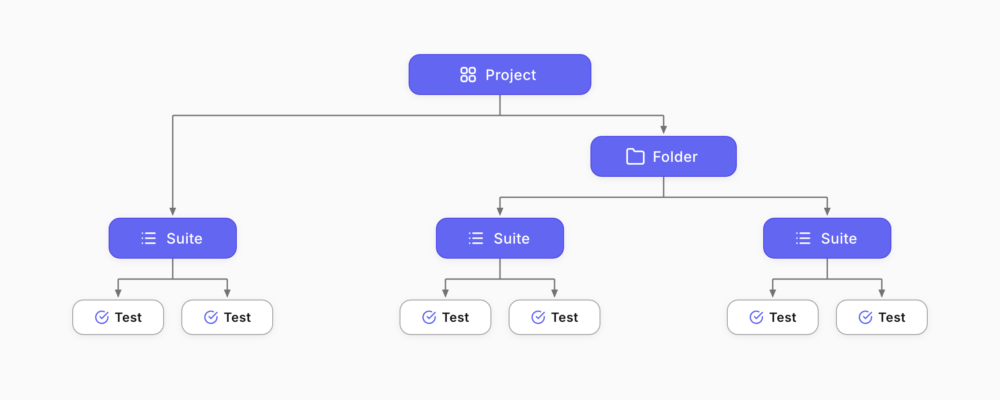

To create a suite:
1. Select a project.
2. Click **New suite**.
3. Enter your Suite name.
4. Press `Enter` on your keyboard.

Another way to create suite:

1. Click action menu button (...).
2. Select **Create more suites** from the menu.

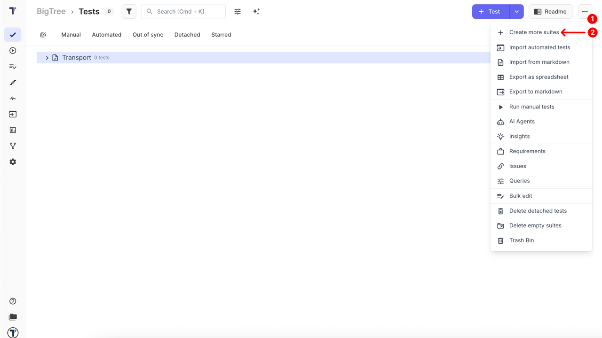

3. Enter the title of the new suite or folder.
4. Click **'+ Suite'** to create a test suite, or optionally
5. Click **'Folder'** to create a folder for grouping suites.

:::note

You can create folders to group your suites. On the project page, click **New folder**, enter its name, and press `Enter` on the keyboard.

You can create any number of folders and suites within a folder.

:::

## Create Manual Test Cases

Read full article: [Test Case Creation and Editing](https://docs.testomat.io/project/tests/test-case-creation-and-editing/).

After you’ve created test suites, you can start adding tests. 
1. Select a test suite.
2. Click on Suite, and a Suite panel will open to the right. 
3. At the bottom of the **Tests** tab, enter the name of the test. 
4. Click **Create**. 
5. Click on the test to edit it.

:::note

When tests are newly created, they are marked as **manual** by default, which shows that they are ready for manual checks. 

:::

You can also create a test using the **New test** button at the top of the Suite editor panel.

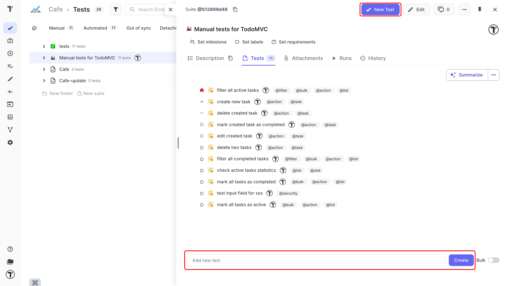

### Bulk-create Tests

Read full article: [Bulk Edit](https://docs.testomat.io/advanced/bulk-edit-folder/bulk-edit-on-suite-and-test-level/).

To add multiple tests at once by listing their names, rather than adding each one individually:
1. Open (or create) a suite.
2. Turn on the **Bulk** toggle.
3. Type **one test name per line** in the input field.
4. Click **Create** - every line becomes a separate test, all added together.

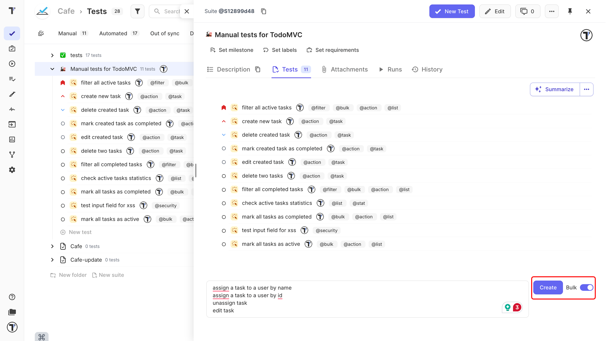

## Run Manual Tests

Read full article: [Running Tests Manually](https://docs.testomat.io/project/runs/running-tests-manually/).

There are two main ways to start a manual run:

From the ‘Tests’ page, quick launch for selected tests or suites, or adding tests to an already ongoing run without leaving the Tests view.

1. On the **Tests** sidebar tab, activate **Multi-select**.
2. Select tests you need to run.
3. Click the **Run** button in the actions menu below.

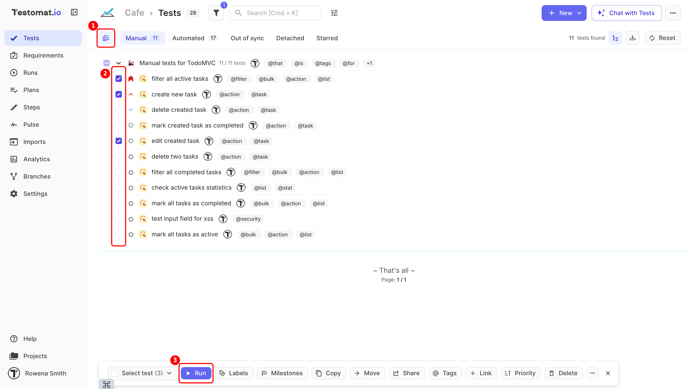

From the ‘Runs’ page - the classic way to create and manage full runs with complete configuration options.

1. Go to the **Runs** tab in the sidebar.
2. Click the **New** button and select **New manual test run**.
3. Enter the run **Title**.
4. Then select **All tests**, **Test plan**, **Select tests**, or **Without tests** to run tests.
5. Click the **Launch** button to execute the tests.

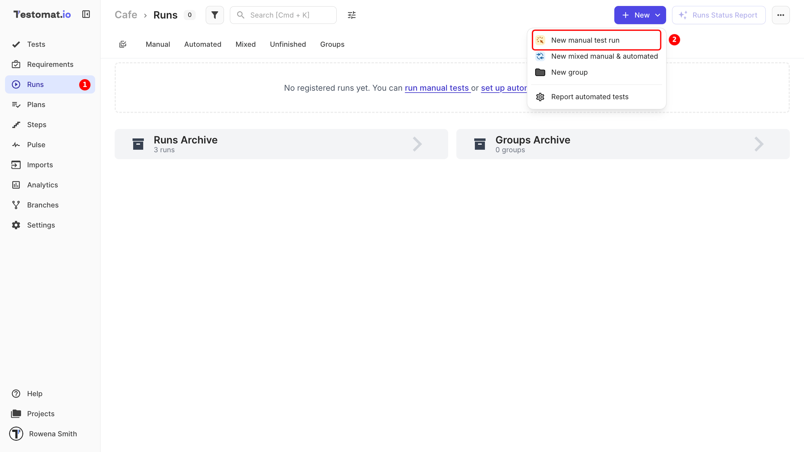

:::note

Before tests execution, you can specify the run [environment options](https://docs.testomat.io/getting-started/running-tests-manually/#multi-environment-tests).

You can also toggle the **Run Automated as Manual** switch to select the result of automated tests manually.

:::

When the test execution is launched, testers can:
- Mark each test as **Passed**, **Failed**, or **Skipped**. 
- Add messages.
- Attach evidence (screenshots, logs, etc.)
- Assign tests to specific team members.

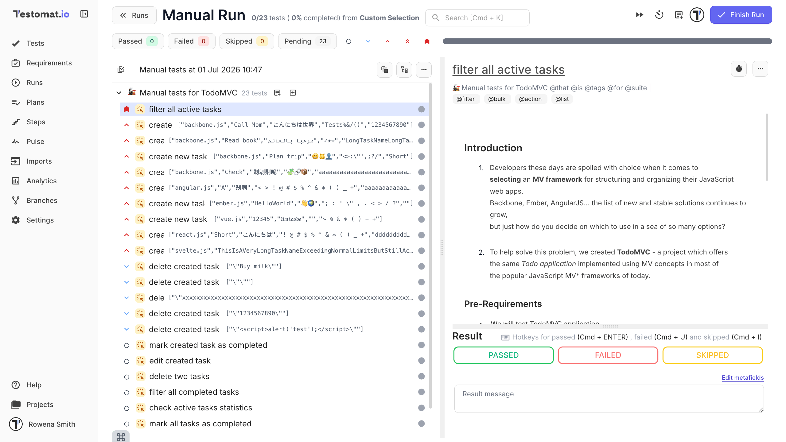

## Import Automated Tests

Read full article: [Import Automated Tests](https://docs.testomat.io/getting-started/#import-automated-tests), [Import from CSV/XLSX](https://docs.testomat.io/project/import-export/import/import-tests-from-csv-xlsx/), and [Import Tests From TestRail](https://docs.testomat.io/project/import-export/import/import-tests-from-testrail/).

To add automated tests to your project, you must import them from the source code, a CSV file, or an existing TestRail suite. To import automated tests, follow these steps:

1. Open your project.
2. Navigate to the actions (...).
3. Click **Import automated tests**.

Alternatively:

1. Go to the Imports menu.
2. Navigate to the **Import** dropdown menu.
3. Select an import option:

   | Import option | Description |
   |---|---|
   | **Import from Source Code** | Imports tests directly from your local project or repository. |
   | **Import from CSV** | Imports tests from a CSV file and converts it to one of the available formats. |
   | **Import from TestRail** | Imports tests from an existing TestRail suite. |

In the **Import** section, pick the framework, programming language and operating system you are using for testing.

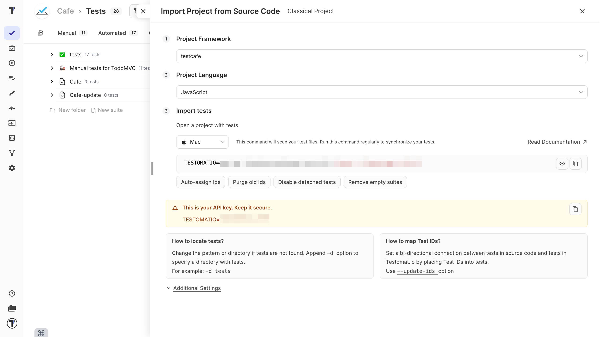

:::note

Please check your environment:

- For NodeJS (JavaScript, TypeScript): you need NodeJS 10+ and npm installed to be able to run this command.
- For PHP: you need PHP > 7.2 and Composer installed.

:::

### Import via Terminal

Testomat.io can store tests from various frameworks. To import automated tests:

1. Open a terminal, navigate to the tests folder in your project. 
2. Copy and execute the import command in a terminal.
3. See a report on how many tests were found.
4. Reopen the project and see that all tests with their folders and files are shown on Testomat.io.

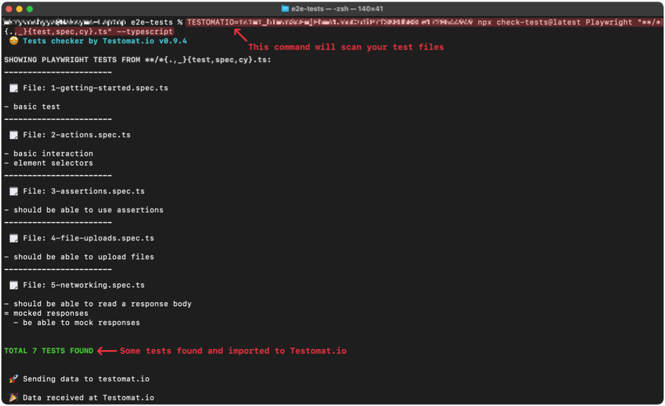

If you don't see a similar message, please check the command's API change command parameters so it could find tests. The most common issues with import are different file naming format and/or incorrect directory for import.

:::note

All imported tests are marked as "Automated" by default. Please, check that the link actually points to the corresponding file.

:::

## Run Automated Tests

Read full article: [Running Automated Tests](https://docs.testomat.io/project/runs/running-automated-tests/).

To start Run Automated Tests:
1. Go to the **Runs** page. 
2. Navigate to the **New** dropdown menu.
3. Select **Report automated tests**.

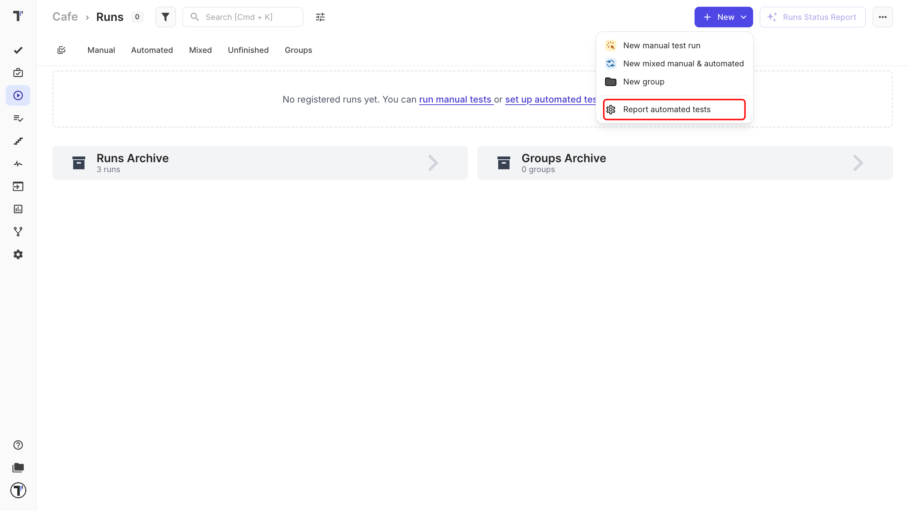

5. In the opened window select your framework. 
6. Testomat.io will generate a terminal command.

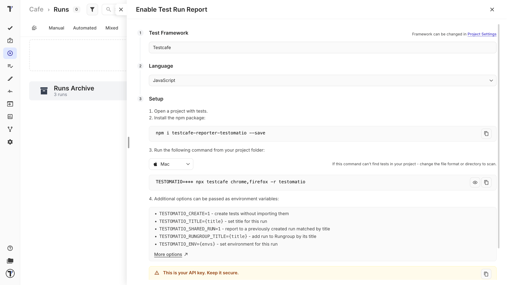

7. Start generated commands in your terminal from your project folder.

8. A new Test Run will appear on Runs page.

## Test Run Report

Read full article: [Testomat.io Reporter](https://docs.testomat.io/test-reporting/reporter/).

You can use Testomat.io as a test management system or as a rich reporting tool. Each test has its history and a lifecycle, so each test report will be attached to a corresponding test in a project.

To view your test run reports: 

1. Navigate to the Runs menu. 
2. Find the information about the completed test run (the duration of the run, the performer, etc.)
3. Filter by status, find specific tests by tags, or sort by available methods. 
4. You can see test results in real-time.

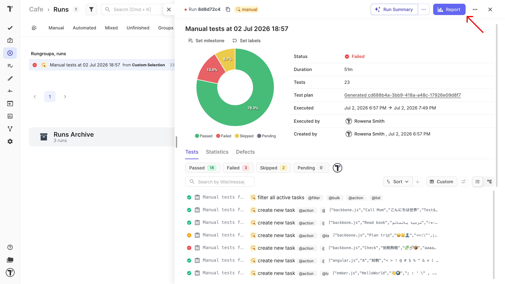

To get a detailed report of the test run, click on the **Report** button. Share the report with your stakeholders.

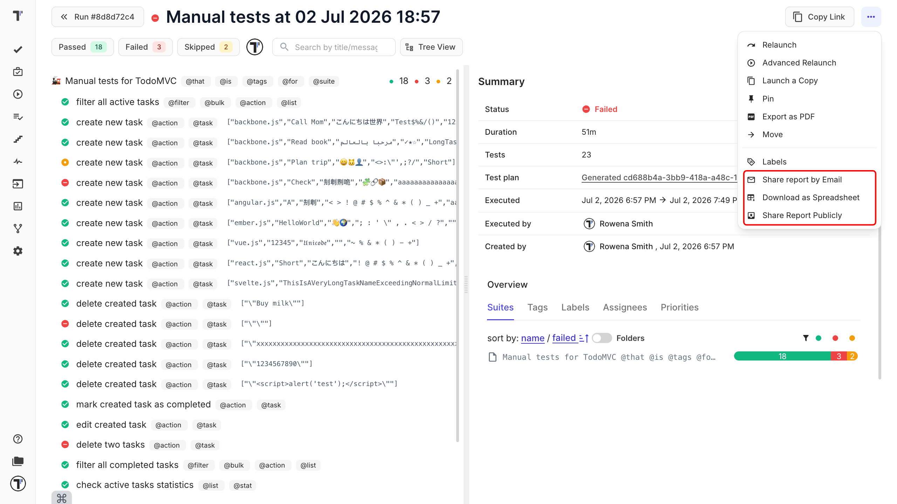

:::note

Artifacts like screenshots, videos, and traces are uploaded to your own cloud storage via S3 protocol. Artifacts can be uploaded privately or publicly and used in reports.

:::

## Analytics

Read full article: [Analytics](https://docs.testomat.io/project/analytics/).

Testomat.io Analytics provides an extensive overview of testing data by tracking both automated and manual tests. You can visualize trends over time with custom charts, identify automation coverage, monitor failure patterns, and analyze metrics like flaky or slowest tests.

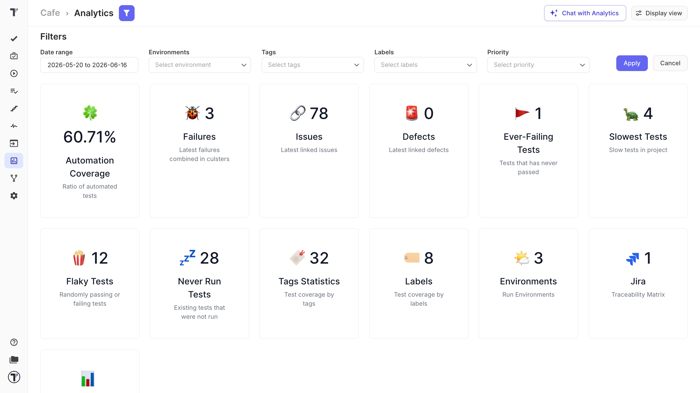

Additional features include a failure board, label, and tag statistics for better team insights, allowing for optimized testing and proactive bug prevention.

## Explore more features

Learn more: [AI-Powered Features](https://docs.testomat.io/advanced/ai-powered-features/ai-powered-features/) and [Issues Management Systems](https://docs.testomat.io/integrations/issues-management/).

Once you’re comfortable with the core workflow, you can start using advanced features to help you with your QA process. 

A built-in AI assistant can generate new test cases from existing suites or requirements, suggest missing scenarios, summarize project coverage, and write descriptions for undocumented automated tests.

On the integrations side, Testomat.io works out of the box with popular automation frameworks ([Playwright](https://docs.testomat.io/tutorials/playwright/), [Cypress](https://docs.testomat.io/test-reporting/workflows/#github-actions-and-cypress-trigger--pr), [Cucumber](https://docs.testomat.io/project/import-export/import/import-bdd/#_top), and more), CI/CD tools like [GitHub Actions](https://docs.testomat.io/integrations/continuous-integration/github), [GitLab](https://docs.testomat.io/integrations/continuous-integration/gitlab), and [Jenkins](https://docs.testomat.io/integrations/continuous-integration/jenkins), as well as team tools such as [Slack](https://docs.testomat.io/integrations/report-notifications/slack) and [Confluence](https://docs.testomat.io/integrations/issues-management/confluence). In addition, the [Jira](https://docs.testomat.io/integrations/report-notifications/jira) plugin keeps tests, issues, and results in sync so your whole team can manage testing without leaving the tools they already use.

