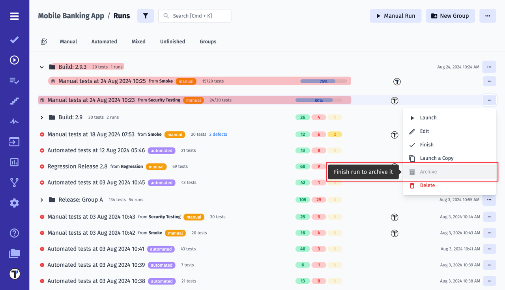

## Reports

When you run tests with Testomat.io it will generate a Run Report with the results. We have such options as **basic view** and **extended view**. Let's have a look at each of them.

**Basic view**

Clicking on the Test Run will toggle RunReport screen in basic view.

Here you can see 1. a list of tests, 2. their status (Passed/ Failed/ Skipped), 3. general information on the Run Result.

Also, you can click on test and open it to see details.

Moreover, you can view the history of run results by filtering them by group name.

**Extended view**

If you click on Report button you will see the extended view of the Run Report.

You can see such options here: 1. a list of tests 2. overview of all executed tests 3. Report Summary.

You can sort suites by Name and by Failed status in the Overview widget. 

You can use ↓ and ↑ keys to navigate the tests and have a quick view of details for each test.

## RunGroups

You can group your Runs within Testomat.io. To do this you need to click on New Group button

On New RunGroup screen you need

1. Add a Name of a group
2. Choose Merge strategy
3. Choose a group type (optional)
4. Click on Save button

A New RunGroup will appear on Runs page

To put Manual Run to a RunGroup you need to open it and click on Add Manual Run button

To put an Automated Run to a RunGroup you need to execute your tests with Testomat.io providing TESTOMATIO_RUNGROUP_TITLE="Build ${BUILD_ID}". 

Now you can see Test Runs in a created RunGroup

### RunGroup Chart

The chart displays up to 50 of the latest test runs belonging to the group. If you have more, use the pagination arrows, to view the results of the previous runs.

## Copy Run Group

You can easily create a new Run Group, completely independent of any previous runs, by copying all relevant tests exactly as they are. You can configure what data should be copied, namely:

**Assignee**: Define assignee details separately, preventing them from being copied.

**Issues**: Choose whether to include or exclude linked issues in the duplication process

**Labels**: Decide whether labels should be duplicated or omitted in the new test run

**Environments**: Control the duplication of environment settings based on your requirements.

**Nested Structure**: Preserve or exclude the nested structure of your test groups as you duplicate them.

Here are steps: 1. Open Run Group 2. Click Extra menu 3. Click Copy 4. Pick configurations 5. Save 6. See Run Group created.

## Merge Strategy

With Testomat.io you can use different Merge Strategies for Test Runs analysis. It helps to aggregate results when a group contains multiple runs.

You can use it when merging few Runs:

Or when you add/edit RunGroup

## Merge Runs

With Testomat.io you can merge your Test Runs. To do this you need to enable multi-selection, choose the Test Runs you want to merge, and click on the Merge button at the bottom of the page

Here you will need to 1. Select testing Environment 2. Enter a name for merged run 3. Choose a Merging Strategy 4. Decide to keep original runs or not. 5. Click on Merge button

Your merged run will appear in the list of runs on the Runs page 

## Relaunch Runs

For some reason, you may need to re-check some tests in your Run manually. You can use Relaunch Run options for such cases. To do this you need to 1. click on the menu button and 2. click on Relaunch manually button

Your Test Run will open in Manual Run window and you will be able to re-check tests and change their status:

When you finish you need to click on Finish button. You will see tests with new status and new Run Status

Also, your Test Run will contain updated information on its results: You will see a changed tag and Run status.

## Launch a Copy

If you need need to re-check some tests in your Run manually, but for some reason, you want to save this Test Run you can use Launch a copy option. To do this you need to 1. click on the menu button and 2. click on Launch a Copy button.

Your Test Run will open in Manual Run window and you will be able to re-check tests and change their status:

When you finish you need to click on Finish button. You will see a new Test Run tests with new status and new Run Status:

On the Runs page you will see a copy of your Test Run with new tests results:

## Archive Runs & Groups

Archive provides you with the ability to declutter the main Runs board, ensuring that only relevant and active test runs take center stage while preserving historical data. The Runs page displays the 30 most recent Runs and Groups, while all other runs go to Archive. 

You can also forcefully archive a Run or Group. To do this you need:

1. Сlick the menu button. 
2. Click the Archive button. 
3. Confirm.

Forcedly archived Runs and Groups get the **archived** badge!

Incomplete Runs or Groups with such runs cannot be archived forcibly or automatically from the main Runs board!

### Runs Archive

Archived runs find a new home in the dedicated **Runs Archive** section. This segregated space ensures that your archived data is easily accessible without cluttering the main board. The Runs Archive comes equipped with filtering capabilities.

You can set the period after which old Test Runs will be deleted from the archive. You can do this through the menu button on the Runs Archive page, then click on the **Purge Old Runs** button, specify the period and confirm. Alternatively, you can specify a term in **Project Settings**.

### Groups Archive

For archived groups, there is a separate section called **Group Archive**. The Groups Archive can also be filtered.

Furthermore, you can sort the groups in a variety of ways.

### More About Archives

* Automatically archived Runs and Groups can be un-archived. This allows them to be displayed on the main board.
* When archiving a group - all runs within it get the **archived** badge.
* If you restore from an archived group, then this group and the parent group will also be unarchived.
* When a group is restored, all of the archived runs will be restored as well.
* If automated run starts in archived group - this group restore from archive.

## Filtering Test Runs

Testomat provides filtering capabilities for Runs and Run Groups. On the Runs page, you can find Basic filters and Additional filters.

## Multiselection For Runs

Multiselection allows the bulk application options to many runs with one click. Here is overview:

1. Select all - select all runs on the Runs page
2. Move - move runs to/from Run Group
3. Download - export selected run reports to spreadsheet
4. Labels - apply/remove [labels](https://docs.testomat.io/usage/labels-and-custom-fields/#how-to-setup-a-label) to runs
5. Merge - merge selected runs 
6. Compare - opens Compare runs view
7. Archive - archive selected runs
8. Link - link selected runs to [JIRA](https://docs.testomat.io/integration/jira/#connecting-to-jira-project), [GitHub](https://docs.testomat.io/integration/issues-management-systems/#github-issues-configuration), [Azure](https://docs.testomat.io/integration/issues-management-systems/#azure-devops-configuration),[Linear](https://docs.testomat.io/integration/issues-management-systems/#linear-configuration) or other issue.
9. Delete - delete selected runs 

## How To Download Run Report

Testomat provides option to export Run Reports as spreadsheet so you can get your data in xlsx file. See how it works.

**Download few run reports in one file**: 1. Enable Multiselection 2. Pick Runs 3. Click Download

**Download a separate Run Report**: 1. Open Run Report 2. Click Run 3. Click Extra button 4. Download as Spreadsheet.

## Compare Test Runs

Select test runs and see a visual display of the similarities and differences. Compare your run reports and analyze them by such parameters as Flaky, Revieved, Degraded, and more. To do this 1. Enable Multiselection 2. Pick Runs 3. Click Compare

Also this option is applicable for Run Groups. 1. Open Run group 2. Click Combined Report

